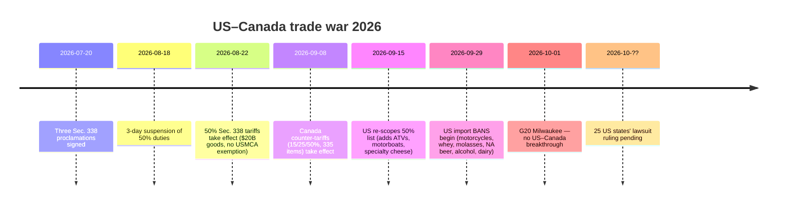
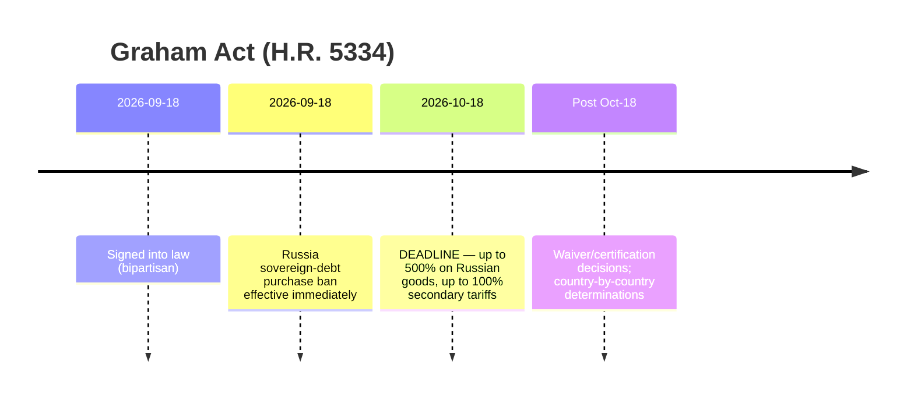
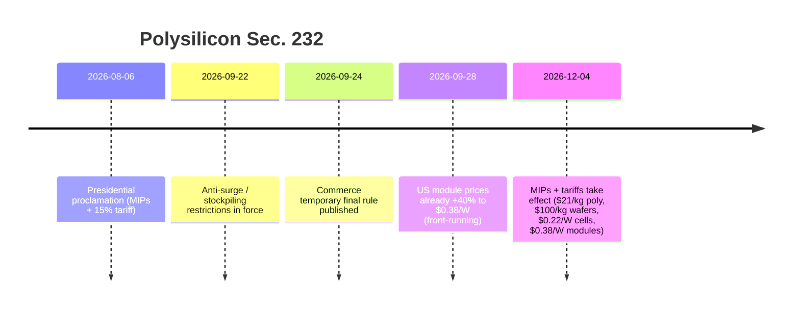

# Global Trade Intelligence Report — Week of September 28 – October 5, 2026

**Weekly briefing.** Coverage window: September 28 – October 5, 2026. Compiled from approximately 45 trade news, policy, data, and freight sources worldwide. All figures are sourced; values that could not be verified are marked n/a.

---

## Table of contents

1. [Executive summary](#1-executive-summary)
2. [Alerts](#2-alerts)
3. [Top stories — deep dives](#3-top-stories--deep-dives)
4. [Tariff tracker](#4-tariff-tracker)
5. [US policy deep dive](#5-us-policy-deep-dive)
6. [World policy by region](#6-world-policy-by-region)
7. [Enforcement actions](#7-enforcement-actions)
8. [Data releases](#8-data-releases)
9. [Freight market](#9-freight-market)
10. [Policy timelines](#10-policy-timelines)
11. [Upcoming deadlines & events (next 90 days)](#11-upcoming-deadlines--events-next-90-days)
12. [Sources & methodology](#12-sources--methodology)

---

## 1. Executive summary

A consequential week for global trade. Three significant developments occurred simultaneously:

- **The US–Canada trade dispute escalated further.** After 50% Section 338 tariffs on ~$20B of Canadian goods (in force since Aug 22, re-scoped Sept 15), Washington moved on Sept 29 to outright **import bans** on Canadian motorcycles, whey, molasses, nonalcoholic beer, alcohol and dairy — goods already on the water face the 50% duty instead. Canada's mirrored 15/25/50% counter-tariffs on 335 US tariff items (in force Sept 8) remain. Twenty-five US states are suing to overturn the tariffs; no ruling yet. ([tariffcalculator2026.com](https://tariffcalculator2026.com/canada-50-percent-tariff-august-19-explainer), [surtaxscan.com](https://surtaxscan.com/news/canadas-counter-tariffs-are-back-15-25-and-50-on-335-us-tariff-items-from))
- **The Graham Act clock is ticking.** Signed Sept 18, the Lindsey O. Graham Sanctioning Russia and Iran Act mandates up to **500% tariffs on Russian goods and up to 100% secondary tariffs** on the top importers of Russian energy (China, India, Turkey most exposed) by **Oct 18**. Duties stack on all existing tariffs. ([lexblog.com](https://www.lexblog.com/2026/09/24/the-lindsey-graham-sanctions-act-what-businesses-need-to-know-about-the-new-tariffs/), [jdsupra.com](https://www.jdsupra.com/legalnews/new-sanctions-and-tariff-power-under-4624517/))
- **The EU reached for its own "Section 301".** On Oct 5, France and Germany jointly proposed a rapid-reaction EU trade weapon — country-agnostic, triggerable by a minority of member states, up to immediate cutoff from the single market — aimed at systemic market distortions (read: China). Beijing answered within days: an anti-dumping probe into EU p-nitrotoluene (Oct 3) and a firm MOFCOM warning. EU leaders take up the China file at a Brussels summit on Oct 15. ([reuters.com](https://www.reuters.com/world/china/france-germany-propose-new-rapid-eu-trade-response-tool-2026-10-05/), [wsj.com](https://www.wsj.com/world/europe/germany-and-france-are-proposing-a-new-weapon-to-counter-flood-of-chinese-goods-f723dfdf))

Meanwhile, the multilateral trading system weakened further: G20 trade ministers in Milwaukee (Sept 30–Oct 2) agreed on exactly one of four agenda items (food-trade coercion) and deadlocked on excess capacity, forced labor, and MFN reform. The US and China published reciprocal "30-for-30" tariff-relief lists ($30B each side) — symbolically significant, economically marginal (HSBC: trade-weighted US tariff on China falls from 27.3% to 26.0%). C.H. Robinson announced a **$5.8B acquisition of RXO**, the largest 3PL consolidation of the cycle. And CBP issued two new forced-labor Withhold Release Orders on Indonesian palm oil, bringing the active total to 60 WROs + 8 Findings.

**Freight:** a two-speed market. Transpacific container rates held firm (Drewry WCI $4,434/FEU, -1% w/w; Shanghai–NYC $10,428), while Asia–Europe fell for the 12th straight week on returning Suez capacity. Dry bulk had its worst week in a month (BDI 3,148, -8.1% w/w) as Capesize earnings collapsed 12.8%.

---

## 2. Alerts

| # | Alert | Effective | Impact | Source |
|---|-------|-----------|--------|--------|
| A1 | US import bans on Canadian motorcycles, whey, molasses, nonalcoholic beer, alcohol, dairy | Sept 29, 2026 | Targeted goods denied entry; in-transit goods face 50% duty instead | [asrwe.com](https://asrwe.com/asr-university/us-canada-import-ban-alcohol-motorcycles-section-338-expansion-september-2026) |
| A2 | CBP WROs on Indonesian palm oil (Mitra Aneka Rezeki, Hardaya Inti Plantation) | Sept 29, 2026 | Immediate detention at all US ports; 60 active WROs + 8 Findings now | [thompsonhine.com](https://www.thompsonhine.com/insights/cbp-issues-withhold-release-orders-on-two-indonesian-palm-oil-producers/) |
| A3 | Graham Act secondary tariffs (up to 100%) on top Russian-energy buyers | Deadline Oct 18, 2026 | China, India, Turkey most exposed; stacks on existing duties | [lexblog.com](https://www.lexblog.com/2026/09/24/the-lindsey-graham-sanctions-act-what-businesses-need-to-know-about-the-new-tariffs/) |
| A4 | Polysilicon Section 232: MIPs + 15% tariffs | Dec 4, 2026 (anti-surge rules already in force) | $21/kg poly, $100/kg wafers, $0.22/W cells, $0.38/W modules; US module prices already +40% | [mondaq.com](https://www.mondaq.com/unitedstates/export-controls-trade-investment-sanctions/1848548/polysilicon-and-derivatives-in-the-bullseye-for-major-new-tariffs-and-other-restrictions) |
| A5 | EU "systemic reaction" rapid-response trade tool proposed | Proposal Oct 5; EU leaders summit Oct 15 | Potential 24-hour market cutoff powers; China retaliation risk | [reuters.com](https://www.reuters.com/world/china/france-germany-propose-new-rapid-eu-trade-response-tool-2026-10-05/) |
| A6 | China anti-dumping probe on EU p-nitrotoluene | Opened Oct 3 (MOFCOM Announcement No. 44) | First retaliatory shot in EU-China escalation | [vespernews.com](https://www.vespernews.com/en/news/7dd758b7-b501-4c41-b2ee-13cb57ed832f) |

### A1 — US import bans on Canadian goods (detail)

The September 8 proclamations created a two-wave structure. Wave one (Sept 15): the 50% Section 338 product list was re-scoped — **added** at 50%: specialty cheeses, modified fats and oils, bovine hides and upholstery leather, raw/dressed furskins, recreational motorboats, specialty paper, select steel/aluminum items, metal fittings and welding inputs, golf carts, furniture and lamps, ATVs, additional dairy. **Removed**: rock salt, sugar, cement, switchgear assemblies, toilet paper, fishing-rod parts, bulk whiskies/liqueurs. Wave two (Sept 29): **import bans** — not tariffs but denial of entry — on Canadian motorcycles (including BRP Can-Am Spyder/Canyon), whey, molasses, nonalcoholic beer, alcoholic beverages and dairy. Goods already on the water or in bonded warehouse before Sept 29 remain subject to the 50% duty rather than the ban. ([tariffcalculator2026.com](https://tariffcalculator2026.com/canada-section-338-september-15-29-what-changes), [asrwe.com](https://asrwe.com/asr-university/us-canada-import-ban-alcohol-motorcycles-section-338-expansion-september-2026))

Critical stacking rule: the 50% Section 338 duty has **no USMCA exemption** — a CUSMA certificate does nothing against it. However, the separate 10% Section 301 forced-labor tariff on Canadian goods *is* avoided with a valid USMCA claim, so a covered non-USMCA good can face **50% + 10% = 60%**. ([tarifflens.ai](https://www.tarifflens.ai/blog/section-338-canada-retaliation-september-2026-importers-guide))

### A2 — Indonesian palm oil WROs (detail)

CBP's Sept 29 orders target palm oil and derivatives from Mitra Aneka Rezeki (MAR) and Hardaya Inti Plantation (HIP). Evidence reviewed: worker interviews, payroll slips, harvest quotas, photographs, NGO/government reports, news media, academic research. Workers at MAR showed **nine** ILO forced-labor indicators (including retention of identity documents and isolation); HIP showed **seven** (debt bondage, wage withholding, deception, excessive overtime, intimidation, abusive conditions, abuse of vulnerability). Detentions are immediate at all US ports; importers may export, destroy, or prove clean sourcing. ([thompsonhine.com](https://www.thompsonhine.com/insights/cbp-issues-withhold-release-orders-on-two-indonesian-palm-oil-producers/), [ghy.com](https://www.ghy.com/trade-compliance/2026-withhold-release-orders-wros/))

### A3 — Graham Act (detail)

H.R. 5334, signed Sept 18 with bipartisan support, puts the Russia sanctions regime on statutory footing and creates two mandatory tariff tracks, both due by **Oct 18**: up to **500%** on all Russian-origin goods, and up to **100% secondary tariffs** on countries that were top-5 importers of Russian crude or gas and made new purchases within 30 days of enactment. Most exposed: **China, India, Turkey**; also elevated: Slovakia, Hungary, UAE. EU members assessed individually. Escape valves: a natural-gas exception (imports <15% of Russia's total gas exports + "significant steps" to reduce), national-interest waivers. All duties **stack** on existing Section 301/232 duties. ([lexblog.com](https://www.lexblog.com/2026/09/24/the-lindsey-graham-sanctions-act-what-businesses-need-to-know-about-the-new-tariffs/), [jdsupra.com](https://www.jdsupra.com/legalnews/new-sanctions-and-tariff-power-under-4624517/), [tradepractitioner.com](https://www.tradepractitioner.com/2026/09/sanctions-by-statute-the-graham-act-and-tariffs-on-russias-energy-buyers/))

### A4 — Polysilicon Section 232 (detail)

Proclamation of Aug 6 + Commerce temporary final rule (Sept 24). From **Dec 4**: minimum import prices of **$21/kg** (polysilicon), **$100/kg** (ingots/wafers), **$0.22/W** (cells), **$0.38/W** (modules), plus a **15% ad valorem** tariff on derivatives (raw poly exempt from the 15%; UK gets 10%; Japan/Korea/Taiwan/Switzerland/Liechtenstein/EU capped at 15% total with MFN). Anti-surge/stockpiling restrictions already in force Sept 22–Dec 4. Market front-running: US module offer prices already at the $0.38/W floor, **+40.7% since August** ($0.27/W), benefiting Hanwha Solutions and OCI. Industry estimates ~$10M added equipment cost per 100 MW project. ([mondaq.com](https://www.mondaq.com/unitedstates/export-controls-trade-investment-sanctions/1848548/polysilicon-and-derivatives-in-the-bullseye-for-major-new-tariffs-and-other-restrictions), [en.sedaily.com](https://en.sedaily.com/finance/2026/09/28/us-solar-module-prices-jump-40-percent-before-import-curbs), [logisticusgroup.com](https://logisticusgroup.com/new-solar-tariffs-land-december-4-heres-how-to-keep-your-project-on-budget-and-on-schedule/))

### A5 — EU rapid-response tool (detail)

Macron and Merz wrote to von der Leyen on Oct 5 proposing a **"systemic reaction" instrument**: country-agnostic, triggerable by a **minority of member states** (breaking the qualified-majority norm), allowing "decisive" measures up to **immediate cutoff from the internal market**. Framed as the EU's answer to US Section 301 and China's critical-mineral export controls; one German official called it a "second-strike weapon." A parallel diversification instrument would cap single-country dependence for critical imports. Context: EU goods deficit with China hit **€359.9B in 2025** and **€103B in Q2 2026** (highest since Q3 2022); Commission enforcement chief cites import surges hitting machinery, textiles, metals, chemicals — not just EVs. ([reuters.com](https://www.reuters.com/world/china/france-germany-propose-new-rapid-eu-trade-response-tool-2026-10-05/), [wsj.com](https://www.wsj.com/world/europe/germany-and-france-are-proposing-a-new-weapon-to-counter-flood-of-chinese-goods-f723dfdf), [brusselsmorning.com](https://brusselsmorning.com/eu-china-trade-tensions/104764/))

### A6 — China retaliates first (detail)

On Oct 3, MOFCOM (Announcement No. 44) opened an **anti-dumping investigation into p-nitrotoluene from the EU** — days before Beijing trade talks and timed against the Franco-German proposal. MOFCOM separately warned of "firm" retaliation to any EU rapid-response instrument. ([vespernews.com](https://www.vespernews.com/en/news/7dd758b7-b501-4c41-b2ee-13cb57ed832f))

---

## 3. Top stories — deep dives

### 3.1 G20 trade ministers fracture in Milwaukee (Sept 30 – Oct 2)

**What happened.** Chaired by USTR Jamieson Greer, G20 trade ministers met in Milwaukee under the US G20 presidency. Of four agenda items, only **one** produced consensus: a joint statement condemning the weaponization of food trade through coercive actions. Three failed: (1) **excess capacity** — a draft backed by most members was blocked by a China-led minority resisting subsidy language; Greer said the presidency was "severely disappointed"; (2) **forced labor** — no joint text, so the US, Mexico and Argentina issued a separate declaration; (3) **MFN reform** — the US opened a debate on whether unconditional most-favoured-nation treatment "fails to promote reciprocity" and "creates free riders," but sought no joint statement. ([barchart.com](https://www.barchart.com/story/news/4917577/g20-trade-talks-yield-little-progress-while-tensions-simmer) (AP), [reuters.com](https://www.reuters.com/world/china/g20-trade-chiefs-denounce-food-trade-coercion-not-excess-factory-capacity-2026-10-01/), [nationpress.com](https://www.nationpress.com/all/g20-milwaukee-talks-eye-more-diesel-globally))

**Key figures.**
- The US has opened excess-capacity investigations into countries "from Norway to Bangladesh"; besides Chinese steel, Washington cites autos, batteries, paper and semiconductors. ([barchart.com](https://www.barchart.com/story/news/4917577/g20-trade-talks-yield-little-progress-while-tensions-simmer))
- India amended its Foreign Trade Policy in **July 2026** to ban imports of goods made wholly or partly with forced labour — Goyal raised it in Milwaukee; India ran a two-track strategy (defend positions in plenary, push bilaterals on the sidelines). ([beatsinbrief.com](https://beatsinbrief.com/2026/10/03/milwaukee-g20-trade-ministers-piyush-goyal-india-positions/))
- A sideline outcome: US-brokered discussions expected to put **more diesel into the global market** (parties, volumes and timetable undisclosed). ([nationpress.com](https://www.nationpress.com/all/g20-milwaukee-talks-eye-more-diesel-globally))
- No breakthrough on the US–Canada dispute; Trump banned ~$1B of Canadian imports (alcohol, dairy, motorcycles) during the week. ([businessmirror.com.ph](https://businessmirror.com.ph/2026/10/02/g20-trade-talks-yield-little-progress-while-tensions-simmer/))

**Why it matters.** The failure to produce an outcome document signals that multilateral trade governance is no longer capable of constraining the current tariff wave — the action has moved permanently to unilateral and bilateral tracks. Watch the G20 leaders' summit in **Miami** for whether Milwaukee's fractures surface at head-of-state level. ([nationpress.com](https://www.nationpress.com/international/g20-trade-talks-end-without-deal-goyal))

### 3.2 US–China "30-for-30": lists published, economics marginal

**What happened.** Following the Sept 23–25 Trump–Xi summit in Washington, both governments published reciprocal tariff-relief product lists on Sept 28 under the new US–China Board of Trade's "30-for-30" framework: each side may de-tariff ~$30B of the other's goods. ([cnn.com](https://www.cnn.com/2026/09/28/business/us-china-tariff-cuts-60-billion-intl?cid=external-feeds_iluminar_meta), [kpmg.com](https://kpmg.com/us/en/taxnewsflash/news/2026/09/us-china-trade-framework-tariff-reductions.html))

**Key figures.**
| | US list (Chinese goods) | China list (US goods) |
|---|---|---|
| HTS lines | 77 | 1,619 |
| Value | ~$30B | ~$30B |
| Character | Consumer goods: toys, fireworks, tableware, blankets, microwaves, Christmas-tree lamps, highchairs, child car seats, electric shavers | Agriculture: corn, wheat, sorghum, meat, dairy, oils, fish, seafood, timber; plus cosmetics, medical devices |
| Notable exclusions | Wi-Fi/Bluetooth-connected toys (data-security carve-out); **all apparel** | **Whole soybeans** — the largest US farm export to China |
| Share of bilateral flow | ~7% of US imports from China (2024 values) | ~18% of China's imports from the US |

**Economics.** HSBC (Sept 29): the trade-weighted US tariff on Chinese goods falls only from **27.3% to 26.0%**. Over 90% of listed goods revert to MFN ("normal") duties. Adjustments under the terms of reference occur **at most once a year**. ([exencialrp.substack.com](https://exencialrp.substack.com/p/hsbc-sees-us-china-30-for-30-deal) (HSBC via Substack), [lexblog.com](https://www.lexblog.com/2026/09/29/u-s-china-board-of-trade-30-for-30-identifies-products-recommended-for-reduced-tariffs/))

**Side deals.** China will import **≥10M metric tons of US coal in 2027 and again in 2028**; an agriculture market-access working group launched; rare-earth shipment levels to be "returned to appropriate levels" (China met only ~two-thirds of prior supply commitments; US–China goods deficit down 40% since Jan 2025 to $140B). No tariff cuts are in force yet — USTR must still announce rates and dates. ([cnn.com](https://www.cnn.com/2026/09/28/business/us-china-tariff-cuts-60-billion-intl?cid=external-feeds_iluminar_meta), [kpmg.com](https://kpmg.com/us/en/taxnewsflash/news/2026/09/us-china-trade-framework-tariff-reductions.html), [tradersunion.com](https://tradersunion.com/news/financial-news/show/3528484-us-china-lower-tariff-framework/))

**Why it matters.** The framework's real significance is institutional — a standing Board of Trade with working procedures — not the tariff math. For sourcing: apparel's exclusion preserves the China-to-Vietnam/Bangladesh/India diversification incentive; home textiles (blankets, bed/table linen, curtains) could face stiffer Chinese competition if relief lands. ([textalks.com](https://textalks.com/us-china-tariff-excludes-apparel-but-opens-door-to-chinese-home-textiles/))

### 3.3 C.H. Robinson to acquire RXO — $5.8B

**What happened.** On Oct 5, C.H. Robinson (Nasdaq: CHRW) agreed to acquire RXO (NYSE: RXO) in a cash-and-stock deal: **$17.25 cash + 0.0856 CHRW shares per RXO share = $30.25/share, a 29% premium** to the Oct 2 close — implied value **$5.8B**, combined enterprise value **>$25B**. Both boards unanimous; MFN Partners (17% of RXO) and Orbis (largest holder) back it; close expected **H1 2027** pending regulatory approval and RXO shareholder vote. ([rxo.com](https://rxo.com/news/c-h-robinson-to-acquire-rxo-redefining-the-future-of-third-party-logistics-while-unlocking-significant-shareholder-value/), [reuters.com](https://www.reuters.com/business/ch-robinson-buy-freight-broker-rxo-58-billion-2026-10-05/))

**Key figures.**
- RXO shareholders to own ~11% of the combined company; RXO folds into CHRW's North American Surface Transportation division (>2/3 of revenue).
- **$300M net run-rate cost synergies within 2 years** via CHRW's "Lean AI" operating model (shared services, vendor consolidation, real estate, insurance).
- Market reaction: RXO **+~20%** ($28.10–28.49), CHRW **-12%** premarket ($150 vs $157.72 close) — the discount typically applied to acquirers.
- Advisors: Morgan Stanley (CHRW), Goldman Sachs (RXO).
- RXO was up 16.2% in the two sessions before announcement on 3.67M-share volume (vs ~1.9M normal) — visible pre-announcement run. ([freightwaves.com](https://www.freightwaves.com/news/breaking-c-h-robinson-acquiring-rxo), [financial-news.co.uk](https://www.financial-news.co.uk/c-h-robinson-to-buy-rxo-in-5-8bn-cash-and-stock-deal/), [inboundlogistics.com](https://www.inboundlogistics.com/articles/c-h-robinson-to-acquire-rxo-in-5-8-billion-deal/))

**Why it matters.** Freight-brokerage consolidation typically accelerates during soft-rate periods, as larger operators acquire density and technology rather than building it. The combined entity would hold considerable pricing power in North American truckload, which may lead to firmer contract negotiations for shippers and intensifying competitive pressure on smaller brokers. The "Lean AI" synergy plan also indicates continued automation of labor-intensive brokerage functions. (Newsquawk via [financial-news.co.uk](https://www.financial-news.co.uk/c-h-robinson-to-buy-rxo-in-5-8bn-cash-and-stock-deal/))

### 3.4 India–US: "short strokes" but no deal

**What happened.** On the G20 sidelines (Oct 1–2), USTR Greer met Commerce Minister Piyush Goyal and declared talks in the "short strokes" — but "I don't think there's something imminent." A Trump–Modi call preceded the meeting; another leaders' call is expected "very soon." ([thehindubusinessline.com](https://www.thehindubusinessline.com/news/nothing-imminent-us-trade-representative-greer-on-india-trade-deal-modi-trump-to-talk-soon/article71536059.ece/amp/), [nationpress.com](https://www.nationpress.com/international/india-us-trade-deal-in-short-strokes-greer))

**Key figures and pressure points.**
- Indian goods face an extra **10% Section 301 forced-labor tariff since July 24** (60 economies covered); a second 301 probe on structural excess capacity (16 economies, incl. India) is pending and could hit steel.
- Sticking points: agriculture access, digital trade, India's Russian-oil purchases — now sharpened by the Graham Act's up-to-100% secondary tariffs.
- Despite duties, India's merchandise exports to the US rose **21.83% YoY in August**; rupee near **96.3/USD**; $500B bilateral trade target by 2030.
- Finance Minister Sitharaman (Oct 4): talks have "reached a plateau" — further concessions hard to secure. ([thefinancialeconomy.com](https://www.thefinancialeconomy.com/india-us-trade-talks/), [jagranjosh.com](https://www.jagranjosh.com/general-knowledge/indiaus-trade-deal-not-imminent-why-is-it-being-delayed-who-has-the-advantage-what-are-indias-options-1820012731-1), [english.dainikjagranmpcg.com](https://english.dainikjagranmpcg.com/top-stories/india-us-trade-talks-reach-plateau-nirmala-sitharaman/article-36152))

**Why it matters.** India is the swing variable in both the China+1 sourcing story and the Graham Act's secondary-tariff map. A deal would unlock one of the few tariff-relief valves available to US importers this year; failure keeps Indian exporters — and their US buyers — in limbo into peak season.

### 3.5 Drones: tariffs up, export controls down

**What happened.** Two opposite-moving US drone actions, both rooted in an Aug 13 double-header: (1) a Section 232 proclamation (Proclamation 11055) imposing **100% tariffs** on drones >25kg or with thermal imaging (plus docking stations and critical components, Annex I) and **25%** on smaller non-thermal drones (Annex II), effective Sept 3; components (Annex III) at 25% from **Feb 9, 2027**. Allied rates: UK 10%, Japan/Korea/Taiwan/Switzerland/Liechtenstein/EU capped at 15% total. (2) A BIS **final rule easing export controls**: sub-3-hour-endurance UAVs drop to AT-only under ECCN 9A012, with STA license exception for Country Group A:5 — though military end-users in China/Russia/Belarus/Venezuela stay restricted. ([whitehouse.gov](https://www.whitehouse.gov/presidential-actions/2026/08/adjusting-imports-of-unmanned-aircraft-systems-and-unmanned-aircraft-systems-components-into-the-united-states/), [jdsupra.com](https://www.jdsupra.com/legalnews/two-us-drone-actions-reshape-export-8075367/) (Wiley), [tbgfs.com](https://tbgfs.com/csms-69738151-guidance-section-232-duties-on-imports-of-unmanned-aircraft-systems-and-unmanned-aircraft-systems-components/))

**Why it matters.** The United States is simultaneously restricting drone imports and easing drone exports — a dual-track industrial policy. Commercial drone buyers face a divided market: allied-supply-chain products at 10–15% duties, Chinese-origin products at 25–100%.

### 3.6 US goods deficit hits $132.6B in August

**What happened.** The advance August goods deficit widened **11.5%** to **$132.6B**: imports **$336.1B (+5.5%)** on industrial supplies and AI-buildout capital goods; exports **$203.4B (+1.9%)**. Trade has been a drag on GDP for the **third consecutive quarter**, complicating the administration's position that tariffs reduce the deficit. ([reuters.com](https://www.reuters.com/business/us-goods-trade-deficit-widens-sharply-august-2026-09-30/))

### 3.7 De minimis remains closed; IEEPA refunds proceed

**What happened.** The Court of International Trade (Aug 13, Detroit Axle case) upheld the IEEPA-based rescission of the $800 de minimis exemption — ruling that withdrawing a "privilege" does not constitute imposing a tariff, so it survives the Supreme Court's February ruling that struck down IEEPA tariffs. Global de minimis ended Aug 29, 2025; Congress's own closure takes effect July 2027. Separately, CBP's CAPE system (live since April 20) is processing the **~$165B in IEEPA duties** collected, with interest accruing ~$650M/month; **CAPE Phase 3 deploys Oct 6** to handle refunds on reliquidated entries. ([reuters.com](https://www.reuters.com/legal/government/us-court-backs-trumps-power-close-de-minimis-tariff-exemption-2026-08-13/), [openclassactions.com](https://openclassactions.com/tariff-class-actions.php))

---

## 4. Tariff tracker

Baseline + this week's changes. Rates are *additional* duties unless noted; stacking rules vary by measure — check HTS, origin, and entry date per shipment.

| Target | Measure | Rate | Effective | Status | Source |
|---|---|---|---|---|---|
| Canada (covered goods) | Sec. 338 (3 proclamations, Jul 20) | 50% | Aug 22, 2026 | In force; **no USMCA exemption**; re-scoped Sept 15 | [tariffcalculator2026.com](https://tariffcalculator2026.com/canada-50-percent-tariff-august-19-explainer) |
| Canada (motorcycles, whey, molasses, NA beer, alcohol, dairy) | Sec. 338 import bans | Ban (denial of entry) | Sept 29, 2026 | In force | [asrwe.com](https://asrwe.com/asr-university/us-canada-import-ban-alcohol-motorcycles-section-338-expansion-september-2026) |
| Canada (general) | Sec. 301 forced-labor | 10% | Jul 24, 2026 (60 economies) | In force; USMCA claim exempts | [tarifflens.ai](https://www.tarifflens.ai/blog/section-338-canada-retaliation-september-2026-importers-guide) |
| US goods → Canada | Canada Surtax Order 2026 | 15% / 25% / 50% (335 items) | Sept 8, 2026 | In force; mirrors US 338 rates | [surtaxscan.com](https://surtaxscan.com/news/canadas-counter-tariffs-are-back-15-25-and-50-on-335-us-tariff-items-from) |
| Russia (all goods) | Graham Act (H.R. 5334) | Up to 500% | By Oct 18, 2026 | Signed Sept 18; implementation pending | [lexblog.com](https://www.lexblog.com/2026/09/24/the-lindsey-graham-sanctions-act-what-businesses-need-to-know-about-the-new-tariffs/) |
| Top Russian-energy buyers (China, India, Turkey…) | Graham Act secondary tariffs | Up to 100% | By Oct 18, 2026 | Pending; stacks on existing duties | [jdsupra.com](https://www.jdsupra.com/legalnews/new-sanctions-and-tariff-power-under-4624517/) |
| China (polysilicon chain) | Sec. 232 MIPs + tariff | MIP $21/kg–$0.38/W + 15% | Dec 4, 2026 | Proclaimed Aug 6; anti-surge rules in force | [mondaq.com](https://www.mondaq.com/unitedstates/export-controls-trade-investment-sanctions/1848548/polysilicon-and-derivatives-in-the-bullseye-for-major-new-tariffs-and-other-restrictions) |
| Drones (general) | Sec. 232 (Proc. 11055) | 100% (>25kg/thermal); 25% (small) | Sept 3, 2026 | In force | [whitehouse.gov](https://www.whitehouse.gov/presidential-actions/2026/08/adjusting-imports-of-unmanned-aircraft-systems-and-unmanned-aircraft-systems-components-into-the-united-states/) |
| Drones (UK / JP/KR/TW/CH/EU) | Sec. 232 allied rates | 10% UK; 15% cap others | Sept 3, 2026 | In force (certification required) | [tbgfs.com](https://tbgfs.com/csms-69738151-guidance-section-232-duties-on-imports-of-unmanned-aircraft-systems-and-unmanned-aircraft-systems-components/) |
| Drone components (Annex III) | Sec. 232 | 25% | Feb 9, 2027 | Announced | [jdsupra.com](https://www.jdsupra.com/legalnews/trump-administration-imposes-section-5315313/) |
| China (30-for-30 list, 77 HTS lines) | Reciprocal relief (pending) | Revert toward MFN | n/a — USTR announcement pending | Lists published Sept 28; no cuts in force | [kpmg.com](https://kpmg.com/us/en/taxnewsflash/news/2026/09/us-china-trade-framework-tariff-reductions.html) |
| Pharmaceuticals (patented) | Sec. 232 | Per HTSUS 9903.04.60–70 | Guidance updated Sept 28 | CBP entry guidance issued | [ghy.com](https://www.ghy.com/trade-compliance/category/international-trade-issues/) |
| India (general) | Sec. 301 forced-labor | 10% | Jul 24, 2026 | In force | [thefinancialeconomy.com](https://www.thefinancialeconomy.com/india-us-trade-talks/) |
| 16 economies incl. India | Sec. 301 excess-capacity probe | n/a | Investigation ongoing | USTR action promised "within weeks" | [thefinancialeconomy.com](https://www.thefinancialeconomy.com/india-us-trade-talks/) |
| 178 product exclusions | Sec. 301 exclusions | Excluded | Through Nov 9, 2026 | Expiring |  |
| EU (proposed) | "Systemic reaction" tool | Up to market cutoff | Proposal Oct 5; summit Oct 15 | Not yet law | [reuters.com](https://www.reuters.com/world/china/france-germany-propose-new-rapid-eu-trade-response-tool-2026-10-05/) |

---

## 5. US policy deep dive

### This week's US actions

| Date | Actor | Action | Significance | Source |
|---|---|---|---|---|
| Sept 28 | CBP | Updated entry guidance for Sec. 232 pharma tariffs (HTSUS 9903.04.60–70); 9903.04.61 retired after Sept 29 | Filing-rule clarity for pharma importers | [ghy.com](https://www.ghy.com/trade-compliance/category/international-trade-issues/) |
| Sept 29 | CBP | FY2027 TRQ bulletins: AGOA apparel, raw cane sugar | Quota-year planning | [ghy.com](https://www.ghy.com/trade-compliance/category/international-trade-issues/) |
| Sept 29 | CBP | Two forced-labor WROs (Indonesian palm oil) | 60 WROs + 8 Findings now active | [kpmg.com](https://kpmg.com/us/en/taxnewsflash/news/2026/09/us-cbp-wros-indonesian-palm-oil.html) |
| Sept 29 | White House | Canada import bans take effect | First US import *bans* (not tariffs) of the trade war | [asrwe.com](https://asrwe.com/asr-university/us-canada-import-ban-alcohol-motorcycles-section-338-expansion-september-2026) |
| Sept 30 | USTR | Global Forum on Steel Excess Capacity statement | Multilateral cover for steel actions |  |
| Oct 1–2 | USTR (Greer) | G20 Milwaukee: food-coercion consensus only; MFN-reform debate opened | Multilateral track stalled; unilateral track affirmed | [reuters.com](https://www.reuters.com/world/china/g20-trade-chiefs-denounce-food-trade-coercion-not-excess-factory-capacity-2026-10-01/) |
| Oct 2 | USTR | 14th RRM remediation — Corporación de Occidente tires (Mexico) | USMCA labor enforcement continues |  |
| Oct 2 | USTR | 2027 USMCA joint review: public comments due **Jan 12, 2027** | Review-year clock starts |  |
| Oct 5 | White House/Congress | Graham Act implementation countdown (13 days left) | Up-to-100% secondary tariffs pending | [lexblog.com](https://www.lexblog.com/2026/09/24/the-lindsey-graham-sanctions-act-what-businesses-need-to-know-about-the-new-tariffs/) |

**Analysis.** The administration is pursuing three parallel tracks: (1) enforcement — Canada import bans, Graham Act secondary tariffs, and polysilicon MIPs, all structured to maximize leverage before year-end; (2) institution-building — USMCA 2027 review preparations, Board of Trade procedures, and the MFN-reform debate; (3) legal positioning — the CIT's de minimis ruling set against the Supreme Court's IEEPA-tariff decision, with $165B in IEEPA refunds now being processed through CAPE. The pattern is consistent: where courts have constrained tariff authority under IEEPA, the administration has shifted to Sections 232, 338, and 301 and to new statute in the Graham Act. Importers should prepare for additional measures under established authorities.

## 6. World policy by region

### Europe

| Development | Detail | Source |
|---|---|---|
| Franco-German rapid-response tool proposed | "Systemic reaction" instrument; minority trigger; up to immediate market cutoff; diversification instrument alongside | [reuters.com](https://www.reuters.com/world/china/france-germany-propose-new-rapid-eu-trade-response-tool-2026-10-05/) |
| EU–China deficit | €359.9B in 2025; €103B in Q2 2026 (highest since Q3 2022); import surges in machinery, textiles, metals, chemicals | [brusselsmorning.com](https://brusselsmorning.com/eu-china-trade-tensions/104764/) |
| EU leaders summit Oct 15 | Brussels summit to take up China imbalances — first test of the Franco-German proposal | [reuters.com](https://www.reuters.com/world/china/france-germany-propose-new-rapid-eu-trade-response-tool-2026-10-05/) |
| EU weighing industrial-tariff cuts | Possible cuts to avert Chinese steel retaliation (per Capitol Forum reporting) |  |

### Canada

| Development | Detail | Source |
|---|---|---|
| Counter-tariffs in force | 15%/25%/50% on 335 US items from Sept 8; C$28B coverage; in-transit goods excluded | [surtaxscan.com](https://surtaxscan.com/news/canadas-counter-tariffs-are-back-15-25-and-50-on-335-us-tariff-items-from) |
| C$7.5B support package | Domestic aid for affected industries |  |
| Diversification push | Carney government pivoting toward Europe/India deals |  |
| 25 US states suing | Challenge to the tariff regime; no ruling yet |  |

### China (MOFCOM)

| Development | Detail | Source |
|---|---|---|
| Anti-dumping probe: EU p-nitrotoluene | Opened Oct 3 (Announcement No. 44) — retaliatory signal | [vespernews.com](https://www.vespernews.com/en/news/7dd758b7-b501-4c41-b2ee-13cb57ed832f) |
| Firm warning on EU tool | "Firm" retaliation threatened against any rapid-response instrument | [reuters.com](https://www.reuters.com/world/china/france-germany-propose-new-rapid-eu-trade-response-tool-2026-10-05/) |
| 30-for-30 readout | Published 1,619-line list; coal commitments (10M MT/yr 2027–28); rare-earth shipments to normalize | [kpmg.com](https://kpmg.com/us/en/taxnewsflash/news/2026/09/us-china-trade-framework-tariff-reductions.html) |
| 8th-round consultation readout | Bilateral channel still functioning |  |

### Rest of world

| Country/region | Development | Source |
|---|---|---|
| India | Forced-labor import ban (July FTP amendment) raised at G20; exports to US +21.83% YoY in August despite 10% tariff | [beatsinbrief.com](https://beatsinbrief.com/2026/10/03/milwaukee-g20-trade-ministers-piyush-goyal-india-positions/), [thefinancialeconomy.com](https://www.thefinancialeconomy.com/india-us-trade-talks/) |
| UK | No major trade-policy moves spotted this week |  |
| Mexico/Argentina | Joined US forced-labor declaration at G20 (separate from failed joint text) | [nationpress.com](https://www.nationpress.com/all/g20-milwaukee-talks-eye-more-diesel-globally) |

## 7. Enforcement actions

| Action | Detail | Source |
|---|---|---|
| 2 new WROs (Sept 29) | Indonesian palm oil — MAR (9 ILO indicators), HIP (7 indicators); immediate detention | [thompsonhine.com](https://www.thompsonhine.com/insights/cbp-issues-withhold-release-orders-on-two-indonesian-palm-oil-producers/) |
| Everlight $5.15M settlement | Texas-based Everlight Americas settled False Claims suit alleging Chinese LEDs declared as Taiwan-origin to dodge Sec. 301 | [news.bloomberglaw.com](https://news.bloomberglaw.com/federal-contracting/tariff-dodging-settlements-underscore-doj-focus-on-trade-fraud) |
| Perfectus Aluminum ~$550M (May) | Aluminum extrusions duty evasion — largest recent trade-fraud settlement | [news.bloomberglaw.com](https://news.bloomberglaw.com/federal-contracting/tariff-dodging-settlements-underscore-doj-focus-on-trade-fraud) |
| DOJ fraud memo (Aug 13) | AAG Colin McDonald: trade fraud/customs evasion a top priority; "institutionalizing" False Claims enforcement | [news.bloomberglaw.com](https://news.bloomberglaw.com/federal-contracting/tariff-dodging-settlements-underscore-doj-focus-on-trade-fraud) |
| Transshipment crackdown preview | White House detailed "massive illegal transshipment schemes," previewed AI-driven enforcement | JD Supra |
| Forced-labor tariff layer | Sec. 301 10% on 60 economies (incl. India, Canada) since July 24 — distinct from UFLPA entity enforcement | [thefinancialeconomy.com](https://www.thefinancialeconomy.com/india-us-trade-talks/) |

**Analysis.** Enforcement is shifting from shipment-level interdiction to financial penalties: half-billion-dollar False Claims settlements, AI-assisted transshipment detection, and tariff layers that punish entire economies for labor practices. The compliance burden is migrating upstream — importers need origin documentation at the *supplier's supplier* level, not just the invoice.

## 8. Data releases

| Release | Detail | Source |
|---|---|---|
| US Census advance goods trade, August (Sept 30) | Deficit $132.6B (+11.5% m/m); imports $336.1B (+5.5%), exports $203.4B (+1.9%); industrial supplies + AI capital goods drove imports | [reuters.com](https://www.reuters.com/business/us-goods-trade-deficit-widens-sharply-august-2026-09-30/) |
| EU–China bilateral (Eurostat via press) | EU goods deficit €103B in Q2 2026; €359.9B in 2025 | [brusselsmorning.com](https://brusselsmorning.com/eu-china-trade-tensions/104764/) |
| UN Comtrade / WITS / ITC / IMF | No major scheduled releases this week (monthly cycle) |  |
| Drewry Container Forecaster | Supply-demand balance to weaken in coming quarters; further spot-rate contraction expected | [fibre2fashion.com](https://www.fibre2fashion.com/news/textile-news/drewry-wci-further-falls-1-transpacific-rates-less-volatile-305782-newsdetails.htm) (prior week) |

---

## 9. Freight market

### 9.1 Container — Drewry World Container Index (Oct 1, 2026)

Composite **$4,434/FEU, -1% w/w**, driven by Asia–Europe weakness. Transpacific held firm into Golden Week; carriers plan FAK/GRIs for mid-October, though Drewry doubts they'll stick.

| Lane | This week ($/FEU) | w/w | Trend |
|---|---|---|---|
| Shanghai → New York | 10,428 | +1% | ▲ firm |
| Shanghai → Los Angeles | 7,835 | flat | ► steady |
| Shanghai → Genoa | 3,702 | -3% | ▼ 12th straight weekly decline |
| Shanghai → Rotterdam | 3,399 | -2% | ▼ 12th straight weekly decline |

Capacity notes: 10 transpacific blank sailings announced for next week (down from 13); 5 on Asia–Europe (down from 6). Suez transits rose **41 → 48/week**, adding effective capacity that is overwhelming blank-sailing cuts on the Europe lane. ([thedcn.com.au](https://www.thedcn.com.au/news/world-container-index-1-october-2026))

**Week-over-week lane moves (Drewry, $/FEU):**

```
Shanghai → New York      $10,428  ▲ +1%   ██████████████████████████████████████▓ +108
Shanghai → Los Angeles    $7,835  ►  0%   ████████████████████████████             0
Shanghai → Genoa          $3,702  ▼ -3%   █████████████▓                        -115
Shanghai → Rotterdam      $3,399  ▼ -2%   ████████████                           -69
Composite WCI             $4,434  ▼ -1%   ███████████████▓                       -45
 (bar length ∝ rate level; figures = approx. $ change w/w)
```

### 9.2 Container — Freightos Baltic Index (w/e Oct 2, 2026)

Global **FBX 3,341 — unchanged w/w**. Transpacific steady, Europe soft, transatlantic mixed:

| Lane | Rate ($/FEU) | w/w move |
|---|---|---|
| FBX01 China/EA → US West Coast | 8,319 | flat |
| FBX03 China/EA → US East Coast | 9,606 | flat |
| FBX11 China/EA → North Europe | 3,260 | flat |
| FBX13 China/EA → Mediterranean | 3,555 | -$7 |
| FBX21 US East Coast → Europe | 963 | -$40 (from $1,003) |
| FBX22 Europe → US East Coast | 2,723 | +$57 (from $2,666) |

([thedcn.com.au](https://www.thedcn.com.au/news/baltic-exchange-weekly-report-2-october-2026))

**FBX lane snapshot ($/FEU):**

```
FBX01  CN/EA → USWC      $8,319  █████████████████████████████████
FBX03  CN/EA → USEC      $9,606  ██████████████████████████████████████
FBX11  CN/EA → N.Europe  $3,260  █████████████
FBX13  CN/EA → Med       $3,555  ██████████████
FBX22  Europe → USEC     $2,723  ███████████
FBX21  USEC → Europe       $963  ████
```

### 9.3 Dry bulk — Baltic Dry Index (Oct 2, 2026)

**BDI 3,148** (+8 pts / +0.3% d/d) but **-8.1% on the week** — worst week in over a month, driven by Capesize collapse on weak Chinese steel-mill margins and high port inventories.

| Segment | Index | d/d | w/w | Avg earnings/day |
|---|---|---|---|---|
| Capesize (BCI) | 5,042 | +32 (+0.6%) | **-12.8%** | $45,731 (BCI 182 5TC) |
| Panamax (BPI) | 2,372 | -7 (-0.3%) | -1.5% | $21,349 |
| Supramax (BSI) | 1,789 | -5 (-0.3%) | **+0.2%** | $22,619 |
| Handysize (BHSI) | 1,007 | -1 | n/a | $18,117 |

Note: Reuters' wire version reports Capesize earnings at $42,228/day on a different vessel-size basis; the Baltic Exchange 5TC figure ($45,731) is used above. ([worldports.org](https://www.worldports.org/baltic-dry-bulk-index-gains-for-second-day-but-posts-weekly-loss/), [handybulk.com](https://www.handybulk.com/baltic-dry-index/), [thedcn.com.au](https://www.thedcn.com.au/news/baltic-exchange-weekly-report-2-october-2026))

**Weekly segment performance (% change w/w):**

```
Capesize   -12.8%  ████████████████████████████████░░░░░░░░░░░░░░░░░░░░░░  deeply negative
Panamax     -1.5%  ████░░░░░░░░░░░░░░░░░░░░░░░░░░░░░░░░░░░░░░░░░░░░░░░░░░  mildly negative
Supramax    +0.2%  ░░░░░░░░░░░░░░░░░░░░░░░░░░░░░░░░░░░░░░░░░░░░░░░░░░░░█  flat-positive
BDI (comp)  -8.1%  ████████████████████░░░░░░░░░░░░░░░░░░░░░░░░░░░░░░░░░░  negative
```

**Analysis.** Grain and coal lanes (Panamax/Supramax) are holding; the weakness is concentrated in iron-ore- and steel-linked Capesize routes — a demand signal rather than a fleet-oversupply signal. Supramax at 1,797 mid-week touched its **highest since August 2022**. ([worldports.org](https://www.worldports.org/falling-vessel-rates-push-baltic-dry-bulk-index-to-fresh-low/))

### 9.4 Tanker & air (context)

- **Dirty Tanker Index 5,444** (+0.22% on Sept 29 fix); **Clean Tanker Index 2,293** (+3.01%) — clean outperforming as products reroute; Houthi strike on Saudi oil noted Oct 4 but crude not spiking. ([geopoliticsunplugged.substack.com](https://geopoliticsunplugged.substack.com/p/houthis-strike-at-saudi-oil-as-the))
- **Air cargo**: Baltic Air Freight Index **+0.6% w/e Sept 28 (+22% YoY)**; WorldACD tonnage **+8% YoY** (week 38) — firming into peak; Xeneta sees a *subdued* peak with China–US e-commerce **-34% YoY** on de minimis elimination. ([metro.global](https://www.metro.global/2026/09/30/airfreight-market-strengthens-as-peak-season-nears/))

### 9.5 Tariff-rate comparison (selected measures, ad valorem)

```
Graham Act secondary (max)      100%  ████████████████████████████████████████
Drones >25kg / thermal           100%  ████████████████████████████████████████
Canada Sec. 338 (covered goods)   50%  ████████████████████
Canada counter-tariffs (top)      50%  ████████████████████
Polysilicon derivatives           15%  ██████
Drones allied (UK)                10%  ████
Canada/India Sec. 301 FL          10%  ████
```

---

## 10. Policy timelines

### US–Canada escalation, 2026



### Graham Act countdown



### Polysilicon Section 232



---

## 11. Upcoming deadlines & events (next 90 days)

| Date | Event | Why it matters | Source |
|---|---|---|---|
| Oct 6, 2026 | CAPE Phase 3 deploys | IEEPA-duty refunds on reliquidated entries |  |
| Oct 15, 2026 | EU leaders summit, Brussels | First test of Franco-German rapid-response tool; China imbalances | [reuters.com](https://www.reuters.com/world/china/france-germany-propose-new-rapid-eu-trade-response-tool-2026-10-05/) |
| Oct 18, 2026 | **Graham Act implementation deadline** | Up-to-100% secondary tariffs on Russian-energy buyers | [lexblog.com](https://www.lexblog.com/2026/09/24/the-lindsey-graham-sanctions-act-what-businesses-need-to-know-about-the-new-tariffs/) |
| Nov 9, 2026 | 178 Sec. 301 exclusions expire | Renewal or lapse decision |  |
| Dec 4, 2026 | Polysilicon MIPs + 15% tariffs effective | Solar supply-chain cost shock | [mondaq.com](https://www.mondaq.com/unitedstates/export-controls-trade-investment-sanctions/1848548/polysilicon-and-derivatives-in-the-bullseye-for-major-new-tariffs-and-other-restrictions) |
| Jan 12, 2027 | USMCA 2027 joint review — public comments due | Review-year agenda setting |  |
| Feb 9, 2027 | Drone component (Annex III) 25% tariffs | Second wave of drone duties | [whitehouse.gov](https://www.whitehouse.gov/presidential-actions/2026/08/adjusting-imports-of-unmanned-aircraft-systems-and-unmanned-aircraft-systems-components-into-the-united-states/) |
| H1 2027 | C.H. Robinson–RXO close | $25B+ combined 3PL | [reuters.com](https://www.reuters.com/business/ch-robinson-buy-freight-broker-rxo-58-billion-2026-10-05/) |
| July 2027 | De minimis legislatively closed | End of $800 exemption by statute | [reuters.com](https://www.reuters.com/legal/government/us-court-backs-trumps-power-close-de-minimis-tariff-exemption-2026-08-13/) |

---

## 12. Sources & methodology

**Coverage window:** September 28 – October 5, 2026.

**Sources drawn on this week:** FreightWaves, thedcn.com.au (Baltic Exchange/Drewry), container-news.com, logisticsnews.ph, worldports.org, handybulk.com, bairdmaritime.com, indexbox.io, geopoliticsunplugged (Substack), metro.global, White House proclamations, CBP (via KPMG, GHY, Thompson Hine, Trans-Border Global Freight), USTR (via AP/Reuters/nationpress), Federal Register (via trade press), BIS (via Baker McKenzie/JD Supra), MOFCOM (direct), Reuters, AP, WSJ, CNN, Euronews (via vespernews/tbsnews), brusselsmorning.com, LexBlog, JD Supra, Mondaq, tradepractitioner.com, KPMG TaxNewsFlash, GHY International, Thompson Hine, tariffcalculator2026.com, surtaxscan.com, tarifflens.ai, asrwe.com, thefinancialeconomy.com, jagranjosh.com, thehindubusinessline.com, nationpress.com, beatsinbrief.com, textalks.com, exencialrp (HSBC note), tradersunion.com, frontlinesandbottomlines (blog), en.sedaily.com, logisticusgroup.com, etwenergy.com, jingsun-power.com, news.metal.com (SMM), news.bloomberglaw.com, openclassactions.com, srnnews.com/Reuters (de minimis), supplychaindive.com, suasnews.com, dronelife.com, rxo.com, inboundlogistics.com, ttnews.com, cdllife.com, financial-news.co.uk.
