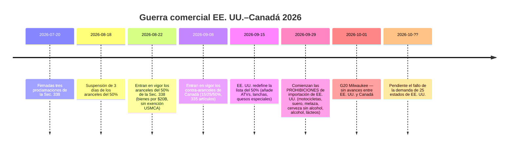
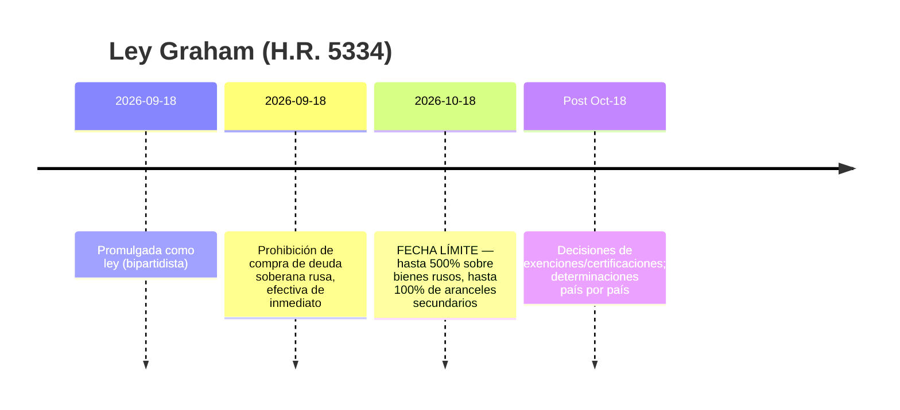
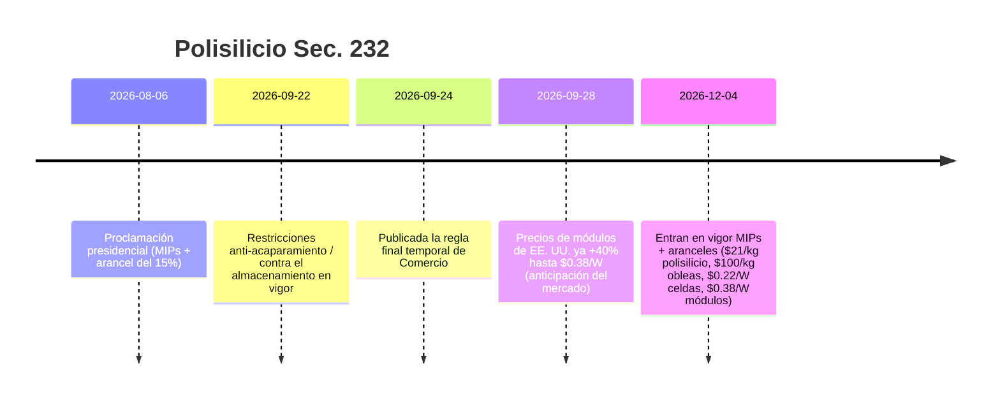

# Informe de inteligencia comercial global — Semana del September 28 – October 5, 2026

**Briefing semanal de nivel analista.** Ventana de cobertura: September 28 – October 5, 2026. Compilado a partir de ~45 fuentes de noticias comerciales, políticas, datos y fletes en todo el mundo. Cada afirmación está respaldada por fuentes; los valores no verificables se marcan como n/a.

---

## Tabla de contenidos

1. [Resumen ejecutivo](#1-executive-summary)
2. [Alertas](#2-alerts)
3. [Historias destacadas — análisis en profundidad](#3-top-stories--deep-dives)
4. [Monitor arancelario](#4-tariff-tracker)
5. [Análisis en profundidad de la política de EE. UU.](#5-us-policy-deep-dive)
6. [Política mundial por región](#6-world-policy-by-region)
7. [Medidas de cumplimiento](#7-enforcement-actions)
8. [Publicación de datos](#8-data-releases)
9. [Mercado de fletes](#9-freight-market)
10. [Cronogramas de políticas](#10-policy-timelines)
11. [Próximos vencimientos y eventos (próximos 90 días)](#11-upcoming-deadlines--events-next-90-days)
[Señales de contenido — ángulos de marketing de Dureach](#12-content-flags--dureach-marketing-angles)
12. [Fuentes y metodología](#12-sources--methodology)

---

## 1. Resumen ejecutivo

La semana decisiva para el comercio global en 2026 hasta ahora. Tres escaladas estructurales ocurrieron al mismo tiempo:

- **La guerra comercial entre EE. UU. y Canadá se volvió cinética.** Tras los aranceles del 50% de la Sección 338 sobre ~$20B en productos canadienses (en vigor desde Aug 22, redefinidos el Sept 15), Washington pasó el Sept 29 a **prohibiciones totales de importación** de motocicletas, suero de leche, melaza, cerveza sin alcohol, alcohol y lácteos canadienses — los productos ya en tránsito enfrentan el arancel del 50% en su lugar. Los contra-aranceles espejo de Canadá del 15/25/50% sobre 335 partidas arancelarias estadounidenses (en vigor desde el Sept 8) se mantienen. Veinticinco estados de EE. UU. están demandando para anular los aranceles; aún no hay fallo. ([tariffcalculator2026.com](https://tariffcalculator2026.com/canada-50-percent-tariff-august-19-explainer), [surtaxscan.com](https://surtaxscan.com/news/canadas-counter-tariffs-are-back-15-25-and-50-on-335-us-tariff-items-from))
- **El reloj de la Ley Graham avanza.** Firmada el Sept 18, la Ley de Sanciones a Rusia e Irán de Lindsey O. Graham ordena aranceles de hasta **500% sobre productos rusos y hasta 100% de aranceles secundarios** sobre los principales importadores de energía rusa (China, India y Turquía, los más expuestos) para el **Oct 18**. Los aranceles se acumulan sobre todos los aranceles existentes. ([lexblog.com](https://www.lexblog.com/2026/09/24/the-lindsey-graham-sanctions-act-what-businesses-need-to-know-about-the-new-tariffs/), [jdsupra.com](https://www.jdsupra.com/legalnews/new-sanctions-and-tariff-power-under-4624517/))
- **La UE recurrió a su propia "Sección 301".** El Oct 5, Francia y Alemania propusieron conjuntamente un arma comercial de reacción rápida de la UE — independiente del país, activable por una minoría de Estados miembros, con capacidad de corte inmediato del mercado único — dirigida a distorsiones sistémicas del mercado (léase: China). Beijing respondió en días: una investigación antidumping sobre el p-nitrotolueno de la UE (Oct 3) y una firme advertencia del MOFCOM. Los líderes de la UE abordarán el expediente de China en una cumbre en Bruselas el Oct 15. ([reuters.com](https://www.reuters.com/world/china/france-germany-propose-new-rapid-eu-trade-response-tool-2026-10-05/), [wsj.com](https://www.wsj.com/world/europe/germany-and-france-are-proposing-a-new-weapon-to-counter-flood-of-chinese-goods-f723dfdf))

Mientras tanto, el sistema multilateral se desgastó aún más: los ministros de comercio del G20 en Milwaukee (Sept 30–Oct 2) acordaron exactamente uno de los cuatro puntos de la agenda (coerción en el comercio de alimentos) y se estancaron en exceso de capacidad, trabajo forzoso y reforma del NMF. EE. UU. y China publicaron listas recíprocas de alivio arancelario "30-por-30" ($30B por lado) — simbólicamente significativas, económicamente marginales (HSBC: el arancel ponderado de EE. UU. sobre China baja de 27.3% a 26.0%). C.H. Robinson anunció la **adquisición de RXO por $5.8B**, la mayor consolidación 3PL del ciclo. Y CBP emitió dos nuevas Órdenes de Retención de Liberación por trabajo forzoso sobre aceite de palma de Indonesia, elevando el total activo a 60 WROs + 8 Determinaciones.

**Fletes:** un mercado a dos velocidades. Las tarifas de contenedores transpacíficas se mantuvieron firmes (Drewry WCI $4,434/FEU, -1% w/w; Shanghái–Nueva York $10,428), mientras Asia–Europa cayó por 12.ª semana consecutiva por el regreso de la capacidad vía Suez. Los graneles secos tuvieron su peor semana en un mes (BDI 3,148, -8.1% w/w) con el colapso de 12.8% en las ganancias de los capesize.

---

## 2. Alertas

| # | Alerta | Vigencia | Impacto | Fuente |
|---|-------|-----------|--------|--------|
| A1 | Prohibiciones de importación de EE. UU. sobre motocicletas, suero de leche, melaza, cerveza sin alcohol, alcohol y lácteos canadienses | Sept 29, 2026 | Productos afectados con entrada denegada; productos en tránsito enfrentan 50% de arancel | [asrwe.com](https://asrwe.com/asr-university/us-canada-import-ban-alcohol-motorcycles-section-338-expansion-september-2026) |
| A2 | WROs de CBP sobre aceite de palma de Indonesia (Mitra Aneka Rezeki, Hardaya Inti Plantation) | Sept 29, 2026 | Detención inmediata en todos los puertos de EE. UU.; 60 WROs activas + 8 Determinaciones ahora | [thompsonhine.com](https://www.thompsonhine.com/insights/cbp-issues-withhold-release-orders-on-two-indonesian-palm-oil-producers/) |
| A3 | Aranceles secundarios de la Ley Graham (hasta 100%) sobre principales compradores de energía rusa | Vencimiento Oct 18, 2026 | China, India y Turquía, los más expuestos; se acumulan sobre aranceles existentes | [lexblog.com](https://www.lexblog.com/2026/09/24/the-lindsey-graham-sanctions-act-what-businesses-need-to-know-about-the-new-tariffs/) |
| A4 | Polisilicio Sección 232: MIPs + aranceles del 15% | Dec 4, 2026 (reglas anti-acumulación ya en vigor) | $21/kg poli, $100/kg obleas, $0.22/W celdas, $0.38/W módulos; precios de módulos en EE. UU. ya +40% | [mondaq.com](https://www.mondaq.com/unitedstates/export-controls-trade-investment-sanctions/1848548/polysilicon-and-derivatives-in-the-bullseye-for-major-new-tariffs-and-other-restrictions) |
| A5 | Propuesta de herramienta de "reacción sistémica" de la UE | Propuesta Oct 5; cumbre de líderes de la UE Oct 15 | Posibles poderes de corte de mercado en 24 horas; riesgo de represalias de China | [reuters.com](https://www.reuters.com/world/china/france-germany-propose-new-rapid-eu-trade-response-tool-2026-10-05/) |
| A6 | Investigación antidumping de China sobre p-nitrotolueno de la UE | Abierta Oct 3 (Anuncio No. 44 del MOFCOM) | Primer disparo de represalia en la escalada UE-China | [vespernews.com](https://www.vespernews.com/en/news/7dd758b7-b501-4c41-b2ee-13cb57ed832f) |

### A1 — Prohibiciones de importación de EE. UU. sobre productos canadienses (detalle)

Las proclamaciones del September 8 crearon una estructura de dos oleadas. Primera oleada (Sept 15): la lista de productos del 50% de la Sección 338 fue redefinida — **se agregaron** al 50%: quesos especiales, grasas y aceites modificados, cueros bovinos y cuero para tapicería, pieles crudas/curtidas, lanchas recreativas, papel especial, artículos selectos de acero/aluminio, accesorios metálicos e insumos de soldadura, carritos de golf, muebles y lámparas, cuatrimotos, más lácteos. **Se eliminaron**: sal de roca, azúcar, cemento, ensambles de equipos de maniobra, papel higiénico, partes de cañas de pescar, whiskies/licores a granel. Segunda oleada (Sept 29): **prohibiciones de importación** — no aranceles sino denegación de entrada — sobre motocicletas canadienses (incluidas BRP Can-Am Spyder/Canyon), suero de leche, melaza, cerveza sin alcohol, bebidas alcohólicas y lácteos. Los productos ya en el agua o en almacén fiscal antes del Sept 29 siguen sujetos al arancel del 50% en lugar de la prohibición. ([tariffcalculator2026.com](https://tariffcalculator2026.com/canada-section-338-september-15-29-what-changes), [asrwe.com](https://asrwe.com/asr-university/us-canada-import-ban-alcohol-motorcycles-section-338-expansion-september-2026))

Regla crítica de acumulación: el arancel del 50% de la Sección 338 **no tiene exención del USMCA** — un certificado CUSMA no sirve contra él. Sin embargo, el arancel separado del 10% de la Sección 301 por trabajo forzoso sobre productos canadienses *sí* se evita con un reclamo USMCA válido, por lo que un producto cubierto sin origen USMCA puede enfrentar **50% + 10% = 60%**. ([tarifflens.ai](https://www.tarifflens.ai/blog/section-338-canada-retaliation-september-2026-importers-guide))

### A2 — WROs sobre aceite de palma de Indonesia (detalle)

Las órdenes del Sept 29 de CBP apuntan al aceite de palma y derivados de Mitra Aneka Rezeki (MAR) y Hardaya Inti Plantation (HIP). Evidencia revisada: entrevistas a trabajadores, recibos de nómina, cuotas de cosecha, fotografías, informes de ONG/gobiernos, medios de prensa, investigación académica. Los trabajadores de MAR mostraron **nueve** indicadores de trabajo forzoso de la OIT (incluida la retención de documentos de identidad y el aislamiento); HIP mostró **siete** (servidumbre por deudas, retención de salarios, engaño, horas extras excesivas, intimidación, condiciones abusivas, abuso de vulnerabilidad). Las detenciones son inmediatas en todos los puertos de EE. UU.; los importadores pueden exportar, destruir o demostrar abastecimiento limpio. ([thompsonhine.com](https://www.thompsonhine.com/insights/cbp-issues-withhold-release-orders-on-two-indonesian-palm-oil-producers/), [ghy.com](https://www.ghy.com/trade-compliance/2026-withhold-release-orders-wros/))

### A3 — Ley Graham (detalle)

H.R. 5334, firmada el Sept 18 con apoyo bipartidista, pone el régimen de sanciones a Rusia sobre una base estatutaria y crea dos vías arancelarias obligatorias, ambas con vencimiento el **Oct 18**: hasta **500%** sobre todos los productos de origen ruso, y hasta **100% de aranceles secundarios** sobre países que estuvieron entre los 5 principales importadores de crudo o gas ruso e hicieron nuevas compras dentro de los 30 días de la promulgación. Los más expuestos: **China, India, Turquía**; también elevada: Eslovaquia, Hungría, EAU. Los miembros de la UE se evalúan individualmente. Válvulas de escape: una excepción para gas natural (importaciones <15% del total de exportaciones de gas de Rusia + "pasos significativos" para reducir), exenciones por interés nacional. Todos los aranceles se **acumulan** sobre los aranceles vigentes de las Secciones 301/232. ([lexblog.com](https://www.lexblog.com/2026/09/24/the-lindsey-graham-sanctions-act-what-businesses-need-to-know-about-the-new-tariffs/), [jdsupra.com](https://www.jdsupra.com/legalnews/new-sanctions-and-tariff-power-under-4624517/), [tradepractitioner.com](https://www.tradepractitioner.com/2026/09/sanctions-by-statute-the-graham-act-and-tariffs-on-russias-energy-buyers/))

### A4 — Polisilicio Sección 232 (detalle)

Proclamación del Aug 6 + regla final temporal de Comercio (Sept 24). Desde el **Dec 4**: precios mínimos de importación de **$21/kg** (polisilicio), **$100/kg** (lingotes/oblea
...[truncated 19762 chars]---

## 3. Historias destacadas — análisis en profundidad

### 3.1 Los ministros de comercio del G20 se fracturan en Milwaukee (Sept 30 – Oct 2)

**Qué pasó.** Presididos por el USTR Jamieson Greer, los ministros de comercio del G20 se reunieron en Milwaukee bajo la presidencia estadounidense del G20. De cuatro puntos de la agenda, solo **uno** produjo consenso: una declaración conjunta condenando el uso del comercio de alimentos como arma mediante acciones coercitivas. Tres fracasaron: (1) **exceso de capacidad** — un borrador respaldado por la mayoría de los miembros fue bloqueado por una minoría liderada por China que resistía el lenguaje sobre subsidios; Greer dijo que la presidencia estaba "gravemente decepcionada"; (2) **trabajo forzoso** — sin texto conjunto, por lo que EE. UU., México y Argentina emitieron una declaración separada; (3) **reforma del NMF** — EE. UU. abrió un debate sobre si el trato incondicional de nación más favorecida "no promueve la reciprocidad" y "crea polizones", pero no buscó una declaración conjunta. ([barchart.com](https://www.barchart.com/story/news/4917577/g20-trade-talks-yield-little-progress-while-tensions-simmer) (AP), [reuters.com](https://www.reuters.com/world/china/g20-trade-chiefs-denounce-food-trade-coercion-not-excess-factory-capacity-2026-10-01/), [nationpress.com](https://www.nationpress.com/all/g20-milwaukee-talks-eye-more-diesel-globally))

**Cifras clave y contexto.**
- EE. UU. ha abierto investigaciones de exceso de capacidad contra países "desde Noruega hasta Bangladesh"; además del acero chino, Washington cita autos, baterías, papel y semiconductores. ([barchart.com](https://www.barchart.com/story/news/4917577/g20-trade-talks-yield-little-progress-while-tensions-simmer))
- India enmendó su Política de Comercio Exterior en **julio de 2026** para prohibir importaciones de productos hechos total o parcialmente con trabajo forzoso — Goyal lo planteó en Milwaukee; India aplicó una estrategia de dos vías (defender posiciones en el plenario, impulsar bilaterales al margen). ([beatsinbrief.com](https://beatsinbrief.com/2026/10/03/milwaukee-g20-trade-ministers-piyush-goyal-india-positions/))
- Un resultado al margen: discusiones intermediadas por EE. UU. que se espera pongan **más diésel en el mercado global** (partes, volúmenes y calendario no divulgados). ([nationpress.com](https://www.nationpress.com/all/g20-milwaukee-talks-eye-more-diesel-globally))
- Sin avances en la disputa EE. UU.–Canadá; Trump prohibió ~$1B de importaciones canadienses (alcohol, lácteos, motocicletas) durante la semana. ([businessmirror.com.ph](https://businessmirror.com.ph/2026/10/02/g20-trade-talks-yield-little-progress-while-tensions-simmer/))

**Por qué importa.** La incapacidad de producir un documento final señala que la gobernanza multilateral del comercio ya no es capaz de contener la actual oleada arancelaria — la acción se ha movido permanentemente a las vías unilaterales y bilaterales. Hay que observar la cumbre de líderes del G20 en **Miami** para ver si las fracturas de Milwaukee afloran a nivel de jefes de Estado. ([nationpress.com](https://www.nationpress.com/international/g20-trade-talks-end-without-deal-goyal))

### 3.2 EE. UU.–China "30-por-30": listas publicadas, economía marginal

**Qué pasó.** Tras la cumbre Trump–Xi del Sept 23–25 en Washington, ambos gobiernos publicaron listas recíprocas de alivio arancelario el Sept 28 bajo el marco "30-por-30" de la nueva Junta de Comercio EE. UU.–China: cada lado puede desarancelar ~$30B en productos del otro. ([cnn.com](https://www.cnn.com/2026/09/28/business/us-china-tariff-cuts-60-billion-intl?cid=external-feeds_iluminar_meta), [kpmg.com](https://kpmg.com/us/en/taxnewsflash/news/2026/09/us-china-trade-framework-tariff-reductions.html))

**Cifras clave.**
| | Lista de EE. UU. (productos chinos) | Lista de China (productos de EE. UU.) |
|---|---|---|
| Líneas HTS | 77 | 1,619 |
| Valor | ~$30B | ~$30B |
| Carácter | Bienes de consumo: juguetes, fuegos artificiales, vajilla, mantas, microondas, luces de árbol de Navidad, sillas altas, asientos infantiles para auto, afeitadoras eléctricas | Agricultura: maíz, trigo, sorgo, carne, lácteos, aceites, pescado, mariscos, madera; más cosméticos, dispositivos médicos |
| Exclusiones notables | Juguetes con Wi-Fi/Bluetooth (excepción por seguridad de datos); **toda la vestimenta** | **Soja en grano** — la mayor exportación agrícola de EE. UU. a China |
| Participación del flujo bilateral | ~7% de las importaciones de EE. UU. desde China (valores 2024) | ~18% de las importaciones de China desde EE. UU. |

**Economía.** HSBC (Sept 29): el arancel ponderado de EE. UU. sobre productos chinos cae solo de **27.3% a 26.0%**. Más del 90% de los productos listados vuelven a aranceles NMF ("normales"). Los ajustes bajo los términos de referencia ocurren **como máximo una vez al año**. ([exencialrp.substack.com](https://exencialrp.substack.com/p/hsbc-sees-us-china-30-for-30-deal) (HSBC vía Substack), [lexblog.com](https://www.lexblog.com/2026/09/29/u-s-china-board-of-trade-30-for-30-identifies-products-recommended-for-reduced-tariffs/))

**Acuerdos paralelos.** China importará **≥10M de toneladas métricas de carbón de EE. UU. en 2027 y de nuevo en 2028**; se lanzó un grupo de trabajo de acceso al mercado agrícola; los niveles de envíos de tierras raras volverán a "niveles apropiados" (China cumplió solo ~dos tercios de los compromisos previos de suministro; el déficit de bienes EE. UU.–China bajó 40% desde Jan 2025 a $140B). Aún no hay recortes arancelarios en vigor — USTR todavía debe anunciar tasas y fechas. ([cnn.com](https://www.cnn.com/2026/09/28/business/us-china-tariff-cuts-60-billion-intl?cid=external-feeds_iluminar_meta), [kpmg.com](https://kpmg.com/us/en/taxnewsflash/news/2026/09/us-china-trade-framework-tariff-reductions.html), [tradersunion.com](https://tradersunion.com/news/financial-news/show/3528484-us-china-lower-tariff-framework/))

**Por qué importa.** La verdadera importancia del marco es institucional — una Junta de Comercio permanente con procedimientos de trabajo — no la matemática arancelaria. Para el abastecimiento: la exclusión de la vestimenta preserva el incentivo de diversificación de China hacia Vietnam/Bangladesh/India; los textiles para el hogar (mantas, ropa de cama/mesa, cortinas) podrían enfrentar una competencia china más dura si el alivio se concreta. ([textalks.com](https://textalks.com/us-china-tariff-excludes-apparel-but-opens-door-to-chinese-home-textiles/))

### 3.3 C.H. Robinson adquirirá RXO — $5.8B

**Qué pasó.** El Oct 5, C.H. Robinson (Nasdaq: CHRW) acordó adquirir RXO (NYSE: RXO) en un acuerdo en efectivo y acciones: **$17.25 en efectivo + 0.0856 acciones de CHRW por acción de RXO = $30.25/acción, una prima del 29%** sobre el cierre del Oct 2 — valor implícito de **$5.8B**, valor empresarial combinado **>$25B**. Ambas juntas por unanimidad; MFN Partners (17% de RXO) y Orbis (mayor accionista) lo respaldan; cierre esperado en el **H1 2027** pendiente de aprobación regulatoria y voto de accionistas de RXO. ([rxo.com](https://rxo.com/news/c-h-robinson-to-acquire-rxo-redefining-the-future-of-third-party-logistics-while-unlocking-significant-shareholder-value/), [reuters.com](https://www.reuters.com/business/ch-robinson-buy-freight-broker-rxo-58-billion-2026-10-05/))

**Cifras clave.**
- Los accionistas de RXO poseerán ~11% de la compañía combinada; RXO se integra a la división de Transporte Terrestre de Norteamérica de CHRW (>2/3 de los ingresos).
- **$300M en sinergias netas de costos en 2 años** vía el modelo operativo "Lean AI" de CHRW (servicios compartidos, consolidación de proveedores, bienes raíces, seguros).
- Reacción del mercado: RXO **+~20%** ($28.10–28.49), CHRW **-12%** premercado ($150 vs $157.72 de cierre) — el clásico descuento del adquirente; Reuters Breakingviews calificó los retornos de "mediocres".
- Asesores: Morgan Stanley (CHRW), Goldman Sachs (RXO).
- RXO subió 16.2% en las dos sesiones previas al anuncio con volumen de 3.67M de acciones (vs ~1.9M normal) — corrida visible previa al anuncio. ([freightwaves.com](https://www.freightwaves.com/news/breaking-c-h-robinson-acquiring-rxo), [financial-news.co.uk](https://www.financial-news.co.uk/c-h-robinson-to-buy-rxo-in-5-8bn-cash-and-stock-deal/), [inboundlogistics.com](https://www.inboundlogistics.com/articles/c-h-robinson-to-acquire-rxo-in-5-8-billion-deal/))

**Por qué importa.** La consolidación del corretaje de fletes se acelera en ciclos de tarifas suaves: los jugadores de escala compran densidad y tecnología en lugar de construirla. El bróker combinado tendrá un poder de precios inigualable en carga completa en Norteamérica — los cargadores deben esperar negociaciones contractuales más duras; los brókers pequeños enfrentan una presión existencial. La historia de sinergias "Lean AI" también es una señal: los modelos de corretaje intensivos en personal están siendo automatizados. (Newsquawk vía [financial-news.co.uk](https://www.financial-news.co.uk/c-h-robinson-to-buy-rxo-in-5-8bn-cash-and-stock-deal/))

### 3.4 India–EE. UU.: "recta final" pero sin acuerdo

**Qué pasó.** Al margen del G20 (Oct 1–2), el USTR Greer se reunió con el ministro de Comercio Piyush Goyal y declaró que las conversaciones están en la "recta final" — pero "no creo que haya algo inminente". Una llamada Trump–Modi precedió la reunión; se espera otra llamada de líderes "muy pronto". ([thehindubusinessline.com](https://www.thehindubusinessline.com/news/nothing-imminent-us-trade-representative-greer-on-india-trade-deal-modi-trump-to-talk-soon/article71536059.ece/amp/), [nationpress.com](https://www.nationpress.com/international/india-us-trade-deal-in-short-strokes-greer))

**Cifras clave y puntos de presión.**
- Los productos indios enfrentan un **10% adicional de la Sección 301 por trabajo forzoso desde el July 24** (60 economías cubiertas); una segunda investigación 301 sobre exceso de capacidad estructural (16 economías, incl. India) está pendiente y podría golpear el acero.
- Puntos de fricción: acceso agrícola, comercio digital, compras indias de petróleo ruso — ahora agudizados por los aranceles secundarios de hasta 100% de la Ley Graham.
- Pese a los aranceles, las exportaciones de mercancías de India a EE. UU. subieron **21.83% interanual en agosto**; rupia cerca de **96.3/USD**; meta de $500B en comercio bilateral para 2030.
- La ministra de Finanzas Sitharaman (Oct 4): las conversaciones han "llegado a una meseta" — es difícil asegurar más concesiones. ([thefinancialeconomy.com](https://www.thefinancialeconomy.com/india-us-trade-talks/), [jagranjosh.com](https://www.jagranjosh.com/general-knowledge/indiaus-trade-deal-not-imminent-why-is-it-being-delayed-who-has-the-advantage-what-are-indias-options-1820012731-1), [english.dainikjagranmpcg.com](https://english.dainikjagranmpcg.com/top-stories/india-us-trade-talks-reach-plateau-nirmala-sitharaman/article-36152))

**Por qué importa.** India es la variable decisiva tanto en la historia de abastecimiento China+1 como en el mapa de aranceles secundarios de la Ley Graham. Un acuerdo desbloquearía una de las pocas válvulas de alivio arancelario disponibles para los importadores estadounidenses este año; el fracaso mantiene a los exportadores indios — y a sus compradores en EE. UU. — en el limbo hacia la temporada alta.

### 3.5 Drones: aranceles al alza, controles de exportación a la baja

**Qué pasó.** Dos acciones opuestas de EE. UU. sobre drones, ambas originadas en un doble anuncio del Aug 13: (1) una proclamación de la Sección 232 (Proclamación 11055) que impone aranceles del **100%** a drones de >25kg o con imagen térmica (más estaciones de acoplamiento y componentes críticos, Anexo I) y del **25%** a drones pequeños no térmicos (Anexo II), efectiva el Sept 3; componentes (Anexo III) al 25% desde el **Feb 9, 2027**. Tasas aliadas: Reino Unido 10%, Japón/Corea/Taiwán/Suiza/Liechtenstein/UE con tope de 15% total. (2) Una regla final de BIS que **flexibiliza los controles de exportación**: los UAVs de menos de 3 horas de autonomía pasan a solo-AT bajo ECCN 9A012, con excepción de licencia STA para el Grupo de Países A:5 — aunque los usuarios finales militares en China/Rusia/Bielorrusia/Venezuela siguen restringidos. ([whitehouse.gov](https://www.whitehouse.gov/presidential-actions/2026/08/adjusting-imports-of-unmanned-aircraft-systems-and-unmanned-aircraft-systems-components-into-the-united-states/), [jdsupra.com](https://www.jdsupra.com/legalnews/two-us-drone-actions-reshape-export-8075367/) (Wiley), [tbgfs.com](https://tbgfs.com/csms-69738151-guidance-section-232-duties-on-imports-of-unmanned-aircraft-systems-and-unmanned-aircraft-systems-components/))

**Por qué importa.** EE. UU. está simultáneamente amurallando su mercado doméstico de drones y armando a sus exportadores — una política industrial de manual de "fortaleza + avance". Los compradores comerciales de drones enfrentan un mercado bifurcado: productos de cadena de suministro aliada al 10–15%, origen chino al 25–100%.

### 3.6 El déficit de bienes de EE. UU. llega a $132.6B en agosto

**Qué pasó.** El déficit adelantado de bienes de agosto se amplió **11.5%** a **$132.6B**: importaciones de **$336.1B (+5.5%)** por suministros industriales y bienes de capital para la expansión de IA; exportaciones de **$203.4B (+1.9%)**. El comercio es ahora un lastre para el PIB por **tercer trimestre consecutivo** — un momento incómodo para una administración que vende los aranceles como medicina contra el déficit. ([reuters.com](https://www.reuters.com/business/us-goods-trade-deficit-widens-sharply-august-2026-09-30/))

### 3.7 El de minimis sigue muerto; fluyen los reembolsos IEEPA

**Qué pasó.** El Tribunal de Comercio Internacional (Aug 13, caso Detroit Axle) confirmó la rescisión basada en IEEPA de la exención de minimis de $800 — dictaminando que eliminar un "privilegio" no es imponer un arancel, por lo que sobrevive al fallo de febrero de la Corte Suprema que anuló los aranceles IEEPA. El de minimis global terminó el Aug 29, 2025; el cierre por ley del Congreso entra en vigor en July 2027. Por separado, el sistema CAPE de CBP (activo desde el April 20) está procesando los **~$165B en aranceles IEEPA** recaudados, con intereses acumulándose ~$650M/mes; **CAPE Fase 3 se despliega el Oct 6** para manejar reembolsos en partidas reliquidadas. ([reuters.com](https://www.reuters.com/legal/government/us-court-backs-trumps-power-close-de-minimis-tariff-exemption-2026-08-13/), [openclassactions.com](https://openclassactions.com/tariff-class-actions.php))

---

## 4. Monitor arancelario

Línea base + cambios de esta semana. Las tasas son aranceles *adicionales* salvo indicación contraria; las reglas de acumulación varían por medida — verifica HTS, origen y fecha de entrada por embarque.

| Objetivo | Medida | Tasa | Vigencia | Estado | Fuente |
|---|---|---|---|---|---|
| Canadá (productos cubiertos) | Sec. 338 (3 proclamaciones, Jul 20) | 50% | Aug 22, 2026 | En vigor; **sin exención del USMCA**; redefinida Sept 15 | [tariffcalculator2026.com](https://tariffcalculator2026.com/canada-50-percent-tariff-august-19-explainer) |
| Canadá (motocicletas, suero de leche, melaza, cerveza NA, alcohol, lácteos) | Prohibiciones de importación Sec. 338 | Prohibición (denegación de entrada) | Sept 29, 2026 | En vigor | [asrwe.com](https://asrwe.com/asr-university/us-canada-import-ban-alcohol-motorcycles-section-338-expansion-september-2026) |
| Canadá (general) | Sec. 301 trabajo forzoso | 10% | Jul 24, 2026 (60 economías) | En vigor; el reclamo USMCA exime | [tarifflens.ai](https://www.tarifflens.ai/blog/section-338-canada-retaliation-september-2026-importers-guide) |
| Productos de EE. UU. → Canadá | Orden de Sobretasa de Canadá 2026 | 15% / 25% / 50% (335 partidas) | Sept 8, 2026 | En vigor; espejo de las tasas 338 de EE. UU. | [surtaxscan.com](https://surtaxscan.com/news/canadas-counter-tariffs-are-back-15-25-and-50-on-335-us-tariff-items-from) |
| Rusia (todos los productos) | Ley Graham (H.R. 5334) | Hasta 500% | Para Oct 18, 2026 | Firmada Sept 18; implementación pendiente | [lexblog.com](https://www.lexblog.com/2026/09/24/the-lindsey-graham-sanctions-act-what-businesses-need-to-know-about-the-new-tariffs/) |
| Principales compradores de energía rusa (China, India, Turquía…) | Aranceles secundarios Ley Graham | Hasta 100% | Para Oct 18, 2026 | Pendiente; se acumulan sobre aranceles existentes | [jdsupra.com](https://www.jdsupra.com/legalnews/new-sanctions-and-tariff-power-under-4624517/) |
| China (cadena del polisilicio) | Sec. 232 MIPs + arancel | MIP $21/kg–$0.38/W + 15% | Dec 4, 2026 | Proclamada Aug 6; reglas anti-acumulación en vigor | [mondaq.com](https://www.mondaq.com/unitedstates/export-controls-trade-investment-sanctions/1848548/polysilicon-and-derivatives-in-the-bullseye-for-major-new-tariffs-and-other-restrictions) |
| Drones (general) | Sec. 232 (Proc. 11055) | 100% (>25kg/térmicos); 25% (pequeños) | Sept 3, 2026 | En vigor | [whitehouse.gov](https://www.whitehouse.gov/presidential-actions/2026/08/adjusting-imports-of-unmanned-aircraft-systems-and-unmanned-aircraft-systems-components-into-the-united-states/) |
| Drones (RU / JP/KR/TW/CH/UE) | Tasas aliadas Sec. 232 | 10% RU; tope 15% otros | Sept 3, 2026 | En vigor (certificación requerida) | [tbgfs.com](https://tbgfs.com/csms-69738151-guidance-section-232-duties-on-imports-of-unmanned-aircraft-systems-and-unmanned-aircraft-systems-components/) |
| Componentes de drones (Anexo III) | Sec. 232 | 25% | Feb 9, 2027 | Anunciado | [jdsupra.com](https://www.jdsupra.com/legalnews/trump-administration-imposes-section-5315313/) |
| China (lista 30-por-30, 77 líneas HTS) | Alivio recíproco (pendiente) | Reversión hacia NMF | n/a — anuncio USTR pendiente | Listas publicadas Sept 28; sin recortes en vigor | [kpmg.com](https://kpmg.com/us/en/taxnewsflash/news/2026/09/us-china-trade-framework-tariff-reductions.html) |
| Farmacéuticos (patentados) | Sec. 232 | Según HTSUS 9903.04.60–70 | Guía actualizada Sept 28 | Guía de entrada de CBP emitida | [ghy.com](https://www.ghy.com/trade-compliance/category/international-trade-issues/) |
| India (general) | Sec. 301 trabajo forzoso | 10% | Jul 24, 2026 | En vigor | [thefinancialeconomy.com](https://www.thefinancialeconomy.com/india-us-trade-talks/) |
| 16 economías incl. India | Investigación 301 exceso de capacidad | n/a | Investigación en curso | Acción USTR prometida "en semanas" | [thefinancialeconomy.com](https://www.thefinancialeconomy.com/india-us-trade-talks/) |
| 178 exclusiones de productos | Exclusiones Sec. 301 | Excluidos | Hasta Nov 9, 2026 | Por vencer |  |
| UE (propuesto) | Herramienta de "reacción sistémica" | Hasta corte de mercado | Propuesta Oct 5; cumbre Oct 15 | Aún no es ley | [reuters.com](https://www.reuters.com/world/china/france-germany-propose-new-rapid-eu-trade-response-tool-2026-10-05/) |

---

## 5. Análisis en profundidad de la política de EE. UU.

### Acciones de EE. UU. esta semana

| Fecha | Actor | Acción | Importancia | Fuente |
|---|---|---|---|---|
| Sept 28 | CBP | Guía de entrada actualizada para aranceles Sec. 232 farmacéuticos (HTSUS 9903.04.60–70); 9903.04.61 retirada tras Sept 29 | Claridad en reglas de declaración para importadores farmacéuticos | [ghy.com](https://www.ghy.com/trade-compliance/category/international-trade-issues/) |
| Sept 29 | CBP | Boletines TRQ FY2027: vestimenta AGOA, azúcar crudo de caña | Planificación del año de cuotas | [ghy.com](https://www.ghy.com/trade-compliance/category/international-trade-issues/) |
| Sept 29 | CBP | Dos WROs por trabajo forzoso (aceite de palma de Indonesia) | 60 WROs + 8 Determinaciones ahora activas | [kpmg.com](https://kpmg.com/us/en/taxnewsflash/news/2026/09/us-cbp-wros-indonesian-palm-oil.html) |
| Sept 29 | Casa Blanca | Prohibiciones de importación a Canadá entran en vigor | Primeras *prohibiciones* de importación de EE. UU. (no aranceles) de la guerra comercial | [asrwe.com](https://asrwe.com/asr-university/us-canada-import-ban-alcohol-motorcycles-section-338-expansion-september-2026) |
| Sept 30 | USTR | Declaración del Foro Global sobre Exceso de Capacidad del Acero | Cobertura multilateral para acciones sobre acero |  |
| Oct 1–2 | USTR (Greer) | G20 Milwaukee: solo consenso sobre coerción alimentaria; debate de reforma del NMF abierto | Vía multilateral estancada; vía unilateral afirmada | [reuters.com](https://www.reuters.com/world/china/g20-trade-chiefs-denounce-food-trade-coercion-not-excess-factory-capacity-2026-10-01/) |
| Oct 2 | USTR | 14.ª remediación RRM — neumáticos Corporación de Occidente (México) | Continúa la aplicación laboral del USMCA |  |
| Oct 2 | USTR | Revisión conjunta USMCA 2027: comentarios públicos hasta el **Jan 12, 2027** | Inicia el reloj del año de revisión |  |
| Oct 5 | Casa Blanca/Congreso | Cuenta regresiva de implementación de la Ley Graham (13 días restantes) | Aranceles secundarios de hasta 100% pendientes | [lexblog.com](https://www.lexblog.com/2026/09/24/the-lindsey-graham-sanctions-act-what-businesses-need-to-know-about-the-new-tariffs/) |

**Análisis.** La administración está manejando tres relojes simultáneamente: (1) el reloj *punitivo* — prohibiciones a Canadá, aranceles secundarios de la Ley Graham, MIPs de polisilicio — todos diseñados para maximizar la presión antes de fin de año; (2) el reloj *institucional* — preparación de la revisión USMCA 2027, procedimientos de la Junta de Comercio, debate de reforma del NMF — construyendo maquinaria permanente; (3) el reloj *legal* — la victoria del CIT sobre de minimis vs. la derrota de los aranceles IEEPA en la Corte Suprema, con $165B en reembolsos IEEPA fluyendo por CAPE. El patrón: donde los tribunales restringen (aranceles IEEPA), la administración rodea vía 232/338/301 y estatutos (Ley Graham). Los importadores deben planificar *más* medidas bajo autoridades *más antiguas*, no menos.

## 6. Política mundial por región

### Europa

| Desarrollo | Detalle | Fuente |
|---|---|---|
| Propuesta franco-alemana de herramienta de reacción rápida | Instrumento de "reacción sistémica"; activación por minoría; hasta corte inmediato del mercado; instrumento de diversificación en paralelo | [reuters.com](https://www.reuters.com/world/china/france-germany-propose-new-rapid-eu-trade-response-tool-2026-10-05/) |
| Déficit UE–China | €359.9B en 2025; €103B en Q2 2026 (máximo desde Q3 2022); alzas de importaciones en maquinaria, textiles, metales, químicos | [brusselsmorning.com](https://brusselsmorning.com/eu-china-trade-tensions/104764/) |
| Cumbre de líderes de la UE Oct 15 | Cumbre en Bruselas abordará los desequilibrios con China — primera prueba de la propuesta franco-alemana | [reuters.com](https://www.reuters.com/world/china/france-germany-propose-new-rapid-eu-trade-response-tool-2026-10-05/) |
| La UE evalúa recortes arancelarios industriales | Posibles recortes para evitar represalias chinas sobre el acero (según reportes de Capitol Forum) |  |

### Canadá

| Desarrollo | Detalle | Fuente |
|---|---|---|
| Contra-aranceles en vigor | 15%/25%/50% sobre 335 partidas de EE. UU. desde Sept 8; cobertura de C$28B; productos en tránsito excluidos | [surtaxscan.com](https://surtaxscan.com/news/canadas-counter-tariffs-are-back-15-25-and-50-on-335-us-tariff-items-from) |
| Paquete de apoyo de C$7.5B | Ayuda doméstica para industrias afectadas |  |
| Impulso de diversificación | El gobierno de Carney pivota hacia acuerdos con Europa/India |  |
| 25 estados de EE. UU. demandando | Impugnación al régimen arancelario; sin fallo aún |  |

### China (MOFCOM)

| Desarrollo | Detalle | Fuente |
|---|---|---|
| Investigación antidumping: p-nitrotolueno de la UE | Abierta Oct 3 (Anuncio No. 44) — señal de represalia | [vespernews.com](https://www.vespernews.com/en/news/7dd758b7-b501-4c41-b2ee-13cb57ed832f) |
| Advertencia firme sobre la herramienta de la UE | Represalia "firme" amenazada contra cualquier instrumento de reacción rápida | [reuters.com](https://www.reuters.com/world/china/france-germany-propose-new-rapid-eu-trade-response-tool-2026-10-05/) |
| Lectura del 30-por-30 | Publicó lista de 1,619 líneas; compromisos de carbón (10M TM/año 2027–28); envíos de tierras raras a normalizarse | [kpmg.com](https://kpmg.com/us/en/taxnewsflash/news/2026/09/us-china-trade-framework-tariff-reductions.html) |
| Lectura de la 8.ª ronda de consultas | El canal bilateral sigue funcionando |  |

### Resto del mundo

| País/región | Desarrollo | Fuente |
|---|---|---|
| India | Prohibición de importaciones por trabajo forzoso (enmienda FTP de julio) planteada en el G20; exportaciones a EE. UU. +21.83% interanual en agosto pese al arancel del 10% | [beatsinbrief.com](https://beatsinbrief.com/2026/10/03/milwaukee-g20-trade-ministers-piyush-goyal-india-positions/), [thefinancialeconomy.com](https://www.thefinancialeconomy.com/india-us-trade-talks/) |
| Reino Unido | Sin movimientos importantes de política comercial detectados esta semana |  |
| México/Argentina | Se sumaron a la declaración de EE. UU. sobre trabajo forzoso en el G20 (separada del texto conjunto fallido) | [nationpress.com](https://www.nationpress.com/all/g20-milwaukee-talks-eye-more-diesel-globally) |

## 7. Medidas de cumplimiento

| Acción | Detalle | Fuente |
|---|---|---|
| 2 nuevas WROs (Sept 29) | Aceite de palma de Indonesia — MAR (9 indicadores OIT), HIP (7 indicadores); detención inmediata | [thompsonhine.com](https://www.thompsonhine.com/insights/cbp-issues-withhold-release-orders-on-two-indonesian-palm-oil-producers/) |
| Acuerdo Everlight $5.15M | Everlight Americas, con sede en Texas, resolvió demanda de False Claims por alegar LEDs chinos declarados como origen Taiwán para evadir la Sec. 301 | [news.bloomberglaw.com](https://news.bloomberglaw.com/federal-contracting/tariff-dodging-settlements-underscore-doj-focus-on-trade-fraud) |
| Perfectus Aluminum ~$550M (mayo) | Evasión de aranceles en extrusiones de aluminio — el mayor acuerdo reciente por fraude comercial | [news.bloomberglaw.com](https://news.bloomberglaw.com/federal-contracting/tariff-dodging-settlements-underscore-doj-focus-on-trade-fraud) |
| Memo de fraude del DOJ (Aug 13) | El AAG Colin McDonald: el fraude comercial/evasion aduanera es prioridad máxima; "institucionalizando" la aplicación de False Claims | [news.bloomberglaw.com](https://news.bloomberglaw.com/federal-contracting/tariff-dodging-settlements-underscore-doj-focus-on-trade-fraud) |
| Avance contra el transbordo | La Casa Blanca detalló "esquemas masivos de transbordo ilegal" y anticipó aplicación con IA | JD Supra |
| Capa arancelaria por trabajo forzoso | Sec. 301 10% sobre 60 economías (incl. India, Canadá) desde July 24 — distinta de la aplicación de entidades UFLPA | [thefinancialeconomy.com](https://www.thefinancialeconomy.com/india-us-trade-talks/) |

**Lectura.** El cumplimiento está pasando de la interdicción a nivel de embarque a consecuencias de *balance*: acuerdos de False Claims de medio billón de dólares, detección de transbordo asistida por IA y capas arancelarias que castigan economías enteras por prácticas laborales. La carga de cumplimiento migra aguas arriba — los importadores necesitan documentación de origen al nivel del *proveedor del proveedor*, no solo la factura.

## 8. Publicación de datos

| Publicación | Detalle | Fuente |
|---|---|---|
| Avance del comercio de bienes de EE. UU., agosto, Oficina del Censo (Sept 30) | Déficit $132.6B (+11.5% m/m); importaciones $336.1B (+5.5%), exportaciones $203.4B (+1.9%); suministros industriales + bienes de capital de IA impulsaron las importaciones | [reuters.com](https://www.reuters.com/business/us-goods-trade-deficit-widens-sharply-august-2026-09-30/) |
| Bilateral UE–China (Eurostat vía prensa) | Déficit de bienes de la UE de €103B en Q2 2026; €359.9B en 2025 | [brusselsmorning.com](https://brusselsmorning.com/eu-china-trade-tensions/104764/) |
| UN Comtrade / WITS / ITC / FMI | Sin publicaciones programadas importantes esta semana (ciclo mensual) |  |
| Drewry Container Forecaster | El balance oferta-demanda se debilitará en los próximos trimestres; se espera más contracción de tarifas spot | [fibre2fashion.com](https://www.fibre2fashion.com/news/textile-news/drewry-wci-further-falls-1-transpacific-rates-less-volatile-305782-newsdetails.htm) (semana previa) |

---

## 9. Mercado de fletes

### 9.1 Contenedores — Drewry World Container Index (Oct 1, 2026)

Compuesto de **$4,434/FEU, -1% w/w**, impulsado por la debilidad Asia–Europa. El transpacífico se mantuvo firme hacia la Golden Week; las navieras planean FAK/GRIs para mediados de octubre, aunque Drewry duda que se sostengan.

| Ruta | Esta semana ($/FEU) | w/w | Tendencia |
|---|---|---|---|
| Shanghái → Nueva York | 10,428 | +1% | ▲ firme |
| Shanghái → Los Ángeles | 7,835 | sin cambio | ► estable |
| Shanghái → Génova | 3,702 | -3% | ▼ 12.ª caída semanal consecutiva |
| Shanghái → Róterdam | 3,399 | -2% | ▼ 12.ª caída semanal consecutiva |

Notas de capacidad: 10 salidas en blanco transpacíficas anunciadas para la próxima semana (menos que 13); 5 en Asia–Europa (menos que 6). Los tránsitos por Suez subieron de **41 a 48/semana**, agregando capacidad efectiva que supera los recortes por salidas en blanco en la ruta europea. ([thedcn.com.au](https://www.thedcn.com.au/news/world-container-index-1-october-2026))

**Movimientos semanales por ruta (Drewry, $/FEU):**

```
Shanghai → New York      $10,428  ▲ +1%   ██████████████████████████████████████▓ +108
Shanghai → Los Angeles    $7,835  ►  0%   ████████████████████████████             0
Shanghai → Genoa          $3,702  ▼ -3%   █████████████▓                        -115
Shanghai → Rotterdam      $3,399  ▼ -2%   ████████████                           -69
Composite WCI             $4,434  ▼ -1%   ███████████████▓                       -45
 (bar length ∝ rate level; figures = approx. $ change w/w)
```

### 9.2 Contenedores — Freightos Baltic Index (s/e Oct 2, 2026)

Global **FBX 3,341 — sin cambios w/w**. Transpacífico estable, Europa suave, transatlántico mixto:

| Ruta | Tarifa ($/FEU) | movimiento w/w |
|---|---|---|
| FBX01 China/EA → Costa Oeste EE. UU. | 8,319 | sin cambio |
| FBX03 China/EA → Costa Este EE. UU. | 9,606 | sin cambio |
| FBX11 China/EA → Norte de Europa | 3,260 | sin cambio |
| FBX13 China/EA → Mediterráneo | 3,555 | -$7 |
| FBX21 Costa Este EE. UU. → Europa | 963 | -$40 (desde $1,003) |
| FBX22 Europa → Costa Este EE. UU. | 2,723 | +$57 (desde $2,666) |

([thedcn.com.au](https://www.thedcn.com.au/news/baltic-exchange-weekly-report-2-october-2026))

**Panorama de rutas FBX ($/FEU):**

```
FBX01  CN/EA → USWC      $8,319  █████████████████████████████████
FBX03  CN/EA → USEC      $9,606  ██████████████████████████████████████
FBX11  CN/EA → N.Europe  $3,260  █████████████
FBX13  CN/EA → Med       $3,555  ██████████████
FBX22  Europe → USEC     $2,723  ███████████
FBX21  USEC → Europe       $963  ████
```

### 9.3 Graneles secos — Baltic Dry Index (Oct 2, 2026)

**BDI 3,148** (+8 pts / +0.3% d/d) pero **-8.1% en la semana** — la peor semana en más de un mes, impulsada por el colapso de los capesize por débiles márgenes de las acerías chinas y altos inventarios portuarios.

| Segmento | Índice | d/d | w/w | Ganancia promedio/día |
|---|---|---|---|---|
| Capesize (BCI) | 5,042 | +32 (+0.6%) | **-12.8%** | $45,731 (BCI 182 5TC) |
| Panamax (BPI) | 2,372 | -7 (-0.3%) | -1.5% | $21,349 |
| Supramax (BSI) | 1,789 | -5 (-0.3%) | **+0.2%** | $22,619 |
| Handysize (BHSI) | 1,007 | -1 | n/a | $18,117 |

Nota: la versión por cable de Reuters reporta ganancias de capesize de $42,228/día con una base de tamaño de buque diferente; arriba se usa la cifra 5TC del Baltic Exchange ($45,731). ([worldports.org](https://www.worldports.org/baltic-dry-bulk-index-gains-for-second-day-but-posts-weekly-loss/), [handybulk.com](https://www.handybulk.com/baltic-dry-index/), [thedcn.com.au](https://www.thedcn.com.au/news/baltic-exchange-weekly-report-2-october-2026))

**Desempeño semanal por segmento (% cambio w/w):**

```
Capesize   -12.8%  ████████████████████████████████░░░░░░░░░░░░░░░░░░░░░░  deeply negative
Panamax     -1.5%  ████░░░░░░░░░░░░░░░░░░░░░░░░░░░░░░░░░░░░░░░░░░░░░░░░░░  mildly negative
Supramax    +0.2%  ░░░░░░░░░░░░░░░░░░░░░░░░░░░░░░░░░░░░░░░░░░░░░░░░░░░░█  flat-positive
BDI (comp)  -8.1%  ████████████████████░░░░░░░░░░░░░░░░░░░░░░░░░░░░░░░░░░  negative
```

**Lectura.** Las rutas de granos/carbón (Panamax/Supramax) se sostienen; el dolor se concentra en las rutas capesize ligadas al mineral de hierro/acero — una señal de demanda, no de exceso de flota. El Supramax tocó 1,797 a mitad de semana, su **máximo desde agosto de 2022**. ([worldports.org](https://www.worldports.org/falling-vessel-rates-push-baltic-dry-bulk-index-to-fresh-low/))

### 9.4 Tanqueros y carga aérea (contexto)

- **Índice de Tanqueros Sucios 5,444** (+0.22% en la fijación del Sept 29); **Índice de Tanqueros Limpios 2,293** (+3.01%) — los limpios superan con el reruteo de productos; ataque hutí contra petróleo saudí notado el Oct 4 pero sin disparada del crudo. ([geopoliticsunplugged.substack.com](https://geopoliticsunplugged.substack.com/p/houthis-strike-at-saudi-oil-as-the))
- **Carga aérea**: Baltic Air Freight Index **+0.6% s/e Sept 28 (+22% interanual)**; tonelaje WorldACD **+8% interanual** (semana 38) — firmeza hacia la temporada alta; Xeneta ve un pico *moderado* con el e-commerce China–EE. UU. **-34% interanual** por la eliminación del de minimis. ([metro.global](https://www.metro.global/2026/09/30/airfreight-market-strengthens-as-peak-season-nears/))

### 9.5 Comparación de tasas arancelarias (medidas selectas, ad valorem)

```
Graham Act secondary (max)      100%  ████████████████████████████████████████
Drones >25kg / thermal           100%  ████████████████████████████████████████
Canada Sec. 338 (covered goods)   50%  ████████████████████
Canada counter-tariffs (top)      50%  ████████████████████
Polysilicon derivatives           15%  ██████
Drones allied (UK)                10%  ████
Canada/India Sec. 301 FL          10%  ████
```

---

## 10. Cronogramas de políticas

### Escalada EE. UU.–Canadá, 2026



### Cuenta regresiva de la Ley Graham



### Polisilicio Sección 232



---

## 11. Próximos vencimientos y eventos (próximos 90 días)

| Fecha | Evento | Por qué importa | Fuente |
|---|---|---|---|
| Oct 6, 2026 | Despliegue de CAPE Fase 3 | Reembolsos de aranceles IEEPA en partidas reliquidadas |  |
| Oct 15, 2026 | Cumbre de líderes de la UE, Bruselas | Primera prueba de la herramienta franco-alemana de reacción rápida; desequilibrios con China | [reuters.com](https://www.reuters.com/world/china/france-germany-propose-new-rapid-eu-trade-response-tool-2026-10-05/) |
| Oct 18, 2026 | **Vencimiento de implementación de la Ley Graham** | Aranceles secundarios de hasta 100% sobre compradores de energía rusa | [lexblog.com](https://www.lexblog.com/2026/09/24/the-lindsey-graham-sanctions-act-what-businesses-need-to-know-about-the-new-tariffs/) |
| Nov 9, 2026 | Vencen 178 exclusiones de la Sec. 301 | Decisión de renovación o caducidad |  |
| Dec 4, 2026 | MIPs + aranceles del 15% al polisilicio en vigor | Choque de costos en la cadena solar | [mondaq.com](https://www.mondaq.com/unitedstates/export-controls-trade-investment-sanctions/1848548/polysilicon-and-derivatives-in-the-bullseye-for-major-new-tariffs-and-other-restrictions) |
| Jan 12, 2027 | Revisión conjunta USMCA 2027 — comentarios públicos hasta | Definición de la agenda del año de revisión |  |
| Feb 9, 2027 | Aranceles del 25% a componentes de drones (Anexo III) | Segunda oleada de aranceles a drones | [whitehouse.gov](https://www.whitehouse.gov/presidential-actions/2026/08/adjusting-imports-of-unmanned-aircraft-systems-and-unmanned-aircraft-systems-components-into-the-united-states/) |
| H1 2027 | Cierre de C.H. Robinson–RXO | 3PL combinado de $25B+ | [reuters.com](https://www.reuters.com/business/ch-robinson-buy-freight-broker-rxo-58-billion-2026-10-05/) |
| July 2027 | Cierre legislativo del de minimis | Fin de la exención de $800 por estatuto | [reuters.com](https://www.reuters.com/legal/government/us-court-backs-trumps-power-close-de-minimis-tariff-exemption-2026-08-13/) |

---

## 12. Fuentes y metodología

**Ventana de cobertura:** September 28 – October 5, 2026.

**Fuentes utilizadas esta semana:** FreightWaves, thedcn.com.au (Baltic Exchange/Drewry), container-news.com, logisticsnews.ph, worldports.org, handybulk.com, bairdmaritime.com, indexbox.io, geopoliticsunplugged (Substack), metro.global, proclamaciones de la Casa Blanca, CBP (vía KPMG, GHY, Thompson Hine, Trans-Border Global Freight), USTR (vía AP/Reuters/nationpress), Federal Register, BIS (vía Baker McKenzie/JD Supra), MOFCOM (directo), Reuters, AP, WSJ, CNN, Euronews (vía vespernews/tbsnews), brusselsmorning.com, LexBlog, JD Supra, Mondaq, tradepractitioner.com, KPMG TaxNewsFlash, GHY International, Thompson Hine, tariffcalculator2026.com, surtaxscan.com, tarifflens.ai, asrwe.com, thefinancialeconomy.com, jagranjosh.com, thehindubusinessline.com, nationpress.com, beatsinbrief.com, textalks.com, exencialrp (nota HSBC), tradersunion.com, frontlinesandbottomlines (blog), en.sedaily.com, logisticusgroup.com, etwenergy.com, jingsun-power.com, news.metal.com (SMM), news.bloomberglaw.com, openclassactions.com, srnnews.com/Reuters (de minimis), supplychaindive.com, suasnews.com, dronelife.com, rxo.com, inboundlogistics.com, ttnews.com, cdllife.com, financial-news.co.uk.
