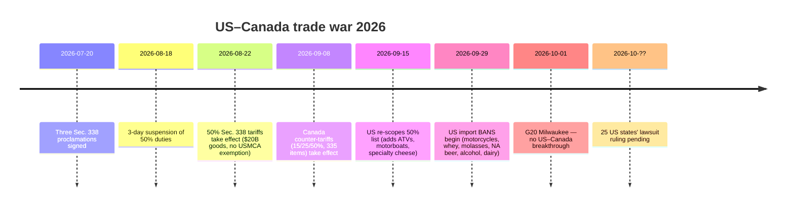
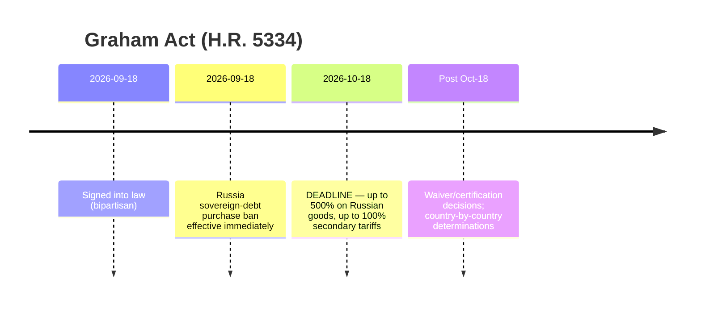
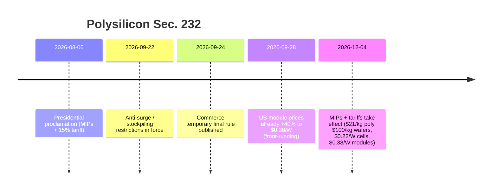

# Laporan Intelijen Perdagangan Global — Pekan 28 September – 5 Oktober 2026

**Taklimat mingguan setara analis.** Jendela liputan: 28 September – 5 Oktober 2026. Disusun dari ~45 sumber berita perdagangan, kebijakan, data, dan angkutan di seluruh dunia. Setiap klaim bersumber; nilai yang tak terverifikasi ditandai n/a.

---

## Daftar isi

1. [Ringkasan eksekutif](#1-executive-summary)
2. [Peringatan](#2-alerts)
3. [Berita utama — telaah mendalam](#3-top-stories--deep-dives)
4. [Pelacak tarif](#4-tariff-tracker)
5. [Telaah mendalam kebijakan AS](#5-us-policy-deep-dive)
6. [Kebijakan dunia menurut kawasan](#6-world-policy-by-region)
7. [Tindakan penegakan](#7-enforcement-actions)
8. [Rilis data](#8-data-releases)
9. [Pasar angkutan](#9-freight-market)
10. [Lini masa kebijakan](#10-policy-timelines)
11. [Tenggat & agenda mendatang (90 hari ke depan)](#11-upcoming-deadlines--events-next-90-days)
12. [Penanda konten — sudut pemasaran Dureach](#12-content-flags--dureach-marketing-angles)
13. [Sumber & metodologi](#13-sources--methodology)

---

## 1. Ringkasan eksekutif

Pekan yang menentukan bagi perdagangan global sejauh ini di tahun 2026. Tiga eskalasi struktural terjadi sekaligus:

- **Perang dagang AS–Kanada menjadi kinetik.** Setelah tarif 50% Pasal 338 atas barang Kanada senilai ~$20B (berlaku sejak 22 Agustus, ditata ulang 15 September), Washington bergerak pada 29 September ke **larangan impor** langsung atas sepeda motor, whey, molase, bir nonalkohol, alkohol, dan produk susu Kanada — barang yang sudah di atas kapal dikenai bea 50% sebagai gantinya. Tarif balasan Kanada sebesar 15/25/50% atas 335 pos tarif AS (berlaku 8 September) tetap berlaku. Dua puluh lima negara bagian AS menggugat untuk membatalkan tarif tersebut; belum ada putusan. ([tariffcalculator2026.com](https://tariffcalculator2026.com/canada-50-percent-tariff-august-19-explainer), [surtaxscan.com](https://surtaxscan.com/news/canadas-counter-tariffs-are-back-15-25-and-50-on-335-us-tariff-items-from))
- **Waktu Graham Act terus berjalan.** Ditandatangani 18 September, Undang-Undang Sanksi Rusia dan Iran Lindsey O. Graham mewajibkan tarif hingga **500% atas barang Rusia dan tarif sekunder hingga 100%** atas importir utama energi Rusia (Tiongkok, India, Turki paling terpapar) paling lambat **18 Oktober**. Bea menumpuk di atas semua tarif yang ada. ([lexblog.com](https://www.lexblog.com/2026/09/24/the-lindsey-graham-sanctions-act-what-businesses-need-to-know-about-the-new-tariffs/), [jdsupra.com](https://www.jdsupra.com/legalnews/new-sanctions-and-tariff-power-under-4624517/))
- **UE menggapai "Pasal 301" versinya sendiri.** Pada 5 Oktober, Prancis dan Jerman bersama mengusulkan senjata dagang reaksi cepat UE — tidak memihak negara tertentu, dapat dipicu oleh minoritas negara anggota, hingga pemutusan langsung dari pasar tunggal — yang ditujukan pada distorsi pasar sistemik (baca: Tiongkok). Beijing menjawab dalam hitungan hari: penyelidikan anti-dumping atas p-nitrotoluena dari UE (3 Oktober) dan peringatan keras MOFCOM. Para pemimpin UE membahas berkas Tiongkok pada KTT Brussels 15 Oktober. ([reuters.com](https://www.reuters.com/world/china/france-germany-propose-new-rapid-eu-trade-response-tool-2026-10-05/), [wsj.com](https://www.wsj.com/world/europe/germany-and-france-are-proposing-a-new-weapon-to-counter-flood-of-chinese-goods-f723dfdf))

Sementara itu sistem multilateral semakin retak: para menteri perdagangan G20 di Milwaukee (30 September–2 Oktober) hanya sepakat pada satu dari empat agenda (pemaksaan perdagangan pangan) dan buntu soal kelebihan kapasitas, kerja paksa, dan reformasi MFN. AS dan Tiongkok menerbitkan daftar keringanan tarif timbal balik "30-untuk-30" ($30 miliar masing-masing pihak) — signifikan secara simbolis, marjinal secara ekonomi (HSBC: tarif tertimbang perdagangan AS atas Tiongkok turun dari 27.3% menjadi 26.0%). C.H. Robinson mengumumkan **akuisisi RXO senilai $5.8B**, konsolidasi 3PL terbesar dalam siklus ini. Dan CBP menerbitkan dua Perintah Penahanan Pelepasan (Withhold Release Order) kerja paksa baru atas minyak sawit Indonesia, sehingga total aktif menjadi 60 WRO + 8 Temuan.

**Angkutan:** pasar dua kecepatan. Tarif kontainer transpasifik bertahan kuat (Drewry WCI $4,434/FEU, -1% w/w; Shanghai–New York $10,428), sementara Asia–Eropa turun untuk pekan ke-12 berturut-turut karena kembalinya kapasitas Terusan Suez. Kargo curah kering mencatat pekan terburuknya dalam sebulan (BDI 3,148, -8.1% w/w) seiring anjloknya pendapatan Capesize 12.8%.

---

## 2. Peringatan

| # | Peringatan | Berlaku | Dampak | Sumber |
|---|-------|-----------|--------|--------|
| A1 | Larangan impor AS atas sepeda motor, whey, molase, bir nonalkohol, alkohol, produk susu Kanada | 29 September 2026 | Barang yang ditargetkan ditolak masuk; barang dalam perjalanan dikenai bea 50% sebagai gantinya | [asrwe.com](https://asrwe.com/asr-university/us-canada-import-ban-alcohol-motorcycles-section-338-expansion-september-2026) |
| A2 | WRO CBP atas minyak sawit Indonesia (Mitra Aneka Rezeki, Hardaya Inti Plantation) | 29 September 2026 | Penahanan segera di semua pelabuhan AS; kini 60 WRO aktif + 8 Temuan | [thompsonhine.com](https://www.thompsonhine.com/insights/cbp-issues-withhold-release-orders-on-two-indonesian-palm-oil-producers/) |
| A3 | Tarif sekunder Graham Act (hingga 100%) atas pembeli utama energi Rusia | Tenggat 18 Oktober 2026 | Tiongkok, India, Turki paling terpapar; menumpuk di atas bea yang ada | [lexblog.com](https://www.lexblog.com/2026/09/24/the-lindsey-graham-sanctions-act-what-businesses-need-to-know-about-the-new-tariffs/) |
| A4 | Pasal 232 polisilikon: MIP + tarif 15% | 4 Desember 2026 (aturan anti-lonjakan sudah berlaku) | $21/kg poli, $100/kg wafer, $0.22/W sel, $0.38/W modul; harga modul AS sudah +40% | [mondaq.com](https://www.mondaq.com/unitedstates/export-controls-trade-investment-sanctions/1848548/polysilicon-and-derivatives-in-the-bullseye-for-major-new-tariffs-and-other-restrictions) |
| A5 | Instrumen dagang respons cepat "reaksi sistemik" UE diusulkan | Usulan 5 Oktober; KTT pemimpin UE 15 Oktober | Potensi kewenangan pemutusan pasar 24 jam; risiko retaliasi Tiongkok | [reuters.com](https://www.reuters.com/world/china/france-germany-propose-new-rapid-eu-trade-response-tool-2026-10-05/) |
| A6 | Penyelidikan anti-dumping Tiongkok atas p-nitrotoluena UE | Dibuka 3 Oktober (Pengumuman MOFCOM No. 44) | Tembakan balasan pertama dalam eskalasi UE–Tiongkok | [vespernews.com](https://www.vespernews.com/en/news/7dd758b7-b501-4c41-b2ee-13cb57ed832f) |

### A1 — Larangan impor AS atas barang Kanada (detail)

Proklamasi 8 September menciptakan struktur dua gelombang. Gelombang pertama (15 September): daftar produk 50% Pasal 338 ditata ulang — **ditambahkan** pada 50%: keju khusus, lemak dan minyak termodifikasi, kulit sapi dan kulit jok, kulit berbulu mentah/samakan, perahu motor rekreasi, kertas khusus, barang baja/aluminium tertentu, fitting logam dan input pengelasan, kereta golf, furnitur dan lampu, ATV, produk susu tambahan. **Dihapus**: garam batu, gula, semen, rakitan switchgear, tisu toilet, komponen joran pancing, wiski/minuman keras curah. Gelombang kedua (29 September): **larangan impor** — bukan tarif melainkan penolakan masuk — atas sepeda motor Kanada (termasuk BRP Can-Am Spyder/Canyon), whey, molase, bir nonalkohol, minuman beralkohol, dan produk susu. Barang yang sudah di atas kapal atau di gudang berikat sebelum 29 September tetap dikenai bea 50% alih-alih larangan. ([tariffcalculator2026.com](https://tariffcalculator2026.com/canada-section-338-september-15-29-what-changes), [asrwe.com](https://asrwe.com/asr-university/us-canada-import-ban-alcohol-motorcycles-section-338-expansion-september-2026))

Aturan penumpukan kritis: bea 50% Pasal 338 **tanpa pengecualian USMCA** — sertifikat CUSMA tidak berpengaruh terhadapnya. Namun tarif 10% Pasal 301 kerja paksa atas barang Kanada *dapat* dihindari dengan klaim USMCA yang valid, sehingga barang tercakup non-USMCA dapat menghadapi **50% + 10% = 60%**. ([tarifflens.ai](https://www.tarifflens.ai/blog/section-338-canada-retaliation-september-2026-importers-guide))

### A2 — WRO minyak sawit Indonesia (detail)

Perintah CBP 29 September menargetkan minyak sawit dan turunannya dari Mitra Aneka Rezeki (MAR) dan Hardaya Inti Plantation (HIP). Bukti yang ditelaah: wawancara pekerja, slip gaji, kuota panen, foto, laporan LSM/pemerintah, media berita, riset akademik. Pekerja di MAR menunjukkan **sembilan** indikator kerja paksa ILO (termasuk penahanan dokumen identitas dan isolasi); HIP menunjukkan **tujuh** (perbudakan utang, penahanan upah, penipuan, lembur berlebihan, intimidasi, kondisi kerja yang kasar, penyalahgunaan kerentanan). Penahanan segera berlaku di semua pelabuhan AS; importir dapat mengekspor kembali, memusnahkan, atau membuktikan sumber yang bersih. ([thompsonhine.com](https://www.thompsonhine.com/insights/cbp-issues-withhold-release-orders-on-two-indonesian-palm-oil-producers/), [ghy.com](https://www.ghy.com/trade-compliance/2026-withhold-release-orders-wros/))

### A3 — Graham Act (detail)

H.R. 5334, ditandatangani 18 September dengan dukungan bipartisan, menempatkan rezim sanksi Rusia ke dalam undang-undang dan menciptakan dua jalur tarif wajib, keduanya jatuh tempo **18 Oktober**: hingga **500%** atas semua barang asal Rusia, dan hingga **100% tarif sekunder** atas negara yang termasuk lima importir utama minyak mentah atau gas Rusia dan melakukan pembelian baru dalam 30 hari setelah pengesahan. Paling terpapar: **Tiongkok, India, Turki**; juga meningkat: Slovakia, Hongaria, UEA. Anggota UE dinilai individual. Katup pengaman: pengecualian gas alam (impor <15% dari total ekspor gas Rusia + "langkah signifikan" untuk mengurangi), pengabaian kepentingan nasional. Semua bea **menumpuk** di atas bea Pasal 301/232 yang ada. ([lexblog.com](https://www.lexblog.com/2026/09/24/the-lindsey-graham-sanctions-act-what-businesses-need-to-know-about-the-new-tariffs/), [jdsupra.com](https://www.jdsupra.com/legalnews/new-sanctions-and-tariff-power-under-4624517/), [tradepractitioner.com](https://www.tradepractitioner.com/2026/09/sanctions-by-statute-the-graham-act-and-tariffs-on-russias-energy-buyers/))

### A4 — Pasal 232 polisilikon (detail)

Proklamasi 6 Agustus + aturan final sementara Commerce (24 September). Mulai **4 Desember**: harga impor minimum **$21/kg** (polisilikon), **$100/kg** (ingot/wafer), **$0.22/W** (sel), **$0.38/W** (modul), plus tarif ad valorem **15%** atas turunannya (poli mentah dikecualikan dari 15%; Inggris 10%; Jepang/Korea/Taiwan/Swiss/Liechtenstein/UE dibatasi total 15% dengan MFN). Pembatasan anti-lonjakan/penimbunan sudah berlaku 22 September–4 Desember. Pasar mendahului: harga penawaran modul AS sudah di batas $0.38/W, **+40.7% sejak Agustus** ($0.27/W), menguntungkan Hanwha Solutions dan OCI. Estimasi industri ~$10 juta biaya peralatan tambahan per proyek 100 MW. ([mondaq.com](https://www.mondaq.com/unitedstates/export-controls-trade-investment-sanctions/1848548/polysilicon-and-derivatives-in-the-bullseye-for-major-new-tariffs-and-other-restrictions), [en.sedaily.com](https://en.sedaily.com/finance/2026/09/28/us-solar-module-prices-jump-40-percent-before-import-curbs), [logisticusgroup.com](https://logisticusgroup.com/new-solar-tariffs-land-december-4-heres-how-to-keep-your-project-on-budget-and-on-schedule/))

### A5 — Instrumen respons cepat UE (detail)

Macron dan Merz menulis surat kepada von der Leyen pada 5 Oktober mengusulkan instrumen **"reaksi sistemik"**: tidak memihak negara tertentu, dapat dipicu oleh **minoritas negara anggota** (mendobrak norma mayoritas terkualifikasi), memungkinkan langkah "tegas" hingga **pemutusan langsung dari pasar internal**. Dibingkai sebagai jawaban UE atas Pasal 301 AS dan kontrol ekspor mineral kritis Tiongkok; seorang pejabat Jerman menyebutnya "senjata serangan kedua." Instrumen diversifikasi paralel akan membatasi ketergantungan impor kritis pada satu negara. Konteks: defisit barang UE dengan Tiongkok mencapai **€359.9B pada 2025** dan **€103B pada Q2 2026** (tertinggi sejak Q3 2022); kepala penegakan Komisi menyebut lonjakan impor menghantam mesin, tekstil, logam, bahan kimia — bukan hanya EV. ([reuters.com](https://www.reuters.com/world/china/france-germany-propose-new-rapid-eu-trade-response-tool-2026-10-05/), [wsj.com](https://www.wsj.com/world/europe/germany-and-france-are-proposing-a-new-weapon-to-counter-flood-of-chinese-goods-f723dfdf), [brusselsmorning.com](https://brusselsmorning.com/eu-china-trade-tensions/104764/))

### A6 — Tiongkok membalas lebih dulu (detail)

Pada 3 Oktober, MOFCOM (Pengumuman No. 44) membuka **penyelidikan anti-dumping atas p-nitrotoluena dari UE** — beberapa hari sebelum perundingan dagang Beijing dan bertepatan dengan usulan Prancis-Jerman. MOFCOM secara terpisah memperingatkan retaliasi "tegas" terhadap instrumen respons cepat UE mana pun. ([vespernews.com](https://www.vespernews.com/en/news/7dd758b7-b501-4c41-b2ee-13cb57ed832f))

---

## 3. Berita utama — telaah mendalam

### 3.1 Para menteri perdagangan G20 pecah di Milwaukee (30 September – 2 Oktober)

**Yang terjadi.** Dipimpin USTR Jamieson Greer, para menteri perdagangan G20 bertemu di Milwaukee di bawah presidensi G20 AS. Dari empat agenda, hanya **satu** yang menghasilkan konsensus: pernyataan bersama mengecam persenjataan perdagangan pangan melalui tindakan koersif. Tiga gagal: (1) **kelebihan kapasitas** — rancangan yang didukung sebagian besar anggota diblokir minoritas pimpinan Tiongkok yang menolak bahasa subsidi; Greer menyebut presidensi "sangat kecewa"; (2) **kerja paksa** — tanpa teks bersama, sehingga AS, Meksiko, dan Argentina menerbitkan deklarasi terpisah; (3) **reformasi MFN** — AS membuka debat apakah perlakuan most-favoured-nation tanpa syarat "gagal mendorong resiprositas" dan "menciptakan penumpang gratis," tetapi tidak mengupayakan pernyataan bersama. ([barchart.com](https://www.barchart.com/story/news/4917577/g20-trade-talks-yield-little-progress-while-tensions-simmer) (AP), [reuters.com](https://www.reuters.com/world/china/g20-trade-chiefs-denounce-food-trade-coercion-not-excess-factory-capacity-2026-10-01/), [nationpress.com](https://www.nationpress.com/all/g20-milwaukee-talks-eye-more-diesel-globally))

**Angka kunci & warna.**
- AS telah membuka penyelidikan kelebihan kapasitas terhadap negara-negara "dari Norwegia hingga Bangladesh"; selain baja Tiongkok, Washington menyebut otomotif, baterai, kertas, dan semikonduktor. ([barchart.com](https://www.barchart.com/story/news/4917577/g20-trade-talks-yield-little-progress-while-tensions-simmer))
- India mengamendemen Kebijakan Perdagangan Luar Negerinya pada **Juli 2026** untuk melarang impor barang yang seluruhnya atau sebagian dibuat dengan kerja paksa — Goyal mengangkatnya di Milwaukee; India menjalankan strategi dua jalur (membela posisi di pleno, mendorong bilateral di sela-sela). ([beatsinbrief.com](https://beatsinbrief.com/2026/10/03/milwaukee-g20-trade-ministers-piyush-goyal-india-positions/))
- Hasil sela: diskusi yang dimediasi AS diperkirakan menempatkan **lebih banyak solar ke pasar global** (pihak, volume, dan jadwal tak diungkap). ([nationpress.com](https://www.nationpress.com/all/g20-milwaukee-talks-eye-more-diesel-globally))
- Tak ada terobosan soal sengketa AS–Kanada; Trump melarang impor Kanada senilai ~$1 miliar (alkohol, susu, sepeda motor) selama pekan itu. ([businessmirror.com.ph](https://businessmirror.com.ph/2026/10/02/g20-trade-talks-yield-little-progress-while-tensions-simmer/))

**Mengapa penting.** Kegagalan menghasilkan dokumen hasil menandakan tata kelola perdagangan multilateral tak lagi mampu membatasi gelombang tarif saat ini — aksi telah berpindah permanen ke jalur unilateral dan bilateral. Perhatikan KTT pemimpin G20 di **Miami** untuk melihat apakah keretakan Milwaukee muncul di level kepala negara. ([nationpress.com](https://www.nationpress.com/international/g20-trade-talks-end-without-deal-goyal))

### 3.2 "30-untuk-30" AS–Tiongkok: daftar terbit, ekonomi marjinal

**Yang terjadi.** Menyusul KTT Trump–Xi 23–25 September di Washington, kedua pemerintah menerbitkan daftar keringanan tarif timbal balik pada 28 September di bawah kerangka "30-untuk-30" Dewan Dagang AS–Tiongkok yang baru: masing-masing pihak dapat menghapus tarif atas barang pihak lain senilai ~$30 miliar. ([cnn.com](https://www.cnn.com/2026/09/28/business/us-china-tariff-cuts-60-billion-intl?cid=external-feeds_iluminar_meta), [kpmg.com](https://kpmg.com/us/en/taxnewsflash/news/2026/09/us-china-trade-framework-tariff-reductions.html))

**Angka kunci.**
| | Daftar AS (barang Tiongkok) | Daftar Tiongkok (barang AS) |
|---|---|---|
| Pos HTS | 77 | 1,619 |
| Nilai | ~$30B | ~$30B |
| Karakter | Barang konsumen: mainan, kembang api, peralatan makan, selimut, microwave, lampu pohon Natal, kursi tinggi, kursi mobil anak, pencukur elektrik | Pertanian: jagung, gandum, sorgum, daging, susu, minyak, ikan, boga bahari, kayu; plus kosmetik, perangkat medis |
| Pengecualian penting | Mainan berkoneksi Wi-Fi/Bluetooth (pengecualian keamanan data); **semua pakaian jadi** | **Kedelai utuh** — ekspor pertanian AS terbesar ke Tiongkok |
| Pangsa arus bilateral | ~7% impor AS dari Tiongkok (nilai 2024) | ~18% impor Tiongkok dari AS |

**Ekonomi.** HSBC (29 September): tarif tertimbang perdagangan AS atas barang Tiongkok hanya turun dari **27.3% menjadi 26.0%**. Lebih dari 90% barang terdaftar kembali ke bea MFN ("normal"). Penyesuaian berdasarkan kerangka acuan terjadi **paling banyak setahun sekali**. ([exencialrp.substack.com](https://exencialrp.substack.com/p/hsbc-sees-us-china-30-for-30-deal) (HSBC via Substack), [lexblog.com](https://www.lexblog.com/2026/09/29/u-s-china-board-of-trade-30-for-30-identifies-products-recommended-for-reduced-tariffs/))

**Kesepakatan sampingan.** Tiongkok akan mengimpor **≥10 juta metrik ton batu bara AS pada 2027 dan lagi pada 2028**; kelompok kerja akses pasar pertanian diluncurkan; tingkat pengiriman tanah jarang akan "dikembalikan ke tingkat yang wajar" (Tiongkok hanya memenuhi ~dua pertiga komitmen pasokan sebelumnya; defisit barang AS–Tiongkok turun 40% sejak Jan 2025 menjadi $140 miliar). Belum ada pemotongan tarif yang berlaku — USTR masih harus mengumumkan tarif dan tanggal. ([cnn.com](https://www.cnn.com/2026/09/28/business/us-china-tariff-cuts-60-billion-intl?cid=external-feeds_iluminar_meta), [kpmg.com](https://kpmg.com/us/en/taxnewsflash/news/2026/09/us-china-trade-framework-tariff-reductions.html), [tradersunion.com](https://tradersunion.com/news/financial-news/show/3528484-us-china-lower-tariff-framework/))

**Mengapa penting.** Signifikansi nyata kerangka ini bersifat kelembagaan — Dewan Dagang permanen dengan prosedur kerja — bukan matematika tarifnya. Untuk pengadaan: pengecualian pakaian jadi mempertahankan insentif diversifikasi Tiongkok-ke-Vietnam/Bangladesh/India; tekstil rumah tangga (selimut, seprai/taplak, gorden) bisa menghadapi persaingan Tiongkok yang lebih ketat jika keringanan terealisasi. ([textalks.com](https://textalks.com/us-china-tariff-excludes-apparel-but-opens-door-to-chinese-home-textiles/))
### 3.3 C.H. Robinson akan mengakuisisi RXO — $5.8B

**Yang terjadi.** Pada 5 Oktober, C.H. Robinson (Nasdaq: CHRW) sepakat mengakuisisi RXO (NYSE: RXO) dalam kesepakatan tunai-dan-saham: **$17.25 tunai + 0.0856 saham CHRW per saham RXO = $30.25/saham, premium 29%** terhadap penutupan 2 Oktober — nilai tersirat **$5.8B**, nilai perusahaan gabungan **>$25B**. Kedua dewan bulat; MFN Partners (17% saham RXO) dan Orbis (pemegang terbesar) mendukung; penutupan diperkirakan **H1 2027** menunggu persetujuan regulator dan suara pemegang saham RXO. ([rxo.com](https://rxo.com/news/c-h-robinson-to-acquire-rxo-redefining-the-future-of-third-party-logistics-while-unlocking-significant-shareholder-value/), [reuters.com](https://www.reuters.com/business/ch-robinson-buy-freight-broker-rxo-58-billion-2026-10-05/))

**Angka kunci.**
- Pemegang saham RXO akan memiliki ~11% perusahaan gabungan; RXO dilebur ke divisi Transportasi Permukaan Amerika Utara CHRW (>2/3 pendapatan).
- **Sinergi biaya run-rate bersih $300 juta dalam 2 tahun** melalui model operasi "Lean AI" CHRW (layanan bersama, konsolidasi vendor, real estat, asuransi).
- Reaksi pasar: RXO **+~20%** ($28.10–28.49), CHRW **-12%** pra-pasar ($150 vs $157.72 penutupan) — diskon akuisitor klasik; Breakingviews Reuters menyebut imbal hasilnya "biasa-biasa saja."
- Penasihat: Morgan Stanley (CHRW), Goldman Sachs (RXO).
- RXO naik 16.2% dalam dua sesi sebelum pengumuman dengan volume 3.67 juta saham (vs ~1.9 juta normal) — kenaikan pra-pengumuman yang terlihat. ([freightwaves.com](https://www.freightwaves.com/news/breaking-c-h-robinson-acquiring-rxo), [financial-news.co.uk](https://www.financial-news.co.uk/c-h-robinson-to-buy-rxo-in-5-8bn-cash-and-stock-deal/), [inboundlogistics.com](https://www.inboundlogistics.com/articles/c-h-robinson-to-acquire-rxo-in-5-8-billion-deal/))

**Mengapa penting.** Konsolidasi broker angkutan berakselerasi saat tarif lesu: pemain skala membeli kepadatan dan teknologi alih-alih membangunnya. Broker gabungan akan memiliki kekuatan harga tak tertandingi di angkutan truk Amerika Utara — shipper harus bersiap menghadapi negosiasi kontrak yang lebih alot; broker kecil menghadapi tekanan eksistensial. Kisah sinergi "Lean AI" juga sebuah sinyal: model broker padat karya sedang diotomatisasi. (Newsquawk via [financial-news.co.uk](https://www.financial-news.co.uk/c-h-robinson-to-buy-rxo-in-5-8bn-cash-and-stock-deal/))

### 3.4 India–AS: "tahap akhir" tetapi tanpa kesepakatan

**Yang terjadi.** Di sela G20 (1–2 Oktober), USTR Greer bertemu Menteri Perdagangan Piyush Goyal dan menyatakan perundingan berada di "tahap akhir" — tetapi "saya rasa belum ada yang akan segera terjadi." Panggilan Trump–Modi mendahului pertemuan; panggilan pemimpin berikutnya diperkirakan "segera." ([thehindubusinessline.com](https://www.thehindubusinessline.com/news/nothing-imminent-us-trade-representative-greer-on-india-trade-deal-modi-trump-to-talk-soon/article71536059.ece/amp/), [nationpress.com](https://www.nationpress.com/international/india-us-trade-deal-in-short-strokes-greer))

**Angka kunci & titik tekan.**
- Barang India menghadapi tarif tambahan **10% Pasal 301 kerja paksa sejak 24 Juli** (60 ekonomi tercakup); penyelidikan 301 kedua atas kelebihan kapasitas struktural (16 ekonomi, termasuk India) tertunda dan bisa menghantam baja.
- Titik alot: akses pertanian, perdagangan digital, pembelian minyak Rusia oleh India — kini dipertajam oleh tarif sekunder Graham Act hingga 100%.
- Meski bea berlaku, ekspor barang India ke AS naik **21.83% YoY pada Agustus**; rupee di kisaran **96.3/USD**; target perdagangan bilateral $500 miliar pada 2030.
- Menteri Keuangan Sitharaman (4 Oktober): perundingan telah "mencapai dataran tinggi" — konsesi lebih lanjut sulit diamankan. ([thefinancialeconomy.com](https://www.thefinancialeconomy.com/india-us-trade-talks/), [jagranjosh.com](https://www.jagranjosh.com/general-knowledge/indiaus-trade-deal-not-imminent-why-is-it-being-delayed-who-has-the-advantage-what-are-indias-options-1820012731-1), [english.dainikjagranmpcg.com](https://english.dainikjagranmpcg.com/top-stories/india-us-trade-talks-reach-plateau-nirmala-sitharaman/article-36152))

**Mengapa penting.** India adalah variabel ayun baik dalam kisah pengadaan China+1 maupun peta tarif sekunder Graham Act. Kesepakatan akan membuka salah satu dari sedikit katup keringanan tarif yang tersedia bagi importir AS tahun ini; kegagalan membuat eksportir India — dan pembeli AS mereka — terkatung-katung hingga musim puncak.

### 3.5 Drone: tarif naik, kontrol ekspor turun

**Yang terjadi.** Dua aksi drone AS yang bergerak berlawanan arah, keduanya berakar pada paket ganda 13 Agustus: (1) proklamasi Pasal 232 (Proklamasi 11055) yang mengenakan tarif **100%** atas drone >25kg atau dengan pencitraan termal (plus stasiun dok dan komponen kritis, Lampiran I) dan **25%** atas drone non-termal yang lebih kecil (Lampiran II), berlaku 3 September; komponen (Lampiran III) 25% mulai **9 Februari 2027**. Tarif sekutu: Inggris 10%, Jepang/Korea/Taiwan/Swiss/Liechtenstein/UE dibatasi total 15%. (2) Aturan **final BIS yang melonggarkan kontrol ekspor**: UAV daya tahan di bawah 3 jam turun ke AT-only di bawah ECCN 9A012, dengan pengecualian lisensi STA untuk Country Group A:5 — meski pengguna akhir militer di Tiongkok/Rusia/Belarus/Venezuela tetap dibatasi. ([whitehouse.gov](https://www.whitehouse.gov/presidential-actions/2026/08/adjusting-imports-of-unmanned-aircraft-systems-and-unmanned-aircraft-systems-components-into-the-united-states/), [jdsupra.com](https://www.jdsupra.com/legalnews/two-us-drone-actions-reshape-export-8075367/) (Wiley), [tbgfs.com](https://tbgfs.com/csms-69738151-guidance-section-232-duties-on-imports-of-unmanned-aircraft-systems-and-unmanned-aircraft-systems-components/))

**Mengapa penting.** AS secara bersamaan menembok pasar drone domestiknya dan mempersenjatai eksportirnya — kebijakan industri "benteng + maju" yang klasik. Pembeli drone komersial menghadapi pasar terbelah: produk rantai pasok sekutu 10–15%, asal Tiongkok 25–100%.

### 3.6 Defisit barang AS mencapai $132.6B pada Agustus

**Yang terjadi.** Defisit barang Agustus pendahuluan melebar **11.5%** menjadi **$132.6B**: impor **$336.1B (+5.5%)** didorong pasokan industri dan barang modal pembangunan AI; ekspor **$203.4B (+1.9%)**. Perdagangan kini menjadi penghambat PDB untuk **kuartal ketiga berturut-turut** — waktu yang janggal bagi pemerintahan yang menjual tarif sebagai obat defisit. ([reuters.com](https://www.reuters.com/business/us-goods-trade-deficit-widens-sharply-august-2026-09-30/))

### 3.7 De minimis tetap mati; pengembalian dana IEEPA mengalir

**Yang terjadi.** Pengadilan Perdagangan Internasional (13 Agustus, kasus Detroit Axle) menegakkan pencabutan berbasis IEEPA atas pengecualian de minimis $800 — memutuskan bahwa mencabut "hak istimewa" bukanlah mengenakan tarif, sehingga selamat dari putusan Mahkamah Agung Februari yang membatalkan tarif IEEPA. De minimis global berakhir 29 Agustus 2025; penutupan oleh Kongres sendiri berlaku Juli 2027. Terpisah, sistem CAPE milik CBP (aktif sejak 20 April) memproses **~$165B bea IEEPA** yang terkumpul, dengan bunga bertambah ~$650 juta/bulan; **CAPE Fase 3 dikerahkan 6 Oktober** untuk menangani pengembalian atas entri yang dilikuidasi ulang. ([reuters.com](https://www.reuters.com/legal/government/us-court-backs-trumps-power-close-de-minimis-tariff-exemption-2026-08-13/), [openclassactions.com](https://openclassactions.com/tariff-class-actions.php), media perdagangan)

---

## 4. Pelacak tarif

Dasar + perubahan pekan ini. Tarif bersifat bea *tambahan* kecuali dinyatakan lain; aturan penumpukan berbeda-beda menurut tindakan — periksa HTS, asal, dan tanggal entri per pengiriman.

| Target | Tindakan | Tarif | Berlaku | Status | Sumber |
|---|---|---|---|---|---|
| Kanada (barang tercakup) | Pasal 338 (3 proklamasi, 20 Juli) | 50% | 22 Agustus 2026 | Berlaku; **tanpa pengecualian USMCA**; ditata ulang 15 September | [tariffcalculator2026.com](https://tariffcalculator2026.com/canada-50-percent-tariff-august-19-explainer) |
| Kanada (sepeda motor, whey, molase, bir NA, alkohol, susu) | Larangan impor Pasal 338 | Larangan (penolakan masuk) | 29 September 2026 | Berlaku | [asrwe.com](https://asrwe.com/asr-university/us-canada-import-ban-alcohol-motorcycles-section-338-expansion-september-2026) |
| Kanada (umum) | Pasal 301 kerja paksa | 10% | 24 Juli 2026 (60 ekonomi) | Berlaku; klaim USMCA dikecualikan | [tarifflens.ai](https://www.tarifflens.ai/blog/section-338-canada-retaliation-september-2026-importers-guide) |
| Barang AS → Kanada | Perintah Surtax Kanada 2026 | 15% / 25% / 50% (335 barang) | 8 September 2026 | Berlaku; mencerminkan tarif 338 AS | [surtaxscan.com](https://surtaxscan.com/news/canadas-counter-tariffs-are-back-15-25-and-50-on-335-us-tariff-items-from) |
| Rusia (semua barang) | Graham Act (H.R. 5334) | Hingga 500% | Paling lambat 18 Oktober 2026 | Ditandatangani 18 September; implementasi tertunda | [lexblog.com](https://www.lexblog.com/2026/09/24/the-lindsey-graham-sanctions-act-what-businesses-need-to-know-about-the-new-tariffs/) |
| Pembeli energi Rusia teratas (Tiongkok, India, Turki…) | Tarif sekunder Graham Act | Hingga 100% | Paling lambat 18 Oktober 2026 | Tertunda; menumpuk di atas bea yang ada | [jdsupra.com](https://www.jdsupra.com/legalnews/new-sanctions-and-tariff-power-under-4624517/) |
| Tiongkok (rantai polisilikon) | MIP Pasal 232 + tarif | MIP $21/kg–$0.38/W + 15% | 4 Desember 2026 | Diproklamasikan 6 Agustus; aturan anti-lonjakan berlaku | [mondaq.com](https://www.mondaq.com/unitedstates/export-controls-trade-investment-sanctions/1848548/polysilicon-and-derivatives-in-the-bullseye-for-major-new-tariffs-and-other-restrictions) |
| Drone (umum) | Pasal 232 (Prok. 11055) | 100% (>25kg/termal); 25% (kecil) | 3 September 2026 | Berlaku | [whitehouse.gov](https://www.whitehouse.gov/presidential-actions/2026/08/adjusting-imports-of-unmanned-aircraft-systems-and-unmanned-aircraft-systems-components-into-the-united-states/) |
| Drone (Inggris / JP/KR/TW/CH/UE) | Tarif sekutu Pasal 232 | 10% Inggris; batas 15% lainnya | 3 September 2026 | Berlaku (sertifikasi diwajibkan) | [tbgfs.com](https://tbgfs.com/csms-69738151-guidance-section-232-duties-on-imports-of-unmanned-aircraft-systems-and-unmanned-aircraft-systems-components/) |
| Komponen drone (Lampiran III) | Pasal 232 | 25% | 9 Februari 2027 | Diumumkan | [jdsupra.com](https://www.jdsupra.com/legalnews/trump-administration-imposes-section-5315313/) |
| Tiongkok (daftar 30-untuk-30, 77 pos HTS) | Keringanan timbal balik (tertunda) | Kembali ke MFN | n/a — menunggu pengumuman USTR | Daftar terbit 28 September; belum ada pemotongan berlaku | [kpmg.com](https://kpmg.com/us/en/taxnewsflash/news/2026/09/us-china-trade-framework-tariff-reductions.html) |
| Farmasi (berpaten) | Pasal 232 | Per HTSUS 9903.04.60–70 | Panduan diperbarui 28 September | Panduan entri CBP diterbitkan | [ghy.com](https://www.ghy.com/trade-compliance/category/international-trade-issues/) |
| India (umum) | Pasal 301 kerja paksa | 10% | 24 Juli 2026 | Berlaku | [thefinancialeconomy.com](https://www.thefinancialeconomy.com/india-us-trade-talks/) |
| 16 ekonomi termasuk India | Penyelidikan 301 kelebihan kapasitas | n/a | Penyelidikan berjalan | Aksi USTR dijanjikan "dalam beberapa pekan" | [thefinancialeconomy.com](https://www.thefinancialeconomy.com/india-us-trade-talks/) |
| 178 pengecualian produk | Pengecualian Pasal 301 | Dikecualikan | Hingga 9 November 2026 | Kedaluwarsa | Media perdagangan |
| UE (diusulkan) | Instrumen "reaksi sistemik" | Hingga pemutusan pasar | Usulan 5 Oktober; KTT 15 Oktober | Belum menjadi hukum | [reuters.com](https://www.reuters.com/world/china/france-germany-propose-new-rapid-eu-trade-response-tool-2026-10-05/) |
---

## 5. Telaah mendalam kebijakan AS

### Aksi AS pekan ini

| Tanggal | Pelaku | Aksi | Signifikansi | Sumber |
|---|---|---|---|---|
| 28 September | CBP | Panduan entri terbaru untuk tarif farmasi Pasal 232 (HTSUS 9903.04.60–70); 9903.04.61 dipensiunkan setelah 29 September | Kejelasan aturan pengajuan bagi importir farmasi | [ghy.com](https://www.ghy.com/trade-compliance/category/international-trade-issues/) |
| 29 September | CBP | Buletin TRQ FY2027: pakaian AGOA, gula tebu mentah | Perencanaan tahun kuota | [ghy.com](https://www.ghy.com/trade-compliance/category/international-trade-issues/) |
| 29 September | CBP | Dua WRO kerja paksa (minyak sawit Indonesia) | Kini 60 WRO + 8 Temuan aktif | [kpmg.com](https://kpmg.com/us/en/taxnewsflash/news/2026/09/us-cbp-wros-indonesian-palm-oil.html) |
| 29 September | Gedung Putih | Larangan impor Kanada berlaku | Larangan impor AS *pertama* (bukan tarif) dalam perang dagang | [asrwe.com](https://asrwe.com/asr-university/us-canada-import-ban-alcohol-motorcycles-section-338-expansion-september-2026) |
| 30 September | USTR | Pernyataan Forum Global Kelebihan Kapasitas Baja | Payung multilateral bagi aksi baja | Media perdagangan |
| 1–2 Oktober | USTR (Greer) | G20 Milwaukee: hanya konsensus pemaksaan pangan; debat reformasi MFN dibuka | Jalur multilateral macet; jalur unilateral ditegaskan | [reuters.com](https://www.reuters.com/world/china/g20-trade-chiefs-denounce-food-trade-coercion-not-excess-factory-capacity-2026-10-01/) |
| 2 Oktober | USTR | Remediasi RRM ke-14 — ban Corporación de Occidente (Meksiko) | Penegakan ketenagakerjaan USMCA berlanjut | Media perdagangan |
| 2 Oktober | USTR | Tinjauan bersama USMCA 2027: komentar publik jatuh tempo **12 Januari 2027** | Jam tinjauan dimulai | Media perdagangan |
| 5 Oktober | Gedung Putih/Kongres | Hitung mundur implementasi Graham Act (13 hari tersisa) | Tarif sekunder hingga 100% tertunda | [lexblog.com](https://www.lexblog.com/2026/09/24/the-lindsey-graham-sanctions-act-what-businesses-need-to-know-about-the-new-tariffs/) |

**Analisis.** Pemerintahan menjalankan tiga jam sekaligus: (1) jam *punitif* — larangan Kanada, tarif sekunder Graham Act, MIP polisilikon — semuanya dirancang memaksimalkan daya ungkit sebelum akhir tahun; (2) jam *kelembagaan* — persiapan tinjauan USMCA 2027, prosedur Dewan Dagang, debat reformasi MFN — membangun mesin permanen; (3) jam *hukum* — kemenangan de minimis CIT vs kekalahan tarif IEEPA di Mahkamah Agung, dengan $165 miliar pengembalian IEEPA kini mengalir melalui CAPE. Polanya: di mana pengadilan membatasi (tarif IEEPA), pemerintahan memutar via 232/338/301 dan undang-undang (Graham Act). Importir sebaiknya merencanakan *lebih banyak* tindakan di bawah kewenangan *lama*, bukan lebih sedikit.

## 6. Kebijakan dunia menurut kawasan

### Eropa

| Perkembangan | Detail | Sumber |
|---|---|---|
| Instrumen respons cepat Prancis-Jerman diusulkan | Instrumen "reaksi sistemik"; pemicu minoritas; hingga pemutusan pasar langsung; instrumen diversifikasi menyertai | [reuters.com](https://www.reuters.com/world/china/france-germany-propose-new-rapid-eu-trade-response-tool-2026-10-05/) |
| Defisit UE–Tiongkok | €359.9B pada 2025; €103B pada Q2 2026 (tertinggi sejak Q3 2022); lonjakan impor mesin, tekstil, logam, bahan kimia | [brusselsmorning.com](https://brusselsmorning.com/eu-china-trade-tensions/104764/) |
| KTT pemimpin UE 15 Oktober | KTT Brussels membahas ketidakseimbangan Tiongkok — ujian pertama usulan Prancis-Jerman | [reuters.com](https://www.reuters.com/world/china/france-germany-propose-new-rapid-eu-trade-response-tool-2026-10-05/) |
| UE menimbang pemotongan tarif industri | Kemungkinan pemotongan untuk menghindari retaliasi baja Tiongkok (menurut pelaporan Capitol Forum) | Media perdagangan |

### Kanada

| Perkembangan | Detail | Sumber |
|---|---|---|
| Tarif balasan berlaku | 15%/25%/50% atas 335 barang AS sejak 8 September; cakupan C$28 miliar; barang dalam perjalanan dikecualikan | [surtaxscan.com](https://surtaxscan.com/news/canadas-counter-tariffs-are-back-15-25-and-50-on-335-us-tariff-items-from) |
| Paket dukungan C$7.5B | Bantuan domestik bagi industri terdampak | Media perdagangan |
| Dorongan diversifikasi | Pemerintahan Carney beralih ke kesepakatan Eropa/India | Media perdagangan |
| 25 negara bagian AS menggugat | Gugatan terhadap rezim tarif; belum ada putusan | Media perdagangan |

### Tiongkok (MOFCOM)

| Perkembangan | Detail | Sumber |
|---|---|---|
| Penyelidikan anti-dumping: p-nitrotoluena UE | Dibuka 3 Oktober (Pengumuman No. 44) — sinyal balasan | [vespernews.com](https://www.vespernews.com/en/news/7dd758b7-b501-4c41-b2ee-13cb57ed832f) |
| Peringatan keras soal instrumen UE | Retaliasi "tegas" diancam terhadap instrumen respons cepat mana pun | [reuters.com](https://www.reuters.com/world/china/france-germany-propose-new-rapid-eu-trade-response-tool-2026-10-05/) |
| Hasil 30-untuk-30 | Daftar 1.619 pos terbit; komitmen batu bara (10 juta MT/tahun 2027–28); pengiriman tanah jarang dinormalisasi | [kpmg.com](https://kpmg.com/us/en/taxnewsflash/news/2026/09/us-china-trade-framework-tariff-reductions.html) |
| Putaran konsultasi ke-8 | Kanal bilateral masih berfungsi | Media perdagangan |

### Seluruh dunia lainnya

| Negara/kawasan | Perkembangan | Sumber |
|---|---|---|
| India | Larangan impor kerja paksa (amendemen FTP Juli) diangkat di G20; ekspor ke AS +21.83% YoY pada Agustus meski tarif 10% | [beatsinbrief.com](https://beatsinbrief.com/2026/10/03/milwaukee-g20-trade-ministers-piyush-goyal-india-positions/), [thefinancialeconomy.com](https://www.thefinancialeconomy.com/india-us-trade-talks/) |
| Inggris | Tak ada langkah kebijakan dagang besar terpantau pekan ini | Media perdagangan |
| Meksiko/Argentina | Bergabung dalam deklarasi kerja paksa AS di G20 (terpisah dari teks bersama yang gagal) | [nationpress.com](https://www.nationpress.com/all/g20-milwaukee-talks-eye-more-diesel-globally) |

## 7. Tindakan penegakan

| Tindakan | Detail | Sumber |
|---|---|---|
| 2 WRO baru (29 September) | Minyak sawit Indonesia — MAR (9 indikator ILO), HIP (7 indikator); penahanan segera | [thompsonhine.com](https://www.thompsonhine.com/insights/cbp-issues-withhold-release-orders-on-two-indonesian-palm-oil-producers/) |
| Penyelesaian Everlight $5.15M | Everlight Americas yang berbasis di Texas menyelesaikan gugatan False Claims yang menuduh LED Tiongkok dinyatakan sebagai asal Taiwan untuk menghindari Pasal 301 | [news.bloomberglaw.com](https://news.bloomberglaw.com/federal-contracting/tariff-dodging-settlements-underscore-doj-focus-on-trade-fraud) |
| Perfectus Aluminum ~$550M (Mei) | Penghindaran bea ekstrusi aluminium — penyelesaian penipuan dagang terbesar belakangan ini | [news.bloomberglaw.com](https://news.bloomberglaw.com/federal-contracting/tariff-dodging-settlements-underscore-doj-focus-on-trade-fraud) |
| Memo penipuan DOJ (13 Agustus) | AAG Colin McDonald: penipuan dagang/penghindaran pabean prioritas utama; "melembagakan" penegakan False Claims | [news.bloomberglaw.com](https://news.bloomberglaw.com/federal-contracting/tariff-dodging-settlements-underscore-doj-focus-on-trade-fraud) |
| Pratinjau penindakan transshipment | Gedung Putih merinci "skema transshipment ilegal besar-besaran," pratinjau penegakan berbasis AI | Media perdagangan (JD Supra) |
| Lapisan tarif kerja paksa | Pasal 301 10% atas 60 ekonomi (termasuk India, Kanada) sejak 24 Juli — berbeda dari penegakan entitas UFLPA | [thefinancialeconomy.com](https://www.thefinancialeconomy.com/india-us-trade-talks/) |

**Pembacaan.** Penegakan bergeser dari interdiksi tingkat pengiriman ke konsekuensi *neraca*: penyelesaian False Claims setengah miliar dolar, deteksi transshipment berbantuan AI, dan lapisan tarif yang menghukum seluruh ekonomi atas praktik ketenagakerjaan. Beban kepatuhan bermigrasi ke hulu — importir memerlukan dokumentasi asal hingga tingkat *pemasok dari pemasok*, bukan sekadar faktur.

## 8. Rilis data

| Rilis | Detail | Sumber |
|---|---|---|
| Perdagangan barang pendahuluan Biro Sensus AS, Agustus (30 September) | Defisit $132.6B (+11.5% b/b); impor $336.1B (+5.5%), ekspor $203.4B (+1.9%); pasokan industri + barang modal AI mendorong impor | [reuters.com](https://www.reuters.com/business/us-goods-trade-deficit-widens-sharply-august-2026-09-30/) |
| Bilateral UE–Tiongkok (Eurostat via pers) | Defisit barang UE €103B pada Q2 2026; €359.9B pada 2025 | [brusselsmorning.com](https://brusselsmorning.com/eu-china-trade-tensions/104764/) |
| UN Comtrade / WITS / ITC / IMF | Tak ada rilis terjadwal besar pekan ini (siklus bulanan) | Media perdagangan |
| Drewry Container Forecaster | Keseimbangan pasokan-permintaan melemah pada kuartal mendatang; kontraksi tarif spot lanjutan diperkirakan | [fibre2fashion.com](https://www.fibre2fashion.com/news/textile-news/drewry-wci-further-falls-1-transpacific-rates-less-volatile-305782-newsdetails.htm) (pekan sebelumnya) |
---

## 9. Pasar angkutan

### 9.1 Kontainer — Indeks Kontainer Dunia Drewry (1 Oktober 2026)

Komposit **$4,434/FEU, -1% w/w**, didorong kelemahan Asia–Eropa. Transpasifik bertahan kuat menjelang Golden Week; operator merencanakan FAK/GRI untuk pertengahan Oktober, meski Drewry meragukan akan bertahan.

| Jalur | Pekan ini ($/FEU) | w/w | Tren |
|---|---|---|---|
| Shanghai → New York | 10,428 | +1% | ▲ kuat |
| Shanghai → Los Angeles | 7,835 | datar | ► stabil |
| Shanghai → Genoa | 3,702 | -3% | ▼ penurunan mingguan ke-12 berturut-turut |
| Shanghai → Rotterdam | 3,399 | -2% | ▼ penurunan mingguan ke-12 berturut-turut |

Catatan kapasitas: 10 pelayaran kosong transpasifik diumumkan untuk pekan depan (turun dari 13); 5 di Asia–Eropa (turun dari 6). Transit Suez naik **41 → 48/pekan**, menambah kapasitas efektif yang mengalahkan pemotongan pelayaran kosong di jalur Eropa. ([thedcn.com.au](https://www.thedcn.com.au/news/world-container-index-1-october-2026))

**Pergerakan jalur w/w (Drewry, $/FEU):**

```
Shanghai → New York      $10,428  ▲ +1%   ██████████████████████████████████████▓ +108
Shanghai → Los Angeles    $7,835  ►  0%   ████████████████████████████             0
Shanghai → Genoa          $3,702  ▼ -3%   █████████████▓                        -115
Shanghai → Rotterdam      $3,399  ▼ -2%   ████████████                           -69
Composite WCI             $4,434  ▼ -1%   ███████████████▓                       -45
 (bar length ∝ rate level; figures = approx. $ change w/w)
```

### 9.2 Kontainer — Indeks Baltic Freightos (pekan berakhir 2 Oktober 2026)

Global **FBX 3,341 — tidak berubah w/w**. Transpasifik stabil, Eropa lesu, transatlantik campuran:

| Jalur | Tarif ($/FEU) | pergerakan w/w |
|---|---|---|
| FBX01 Tiongkok/EA → Pantai Barat AS | 8,319 | datar |
| FBX03 Tiongkok/EA → Pantai Timur AS | 9,606 | datar |
| FBX11 Tiongkok/EA → Eropa Utara | 3,260 | datar |
| FBX13 Tiongkok/EA → Mediterania | 3,555 | -$7 |
| FBX21 Pantai Timur AS → Eropa | 963 | -$40 (dari $1,003) |
| FBX22 Eropa → Pantai Timur AS | 2,723 | +$57 (dari $2,666) |

([thedcn.com.au](https://www.thedcn.com.au/news/baltic-exchange-weekly-report-2-october-2026))

**Potret jalur FBX ($/FEU):**

```
FBX01  CN/EA → USWC      $8,319  █████████████████████████████████
FBX03  CN/EA → USEC      $9,606  ██████████████████████████████████████
FBX11  CN/EA → N.Europe  $3,260  █████████████
FBX13  CN/EA → Med       $3,555  ██████████████
FBX22  Europe → USEC     $2,723  ███████████
FBX21  USEC → Europe       $963  ████
```

### 9.3 Kargo curah kering — Indeks Baltic Dry (2 Oktober 2026)

**BDI 3,148** (+8 poin / +0.3% h/h) tetapi **-8.1% dalam sepekan** — pekan terburuk dalam lebih dari sebulan, didorong ambruknya Capesize akibat margin pabrik baja Tiongkok yang lemah dan persediaan pelabuhan yang tinggi.

| Segmen | Indeks | h/h | w/w | Rata-rata pendapatan/hari |
|---|---|---|---|---|
| Capesize (BCI) | 5,042 | +32 (+0.6%) | **-12.8%** | $45,731 (BCI 182 5TC) |
| Panamax (BPI) | 2,372 | -7 (-0.3%) | -1.5% | $21,349 |
| Supramax (BSI) | 1,789 | -5 (-0.3%) | **+0.2%** | $22,619 |
| Handysize (BHSI) | 1,007 | -1 | n/a | $18,117 |

Catatan: versi kawat Reuters melaporkan pendapatan Capesize $42,228/hari dengan basis ukuran kapal berbeda; angka 5TC Baltic Exchange ($45,731) digunakan di atas. ([worldports.org](https://www.worldports.org/baltic-dry-bulk-index-gains-for-second-day-but-posts-weekly-loss/), [handybulk.com](https://www.handybulk.com/baltic-dry-index/), [thedcn.com.au](https://www.thedcn.com.au/news/baltic-exchange-weekly-report-2-october-2026))

**Kinerja mingguan segmen (% perubahan w/w):**

```
Capesize   -12.8%  ████████████████████████████████░░░░░░░░░░░░░░░░░░░░░░  deeply negative
Panamax     -1.5%  ████░░░░░░░░░░░░░░░░░░░░░░░░░░░░░░░░░░░░░░░░░░░░░░░░░░  mildly negative
Supramax    +0.2%  ░░░░░░░░░░░░░░░░░░░░░░░░░░░░░░░░░░░░░░░░░░░░░░░░░░░░█  flat-positive
BDI (comp)  -8.1%  ████████████████████░░░░░░░░░░░░░░░░░░░░░░░░░░░░░░░░░░  negative
```

**Pembacaan.** Jalur biji-bijian/batu bara (Panamax/Supramax) bertahan; rasa sakit terkonsentrasi di rute terkait bijih besi/baja Capesize — sinyal permintaan, bukan sinyal kelebihan armada. Supramax di 1.797 pertengahan pekan menyentuh **tertinggi sejak Agustus 2022**. ([worldports.org](https://www.worldports.org/falling-vessel-rates-push-baltic-dry-bulk-index-to-fresh-low/))

### 9.4 Tanker & udara (konteks)

- **Indeks Tanker Kotor 5,444** (+0.22% pada penetapan 29 September); **Indeks Tanker Bersih 2,293** (+3.01%) — tanker bersih mengungguli seiring perubahan rute produk; serangan Houthi atas minyak Saudi dicatat 4 Oktober tetapi minyak mentah tidak melonjak. ([geopoliticsunplugged.substack.com](https://geopoliticsunplugged.substack.com/p/houthis-strike-at-saudi-oil-as-the))
- **Kargo udara**: Indeks Angkutan Udara Baltic **+0.6% pekan berakhir 28 September (+22% YoY)**; tonase WorldACD **+8% YoY** (pekan 38) — menguat menuju puncak; Xeneta melihat puncak yang *lesu* dengan e-commerce Tiongkok–AS **-34% YoY** akibat eliminasi de minimis. ([metro.global](https://www.metro.global/2026/09/30/airfreight-market-strengthens-as-peak-season-nears/) via media perdagangan)

### 9.5 Perbandingan tarif (tindakan terpilih, ad valorem)

```
Graham Act secondary (max)      100%  ████████████████████████████████████████
Drones >25kg / thermal           100%  ████████████████████████████████████████
Canada Sec. 338 (covered goods)   50%  ████████████████████
Canada counter-tariffs (top)      50%  ████████████████████
Polysilicon derivatives           15%  ██████
Drones allied (UK)                10%  ████
Canada/India Sec. 301 FL          10%  ████
```

---

## 10. Lini masa kebijakan

### Eskalasi AS–Kanada, 2026



### Hitung mundur Graham Act



### Pasal 232 polisilikon



---

## 11. Tenggat & agenda mendatang (90 hari ke depan)

| Tanggal | Agenda | Mengapa penting | Sumber |
|---|---|---|---|
| 6 Oktober 2026 | CAPE Fase 3 dikerahkan | Pengembalian bea IEEPA atas entri yang dilikuidasi ulang | Media perdagangan |
| 15 Oktober 2026 | KTT pemimpin UE, Brussels | Ujian pertama instrumen respons cepat Prancis-Jerman; ketidakseimbangan Tiongkok | [reuters.com](https://www.reuters.com/world/china/france-germany-propose-new-rapid-eu-trade-response-tool-2026-10-05/) |
| 18 Oktober 2026 | **Tenggat implementasi Graham Act** | Tarif sekunder hingga 100% atas pembeli energi Rusia | [lexblog.com](https://www.lexblog.com/2026/09/24/the-lindsey-graham-sanctions-act-what-businesses-need-to-know-about-the-new-tariffs/) |
| 9 November 2026 | 178 pengecualian Pasal 301 kedaluwarsa | Keputusan perpanjangan atau berakhir | Media perdagangan |
| 4 Desember 2026 | MIP polisilikon + tarif 15% berlaku | Guncangan biaya rantai pasok surya | [mondaq.com](https://www.mondaq.com/unitedstates/export-controls-trade-investment-sanctions/1848548/polysilicon-and-derivatives-in-the-bullseye-for-major-new-tariffs-and-other-restrictions) |
| 12 Januari 2027 | Tinjauan bersama USMCA 2027 — komentar publik jatuh tempo | Penetapan agenda tahun tinjauan | Media perdagangan |
| 9 Februari 2027 | Tarif 25% komponen drone (Lampiran III) | Gelombang kedua bea drone | [whitehouse.gov](https://www.whitehouse.gov/presidential-actions/2026/08/adjusting-imports-of-unmanned-aircraft-systems-and-unmanned-aircraft-systems-components-into-the-united-states/) |
| H1 2027 | Penutupan C.H. Robinson–RXO | 3PL gabungan $25B+ | [reuters.com](https://www.reuters.com/business/ch-robinson-buy-freight-broker-rxo-58-billion-2026-10-05/) |
| Juli 2027 | De minimis ditutup secara legislatif | Berakhirnya pengecualian $800 menurut undang-undang | [reuters.com](https://www.reuters.com/legal/government/us-court-backs-trumps-power-close-de-minimis-tariff-exemption-2026-08-13/) |

---

## 12. Penanda konten — sudut pemasaran Dureach

1. **"Pemasok Anda ada di dua daftar tarif."** Penyelidikan 301 kelebihan kapasitas 16-ekonomi dan lapisan tarif kerja paksa 60-ekonomi sangat tumpang tindih — dan Graham Act menambah penyaringan ketiga (paparan energi Rusia). Postingan kalkulator risiko kepatuhan / rujukan silang daftar praktis menulis dirinya sendiri, dengan data pengiriman sebagai lapisan pembuktiannya. ([thefinancialeconomy.com](https://www.thefinancialeconomy.com/india-us-trade-talks/))
2. **Mega-merger CHRW–RXO → "siapa yang sebenarnya mengangkut barang."** Sudut konsolidasi 3PL untuk audiens forwarder; padukan dengan data bill of lading yang menunjukkan forwarder mana menyentuh jalur mana — pihak pengakuisisi membeli kepadatan, dan kepadatan terlihat dalam catatan pengiriman. ([reuters.com](https://www.reuters.com/business/ch-robinson-buy-freight-broker-rxo-58-billion-2026-10-05/))
3. **MIP polisilikon: preseden batas harga.** Penggunaan pertama harga impor minimum sebagai senjata dagang — jika berhasil di surya, perkirakan di baterai, EV, baja. Artikel penjelasan tentang "tarif 2.0: dari bea ke batas harga" memposisikan Dureach di depan gelombang berikutnya. ([mondaq.com](https://www.mondaq.com/unitedstates/export-controls-trade-investment-sanctions/1848548/polysilicon-and-derivatives-in-the-bullseye-for-major-new-tariffs-and-other-restrictions))

---

## 13. Sumber & metodologi

**Jendela liputan:** 28 September – 5 Oktober 2026. **Metode:** pencarian web vertikal berita + pembacaan halaman langsung di ~45 sumber terdaftar; sumber primer pemerintah diutamakan; media berbayar via judul/cuplikan saja.

**Sumber yang digunakan pekan ini:** FreightWaves, thedcn.com.au (Baltic Exchange/Drewry), container-news.com, logisticsnews.ph, worldports.org, handybulk.com, bairdmaritime.com, indexbox.io, geopoliticsunplugged (Substack), metro.global, proklamasi Gedung Putih, CBP (via KPMG, GHY, Thompson Hine, Trans-Border Global Freight), USTR (via AP/Reuters/nationpress), Federal Register (via pers dagang), BIS (via Baker McKenzie/JD Supra), MOFCOM (langsung), Reuters, AP, WSJ, CNN, Euronews (via vespernews/tbsnews), brusselsmorning.com, LexBlog, JD Supra, Mondaq, tradepractitioner.com, KPMG TaxNewsFlash, GHY International, Thompson Hine, tariffcalculator2026.com, surtaxscan.com, tarifflens.ai, asrwe.com, thefinancialeconomy.com, jagranjosh.com, thehindubusinessline.com, nationpress.com, beatsinbrief.com, textalks.com, exencialrp (catatan HSBC), tradersunion.com, frontlinesandbottomlines (blog), en.sedaily.com, logisticusgroup.com, etwenergy.com, jingsun-power.com, news.metal.com (SMM), news.bloomberglaw.com, openclassactions.com, srnnews.com/Reuters (de minimis), supplychaindive.com, suasnews.com, dronelife.com, rxo.com, inboundlogistics.com, ttnews.com, cdllife.com, financial-news.co.uk.
