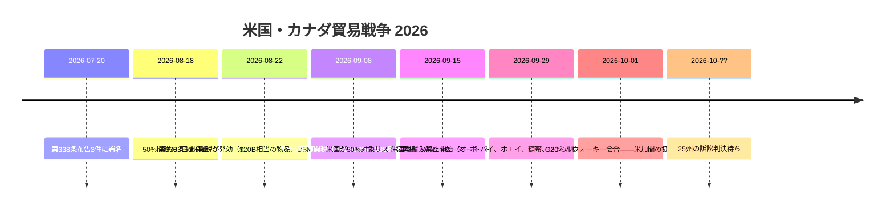
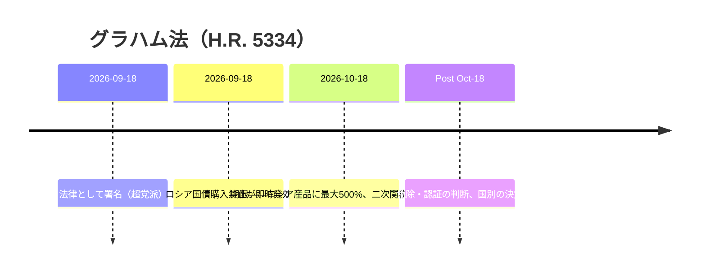
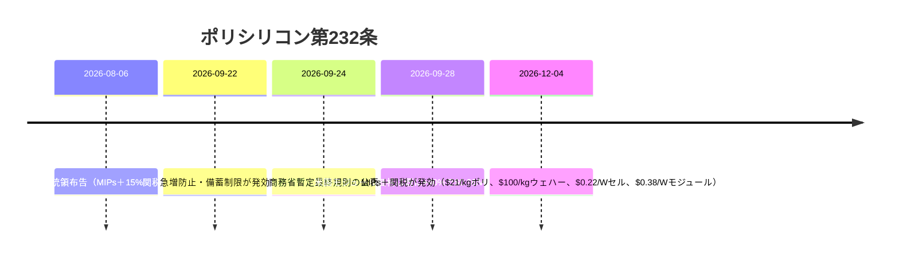

# グローバル貿易インテリジェンスレポート ― 2026年9月28日～10月5日週

**アナリスト級の週間ブリーフィング。** 対象期間：2026年9月28日～10月5日。世界の貿易ニュース・政策・データ・海運に関する約45の情報源から編纂。すべての主張に出典を付記。検証不能な値はn/aと表記。

---

## 目次

1. [エグゼクティブサマリー](#1-executive-summary)
2. [アラート](#2-alerts)
3. [トップストーリー ― 深掘り](#3-top-stories--deep-dives)
4. [関税トラッカー](#4-tariff-tracker)
5. [米国政策の深掘り](#5-us-policy-deep-dive)
6. [地域別・世界の政策](#6-world-policy-by-region)
7. [執行措置](#7-enforcement-actions)
8. [データ発表](#8-data-releases)
9. [海運市況](#9-freight-market)
10. [政策タイムライン](#10-policy-timelines)
11. [今後の期限・イベント（今後90日）](#11-upcoming-deadlines--events-next-90-days)
[コンテンツフラグ ― Dureachマーケティングの切り口](#12-content-flags--dureach-marketing-angles)
12. [情報源と作成方法](#12-sources--methodology)

---

## 1. エグゼクティブサマリー

2026年に入ってから世界の貿易にとって最も重大な週である。3つの構造的エスカレーションが同時に起きた。

- **米加貿易戦争が「動的」段階に入った。** 約$20B相当のカナダ製品に対する50%の第338条関税（Aug 22発効、Sept 15に適用範囲見直し）に続き、ワシントンはSept 29、カナダ産のオートバイ、ホエー、糖蜜、ノンアルコールビール、アルコール飲料、乳製品に対する**輸入禁止**に踏み切った。すでに輸送中の貨物は禁止ではなく50%関税の対象となる。カナダの335品目に対する15/25/50%の報復関税（Sept 8発効）は継続。米国内25州が関税の無効を求めて提訴中であり、判決はまだ出ていない。([tariffcalculator2026.com](https://tariffcalculator2026.com/canada-50-percent-tariff-august-19-explainer), [surtaxscan.com](https://surtaxscan.com/news/canadas-counter-tariffs-are-back-15-25-and-50-on-335-us-tariff-items-from))
- **Graham Actの時計が進んでいる。** Sept 18に署名されたLindsey O. Graham対ロシア・イラン制裁法は、**ロシア製品に対する最大500%の関税、およびロシア産エネルギーの主要輸入国に対する最大100%の二次関税**を**Oct 18**までに課すことを義務付ける。対象は中国、インド、トルコが中心である。関税は既存の関税に上乗せされる。([lexblog.com](https://www.lexblog.com/2026/09/24/the-lindsey-graham-sanctions-act-what-businesses-need-to-know-about-the-new-tariffs/), [jdsupra.com](https://www.jdsupra.com/legalnews/new-sanctions-and-tariff-power-under-4624517/))
- **EUが独自の「第301条」に手を伸ばした。** Oct 5、フランスとドイツは共同で、迅速に対応するEUの貿易兵器を提案した。特定国を対象とせず、加盟国の少数派の賛成で発動可能、域内市場からの即時遮断までを含む内容であり、構造的な市場歪曲（読み替え：中国）を狙う。これに対し北京は数日以内に応酬した。EU産p-ニトロトルエンに対する反ダンピング調査（Oct 3開始）と、中国商務部（MOFCOM）による断固たる警告である。EU首脳はOct 15のブリュッセル首脳会議で中国問題を取り上げる。([reuters.com](https://www.reuters.com/world/china/france-germany-propose-new-rapid-eu-trade-response-tool-2026-10-05/), [wsj.com](https://www.wsj.com/world/europe/germany-and-france-are-proposing-a-new-weapon-to-counter-flood-of-chinese-goods-f723dfdf))

一方、多国間体制はさらに綻びを見せた。ミルウォーキーでのG20貿易相会合（Sept 30–Oct 2）では4つの議題のうち合意できたのは1つ（食料貿易の威圧的利用の非難）のみであり、過剰生産能力、強制労働、MFN（最恵国待遇）改革では行き詰まった。米国と中国は相互の「30-for-30」関税緩和リスト（双方$30B）を公表した。象徴的な意義は大きいが、経済効果は限定的である（HSBC試算：対中貿易加重平均関税は27.3%から26.0%へ低下するのみ）。C.H. Robinsonは**$5.8BでのRXO買収**を発表し、今サイクル最大の3PL再編となった。また、米国税関・国境警備局（CBP）はインドネシア産パーム油に対する2件の強制労働に係る引渡保留命令（WRO）を発出し、発動中のWROは60件＋8件の認定（Findings）となった。

**海運：** 二極化した市況。太平洋航路のコンテナ運賃は堅調（Drewry世界コンテナ指数 $4,434/FEU、前週比-1%。上海–ニューヨーク $10,428）の一方、アジア–欧州航路はスエズ経由輸送の回復により12週連続で下落した。ドライバルクは1か月で最悪の週となり（バルチック海運指数 3,148、前週比-8.1%）、ケープサイズ船の収益が12.8%急落した。

---

## 2. アラート

| # | アラート | 発効 | 影響 | 出典 |
|---|-------|-----------|--------|--------|
| A1 | カナダ産オートバイ、ホエー、糖蜜、ノンアルコールビール、アルコール飲料、乳製品に対する米国の輸入禁止 | Sept 29, 2026 | 対象貨物の入国拒否。輸送中の貨物は代わりに50%関税の対象 | [asrwe.com](https://asrwe.com/asr-university/us-canada-import-ban-alcohol-motorcycles-section-338-expansion-september-2026) |
| A2 | インドネシア産パーム油に対するCBPのWRO（Mitra Aneka Rezeki、Hardaya Inti Plantation） | Sept 29, 2026 | 全米港湾で即時差し止め。発動中のWROは60件＋8件の認定に | [thompsonhine.com](https://www.thompsonhine.com/insights/cbp-issues-withhold-release-orders-on-two-indonesian-palm-oil-producers/) |
| A3 | ロシア産エネルギーの主要購入国に対するGraham Act二次関税（最大100%） | 期限 Oct 18, 2026 | 中国、インド、トルコが最も影響を受ける。既存関税に上乗せ | [lexblog.com](https://www.lexblog.com/2026/09/24/the-lindsey-graham-sanctions-act-what-businesses-need-to-know-about-the-new-tariffs/) |
| A4 | ポリシリコン第232条：最低輸入価格（MIP）＋15%関税 | Dec 4, 2026（急増対策ルールは既に発効） | ポリ$21/kg、ウエハー$100/kg、セル$0.22/W、モジュール$0.38/W。米国のモジュール価格は既に+40% | [mondaq.com](https://www.mondaq.com/unitedstates/export-controls-trade-investment-sanctions/1848548/polysilicon-and-derivatives-in-the-bullseye-for-major-new-tariffs-and-other-restrictions) |
| A5 | EU「構造的対応」迅速貿易ツールの提案 | Oct 5に提案。EU首脳会議はOct 15 | 24時間での市場遮断権限の可能性。中国の報復リスク | [reuters.com](https://www.reuters.com/world/china/france-germany-propose-new-rapid-eu-trade-response-tool-2026-10-05/) |
| A6 | EU産p-ニトロトルエンに対する中国の反ダンピング調査 | Oct 3開始（商務部公告第44号） | EU–中国エスカレーションにおける最初の報復措置 | [vespernews.com](https://www.vespernews.com/en/news/7dd758b7-b501-4c41-b2ee-13cb57ed832f) |

### A1 ― カナダ製品に対する米国の輸入禁止（詳細）

Sept 8の大統領布告により二段階の構造が作られた。第一波（Sept 15）：50%の第338条製品リストの適用範囲が見直され、**追加**されたのは特殊チーズ、加工油脂、牛皮・家具用皮革、毛皮（原皮・なめし）、レクリエーション用モーターボート、特殊紙、一部の鉄鋼・アルミ製品、金属継手・溶接資材、ゴルフカート、家具・照明器具、ATV、追加の乳製品（いずれも50%）。**除外**されたのは岩塩、砂糖、セメント、開閉装置組立品、トイレットペーパー、釣り竿部品、バルクのウイスキー・リキュールである。第二波（Sept 29）：**輸入禁止**――関税ではなく入国拒否――の対象はカナダ産オートバイ（BRP Can-Am Spyder／Canyonを含む）、ホエー、糖蜜、ノンアルコールビール、アルコール飲料、乳製品である。Sept 29時点で既に輸送中または保税蔵置中の貨物については、禁止ではなく50%関税が適用される。([tariffcalculator2026.com](https://tariffcalculator2026.com/canada-section-338-september-15-29-what-changes), [asrwe.com](https://asrwe.com/asr-university/us-canada-import-ban-alcohol-motorcycles-section-338-expansion-september-2026))

重要な積み上げルール：50%の第338条関税には**USMCA適用除外がない**――CUSMA原産地証明は何の効力も持たない。一方、カナダ製品に対する10%の第301条強制労働関税については、有効なUSMCA申告があれば回避できる。したがって、USMCA非適用の対象品は**50%＋10%＝60%**に達しうる。([tarifflens.ai](https://www.tarifflens.ai/blog/section-338-canada-retaliation-september-2026-importers-guide))

### A2 ― インドネシア産パーム油WRO（詳細）

CBPのSept 29命令は、Mitra Aneka Rezeki（MAR）およびHardaya Inti Plantation（HIP）由来のパーム油とその派生物を対象とする。検討された証拠：労働者への聞き取り、給与明細、収穫ノルマ、写真、NGO・政府報告書、報道、学術研究。MARの労働者にはILOの強制労働指標のうち**9項目**（身分証明書の取り上げや隔離を含む）が、HIPには**7項目**（債務束縛、賃金の不払い、欺瞞、過度の時間外労働、脅迫、虐待的労働条件、脆弱性の悪用）が確認された。全米港湾で即時差し止め。輸入者は輸出、廃棄、またはクリーンな調達の立証のいずれかを選択できる。([thompsonhine.com](https://www.thompsonhine.com/insights/cbp-issues-withhold-release-orders-on-two-indonesian-palm-oil-producers/), [ghy.com](https://www.ghy.com/trade-compliance/2026-withhold-release-orders-wros/))

### A3 ― Graham Act（詳細）

超党派の支持を得てSept 18に署名されたH.R. 5334は、対ロシア制裁体制を法制化し、**Oct 18**を期限とする2つの関税トラックを創設する。ロシア原産の全貨物に対する最大**500%**、およびロシア産原油・ガスの上位輸入国で成立後30日以内に新規購入を行った国に対する最大**100%の二次関税**である。最も影響を受けるのは**中国、インド、トルコ**であり、スロバキア、ハンガリー、UAEもリスクが高い。EU加盟国は個別に評価される。逃げ道として、天然ガス例外（ロシアのガス輸出総量の15%未満の輸入＋「大幅な削減措置」）や国益免除がある。すべての関税は既存の第301条・第232条関税に**上乗せ**される。([lexblog.com](https://www.lexblog.com/2026/09/24/the-lindsey-graham-sanctions-act-what-businesses-need-to-know-about-the-new-tariffs/), [jdsupra.com](https://www.jdsupra.com/legalnews/new-sanctions-and-tariff-power-under-4624517/), [tradepractitioner.com](https://www.tradepractitioner.com/2026/09/sanctions-by-statute-the-graham-act-and-tariffs-on-russias-energy-buyers/))

### A4 ― ポリシリコン第232条（詳細）

Aug 6の大統領布告＋商務省暫定最終規則（Sept 24）。**Dec 4**から最低輸入価格が適用される。**$21/kg**（ポリシリコン）、**$100/kg**（インゴット／ウエハー）、**$0.22/W**（セル）、**$0.38/W**（モジュール）に加え、派生物に**15%の従価税**（原料ポリは15%の対象外。英国は10%。日本・韓国・台湾・スイス・リヒテンシュタイン・EUはMFN込みで合計15%上限）。急増・備蓄対策はSept 22–Dec 4ですでに発効している。市場の先回り：米国のモジュール提示価格はすでに$0.38/Wの下限に達し、**8月以降+40.7%**（$0.27/Wから）。Hanwha SolutionsとOCIが恩恵を受ける。業界試算では100MWのプロジェクトあたり約$10Mの設備コスト増となる。([mondaq.com](https://www.mondaq.com/unitedstates/export-controls-trade-investment-sanctions/1848548/polysilicon-and-derivatives-in-the-bullseye-for-major-new-tariffs-and-other-restrictions), [en.sedaily.com](https://en.sedaily.com/finance/2026/09/28/us-solar-module-prices-jump-40-percent-before-import-curbs), [logisticusgroup.com](https://logisticusgroup.com/new-solar-tariffs-land-december-4-heres-how-to-keep-your-project-on-budget-and-on-schedule/))

### A5 ― EU迅速対応ツール（詳細）

マクロン大統領とメルツ首相はOct 5、フォンデアライエン欧州委員長に宛てて**「構造的対応」手段**を提案する書簡を送った。特定国を対象とせず、**加盟国の少数派**の賛成で発動可能（特定多数決の慣行を破るもの）であり、**域内市場からの即時遮断**までの「断固たる」措置を可能にする。米国の第301条と中国の重要鉱物輸出規制へのEUの回答と位置付けられ、あるドイツ政府高官はこれを「第二撃兵器」と呼んだ。並行して、重要輸入品の単一国依存に上限を設ける多様化手段も提案されている。背景：対中EU物品貿易赤字は**2025年に€359.9B**、**2026年第2四半期に€103B**（2022年第3四半期以来最大）に達し、欧州委員会の執行責任者は、EVだけでなく機械、繊維、金属、化学品にも輸入急増が及んでいると指摘する。([reuters.com](https://www.reuters.com/world/china/france-germany-propose-new-rapid-eu-trade-response-tool-2026-10-05/), [wsj.com](https://www.wsj.com/world/europe/germany-and-france-are-proposing-a-new-weapon-to-counter-flood-of-chinese-goods-f723dfdf), [brusselsmorning.com](https://brusselsmorning.com/eu-china-trade-tensions/104764/))

### A6 ― 中国が先に報復（詳細）

Oct 3、中国商務部（公告第44号）は**EU産p-ニトロトルエンに対する反ダンピング調査**を開始した。北京での貿易協議の数日前、仏独提案に対抗するタイミングである。商務部はEUの迅速対応手段に対して別途「断固たる」報復を警告した。([vespernews.com](https://www.vespernews.com/en/news/7dd758b7-b501-4c41-b2ee-13cb57ed832f))

---

## 3. トップストーリー ― 深掘り

### 3.1 ミルウォーキーでG20貿易相が分裂（Sept 30 – Oct 2）

**経緯。** USTRのJamieson Greer議長の下、G20貿易相は米国のG20議長国体制のもとミルウォーキーに集まった。4つの議題のうち合意に至ったのは**1つ**のみ。食料貿易の威圧的利用を非難する共同声明である。残る3つは失敗に終わった。(1)**過剰生産能力**――大半の加盟国が支持した草案を、中国を中心とする少数派が補助金関連の文言に抵抗して阻止。Greerは議長国として「深く失望した」と述べた。(2)**強制労働**――共同文書なし。米国、メキシコ、アルゼンチンが別途宣言を出した。(3)**MFN改革**――米国は無条件の最恵国待遇が「互恵を促進せず」「フリーライダーを生む」とする議論を開始したが、共同声明は求めなかった。([barchart.com](https://www.barchart.com/story/news/4917577/g20-trade-talks-yield-little-progress-while-tensions-simmer) (AP), [reuters.com](https://www.reuters.com/world/china/g20-trade-chiefs-denounce-food-trade-coercion-not-excess-factory-capacity-2026-10-01/), [nationpress.com](https://www.nationpress.com/all/g20-milwaukee-talks-eye-more-diesel-globally))

**主要な数字と背景。**
- 米国はノルウェーからバングラデシュまで各国を対象に過剰生産能力調査を開始している。中国の鉄鋼以外にも、自動車、電池、紙、半導体をワシントンは挙げる。([barchart.com](https://www.barchart.com/story/news/4917577/g20-trade-talks-yield-little-progress-while-tensions-simmer))
- インドは**2026年7月**の対外貿易政策改正で、全部または一部が強制労働で作られた物品の輸入を禁止した。Goyal商工相はミルウォーキーでこれを取り上げた。インドは二正面戦略を取った（本会議では立場を守り、傍らで二国間協議を推進）。([beatsinbrief.com](https://beatsinbrief.com/2026/10/03/milwaukee-g20-trade-ministers-piyush-goyal-india-positions/))
- 傍らの成果：米国が仲介した協議により、世界の市場により多くのディーゼルが供給される見込み（当事者、数量、時期は非開示）。([nationpress.com](https://www.nationpress.com/all/g20-milwaukee-talks-eye-more-diesel-globally))
- 米加紛争の打開なし。トランプ大統領は週内にカナダ製品約$1B（アルコール、乳製品、オートバイ）の輸入を禁止した。([businessmirror.com.ph](https://businessmirror.com.ph/2026/10/02/g20-trade-talks-yield-little-progress-while-tensions-simmer/))

**意義。** 成果文書を出せなかったことは、多国間の貿易ガバナンスがもはや現在の関税の波を抑える力を持たないことを示す。行動の場は恒久的に一国主義と二国間の軌道に移った。**マイアミ**でのG20首脳会議で、ミルウォーキーの亀裂が首脳レベルに表面化するかに注目である。([nationpress.com](https://www.nationpress.com/international/g20-trade-talks-end-without-deal-goyal))

### 3.2 米中「30-for-30」：リスト公表も経済効果は限定的

**経緯。** Sept 23–25のワシントンでのトランプ–習首脳会談を受け、両政府はSept 28、新設の米中貿易委員会の「30-for-30」枠組みの下で相互の関税緩和製品リストを公表した。双方が相手国製品の約$30Bを関税引き下げ対象にできる仕組みである。([cnn.com](https://www.cnn.com/2026/09/28/business/us-china-tariff-cuts-60-billion-intl?cid=external-feeds_iluminar_meta), [kpmg.com](https://kpmg.com/us/en/taxnewsflash/news/2026/09/us-china-trade-framework-tariff-reductions.html))

**主要な数字。**
| | 米国リスト（中国製品） | 中国リスト（米国製品） |
|---|---|---|
| HTSライン数 | 77 | 1,619 |
| 金額 | 約$30B | 約$30B |
| 内容 | 消費財：玩具、花火、食器、毛布、電子レンジ、クリスマスツリー用ランプ、ハイチェア、チャイルドシート、電気シェーバー | 農産品：トウモロコシ、小麦、ソルガム、肉、乳製品、油脂、魚介類、木材。化粧品、医療機器も |
| 主な除外 | Wi-Fi／Bluetooth接続玩具（データ安全保障上の除外）。**衣料品はすべて除外** | **大豆（丸粒）**――中国向け最大の米国農産輸出品 |
| 二国間フローに占める割合 | 対中米輸入の約7%（2024年値） | 対米中輸入の約18% |

**経済効果。** HSBC（Sept 29）：貿易加重平均の対中米関税は**27.3%から26.0%**へ低下するのみである。掲載品目の90%以上がMFN（「通常」）関税に戻る。付託条件の下での調整は**年1回まで**である。([exencialrp.substack.com](https://exencialrp.substack.com/p/hsbc-sees-us-china-30-for-30-deal) (Substack経由のHSBC), [lexblog.com](https://www.lexblog.com/2026/09/29/u-s-china-board-of-trade-30-for-30-identifies-products-recommended-for-reduced-tariffs/))

**付随合意。** 中国は**2027年および2028年に年間1,000万トン以上**の米国産石炭を輸入する。農産品市場アクセスの作業部会が発足。レアアースの出荷水準は「適切な水準」に戻す（中国は従来の供給約束の3分の2程度しか履行していなかった。米中物品貿易赤字は2025年1月以降40%減の$140B）。関税引き下げはまだ発効していない。USTRが税率と期日を発表する必要がある。([cnn.com](https://www.cnn.com/2026/09/28/business/us-china-tariff-cuts-60-billion-intl?cid=external-feeds_iluminar_meta), [kpmg.com](https://kpmg.com/us/en/taxnewsflash/news/2026/09/us-china-trade-framework-tariff-reductions.html), [tradersunion.com](https://tradersunion.com/news/financial-news/show/3528484-us-china-lower-tariff-framework/))

**意義。** この枠組みの真の意義は制度面――作業手順を持つ常設の貿易委員会――にあり、関税の計算ではない。調達面では、衣料品の除外により中国からベトナム・バングラデシュ・インドへの生産移管のインセンティブが維持される。ホームテキスタイル（毛布、寝具・テーブルリネン、カーテン）は、緩和が実現すれば中国製品との競争が激化しうる。([textalks.com](https://textalks.com/us-china-tariff-excludes-apparel-but-opens-door-to-chinese-home-textiles/))

### 3.3 C.H. RobinsonがRXOを買収 ― $5.8B

**経緯。** Oct 5、C.H. Robinson（Nasdaq: CHRW）はRXO（NYSE: RXO）の買収に現金・株式交換で合意した。**現金$17.25＋CHRW株0.0856株／RXO株＝$30.25／株、Oct 2終値に対し29%のプレミアム**であり、 implied valueは**$5.8B**、統合後の企業価値は**$25B超**である。両取締役会は全会一致。MFN Partners（RXO株17%保有）と筆頭株主Orbisが賛成。規制当局の承認とRXO株主総会を経て**2027年上期**の完了を見込む。([rxo.com](https://rxo.com/news/c-h-robinson-to-acquire-rxo-redefining-the-future-of-third-party-logistics-while-unlocking-significant-shareholder-value/), [reuters.com](https://www.reuters.com/business/ch-robinson-buy-freight-broker-rxo-58-billion-2026-10-05/))

**主要な数字。**
- RXO株主は統合会社の約11%を保有。RXOはCHRWの北米陸上輸送部門（売上高の3分の2超）に統合される。
- **2年以内に年$300Mの純コストシナジー**をCHRWの「Lean AI」運営モデルで実現（シェアードサービス、ベンダー集約、不動産、保険）。
- 市場の反応：RXOは**約+20%**（$28.10–28.49）、CHRWは寄り付き前**-12%**（終値$157.72に対し$150）――典型的な買収者ディスカウント。Reuters Breakingviewsはリターンを「まずまず」と評した。
- アドバイザー：Morgan Stanley（CHRW側）、Goldman Sachs（RXO側）。
- RXOは発表前の2営業日で16.2%上昇し、出来高は367万株（通常約190万株）――発表前の明らかな先回り買いがあった。([freightwaves.com](https://www.freightwaves.com/news/breaking-c-h-robinson-acquiring-rxo), [financial-news.co.uk](https://www.financial-news.co.uk/c-h-robinson-to-buy-rxo-in-5-8bn-cash-and-stock-deal/), [inboundlogistics.com](https://www.inboundlogistics.com/articles/c-h-robinson-to-acquire-rxo-in-5-8-billion-deal/))

**意義。** 運賃軟調局面では貨物ブローカーの再編が加速する。大手は密度と技術を買う。統合ブローカーは北米トラック輸送で比類ない価格決定力を持つことになる。荷主は厳しい契約交渉を覚悟すべきであり、中小ブローカーは存亡の危機に直面する。「Lean AI」シナジーの物語も一つのシグナルである。人員集約型のブローカーモデルは自動化されつつある。（Newsquawk、[financial-news.co.uk](https://www.financial-news.co.uk/c-h-robinson-to-buy-rxo-in-5-8bn-cash-and-stock-deal/)経由）

### 3.4 インド–米国：「大詰め」だが合意なし

**経緯。** G20の傍ら（Oct 1–2）でUSTRのGreerがインドのGoyal商工相と会談し、「大詰め（short strokes）」と宣言した。ただし「差し迫ったものはないと思う」とも述べた。会談に先立ちトランプ–モディ電話会談が行われ、近く再び首脳電話会談が行われる見込みである。([thehindubusinessline.com](https://www.thehindubusinessline.com/news/nothing-imminent-us-trade-representative-greer-on-india-trade-deal-modi-trump-to-talk-soon/article71536059.ece/amp/), [nationpress.com](https://www.nationpress.com/international/india-us-trade-deal-in-short-strokes-greer))

**主要な数字と焦点。**
- インド製品にはJuly 24以降、60経済を対象とする10%の第301条強制労働関税が上乗せされている。構造的過剰生産能力に関する第2の301調査（16経済、インドを含む）が係属中であり、鉄鋼に波及しうる。
- 争点：農産品アクセス、デジタル貿易、インドのロシア産石油購入――Graham Actの最大100%二次関税によりさらに先鋭化している。
- 関税にもかかわらず、インドの対米物品輸出は**8月に前年比+21.83%**。ルピーは**96.3／USD**近辺。2030年までに$500Bの二国間貿易目標を掲げる。
- Sitharaman財務相（Oct 4）：協議は「踊り場に達した」――さらなる譲歩の確保は困難である。([thefinancialeconomy.com](https://www.thefinancialeconomy.com/india-us-trade-talks/), [jagranjosh.com](https://www.jagranjosh.com/general-knowledge/indiaus-trade-deal-not-imminent-why-is-it-being-delayed-who-has-the-advantage-what-are-indias-options-1820012731-1), [english.dainikjagranmpcg.com](https://english.dainikjagranmpcg.com/top-stories/india-us-trade-talks-reach-plateau-nirmala-sitharaman/article-36152))

**意義。** インドは中国＋1調達の物語とGraham Act二次関税マップの双方におけるスイング要因である。合意できれば、今年の米国輸入者にとって数少ない関税緩和の抜け道の一つが開く。決裂すれば、インドの輸出者とその米国の買い手はピークシーズン突入後も宙ぶらりんのままである。

### 3.5 ドローン：関税は引き上げ、輸出規制は緩和

**経緯。** いずれもAug 13の二本立てに根ざす、逆方向に動く2つの米国のドローン措置。(1)第232条布告（布告11055）：25kg超または赤外線撮像搭載のドローンに**100%関税**（ドッキングステーションと重要部品、附属書Iを含む）、小型非赤外線ドローンに**25%**（附属書II）。Sept 3発効。部品（附属書III）は**2027年2月9日**から25%。同盟国税率：英国10%、日本・韓国・台湾・スイス・リヒテンシュタイン・EUは合計15%上限。(2)BIS**最終規則による輸出規制の緩和**：航続3時間未満のUAVはECCN 9A012の下でAT（反テロ）のみに格下げされ、国グループA:5向けにSTAライセンス例外が適用される。ただし中国・ロシア・ベラルーシ・ベネズエラの軍事エンドユーザー向けは引き続き制限される。([whitehouse.gov](https://www.whitehouse.gov/presidential-actions/2026/08/adjusting-imports-of-unmanned-aircraft-systems-and-unmanned-aircraft-systems-components-into-the-united-states/), [jdsupra.com](https://www.jdsupra.com/legalnews/two-us-drone-actions-reshape-export-8075367/) (Wiley), [tbgfs.com](https://tbgfs.com/csms-69738151-guidance-section-232-duties-on-imports-of-unmanned-aircraft-systems-and-unmanned-aircraft-systems-components/))

**意義。** 米国は国内ドローン市場を壁で囲む一方で輸出企業には武器を与えている――典型的な「要塞＋前方展開」の産業政策である。商用ドローンの買い手は二分された市場に直面する。同盟国サプライチェーン製品は10–15%、中国原産は25–100%である。

### 3.6 米国の8月物品貿易赤字は$132.6Bに

**経緯。** 8月の速報物品貿易赤字は**11.5%拡大**し**$132.6B**となった。輸入は**$336.1B（+5.5%）**で産業資材とAI関連資本財が牽引。輸出は**$203.4B（+1.9%）**である。貿易は**3四半期連続**でGDPの足かせとなった。関税を赤字是正策として売る政権にとっては都合の悪いタイミングである。([reuters.com](https://www.reuters.com/business/us-goods-trade-deficit-widens-sharply-august-2026-09-30/))

### 3.7 デミニミスは廃止のまま。IEEPA還付は進行中

**経緯。** 国際貿易裁判所（CIT、Aug 13、Detroit Axle事件）は、$800デミニミス免除のIEEPAに基づく廃止を支持した。「特権」の廃止は関税の賦課ではないため、IEEPA関税を違憲とした最高裁2月判決の影響を受けないとの判断である。世界のデミニミスは2025年8月29日に終了済み。議会独自の廃止は2027年7月に発効する。一方、CBPのCAPEシステム（4月20日稼働開始）は徴収済みの**約$165BのIEEPA関税**を処理中であり、利息は月約$650Mずつ積み上がっている。**CAPEフェーズ3はOct 6に展開**され、再精算された申告に係る還付を処理する。([reuters.com](https://www.reuters.com/legal/government/us-court-backs-trumps-power-close-de-minimis-tariff-exemption-2026-08-13/), [openclassactions.com](https://openclassactions.com/tariff-class-actions.php))

---

## 4. 関税トラッカー

ベースライン＋今週の変更。特記なき限り税率は*追加*関税。積み上げルールは措置ごとに異なるため、出荷ごとにHTS、原産地、入国日を確認すること。

| 対象 | 措置 | 税率 | 発効 | 状態 | 出典 |
|---|---|---|---|---|---|
| カナダ（対象品） | 第338条（7月20日の3布告） | 50% | Aug 22, 2026 | 発効中。**USMCA適用除外なし**。Sept 15に適用範囲見直し | [tariffcalculator2026.com](https://tariffcalculator2026.com/canada-50-percent-tariff-august-19-explainer) |
| カナダ（オートバイ、ホエー、糖蜜、ノンアルコールビール、アルコール飲料、乳製品） | 第338条輸入禁止 | 禁止（入国拒否） | Sept 29, 2026 | 発効中 | [asrwe.com](https://asrwe.com/asr-university/us-canada-import-ban-alcohol-motorcycles-section-338-expansion-september-2026) |
| カナダ（一般） | 第301条強制労働 | 10% | July 24, 2026（60経済） | 発効中。USMCA申告で免除 | [tarifflens.ai](https://www.tarifflens.ai/blog/section-338-canada-retaliation-september-2026-importers-guide) |
| 米国製品→カナダ | カナダ追加税命令2026 | 15%／25%／50%（335品目） | Sept 8, 2026 | 発効中。米第338条税率を鏡写し | [surtaxscan.com](https://surtaxscan.com/news/canadas-counter-tariffs-are-back-15-25-and-50-on-335-us-tariff-items-from) |
| ロシア（全貨物） | Graham Act（H.R. 5334） | 最大500% | Oct 18, 2026まで | Sept 18署名。施行待ち | [lexblog.com](https://www.lexblog.com/2026/09/24/the-lindsey-graham-sanctions-act-what-businesses-need-to-know-about-the-new-tariffs/) |
| ロシア産エネルギー主要購入国（中国、インド、トルコ等） | Graham Act二次関税 | 最大100% | Oct 18, 2026まで | 未施行。既存関税に上乗せ | [jdsupra.com](https://www.jdsupra.com/legalnews/new-sanctions-and-tariff-power-under-4624517/) |
| 中国（ポリシリコンチェーン） | 第232条MIP＋関税 | MIP $21/kg–$0.38/W＋15% | Dec 4, 2026 | Aug 6布告。急増対策は発効済み | [mondaq.com](https://www.mondaq.com/unitedstates/export-controls-trade-investment-sanctions/1848548/polysilicon-and-derivatives-in-the-bullseye-for-major-new-tariffs-and-other-restrictions) |
| ドローン（一般） | 第232条（布告11055） | 100%（25kg超／赤外線搭載）。25%（小型） | Sept 3, 2026 | 発効中 | [whitehouse.gov](https://www.whitehouse.gov/presidential-actions/2026/08/adjusting-imports-of-unmanned-aircraft-systems-and-unmanned-aircraft-systems-components-into-the-united-states/) |
| ドローン（英国／日韓台スイス・リヒテンシュタイン・EU） | 第232条同盟国税率 | 英国10%。その他15%上限 | Sept 3, 2026 | 発効中（認証が必要） | [tbgfs.com](https://tbgfs.com/csms-69738151-guidance-section-232-duties-on-imports-of-unmanned-aircraft-systems-and-unmanned-aircraft-systems-components/) |
| ドローン部品（附属書III） | 第232条 | 25% | Feb 9, 2027 | 発表済み | [jdsupra.com](https://www.jdsupra.com/legalnews/trump-administration-imposes-section-5315313/) |
| 中国（30-for-30リスト、77HTSライン） | 相互緩和（未定） | MFN方向に戻す | n/a ― USTR発表待ち | Sept 28にリスト公表。緩和は未発効 | [kpmg.com](https://kpmg.com/us/en/taxnewsflash/news/2026/09/us-china-trade-framework-tariff-reductions.html) |
| 医薬品（特許品） | 第232条 | HTSUS 9903.04.60–70による | Sept 28にガイダンス更新 | CBP申告ガイダンス発出済み | [ghy.com](https://www.ghy.com/trade-compliance/category/international-trade-issues/) |
| インド（一般） | 第301条強制労働 | 10% | July 24, 2026 | 発効中 | [thefinancialeconomy.com](https://www.thefinancialeconomy.com/india-us-trade-talks/) |
| インド含む16経済 | 第301条過剰生産能力調査 | n/a | 調査継続中 | USTRは「数週間以内」に措置を約束 | [thefinancialeconomy.com](https://www.thefinancialeconomy.com/india-us-trade-talks/) |
| 178品目の適用除外 | 第301条適用除外 | 除外 | Nov 9, 2026まで | 失効予定 |  |
| EU（提案） | 「構造的対応」ツール | 市場遮断まで | Oct 5に提案。首脳会議はOct 15 | 未成立 | [reuters.com](https://www.reuters.com/world/china/france-germany-propose-new-rapid-eu-trade-response-tool-2026-10-05/) |

---

## 5. 米国政策の深掘り

### 今週の米国の動き

| 日付 | 主体 | 内容 | 意義 | 出典 |
|---|---|---|---|---|
| Sept 28 | CBP | 第232条医薬品関税の申告ガイダンス更新（HTSUS 9903.04.60–70）。9903.04.61はSept 29以降廃止 | 医薬品輸入者の申告ルール明確化 | [ghy.com](https://www.ghy.com/trade-compliance/category/international-trade-issues/) |
| Sept 29 | CBP | 2027年度TRQ公示：AGOA衣料、粗糖 | 割当年計画 | [ghy.com](https://www.ghy.com/trade-compliance/category/international-trade-issues/) |
| Sept 29 | CBP | 強制労働WRO2件（インドネシア産パーム油） | 発動中のWROは60件＋8件の認定に | [kpmg.com](https://kpmg.com/us/en/taxnewsflash/news/2026/09/us-cbp-wros-indonesian-palm-oil.html) |
| Sept 29 | ホワイトハウス | カナダ輸入禁止の発効 | 貿易戦争初の米国による輸入*禁止*（関税ではない） | [asrwe.com](https://asrwe.com/asr-university/us-canada-import-ban-alcohol-motorcycles-section-338-expansion-september-2026) |
| Sept 30 | USTR | 鉄鋼過剰生産能力グローバルフォーラム声明 | 鉄鋼措置の多国間的裏付け |  |
| Oct 1–2 | USTR（Greer） | G20ミルウォーキー：食料威圧の合意のみ。MFN改革論議を開始 | 多国間軌道は停滞、一国主義軌道を確認 | [reuters.com](https://www.reuters.com/world/china/g20-trade-chiefs-denounce-food-trade-coercion-not-excess-factory-capacity-2026-10-01/) |
| Oct 2 | USTR | 第14回RRM是正措置 ― Corporación de Occidenteタイヤ（メキシコ） | USMCA労働執行の継続 |  |
| Oct 2 | USTR | 2027年USMCA共同見直し：パブリックコメント期限は**2027年1月12日** | 見直し年の時計が始動 |  |
| Oct 5 | ホワイトハウス／議会 | Graham Act施行カウントダウン（残り13日） | 最大100%二次関税が未施行 | [lexblog.com](https://www.lexblog.com/2026/09/24/the-lindsey-graham-sanctions-act-what-businesses-need-to-know-about-the-new-tariffs/) |

**分析。** 政権は3つの時計を同時に回している。(1)*懲罰*の時計――カナダ禁止、Graham Act二次関税、ポリシリコンMIP――いずれも年末までにレバレッジを最大化するよう設計されている。(2)*制度*の時計――USMCA2027年見直し準備、貿易委員会の手続き、MFN改革論議――恒久的な仕組みを構築している。(3)*法廷*の時計――CITのデミニミス勝訴と最高裁のIEEPA関税敗訴が並存し、$165BのIEEPA関税がCAPEを通じて還付されつつある。パターンは明確である。裁判所が制約を課すところ（IEEPA関税）では、政権は232条・338条・301条や制定法（Graham Act）で迂回する。輸入者は、措置の*減少*ではなく、*古い*権限に基づく*さらなる*措置を想定すべきである。

---

## 6. 地域別・世界の政策

### 欧州

| 動向 | 詳細 | 出典 |
|---|---|---|
| 仏独の迅速対応ツール提案 | 「構造的対応」手段。少数派による発動。即時市場遮断まで。並行して多様化手段も | [reuters.com](https://www.reuters.com/world/china/france-germany-propose-new-rapid-eu-trade-response-tool-2026-10-05/) |
| EU–中国貿易赤字 | 2025年€359.9B。2026年第2四半期€103B（2022年第3四半期以来最大）。機械、繊維、金属、化学品に輸入急増 | [brusselsmorning.com](https://brusselsmorning.com/eu-china-trade-tensions/104764/) |
| Oct 15のEU首脳会議 | ブリュッセル首脳会議で中国のアンバランスを取り上げ――仏独提案の最初の試金石 | [reuters.com](https://www.reuters.com/world/china/france-germany-propose-new-rapid-eu-trade-response-tool-2026-10-05/) |
| EUの産業関税引き下げ検討 | 中国の鉄鋼報復を回避するための可能性（Capitol Forum報道による） |  |

### カナダ

| 動向 | 詳細 | 出典 |
|---|---|---|
| 報復関税が発効 | 335品目に15%／25%／50%（Sept 8～）。C$28B規模。輸送中貨物は除外 | [surtaxscan.com](https://surtaxscan.com/news/canadas-counter-tariffs-are-back-15-25-and-50-on-335-us-tariff-items-from) |
| C$7.5B支援パッケージ | 影響を受ける国内産業への支援 |  |
| 多様化の推進 | Carney政権は欧州・インドとの協定に軸足 |  |
| 米25州が提訴 | 関税体制への異議。判決はまだ |  |

### 中国（商務部）

| 動向 | 詳細 | 出典 |
|---|---|---|
| EU産p-ニトロトルエン反ダンピング調査 | Oct 3開始（公告第44号）――報復シグナル | [vespernews.com](https://www.vespernews.com/en/news/7dd758b7-b501-4c41-b2ee-13cb57ed832f) |
| EUツールへの断固たる警告 | 迅速対応手段に対する「断固たる」報復を警告 | [reuters.com](https://www.reuters.com/world/china/france-germany-propose-new-rapid-eu-trade-response-tool-2026-10-05/) |
| 30-for-30の発表内容 | 1,619ラインのリスト公表。石炭約束（2027–28年、各年1,000万トン）。レアアース出荷の正常化 | [kpmg.com](https://kpmg.com/us/en/taxnewsflash/news/2026/09/us-china-trade-framework-tariff-reductions.html) |
| 第8回協議の発表 | 二国間チャネルは依然機能 |  |

### その他の地域

| 国・地域 | 動向 | 出典 |
|---|---|---|
| インド | 強制労働製品の輸入禁止（7月のFTP改正）をG20で提起。10%関税にもかかわらず対米輸出は8月に前年比+21.83% | [beatsinbrief.com](https://beatsinbrief.com/2026/10/03/milwaukee-g20-trade-ministers-piyush-goyal-india-positions/), [thefinancialeconomy.com](https://www.thefinancialeconomy.com/india-us-trade-talks/) |
| 英国 | 今週、特筆すべき貿易政策の動きなし |  |
| メキシコ／アルゼンチン | G20で米国の強制労働宣言に参加（共同文書案の失敗とは別枠） | [nationpress.com](https://www.nationpress.com/all/g20-milwaukee-talks-eye-more-diesel-globally) |

## 7. 執行措置

| 措置 | 詳細 | 出典 |
|---|---|---|
| 新規WRO2件（Sept 29） | インドネシア産パーム油――MAR（ILO指標9項目）、HIP（同7項目）。即時差し止め | [thompsonhine.com](https://www.thompsonhine.com/insights/cbp-issues-withhold-release-orders-on-two-indonesian-palm-oil-producers/) |
| Everlight $5.15M和解 | Texas拠点のEverlight Americasが虚偽請求訴訟で和解。中国製LEDを台湾原産と偽り第301条を回避した疑い | [news.bloomberglaw.com](https://news.bloomberglaw.com/federal-contracting/tariff-dodging-settlements-underscore-doj-focus-on-trade-fraud) |
| Perfectus Aluminum 約$550M（5月） | アルミ押出材の関税回避――近年の貿易詐欺和解では最大級 | [news.bloomberglaw.com](https://news.bloomberglaw.com/federal-contracting/tariff-dodging-settlements-underscore-doj-focus-on-trade-fraud) |
| DOJ詐欺メモ（Aug 13） | Colin McDonald司法次官補：貿易詐欺・関税回避を最優先事項とし、虚偽請求の執行を「制度化」 | [news.bloomberglaw.com](https://news.bloomberglaw.com/federal-contracting/tariff-dodging-settlements-underscore-doj-focus-on-trade-fraud) |
| 迂回輸出取り締まりの予告 | ホワイトハウスが「大規模な違法迂回輸出スキーム」の詳細を公表し、AI主導の執行を予告 | JD Supra |
| 強制労働関税レイヤー | 60経済（インド、カナダ含む）に対する第301条10%。7月24日～。UFLPAエンティティ執行とは別枠 | [thefinancialeconomy.com](https://www.thefinancialeconomy.com/india-us-trade-talks/) |

**読み筋。** 執行は貨物単位の差し止めから*貸借対照表*への影響へと移行している。5億ドル級の虚偽請求和解、AI支援の迂回輸出検知、経済全体を罰する労働関税レイヤーである。コンプライアンスの負担は上流へ移っている。輸入者に必要なのは請求書レベルではなく*サプライヤーのサプライヤー*レベルでの原産地文書である。

## 8. データ発表

| 発表 | 詳細 | 出典 |
|---|---|---|
| 米国商務省8月速報物品貿易（Sept 30） | 赤字$132.6B（前月比+11.5%）。輸入$336.1B（+5.5%）、輸出$203.4B（+1.9%）。産業資材＋AI資本財が輸入を牽引 | [reuters.com](https://www.reuters.com/business/us-goods-trade-deficit-widens-sharply-august-2026-09-30/) |
| EU–中国二国間（Eurostat、報道経由） | EUの物品赤字は2026年第2四半期€103B。2025年€359.9B | [brusselsmorning.com](https://brusselsmorning.com/eu-china-trade-tensions/104764/) |
| UN Comtrade／WITS／ITC／IMF | 今週の主要な定期発表なし（月次サイクル） |  |
| Drewry Container Forecaster | 今後四半期は需給バランスが緩和し、スポット運賃のさらなる下落を見込む | [fibre2fashion.com](https://www.fibre2fashion.com/news/textile-news/drewry-wci-further-falls-1-transpacific-rates-less-volatile-305782-newsdetails.htm)（前週） |

---

## 9. 海運市況

### 9.1 コンテナ ― Drewry世界コンテナ指数（Oct 1, 2026）

総合指数**$4,434/FEU、前週比-1%**。アジア–欧州の軟調が牽引した。太平洋航路は国慶節前で堅調を維持。船社は10月中旬のFAK／GRIを計画するが、Drewryは定着に懐疑的である。

| 航路 | 今週（$/FEU） | 前週比 | 傾向 |
|---|---|---|---|
| 上海 → ニューヨーク | 10,428 | +1% | ▲ 堅調 |
| 上海 → ロサンゼルス | 7,835 | 横ばい | ► 安定 |
| 上海 → ジェノバ | 3,702 | -3% | ▼ 12週連続下落 |
| 上海 → ロッテルダム | 3,399 | -2% | ▼ 12週連続下落 |

キャパシティ注記：来週の太平洋航路の欠航は10便（前週13便から減少）。アジア–欧州は5便（前週6便から減少）。スエズ経由が**週41→48便**に増加し、実効キャパシティが増えたことで、欧州航路では欠航削減効果が打ち消されている。([thedcn.com.au](https://www.thedcn.com.au/news/world-container-index-1-october-2026))

**航路別・前週比の動き（Drewry、$/FEU）：**

```
Shanghai → New York      $10,428  ▲ +1%   ██████████████████████████████████████▓ +108
Shanghai → Los Angeles    $7,835  ►  0%   ████████████████████████████             0
Shanghai → Genoa          $3,702  ▼ -3%   █████████████▓                        -115
Shanghai → Rotterdam      $3,399  ▼ -2%   ████████████                           -69
Composite WCI             $4,434  ▼ -1%   ███████████████▓                       -45
 (bar length ∝ rate level; figures = approx. $ change w/w)
```

### 9.2 コンテナ ― Freightosバルチック指数（Oct 2週）

グローバル**FBX 3,341 ― 前週比横ばい**。太平洋は安定、欧州は軟調、大西洋はまちまち。

| 航路 | 運賃（$/FEU） | 前週比 |
|---|---|---|
| FBX01 中国／東アジア → 米西岸 | 8,319 | 横ばい |
| FBX03 中国／東アジア → 米東岸 | 9,606 | 横ばい |
| FBX11 中国／東アジア → 北欧州 | 3,260 | 横ばい |
| FBX13 中国／東アジア → 地中海 | 3,555 | -$7 |
| FBX21 米東岸 → 欧州 | 963 | -$40（$1,003から） |
| FBX22 欧州 → 米東岸 | 2,723 | +$57（$2,666から） |

([thedcn.com.au](https://www.thedcn.com.au/news/baltic-exchange-weekly-report-2-october-2026))

**FBX航路スナップショット（$/FEU）：**

```
FBX01  CN/EA → USWC      $8,319  █████████████████████████████████
FBX03  CN/EA → USEC      $9,606  ██████████████████████████████████████
FBX11  CN/EA → N.Europe  $3,260  █████████████
FBX13  CN/EA → Med       $3,555  ██████████████
FBX22  Europe → USEC     $2,723  ███████████
FBX21  USEC → Europe       $963  ████
```

### 9.3 ドライバルク ― バルチック海運指数（Oct 2, 2026）

**BDI 3,148**（前日比+8ポイント／+0.3%）だが**週間では-8.1%**――1か月余りで最悪の週となった。中国の鉄鋼ミルの採算悪化と港湾在庫の高止まりによりケープサイズ船が急落した。

| 船型 | 指数 | 前日比 | 前週比 | 平均日収 |
|---|---|---|---|---|
| ケープサイズ（BCI） | 5,042 | +32（+0.6%） | **-12.8%** | $45,731（BCI 182 5TC） |
| パナマックス（BPI） | 2,372 | -7（-0.3%） | -1.5% | $21,349 |
| スープラマックス（BSI） | 1,789 | -5（-0.3%） | **+0.2%** | $22,619 |
| ハンディサイズ（BHSI） | 1,007 | -1 | n/a | $18,117 |

注：Reuters電はケープサイズの日収を$42,228／日（船型基準が異なる）と報じている。上記はバルチック取引所5TC値（$45,731）を採用。([worldports.org](https://www.worldports.org/baltic-dry-bulk-index-gains-for-second-day-but-posts-weekly-loss/), [handybulk.com](https://www.handybulk.com/baltic-dry-index/), [thedcn.com.au](https://www.thedcn.com.au/news/baltic-exchange-weekly-report-2-october-2026))

**船型別・週間パフォーマンス（前週比％）：**

```
Capesize   -12.8%  ████████████████████████████████░░░░░░░░░░░░░░░░░░░░░░  deeply negative
Panamax     -1.5%  ████░░░░░░░░░░░░░░░░░░░░░░░░░░░░░░░░░░░░░░░░░░░░░░░░░░  mildly negative
Supramax    +0.2%  ░░░░░░░░░░░░░░░░░░░░░░░░░░░░░░░░░░░░░░░░░░░░░░░░░░░░█  flat-positive
BDI (comp)  -8.1%  ████████████████████░░░░░░░░░░░░░░░░░░░░░░░░░░░░░░░░░░  negative
```

**読み筋。** 穀物・石炭航路（パナマックス／スープラマックス）は持ちこたえている。痛みは鉄鉱石・鉄鋼系のケープサイズ航路に集中している。これは需要シグナルであり、船腹過剰のシグナルではない。スープラマックスは週半ばに1,797を付け、**2022年8月以来の高値**を記録した。([worldports.org](https://www.worldports.org/falling-vessel-rates-push-baltic-dry-bulk-index-to-fresh-low/))

### 9.4 タンカー・航空（参考）

- **ダーティタンカー指数 5,444**（9月29日確定値で+0.22%）。**クリーンタンカー指数 2,293**（+3.01%）――製品船の迂回によりクリーンがアウトパフォーム。10月4日にサウジ石油施設へのフーシ派の攻撃が報じられたが、原油は急騰していない。([geopoliticsunplugged.substack.com](https://geopoliticsunplugged.substack.com/p/houthis-strike-at-saudi-oil-as-the))
- **航空貨物**：バルチック航空貨物指数は**9月28日週+0.6%（前年比+22%）**。WorldACDのトン数は**前年比+8%**（第38週）――ピークシーズンに向けて堅調化。Xenetaは*抑制された*ピークを見込み、中国–米国EC貨物はデミニミス廃止で**前年比-34%**とみる。([metro.global](https://www.metro.global/2026/09/30/airfreight-market-strengthens-as-peak-season-nears/))

### 9.5 関税率の比較（主な措置、従価税）

```
Graham Act secondary (max)      100%  ████████████████████████████████████████
Drones >25kg / thermal           100%  ████████████████████████████████████████
Canada Sec. 338 (covered goods)   50%  ████████████████████
Canada counter-tariffs (top)      50%  ████████████████████
Polysilicon derivatives           15%  ██████
Drones allied (UK)                10%  ████
Canada/India Sec. 301 FL          10%  ████
```

---

## 10. 政策タイムライン

### 米加エスカレーション（2026年）



### Graham Actカウントダウン



### ポリシリコン第232条



---

## 11. 今後の期限・イベント（今後90日）

| 日付 | イベント | 意義 | 出典 |
|---|---|---|---|
| Oct 6, 2026 | CAPEフェーズ3の展開 | 再精算申告に係るIEEPA関税の還付 |  |
| Oct 15, 2026 | EU首脳会議（ブリュッセル） | 仏独迅速対応ツールの最初の試金石。中国のアンバランス | [reuters.com](https://www.reuters.com/world/china/france-germany-propose-new-rapid-eu-trade-response-tool-2026-10-05/) |
| Oct 18, 2026 | **Graham Act施行期限** | ロシア産エネルギー購入国への最大100%二次関税 | [lexblog.com](https://www.lexblog.com/2026/09/24/the-lindsey-graham-sanctions-act-what-businesses-need-to-know-about-the-new-tariffs/) |
| Nov 9, 2026 | 178件の第301条適用除外の失効 | 更新か失効かの判断 |  |
| Dec 4, 2026 | ポリシリコンMIP＋15%関税の発効 | 太陽光サプライチェーンのコストショック | [mondaq.com](https://www.mondaq.com/unitedstates/export-controls-trade-investment-sanctions/1848548/polysilicon-and-derivatives-in-the-bullseye-for-major-new-tariffs-and-other-restrictions) |
| Jan 12, 2027 | USMCA2027年共同見直し ― パブリックコメント期限 | 見直し年の議題設定 |  |
| Feb 9, 2027 | ドローン部品（附属書III）25%関税 | ドローン関税の第二波 | [whitehouse.gov](https://www.whitehouse.gov/presidential-actions/2026/08/adjusting-imports-of-unmanned-aircraft-systems-and-unmanned-aircraft-systems-components-into-the-united-states/) |
| H1 2027 | C.H. Robinson–RXO統合完了 | $25B超の統合3PL誕生 | [reuters.com](https://www.reuters.com/business/ch-robinson-buy-freight-broker-rxo-58-billion-2026-10-05/) |
| July 2027 | デミニミスの法令による廃止 | $800免除の法令上の終了 | [reuters.com](https://www.reuters.com/legal/government/us-court-backs-trumps-power-close-de-minimis-tariff-exemption-2026-08-13/) |

---

## 12. 情報源と作成方法

**対象期間：** 2026年9月28日～10月5日。

**今週参照した情報源：** FreightWaves、thedcn.com.au（バルチック取引所／Drewry）、container-news.com、logisticsnews.ph、worldports.org、handybulk.com、bairdmaritime.com、indexbox.io、geopoliticsunplugged（Substack）、metro.global、ホワイトハウス布告、CBP（KPMG、GHY、Thompson Hine、Trans-Border Global Freight経由）、USTR（AP／Reuters／nationpress経由）、Federal Register（貿易専門紙経由）、BIS（Baker McKenzie／JD Supra経由）、MOFCOM（直接）、Reuters、AP、WSJ、CNN、Euronews（vespernews／tbsnews経由）、brusselsmorning.com、LexBlog、JD Supra、Mondaq、tradepractitioner.com、KPMG TaxNewsFlash、GHY International、Thompson Hine、tariffcalculator2026.com、surtaxscan.com、tarifflens.ai、asrwe.com、thefinancialeconomy.com、jagranjosh.com、thehindubusinessline.com、nationpress.com、beatsinbrief.com、textalks.com、exencialrp（HSBCノート）、tradersunion.com、frontlinesandbottomlines（ブログ）、en.sedaily.com、logisticusgroup.com、etwenergy.com、jingsun-power.com、news.metal.com（SMM）、news.bloomberglaw.com、openclassactions.com、srnnews.com／Reuters（デミニミス）、supplychaindive.com、suasnews.com、dronelife.com、rxo.com、inboundlogistics.com、ttnews.com、cdllife.com、financial-news.co.uk。
