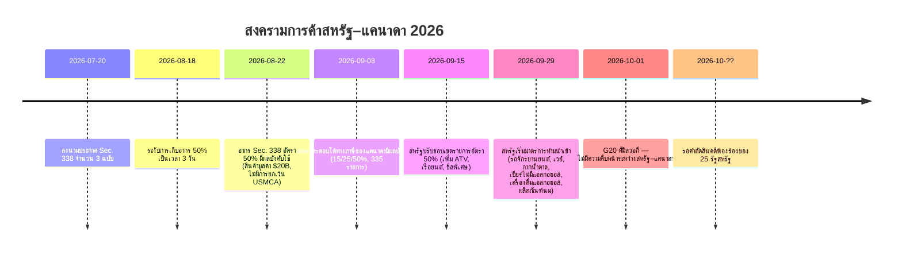
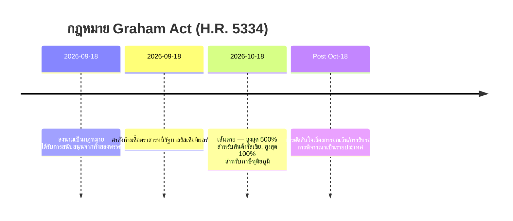
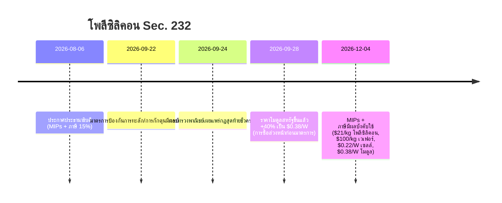

# รายงานข่าวกรองการค้าโลก — สัปดาห์ที่ 28 กันยายน – 5 ตุลาคม 2026

**บรีฟิงรายสัปดาห์ระดับนักวิเคราะห์** กรอบเวลาครอบคลุม: 28 กันยายน – 5 ตุลาคม 2026 รวบรวมจากแหล่งข่าวการค้า นโยบาย ข้อมูล และค่าระวางประมาณ 45 แหล่งทั่วโลก ทุกข้อกล่าวอ้างมีแหล่งอ้างอิง ค่าที่ตรวจสอบไม่ได้จะทำเครื่องหมายว่า n/a

---

## สารบัญ

1. [บทสรุปผู้บริหาร](#1-executive-summary)
2. [การแจ้งเตือน](#2-alerts)
3. [เรื่องเด่น — เจาะลึก](#3-top-stories--deep-dives)
4. [ตัวติดตามภาษีศุลกากร](#4-tariff-tracker)
5. [เจาะลึกนโยบายสหรัฐฯ](#5-us-policy-deep-dive)
6. [นโยบายโลกตามภูมิภาค](#6-world-policy-by-region)
7. [มาตรการบังคับใช้กฎหมาย](#7-enforcement-actions)
8. [ข้อมูลที่เผยแพร่](#8-data-releases)
9. [ตลาดค่าระวาง](#9-freight-market)
10. [ไทม์ไลน์นโยบาย](#10-policy-timelines)
11. [กำหนดการและเหตุการณ์สำคัญ (90 วันข้างหน้า)](#11-upcoming-deadlines--events-next-90-days)
[ประเด็นเด่น — มุมการตลาดของ Dureach](#12-content-flags--dureach-marketing-angles)
12. [แหล่งข้อมูลและระเบียบวิธี](#12-sources--methodology)

---

## 1. บทสรุปผู้บริหาร

สัปดาห์ที่กำหนดทิศทางการค้าโลกของปี 2026 มาถึงแล้ว การยกระดับเชิงโครงสร้างสามเรื่องเกิดขึ้นพร้อมกัน:

- **สงครามการค้าสหรัฐฯ–แคนาดาทวีความรุนแรงถึงขั้นห้ามนำเข้า** หลังจากภาษีมาตรา 338 อัตรา 50% กับสินค้าแคนาดามูลค่าประมาณ 20,000 ล้านดอลลาร์ (มีผลตั้งแต่ 22 ส.ค. ปรับขอบเขตใหม่ 15 ก.ย.) วอชิงตันขยับขั้นต่อไปในวันที่ 29 ก.ย. ด้วยการ**ห้ามนำเข้า**รถจักรยานยนต์ เวย์ กากน้ำตาล เบียร์ไร้แอลกอฮอล์ เครื่องดื่มแอลกอฮอล์ และผลิตภัณฑ์นมจากแคนาดาโดยสิ้นเชิง — สินค้าที่อยู่ระหว่างขนส่งแล้วจะเสียภาษี 50% แทน ด้านแคนาดายังคงมาตรการตอบโต้ภาษี 15/25/50% กับสินค้าสหรัฐฯ 335 รายการภาษี (มีผล 8 ก.ย.) ขณะที่ 25 รัฐของสหรัฐฯ กำลังฟ้องเพื่อล้มเลิกภาษีเหล่านี้ ยังไม่มีคำตัดสิน ([tariffcalculator2026.com](https://tariffcalculator2026.com/canada-50-percent-tariff-august-19-explainer), [surtaxscan.com](https://surtaxscan.com/news/canadas-counter-tariffs-are-back-15-25-and-50-on-335-us-tariff-items-from))
- **นาฬิกากฎหมาย Graham Act กำลังเดิน** ลงนามเมื่อ 18 ก.ย. กฎหมาย Lindsey O. Graham Sanctioning Russia and Iran Act กำหนดให้เรียกเก็บภาษีสูงสุด **500% กับสินค้ารัสเซีย และภาษีทุติยภูมิสูงสุด 100%** กับผู้นำเข้าพลังงานรัสเซียรายใหญ่ (จีน อินเดีย ตุรกี เสี่ยงที่สุด) ภายใน**วันที่ 18 ต.ค.** ภาษีเหล่านี้บวกทับบนภาษีเดิมทั้งหมด ([lexblog.com](https://www.lexblog.com/2026/09/24/the-lindsey-graham-sanctions-act-what-businesses-need-to-know-about-the-new-tariffs/), [jdsupra.com](https://www.jdsupra.com/legalnews/new-sanctions-and-tariff-power-under-4624517/))
- **สหภาพยุโรปหยิบ "มาตรา 301" ฉบับของตัวเอง** เมื่อวันที่ 5 ต.ค. ฝรั่งเศสและเยอรมนีร่วมกันเสนอเครื่องมือการค้าตอบโต้เร็วของสหภาพยุโรป — ไม่เจาะจงประเทศ กระตุ้นใช้ได้ด้วยเสียงข้างน้อยของรัฐสมาชิก สูงสุดถึงขั้นตัดขาดจากตลาดเดียวทันที — เล็งเป้าความบิดเบือนตลาดเชิงระบบ (อ่านว่า: จีน) ปักกิ่งตอบโต้ภายในไม่กี่วัน: เปิดไต่สวนทุ่มตลาด p-nitrotoluene จากสหภาพยุโรป (3 ต.ค.) พร้อมคำเตือนแข็งกร้าวจาก MOFCOM ผู้นำสหภาพยุโรปจะหยิบยกเรื่องจีนขึ้นหารือในการประชุมสุดยอดที่บรัสเซลส์วันที่ 15 ต.ค. ([reuters.com](https://www.reuters.com/world/china/france-germany-propose-new-rapid-eu-trade-response-tool-2026-10-05/), [wsj.com](https://www.wsj.com/world/europe/germany-and-france-are-proposing-a-new-weapon-to-counter-flood-of-chinese-goods-f723dfdf))

ขณะเดียวกันระบบพหุภาคีก็แตกหักมากขึ้น: รัฐมนตรีการค้า G20 ที่มิลวอกี (30 ก.ย.–2 ต.ค.) เห็นพ้องกันเพียง 1 ใน 4 วาระ (การประณามการใช้อาหารเป็นเครื่องมือบีบบังคับทางการค้า) และติดหล่มเรื่องกำลังการผลิตส่วนเกิน แรงงานบังคับ และการปฏิรูป MFN สหรัฐฯ กับจีนประกาศรายชื่อสินค้าลดภาษีแบบต่างตอบแทน "30-for-30" (ฝ่ายละ 30,000 ล้านดอลลาร์) — มีนัยเชิงสัญลักษณ์ แต่ในเชิงเศรษฐกิจแทบไม่มีผล (HSBC: ภาษีถัวเฉลี่ยถ่วงน้ำหนักของสหรัฐฯ ต่อจีนลดจาก 27.3% เหลือ 26.0%) C.H. Robinson ประกาศ**ซื้อกิจการ RXO มูลค่า 5,800 ล้านดอลลาร์** การควบรวม 3PL ครั้งใหญ่ที่สุดของวัฏจักรนี้ และ CBP ออกคำสั่ง Withhold Release Order ใหม่ 2 ฉบับกรณีแรงงานบังคับกับน้ำมันปาล์มอินโดนีเซีย ทำให้ยอดรวมเป็น 60 WROs + 8 Findings ที่ยังมีผลบังคับ

**ค่าระวาง:** ตลาดสองจังหวะ เรือคอนเทนเนอร์ข้ามแปซิฟิกทรงตัวแข็งแกร่ง (Drewry WCI 4,434 ดอลลาร์/FEU, -1% w/w; เซี่ยงไฮ้–นิวยอร์ก 10,428 ดอลลาร์) ขณะที่เอเชีย–ยุโรปร่วงเป็นสัปดาห์ที่ 12 ติดต่อกันจากกำลังการผลิตเรือที่กลับผ่านคลองสุเอซ เรือเทกองเจอสัปดาห์แย่ที่สุดในรอบเดือน (BDI 3,148, -8.1% w/w) หลังรายได้เรือ Capesize ดิ่ง 12.8%

---

## 2. การแจ้งเตือน

| # | การแจ้งเตือน | วันที่มีผล | ผลกระทบ | แหล่งที่มา |
|---|---|---|---|---|
| A1 | สหรัฐฯ ห้ามนำเข้าสินค้าแคนาดา: รถจักรยานยนต์ เวย์ กากน้ำตาล เบียร์ไร้แอลกอฮอล์ เครื่องดื่มแอลกอฮอล์ ผลิตภัณฑ์นม | 29 ก.ย. 2026 | สินค้าเป้าหมายถูกปฏิเสธการนำเข้า สินค้าที่อยู่ระหว่างขนส่งเสียภาษี 50% แทน | [asrwe.com](https://asrwe.com/asr-university/us-canada-import-ban-alcohol-motorcycles-section-338-expansion-september-2026) |
| A2 | CBP ออก WRO กับน้ำมันปาล์มอินโดนีเซีย (Mitra Aneka Rezeki, Hardaya Inti Plantation) | 29 ก.ย. 2026 | กักสินค้าทันทีที่ท่าเรือสหรัฐฯ ทุกแห่ง รวม WRO ที่ยังมีผล 60 ฉบับ + 8 Findings | [thompsonhine.com](https://www.thompsonhine.com/insights/cbp-issues-withhold-release-orders-on-two-indonesian-palm-oil-producers/) |
| A3 | ภาษีทุติยภูมิ Graham Act (สูงสุด 100%) กับผู้ซื้อพลังงานรัสเซียรายใหญ่ | เส้นตาย 18 ต.ค. 2026 | จีน อินเดีย ตุรกี เสี่ยงที่สุด บวกทับภาษีเดิม | [lexblog.com](https://www.lexblog.com/2026/09/24/the-lindsey-graham-sanctions-act-what-businesses-need-to-know-about-the-new-tariffs/) |
| A4 | โพลีซิลิคอนมาตรา 232: ราคาขั้นต่ำนำเข้า (MIPs) + ภาษี 15% | 4 ธ.ค. 2026 (มาตรการกันกักตุนมีผลแล้ว) | โพลี 21 ดอลลาร์/กก. เวเฟอร์ 100 ดอลลาร์/กก. เซลล์ 0.22 ดอลลาร์/W โมดูล 0.38 ดอลลาร์/W ราคาโมดูลสหรัฐฯ ขึ้นแล้ว 40% | [mondaq.com](https://www.mondaq.com/unitedstates/export-controls-trade-investment-sanctions/1848548/polysilicon-and-derivatives-in-the-bullseye-for-major-new-tariffs-and-other-restrictions) |
| A5 | สหภาพยุโรปเสนอเครื่องมือการค้าตอบโต้เร็ว "systemic reaction" | เสนอ 5 ต.ค. ผู้นำ EU ประชุม 15 ต.ค. | อำนาจตัดขาดตลาดได้ใน 24 ชม. เสี่ยงจีนตอบโต้ | [reuters.com](https://www.reuters.com/world/china/france-germany-propose-new-rapid-eu-trade-response-tool-2026-10-05/) |
| A6 | จีนเปิดไต่สวนทุ่มตลาด p-nitrotoluene จากสหภาพยุโรป | เปิด 3 ต.ค. (ประกาศ MOFCOM ฉบับที่ 44) | กระสุนนัดแรกของการยกระดับ EU–จีน | [vespernews.com](https://www.vespernews.com/en/news/7dd758b7-b501-4c41-b2ee-13cb57ed832f) |

### A1 — สหรัฐฯ ห้ามนำเข้าสินค้าแคนาดา (รายละเอียด)

ประกาศเดือนกันยายนสร้างโครงสร้างสองคลื่น คลื่นแรก (15 ก.ย.): ปรับขอบเขตรายการสินค้าภาษี 50% มาตรา 338 ใหม่ — **เพิ่ม**ในอัตรา 50%: ชีสพิเศษ ไขมันและน้ำมันดัดแปลง หนังวัวดิบและหนังเบาะ หนังเฟอร์ดิบและฟอก เรือยนต์สันทนาการ กระดาษพิเศษ สินค้าเหล็ก/อะลูมิเนียมบางรายการ อุปกรณ์โลหะและวัสดุเชื่อม รถกอล์ฟ เฟอร์นิเจอร์และโคมไฟ ATV ผลิตภัณฑ์นมเพิ่มเติม **ถอดออก**: เกลือหิน น้ำตาล ซีเมนต์ ตู้สวิตช์เกียร์ กระดาษชำระ ชิ้นส่วนคันเบ็ด วิสกี้/เหล้าหวานแบบ bulk คลื่นที่สอง (29 ก.ย.): **ห้ามนำเข้า** — ไม่ใช่ภาษีแต่คือการปฏิเสธการนำเข้า — รถจักรยานยนต์แคนาดา (รวมถึง BRP Can-Am Spyder/Canyon) เวย์ กากน้ำตาล เบียร์ไร้แอลกอฮอล์ เครื่องดื่มแอลกอฮอล์ และผลิตภัณฑ์นม สินค้าที่อยู่บนเรือหรือในคลังทัณฑ์บนก่อน 29 ก.ย. ยังเสียภาษี 50% แทนการถูกห้าม ([tariffcalculator2026.com](https://tariffcalculator2026.com/canada-section-338-september-15-29-what-changes), [asrwe.com](https://asrwe.com/asr-university/us-canada-import-ban-alcohol-motorcycles-section-338-expansion-september-2026))

กฎการบวกทับที่สำคัญ: ภาษีมาตรา 338 อัตรา 50% **ไม่ได้รับการยกเว้น USMCA** — ใบรับรอง CUSMA ไม่มีผลกับภาษีนี้ อย่างไรก็ตาม ภาษีมาตรา 301 กรณีแรงงานบังคับ 10% กับสินค้าแคนาดา *ได้รับการยกเว้น* หากมีการอ้างสิทธิ USMCA ที่ถูกต้อง ดังนั้นสินค้าที่อยู่ในข่ายแต่ไม่ได้สิทธิ USMCA อาจเจอ **50% + 10% = 60%** ([tarifflens.ai](https://www.tarifflens.ai/blog/section-338-canada-retaliation-september-2026-importers-guide))

### A2 — WRO น้ำมันปาล์มอินโดนีเซีย (รายละเอียด)

คำสั่ง CBP วันที่ 29 ก.ย. เล็งเป้าน้ำมันปาล์มและอนุพันธ์จาก Mitra Aneka Rezeki (MAR) และ Hardaya Inti Plantation (HIP) หลักฐานที่พิจารณา: การสัมภาษณ์คนงาน สลิปเงินเดือน โควตาการเก็บเกี่ยว ภาพถ่าย รายงาน NGO/รัฐบาล สื่อข่าว งานวิจัยวิชาการ คนงานของ MAR แสดงตัวบ่งชี้แรงงานบังคับของ ILO **เก้าข้อ** (รวมถึงการยึดเอกสารประจำตัวและการแยกตัว) ส่วน HIP แสดง**เจ็ดข้อ** (หนี้ผูกมัด การหักค่าจ้าง การหลอกลวง การทำงานล่วงเวลาเกินควร การข่มขู่ สภาพการทำงานที่เลวร้าย การเอารัดเอาเปรียบผู้เปราะบาง) การกักสินค้ามีผลทันทีที่ท่าเรือสหรัฐฯ ทุกแห่ง ผู้นำเข้าอาจเลือกส่งออก ทำลาย หรือพิสูจน์แหล่งที่มาสะอาด ([thompsonhine.com](https://www.thompsonhine.com/insights/cbp-issues-withhold-release-orders-on-two-indonesian-palm-oil-producers/), [ghy.com](https://www.ghy.com/trade-compliance/2026-withhold-release-orders-wros/))

### A3 — กฎหมาย Graham Act (รายละเอียด)

H.R. 5334 ลงนาม 18 ก.ย. ด้วยเสียงสนับสนุนจากสองพรรค วางระบอบคว่ำบาตรรัสเซียไว้บนฐานกฎหมาย และสร้างช่องทางภาษีบังคับสองช่อง ทั้งสองครบกำหนดภายใน**วันที่ 18 ต.ค.**: สูงสุด **500%** กับสินค้าทุกรายการที่มีถิ่นกำเนิดรัสเซีย และภาษีทุติยภูมิสูงสุด **100%** กับประเทศที่เป็นผู้นำเข้าน้ำมันดิบหรือก๊าซรัสเซีย 5 อันดับแรกและมีการซื้อใหม่ภายใน 30 วันหลังกฎหมายมีผล กลุ่มเสี่ยงที่สุด: **จีน อินเดีย ตุรกี** นอกจากนี้ยังเสี่ยงสูง: สโลวาเกีย ฮังการี สหรัฐอาหรับเอมิเรตส์ ประเทศสมาชิก EU ประเมินเป็นรายประเทศ ช่องทางผ่อนปรน: ข้อยกเว้นก๊าซธรรมชาติ (นำเข้าน้อยกว่า 15% ของการส่งออกก๊าซทั้งหมดของรัสเซีย + "ดำเนินการอย่างมีนัยสำคัญ" เพื่อลด) และการยกเว้นเพื่อผลประโยชน์ชาติ ภาษีทั้งหมด**บวกทับ**บนภาษีมาตรา 301/232 เดิม ([lexblog.com](https://www.lexblog.com/2026/09/24/the-lindsey-graham-sanctions-act-what-businesses-need-to-know-about-the-new-tariffs/), [jdsupra.com](https://www.jdsupra.com/legalnews/new-sanctions-and-tariff-power-under-4624517/), [tradepractitioner.com](https://www.tradepractitioner.com/2026/09/sanctions-by-statute-the-graham-act-and-tariffs-on-russias-energy-buyers/))

### A4 — โพลีซิลิคอนมาตรา 232 (รายละเอียด)

ประกาศประธานาธิบดี 6 ส.ค. + กฎชั่วคราวฉบับสุดท้ายของกระทรวงพาณิชย์ (24 ก.ย.) ตั้งแต่วันที่**4 ธ.ค.**: ราคาขั้นต่ำนำเข้า **21 ดอลลาร์/กก.** (โพลีซิลิคอน) **100 ดอลลาร์/กก.** (แท่ง/เวเฟอร์) **0.22 ดอลลาร์/W** (เซลล์) **0.38 ดอลลาร์/W** (โมดูล) บวกภาษี **15% ตามมูลค่า** กับอนุพันธ์ (โพลีดิบได้รับการยกเว้นภาษี 15% สหราชอาณาจักรได้ 10% ญี่ปุ่น/เกาหลี/ไต้หวัน/สวิตเซอร์แลนด์/ลิกเตนสไตน์/EU จำกัดรวมสูงสุด 15% รวม MFN) มาตรการกันกักตุนมีผลแล้วตั้งแต่ 22 ก.ย.–4 ธ.ค. ตลาดวิ่งนำหน้า: ราคาเสนอขายโมดูลสหรัฐฯ แตะเพดาน 0.38 ดอลลาร์/W แล้ว **+40.7% ตั้งแต่เดือนสิงหาคม** (จาก 0.27 ดอลลาร์/W) เป็นผลดีต่อ Hanwha Solutions และ OCI อุตสาหกรรมประเมินต้นทุนอุปกรณ์เพิ่มประมาณ 10 ล้านดอลลาร์ต่อโครงการ 100 MW ([mondaq.com](https://www.mondaq.com/unitedstates/export-controls-trade-investment-sanctions/1848548/polysilicon-and-derivatives-in-the-bullseye-for-major-new-tariffs-and-other-restrictions), [en.sedaily.com](https://en.sedaily.com/finance/2026/09/28/us-solar-module-prices-jump-40-percent-before-import-curbs), [logisticusgroup.com](https://logisticusgroup.com/new-solar-tariffs-land-december-4-heres-how-to-keep-your-project-on-budget-and-on-schedule/))

### A5 — เครื่องมือตอบโต้เร็วของสหภาพยุโรป (รายละเอียด)

Macron และ Merz เขียนจดหมายถึง von der Leyen เมื่อวันที่ 5 ต.ค. เสนอเครื่องมือ **"systemic reaction"**: ไม่เจาะจงประเทศ กระตุ้นใช้ได้ด้วย**เสียงข้างน้อยของรัฐสมาชิก** (ทำลายธรรมเนียมเสียงข้างมากแบบมีเงื่อนไข) อนุญาตมาตรการ "เด็ดขาด" สูงสุดถึง**ตัดขาดจากตลาดภายในทันที** วางกรอบเป็นคำตอบของสหภาพยุโรปต่อมาตรา 301 ของสหรัฐฯ และการควบคุมส่งออกแร่สำคัญของจีน เจ้าหน้าที่เยอรมันรายหนึ่งเรียกว่า "อาวุธโจมตีสวนครั้งที่สอง" ควบคู่กันจะมีเครื่องมือกระจายความเสี่ยงที่จำกัดการพึ่งพาประเทศเดียวสำหรับการนำเข้าสำคัญ บริบท: ขาดดุลสินค้าของสหภาพยุโรปกับจีนแตะ **359,900 ล้านยูโรในปี 2025** และ **103,000 ล้านยูโรในไตรมาส 2/2026** (สูงสุดตั้งแต่ไตรมาส 3/2022) หัวหน้าฝ่ายบังคับใช้ของคณะกรรมาธิการชี้ว่าการนำเข้าพุ่งในเครื่องจักร สิ่งทอ โลหะ เคมีภัณฑ์ — ไม่ใช่แค่ EV ([reuters.com](https://www.reuters.com/world/china/france-germany-propose-new-rapid-eu-trade-response-tool-2026-10-05/), [wsj.com](https://www.wsj.com/world/europe/germany-and-france-are-proposing-a-new-weapon-to-counter-flood-of-chinese-goods-f723dfdf), [brusselsmorning.com](https://brusselsmorning.com/eu-china-trade-tensions/104764/))

### A6 — จีนตอบโต้ก่อน (รายละเอียด)

วันที่ 3 ต.ค. MOFCOM (ประกาศฉบับที่ 44) เปิด**ไต่สวนทุ่มตลาด p-nitrotoluene จากสหภาพยุโรป** — ไม่กี่วันก่อนการเจรจาการค้าปักกิ่ง และจังหวะตรงกับข้อเสนอฝรั่งเศส-เยอรมนี MOFCOM ยังเตือนแยกว่าจะตอบโต้ "อย่างเด็ดขาด" ต่อเครื่องมือตอบโต้เร็วใดๆ ของสหภาพยุโรป ([vespernews.com](https://www.vespernews.com/en/news/7dd758b7-b501-4c41-b2ee-13cb57ed832f))

---
## 3. เรื่องเด่น — เจาะลึก

### 3.1 รัฐมนตรีการค้า G20 แตกคอกันที่มิลวอกี (30 ก.ย. – 2 ต.ค.)

**เกิดอะไรขึ้น** ภายใต้ประธาน USTR Jamieson Greer รัฐมนตรีการค้า G20 ประชุมกันที่มิลวอกีภายใต้ประธาน G20 ของสหรัฐฯ จาก 4 วาระ มีเพียง**หนึ่งเดียว**ที่เห็นพ้อง: แถลงการณ์ร่วมประณามการใช้อาหารเป็นเครื่องมือบีบบังคับทางการค้า อีกสามวาระล้มเหลว: (1) **กำลังการผลิตส่วนเกิน** — ร่างที่สมาชิกส่วนใหญ่หนุนถูกกลุ่มน้อยที่นำโดยจีนขวางเรื่องถ้อยคำอุดหนุน Greer กล่าวว่าประธาน "ผิดหวังอย่างยิ่ง" (2) **แรงงานบังคับ** — ไม่มีข้อความร่วม สหรัฐฯ เม็กซิโก และอาร์เจนตินาจึงออกแถลงการณ์แยก (3) **การปฏิรูป MFN** — สหรัฐฯ เปิดประเด็นว่าการให้ MFN แบบไม่มีเงื่อนไข "ไม่ส่งเสริมการตอบแทน" และ "สร้างผู้โดยสารฟรี" แต่ไม่ได้ขอแถลงการณ์ร่วม ([barchart.com](https://www.barchart.com/story/news/4917577/g20-trade-talks-yield-little-progress-while-tensions-simmer) (AP), [reuters.com](https://www.reuters.com/world/china/g20-trade-chiefs-denounce-food-trade-coercion-not-excess-factory-capacity-2026-10-01/), [nationpress.com](https://www.nationpress.com/all/g20-milwaukee-talks-eye-more-diesel-globally))

**ตัวเลขสำคัญและสีสัน**
- สหรัฐฯ เปิดไต่สวนกำลังการผลิตส่วนเกินกับประเทศ "ตั้งแต่นอร์เวย์ถึงบังกลาเทศ" นอกจากเหล็กจีน วอชิงตันยังอ้างรถยนต์ แบตเตอรี่ กระดาษ และเซมิคอนดักเตอร์ ([barchart.com](https://www.barchart.com/story/news/4917577/g20-trade-talks-yield-little-progress-while-tensions-simmer))
- อินเดียแก้ไขนโยบายการค้าต่างประเทศใน**เดือนกรกฎาคม 2026** ห้ามนำเข้าสินค้าที่ผลิตโดยใช้แรงงานบังคับทั้งหมดหรือบางส่วน — Goyal หยิบยกขึ้นในมิลวอกี อินเดียใช้ยุทธศาสตร์สองทาง (ปกป้องจุดยืนในที่ประชุมใหญ่ ผลักดันทวิภาคีนอกรอบ) ([beatsinbrief.com](https://beatsinbrief.com/2026/10/03/milwaukee-g20-trade-ministers-piyush-goyal-india-positions/))
- ผลพลอยได้นอกรอบ: การหารือที่มีสหรัฐฯ เป็นตัวกลางคาดว่าจะส่ง**ดีเซลออกสู่ตลาดโลกมากขึ้น** (คู่เจรจา ปริมาณ และตารางเวลาไม่เปิดเผย) ([nationpress.com](https://www.nationpress.com/all/g20-milwaukee-talks-eye-more-diesel-globally))
- ไม่มีความคืบหน้าข้อพิพาทสหรัฐฯ–แคนาดา Trump สั่งห้ามนำเข้าสินค้าแคนาดามูลค่าประมาณ 1,000 ล้านดอลลาร์ (แอลกอฮอล์ ผลิตภัณฑ์นม รถจักรยานยนต์) ในสัปดาห์นั้น ([businessmirror.com.ph](https://businessmirror.com.ph/2026/10/02/g20-trade-talks-yield-little-progress-while-tensions-simmer/))

**ทำไมจึงสำคัญ** การไม่สามารถออกเอกสารผลลัพธ์ส่งสัญญาณว่าธรรมาภิบาลการค้าพหุภาคีไม่อาจสกัดกั้นคลื่นภาษีปัจจุบันได้อีกต่อไป — สมรภูมิจริงย้ายไปอยู่ช่องทางทวิภาคีและฝ่ายเดียวอย่างถาวรแล้ว จับตาการประชุมสุดยอดผู้นำ G20 ที่**ไมอามี** ว่ารอยร้าวมิลวอกีจะปรากฏในระดับผู้นำหรือไม่ ([nationpress.com](https://www.nationpress.com/international/g20-trade-talks-end-without-deal-goyal))

### 3.2 สหรัฐฯ–จีน "30-for-30": ประกาศรายชื่อแล้ว เศรษฐกิจแทบไม่ขยับ

**เกิดอะไรขึ้น** หลังการประชุมสุดยอด Trump–Xi ที่วอชิงตัน (23–25 ก.ย.) ทั้งสองรัฐบาลประกาศรายชื่อสินค้าลดภาษีแบบต่างตอบแทนเมื่อ 28 ก.ย. ภายใต้กรอบ "30-for-30" ของคณะกรรมการการค้าสหรัฐฯ–จีนชุดใหม่: แต่ละฝ่ายอาจลดภาษีสินค้าของอีกฝ่ายมูลค่าประมาณ 30,000 ล้านดอลลาร์ ([cnn.com](https://www.cnn.com/2026/09/28/business/us-china-tariff-cuts-60-billion-intl?cid=external-feeds_iluminar_meta), [kpmg.com](https://kpmg.com/us/en/taxnewsflash/news/2026/09/us-china-trade-framework-tariff-reductions.html))

**ตัวเลขสำคัญ**
| | รายชื่อสหรัฐฯ (สินค้าจีน) | รายชื่อจีน (สินค้าสหรัฐฯ) |
|---|---|---|
| จำนวนพิกัด HTS | 77 | 1,619 |
| มูลค่า | ~30,000 ล้านดอลลาร์ | ~30,000 ล้านดอลลาร์ |
| ลักษณะ | สินค้าอุปโภค: ของเล่น ดอกไม้ไฟ เครื่องใช้บนโต๊ะอาหาร ผ้าห่ม ไมโครเวฟ โคมไฟต้นคริสต์มาส เก้าอี้เด็ก ที่นั่งเด็กในรถ มีดโกนไฟฟ้า | เกษตร: ข้าวโพด ข้าวสาลี ข้าวฟ่าง เนื้อสัตว์ ผลิตภัณฑ์นม น้ำมัน ปลา อาหารทะเล ไม้ซุง บวกเครื่องสำอาง อุปกรณ์การแพทย์ |
| ข้อยกเว้นเด่น | ของเล่นเชื่อมต่อ Wi-Fi/Bluetooth (ข้อยกเว้นความมั่นคงข้อมูล) **เสื้อผ้าทั้งหมด** | **ถั่วเหลืองทั้งเมล็ด** — สินค้าเกษตรส่งออกใหญ่สุดของสหรัฐฯ ไปจีน |
| สัดส่วนการค้า | ~7% ของการนำเข้าสหรัฐฯ จากจีน (มูลค่าปี 2024) | ~18% ของการนำเข้าจีนจากสหรัฐฯ |

**เชิงเศรษฐกิจ** HSBC (29 ก.ย.): ภาษีถัวเฉลี่ยถ่วงน้ำหนักของสหรัฐฯ ต่อสินค้าจีนลดลงเพียงจาก **27.3% เหลือ 26.0%** สินค้าในรายชื่อกว่า 90% กลับไปอัตราปกติ MFN การปรับภายใต้กรอบอ้างอิงเกิดได้**มากสุดปีละครั้ง** ([exencialrp.substack.com](https://exencialrp.substack.com/p/hsbc-sees-us-china-30-for-30-deal) (HSBC ผ่าน Substack), [lexblog.com](https://www.lexblog.com/2026/09/29/u-s-china-board-of-trade-30-for-30-identifies-products-recommended-for-reduced-tariffs/))

**ดีลข้างเคียง** จีนจะนำเข้า**ถ่านหินสหรัฐฯ อย่างน้อย 10 ล้านเมตริกตันในปี 2027 และอีกในปี 2028** เปิดคณะทำงานเปิดตลาดสินค้าเกษตร ระดับการส่งแร่หายากจะ "กลับสู่ระดับที่เหมาะสม" (จีนทำตามพันธกรณีเดิมได้เพียงประมาณสองในสาม ดุลการค้าสินค้าสหรัฐฯ–จีนลดลง 40% ตั้งแต่ ม.ค. 2025 เหลือ 140,000 ล้านดอลลาร์) ยังไม่มีการลดภาษีใดมีผลบังคับ — USTR ต้องประกาศอัตราและวันที่มีผลก่อน ([cnn.com](https://www.cnn.com/2026/09/28/business/us-china-tariff-cuts-60-billion-intl?cid=external-feeds_iluminar_meta), [kpmg.com](https://kpmg.com/us/en/taxnewsflash/news/2026/09/us-china-trade-framework-tariff-reductions.html), [tradersunion.com](https://tradersunion.com/news/financial-news/show/3528484-us-china-lower-tariff-framework/))

**ทำไมจึงสำคัญ** นัยสำคัญที่แท้จริงของกรอบนี้อยู่ที่สถาบัน — คณะกรรมการการค้าถาวรที่มีขั้นตอนทำงาน — ไม่ใช่ตัวเลขภาษี สำหรับการจัดหา: การยกเว้นเสื้อผ้าทำให้แรงจูงใจกระจายฐานจากจีนไปเวียดนาม/บังกลาเทศ/อินเดียคงอยู่ ส่วนสิ่งทอในบ้าน (ผ้าห่ม ผ้าปูที่นอน/ผ้าปูโต๊ะ ผ้าม่าน) อาจเจอการแข่งขันจากจีนที่ดุขึ้นหากมาตรการลดภาษีมีผล ([textalks.com](https://textalks.com/us-china-tariff-excludes-apparel-but-opens-door-to-chinese-home-textiles/))

### 3.3 C.H. Robinson เตรียมซื้อ RXO — 5,800 ล้านดอลลาร์

**เกิดอะไรขึ้น** วันที่ 5 ต.ค. C.H. Robinson (Nasdaq: CHRW) ตกลงซื้อ RXO (NYSE: RXO) ด้วยดีลเงินสด+หุ้น: **17.25 ดอลลาร์เงินสด + หุ้น CHRW 0.0856 หุ้นต่อหุ้น RXO = 30.25 ดอลลาร์/หุ้น พรีเมียม 29%** จากราคาปิด 2 ต.ค. — มูลค่าโดยนัย **5,800 ล้านดอลลาร์** มูลค่ากิจการรวม **กว่า 25,000 ล้านดอลลาร์** บอร์ดทั้งสองฝ่ายเห็นชอบเป็นเอกฉันท์ MFN Partners (ถือ 17% ของ RXO) และ Orbis (ผู้ถือใหญ่สุด) หนุน คาดปิดดีล**ครึ่งแรก 2027** รอการอนุมัติกำกับดูแลและผู้ถือหุ้น RXO ([rxo.com](https://rxo.com/news/c-h-robinson-to-acquire-rxo-redefining-the-future-of-third-party-logistics-while-unlocking-significant-shareholder-value/), [reuters.com](https://www.reuters.com/business/ch-robinson-buy-freight-broker-rxo-58-billion-2026-10-05/))

**ตัวเลขสำคัญ**
- ผู้ถือหุ้น RXO จะถือ ~11% ของบริษัทรวม RXO ถูกรวมเข้าหน่วย North American Surface Transportation ของ CHRW (กว่า 2/3 ของรายได้)
- **ซินเนอร์จีต้นทุนสุทธิ 300 ล้านดอลลาร์ต่อปีภายใน 2 ปี** ผ่านโมเดลปฏิบัติการ "Lean AI" ของ CHRW (รวมศูนย์บริการ รวมผู้ขาย อสังหาริมทรัพย์ ประกันภัย)
- ปฏิกิริยาตลาด: RXO **+~20%** (28.10–28.49 ดอลลาร์) CHRW **-12%** ก่อนเปิดตลาด (150 ดอลลาร์ เทียบปิด 157.72 ดอลลาร์) — ส่วนลดผู้ซื้อแบบคลาสสิก Reuters Breakingviews เรียกผลตอบแทนว่า "so-so"
- ที่ปรึกษา: Morgan Stanley (CHRW), Goldman Sachs (RXO)
- RXO ขึ้น 16.2% ในสองวันทำการก่อนประกาศ ด้วยวอลุ่ม 3.67 ล้านหุ้น (เทียบปกติ ~1.9 ล้าน) — มีแรงซื้อดักหน้าชัดเจน ([freightwaves.com](https://www.freightwaves.com/news/breaking-c-h-robinson-acquiring-rxo), [financial-news.co.uk](https://www.financial-news.co.uk/c-h-robinson-to-buy-rxo-in-5-8bn-cash-and-stock-deal/), [inboundlogistics.com](https://www.inboundlogistics.com/articles/c-h-robinson-to-acquire-rxo-in-5-8-billion-deal/))

**ทำไมจึงสำคัญ** การควบรวมโบรกเกอร์ขนส่งเร่งตัวในช่วงค่าระวางอ่อน: ผู้เล่นรายใหญ่ซื้อความหนาแน่นและเทคโนโลยีแทนการสร้างเอง โบรกเกอร์รวมจะมีอำนาจต่อรองราคาสูงสุดในตลาดรถบรรทุกอเมริกาเหนือ — ผู้ส่งสินค้าควรเตรียมเจรจาสัญญาที่หินขึ้น โบรกเกอร์รายเล็กเจอแรงกดดันถึงขั้นอยู่รอด เรื่องซินเนอร์จี "Lean AI" ก็ส่งสัญญาณเช่นกัน: โมเดลโบรกเกอร์ที่ใช้คนเยอะกำลังถูกระบบอัตโนมัติแทนที่ (Newsquawk ผ่าน [financial-news.co.uk](https://www.financial-news.co.uk/c-h-robinson-to-buy-rxo-in-5-8bn-cash-and-stock-deal/))

### 3.4 อินเดีย–สหรัฐฯ: "ใกล้เส้นชัย" แต่ยังไม่มีดีล

**เกิดอะไรขึ้น** นอกรอบ G20 (1–2 ต.ค.) USTR Greer พบรัฐมนตรีพาณิชย์ Piyush Goyal แล้วประกาศว่าการเจรจาอยู่ใน "ช่วงโค้งสุดท้าย" — แต่ "ผมไม่คิดว่าจะมีอะไรในเร็วๆ นี้" มีสาย Trump–Modi ก่อนการประชุม และคาดว่าจะมีสายผู้นำอีก "เร็วๆ นี้" ([thehindubusinessline.com](https://www.thehindubusinessline.com/news/nothing-imminent-us-trade-representative-greer-on-india-trade-deal-modi-trump-to-talk-soon/article71536059.ece/amp/), [nationpress.com](https://www.nationpress.com/international/india-us-trade-deal-in-short-strokes-greer))

**ตัวเลขสำคัญและจุดกดดัน**
- สินค้าอินเดียเจอภาษีมาตรา 301 กรณีแรงงานบังคับเพิ่ม **10% ตั้งแต่ 24 ก.ค.** (ครอบคลุม 60 เศรษฐกิจ) การไต่สวน 301 รอบสองเรื่องกำลังการผลิตส่วนเกินเชิงโครงสร้าง (16 เศรษฐกิจ รวมอินเดีย) กำลังดำเนินและอาจกระทบเหล็ก
- จุดติด: การเปิดตลาดเกษตร การค้าดิจิทัล การซื้อน้ำมันรัสเซียของอินเดีย — ยิ่งแหลมคมขึ้นด้วยภาษีทุติยภูมิสูงสุด 100% ของ Graham Act
- แม้มีภาษี การส่งออกสินค้าอินเดียไปสหรัฐฯ โต **21.83% YoY ในเดือนสิงหาคม** รูปีใกล้ **96.3/ดอลลาร์** เป้าการค้า 500,000 ล้านดอลลาร์ภายในปี 2030
- รัฐมนตรีคลัง Sitharaman (4 ต.ค.): การเจรจา "ถึงจุดอิ่มตัว" — ยากที่จะได้สัมปทานเพิ่ม ([thefinancialeconomy.com](https://www.thefinancialeconomy.com/india-us-trade-talks/), [jagranjosh.com](https://www.jagranjosh.com/general-knowledge/indiaus-trade-deal-not-imminent-why-is-it-being-delayed-who-has-the-advantage-what-are-indias-options-1820012731-1), [english.dainikjagranmpcg.com](https://english.dainikjagranmpcg.com/top-stories/india-us-trade-talks-reach-plateau-nirmala-sitharaman/article-36152))

**ทำไมจึงสำคัญ** อินเดียคือตัวแปรสำคัญทั้งในเรื่อง China+1 และแผนที่ภาษีทุติยภูมิของ Graham Act ดีลจะปลดล็อกวาล์วบรรเทาภาษีหนึ่งในไม่กี่ช่องที่ผู้นำเข้าสหรัฐฯ มีในปีนี้ ความล้มเหลวทำให้ผู้ส่งออกอินเดีย — และผู้ซื้อสหรัฐฯ ของพวกเขา — อยู่ในภาวะคลุมเครือต่อไปจนถึงช่วงพีคซีซัน

### 3.5 โดรน: ภาษีขึ้น แต่ควบคุมส่งออกผ่อนลง

**เกิดอะไรขึ้น** มาตรการโดรนสหรัฐฯ สองเรื่องที่วิ่งสวนทางกัน ทั้งคู่มีรากจากวันที่ 13 ส.ค.: (1) ประกาศมาตรา 232 (Proclamation 11055) เก็บภาษี **100%** กับโดรนน้ำหนักเกิน 25 กก. หรือมีกล้องถ่ายภาพความร้อน (บวกสถานีจอดและชิ้นส่วนสำคัญ ภาคผนวก I) และ **25%** กับโดรนเล็กไม่มีกล้องความร้อน (ภาคผนวก II) มีผล 3 ก.ย. ชิ้นส่วน (ภาคผนวก III) 25% ตั้งแต่**9 ก.พ. 2027** อัตราพันธมิตร: สหราชอาณาจักร 10% ญี่ปุ่น/เกาหลี/ไต้หวัน/สวิตเซอร์แลนด์/ลิกเตนสไตน์/EU จำกัดรวม 15% (2) กฎสุดท้ายของ BIS **ผ่อนปรนการควบคุมส่งออก**: UAV ที่บินได้น้อยกว่า 3 ชม. ลดเหลือควบคุม AT เท่านั้นภายใต้ ECCN 9A012 พร้อมข้อยกเว้นใบอนุญาต STA สำหรับ Country Group A:5 — แต่ผู้ใช้ทางทหารในจีน/รัสเซีย/เบลารุส/เวเนซุเอลายังถูกจำกัด ([whitehouse.gov](https://www.whitehouse.gov/presidential-actions/2026/08/adjusting-imports-of-unmanned-aircraft-systems-and-unmanned-aircraft-systems-components-into-the-united-states/), [jdsupra.com](https://www.jdsupra.com/legalnews/two-us-drone-actions-reshape-export-8075367/) (Wiley), [tbgfs.com](https://tbgfs.com/csms-69738151-guidance-section-232-duties-on-imports-of-unmanned-aircraft-systems-and-unmanned-aircraft-systems-components/))

**ทำไมจึงสำคัญ** สหรัฐฯ กำลังสร้างกำแพงล้อมตลาดโดรนในประเทศพร้อมกับติดอาวุธให้ผู้ส่งออกของตัวเอง — นโยบายอุตสาหกรรมแบบ "ป้อมปราการ + รุกไปข้างหน้า" ตามตำรา ผู้ซื้อโดรนเชิงพาณิชย์เจอตลาดสองขั้ว: สินค้าจากห่วงโซ่อุปทานพันธมิตรที่ 10–15% สินค้าต้นทางจีนที่ 25–100%

### 3.6 ดุลการค้าสินค้าสหรัฐฯ แตะ 132,600 ล้านดอลลาร์ในเดือนสิงหาคม

**เกิดอะไรขึ้น** ดุลการค้าสินค้าเบื้องต้นเดือนสิงหาคมขาดดุลเพิ่ม **11.5%** เป็น **132,600 ล้านดอลลาร์**: นำเข้า **336,100 ล้านดอลลาร์ (+5.5%)** จากวัสดุอุตสาหกรรมและสินค้าทุนเพื่อสร้าง AI ส่งออก **203,400 ล้านดอลลาร์ (+1.9%)** การค้ากลายเป็นตัวฉุด GDP **ไตรมาสที่สามติดต่อกัน** — จังหวะไม่สวยสำหรับรัฐบาลที่ขายภาษีว่าเป็นยารักษาดุลขาดดุล ([reuters.com](https://www.reuters.com/business/us-goods-trade-deficit-widens-sharply-august-2026-09-30/))

### 3.7 De minimis ยังตายสนิท เงินคืน IEEPA เริ่มไหล

**เกิดอะไรขึ้น** ศาลการค้าระหว่างประเทศ (13 ส.ค. คดี Detroit Axle) ยืนยันการยกเลิกข้อยกเว้น de minimis 800 ดอลลาร์บนฐาน IEEPA — ตัดสินว่าการยกเลิก "สิทธิพิเศษ" ไม่ใช่การเก็บภาษี จึงรอดจากคำตัดสินศาลฎีกาเดือนกุมภาพันธ์ที่ล้มภาษี IEEPA de minimis ทั่วโลกสิ้นสุด 29 ส.ค. 2025 สภาคองเกรสจะปิดช่องเองโดยกฎหมายมีผล ก.ค. 2027 อีกด้าน ระบบ CAPE ของ CBP (ใช้งานตั้งแต่ 20 เม.ย.) กำลังดำเนินการคืน**ภาษี IEEPA ประมาณ 165,000 ล้านดอลลาร์** ที่เก็บไป พร้อมดอกเบี้ยสะสม ~650 ล้านดอลลาร์/เดือน **CAPE Phase 3 ใช้งาน 6 ต.ค.** เพื่อจัดการเงินคืนสำหรับรายการที่ reliquidate ([reuters.com](https://www.reuters.com/legal/government/us-court-backs-trumps-power-close-de-minimis-tariff-exemption-2026-08-13/), [openclassactions.com](https://openclassactions.com/tariff-class-actions.php))

---
## 4. ตัวติดตามภาษีศุลกากร

ค่าฐาน + การเปลี่ยนแปลงสัปดาห์นี้ อัตราเป็นภาษี*เพิ่มเติม* เว้นแต่ระบุไว้ กฎการบวกทับแตกต่างกันตามมาตรการ — ตรวจสอบ HTS แหล่งกำเนิด และวันนำเข้าต่อ shipment

| เป้าหมาย | มาตรการ | อัตรา | วันที่มีผล | สถานะ | แหล่งที่มา |
|---|---|---|---|---|---|
| แคนาดา (สินค้าในข่าย) | มาตรา 338 (3 ประกาศ, 20 ก.ค.) | 50% | 22 ส.ค. 2026 | มีผลบังคับ **ไม่ได้รับการยกเว้น USMCA** ปรับขอบเขตใหม่ 15 ก.ย. | [tariffcalculator2026.com](https://tariffcalculator2026.com/canada-50-percent-tariff-august-19-explainer) |
| แคนาดา (รถจักรยานยนต์ เวย์ กากน้ำตาล เบียร์ NA แอลกอฮอล์ ผลิตภัณฑ์นม) | มาตรา 338 ห้ามนำเข้า | ห้าม (ปฏิเสธการนำเข้า) | 29 ก.ย. 2026 | มีผลบังคับ | [asrwe.com](https://asrwe.com/asr-university/us-canada-import-ban-alcohol-motorcycles-section-338-expansion-september-2026) |
| แคนาดา (ทั่วไป) | มาตรา 301 กรณีแรงงานบังคับ | 10% | 24 ก.ค. 2026 (60 เศรษฐกิจ) | มีผลบังคับ การอ้างสิทธิ USMCA ได้รับการยกเว้น | [tarifflens.ai](https://www.tarifflens.ai/blog/section-338-canada-retaliation-september-2026-importers-guide) |
| สินค้าสหรัฐฯ → แคนาดา | คำสั่ง Surtax แคนาดา 2026 | 15% / 25% / 50% (335 รายการ) | 8 ก.ย. 2026 | มีผลบังคับ สะท้อนอัตรา 338 ของสหรัฐฯ | [surtaxscan.com](https://surtaxscan.com/news/canadas-counter-tariffs-are-back-15-25-and-50-on-335-us-tariff-items-from) |
| รัสเซีย (สินค้าทั้งหมด) | กฎหมาย Graham Act (H.R. 5334) | สูงสุด 500% | ภายใน 18 ต.ค. 2026 | ลงนาม 18 ก.ย. รอการบังคับใช้ | [lexblog.com](https://www.lexblog.com/2026/09/24/the-lindsey-graham-sanctions-act-what-businesses-need-to-know-about-the-new-tariffs/) |
| ผู้ซื้อพลังงานรัสเซียรายใหญ่ (จีน อินเดีย ตุรกี…) | ภาษีทุติยภูมิ Graham Act | สูงสุด 100% | ภายใน 18 ต.ค. 2026 | รอดำเนินการ บวกทับภาษีเดิม | [jdsupra.com](https://www.jdsupra.com/legalnews/new-sanctions-and-tariff-power-under-4624517/) |
| จีน (ห่วงโซ่โพลีซิลิคอน) | มาตรา 232 MIPs + ภาษี | MIP 21 ดอลลาร์/กก.–0.38 ดอลลาร์/W + 15% | 4 ธ.ค. 2026 | ประกาศ 6 ส.ค. มาตรการกันกักตุนมีผลแล้ว | [mondaq.com](https://www.mondaq.com/unitedstates/export-controls-trade-investment-sanctions/1848548/polysilicon-and-derivatives-in-the-bullseye-for-major-new-tariffs-and-other-restrictions) |
| โดรน (ทั่วไป) | มาตรา 232 (ประกาศ 11055) | 100% (>25 กก./มีกล้องความร้อน) 25% (ขนาดเล็ก) | 3 ก.ย. 2026 | มีผลบังคับ | [whitehouse.gov](https://www.whitehouse.gov/presidential-actions/2026/08/adjusting-imports-of-unmanned-aircraft-systems-and-unmanned-aircraft-systems-components-into-the-united-states/) |
| โดรน (สหราชอาณาจักร / ญี่ปุ่น/เกาหลี/ไต้หวัน/สวิส/EU) | มาตรา 232 อัตราพันธมิตร | 10% สหราชอาณาจักร จำกัดรวม 15% ที่เหลือ | 3 ก.ย. 2026 | มีผลบังคับ (ต้องมีใบรับรอง) | [tbgfs.com](https://tbgfs.com/csms-69738151-guidance-section-232-duties-on-imports-of-unmanned-aircraft-systems-and-unmanned-aircraft-systems-components/) |
| ชิ้นส่วนโดรน (ภาคผนวก III) | มาตรา 232 | 25% | 9 ก.พ. 2027 | ประกาศแล้ว | [jdsupra.com](https://www.jdsupra.com/legalnews/trump-administration-imposes-section-5315313/) |
| จีน (รายชื่อ 30-for-30, 77 พิกัด HTS) | บรรเทาภาษีแบบต่างตอบแทน (รอดำเนินการ) | กลับสู่อัตรา MFN | n/a — รอประกาศ USTR | ประกาศรายชื่อ 28 ก.ย. ยังไม่มีการลดภาษีมีผล | [kpmg.com](https://kpmg.com/us/en/taxnewsflash/news/2026/09/us-china-trade-framework-tariff-reductions.html) |
| ยา (มีสิทธิบัตร) | มาตรา 232 | ตาม HTSUS 9903.04.60–70 | อัปเดตคำแนะนำ 28 ก.ย. | ออกคำแนะนำการยื่น CBP แล้ว | [ghy.com](https://www.ghy.com/trade-compliance/category/international-trade-issues/) |
| อินเดีย (ทั่วไป) | มาตรา 301 กรณีแรงงานบังคับ | 10% | 24 ก.ค. 2026 | มีผลบังคับ | [thefinancialeconomy.com](https://www.thefinancialeconomy.com/india-us-trade-talks/) |
| 16 เศรษฐกิจรวมอินเดีย | ไต่สวนมาตรา 301 กำลังการผลิตส่วนเกิน | n/a | อยู่ระหว่างไต่สวน | USTR สัญญาจะดำเนินการ "ภายในไม่กี่สัปดาห์" | [thefinancialeconomy.com](https://www.thefinancialeconomy.com/india-us-trade-talks/) |
| 178 รายการยกเว้นสินค้า | ข้อยกเว้นมาตรา 301 | ได้รับการยกเว้น | ถึง 9 พ.ย. 2026 | กำลังจะหมดอายุ |  |
| สหภาพยุโรป (เสนอ) | เครื่องมือ "systemic reaction" | สูงสุดถึงตัดขาดตลาด | เสนอ 5 ต.ค. ประชุมสุดยอด 15 ต.ค. | ยังไม่เป็นกฎหมาย | [reuters.com](https://www.reuters.com/world/china/france-germany-propose-new-rapid-eu-trade-response-tool-2026-10-05/) |

---

## 5. เจาะลึกนโยบายสหรัฐฯ

### การดำเนินการของสหรัฐฯ สัปดาห์นี้

| วันที่ | หน่วยงาน | การดำเนินการ | นัยสำคัญ | แหล่งที่มา |
|---|---|---|---|---|
| 28 ก.ย. | CBP | อัปเดตคำแนะนำการยื่นสำหรับภาษียามาตรา 232 (HTSUS 9903.04.60–70) 9903.04.61 ยกเลิกหลัง 29 ก.ย. | ความชัดเจนกฎการยื่นสำหรับผู้นำเข้ายา | [ghy.com](https://www.ghy.com/trade-compliance/category/international-trade-issues/) |
| 29 ก.ย. | CBP | ประกาศ TRQ ปีงบ 2027: เสื้อผ้า AGOA น้ำตาลทรายดิบ | วางแผนปีโควตา | [ghy.com](https://www.ghy.com/trade-compliance/category/international-trade-issues/) |
| 29 ก.ย. | CBP | WRO แรงงานบังคับ 2 ฉบับ (น้ำมันปาล์มอินโดนีเซีย) | WRO 60 ฉบับ + 8 Findings ยังมีผล | [kpmg.com](https://kpmg.com/us/en/taxnewsflash/news/2026/09/us-cbp-wros-indonesian-palm-oil.html) |
| 29 ก.ย. | ทำเนียบขาว | ห้ามนำเข้าสินค้าแคนาดามีผลบังคับ | การห้ามนำเข้า*ครั้งแรก* (ไม่ใช่ภาษี) ของสงครามการค้า | [asrwe.com](https://asrwe.com/asr-university/us-canada-import-ban-alcohol-motorcycles-section-338-expansion-september-2026) |
| 30 ก.ย. | USTR | ถ้อยแถลง Global Forum on Steel Excess Capacity | ปกคลุมพหุภาคีให้มาตรการเหล็ก |  |
| 1–2 ต.ค. | USTR (Greer) | G20 มิลวอกี: เห็นพ้องเฉพาะเรื่องบีบบังคับอาหาร เปิดประเด็นปฏิรูป MFN | ช่องทางพหุภาคีชะงัก ยืนยันช่องทางฝ่ายเดียว | [reuters.com](https://www.reuters.com/world/china/g20-trade-chiefs-denounce-food-trade-coercion-not-excess-factory-capacity-2026-10-01/) |
| 2 ต.ค. | USTR | แก้ไข RRM ครั้งที่ 14 — ยาง Corporación de Occidente (เม็กซิโก) | บังคับใช้แรงงาน USMCA ต่อเนื่อง |  |
| 2 ต.ค. | USTR | ทบทวนร่วม USMCA 2027: รับความเห็นสาธารณะถึง**12 ม.ค. 2027** | นาฬิกาปีทบทวนเริ่มเดิน |  |
| 5 ต.ค. | ทำเนียบขาว/สภาคองเกรส | นับถอยหลังบังคับใช้ Graham Act (เหลือ 13 วัน) | ภาษีทุติยภูมิสูงสุด 100% รออยู่ | [lexblog.com](https://www.lexblog.com/2026/09/24/the-lindsey-graham-sanctions-act-what-businesses-need-to-know-about-the-new-tariffs/) |

**วิเคราะห์** รัฐบาลกำลังเดินนาฬิกาสามเรือนพร้อมกัน: (1) นาฬิกา*ลงโทษ* — ห้ามนำเข้าแคนาดา ภาษีทุติยภูมิ Graham Act MIP โพลีซิลิคอน — ทั้งหมดออกแบบมาเพื่อเพิ่มอำนาจต่อรองสูงสุดก่อนสิ้นปี (2) นาฬิกา*สถาบัน* — เตรียมทบทวน USMCA 2027 ขั้นตอนคณะกรรมการการค้า ประเด็นปฏิรูป MFN — สร้างกลไกถาวร (3) นาฬิกา*กฎหมาย* — ชัยชนะ de minimis ของ CIT เทียบกับความพ่ายแพ้ภาษี IEEPA ในศาลฎีกา โดยเงินคืน IEEPA 165,000 ล้านดอลลาร์กำลังไหลผ่าน CAPE รูปแบบชัดเจน: ตรงไหนศาลจำกัด (ภาษี IEEPA) รัฐบาลก็อ้อมผ่าน 232/338/301 และกฎหมาย (Graham Act) ผู้นำเข้าควรวางแผนรับมาตรการ*เพิ่ม*ภายใต้กฎหมาย*เก่า* ไม่ใช่น้อยลง

---
## 6. นโยบายโลกตามภูมิภาค

### ยุโรป

| ความเคลื่อนไหว | รายละเอียด | แหล่งที่มา |
|---|---|---|
| ฝรั่งเศส-เยอรมนีเสนอเครื่องมือตอบโต้เร็ว | เครื่องมือ "systemic reaction" กระตุ้นด้วยเสียงข้างน้อย สูงสุดถึงตัดขาดตลาดทันที ควบคู่เครื่องมือกระจายความเสี่ยง | [reuters.com](https://www.reuters.com/world/china/france-germany-propose-new-rapid-eu-trade-response-tool-2026-10-05/) |
| ดุล EU–จีน | ขาดดุล 359,900 ล้านยูโรในปี 2025 และ 103,000 ล้านยูโรในไตรมาส 2/2026 (สูงสุดตั้งแต่ไตรมาส 3/2022) การนำเข้าพุ่งในเครื่องจักร สิ่งทอ โลหะ เคมีภัณฑ์ | [brusselsmorning.com](https://brusselsmorning.com/eu-china-trade-tensions/104764/) |
| ประชุมสุดยอดผู้นำ EU 15 ต.ค. | ประชุมบรัสเซลส์หยิบยกความไม่สมดุลกับจีน — บททดสอบแรกของข้อเสนอฝรั่งเศส-เยอรมนี | [reuters.com](https://www.reuters.com/world/china/france-germany-propose-new-rapid-eu-trade-response-tool-2026-10-05/) |
| EU พิจารณาลดภาษีอุตสาหกรรม | อาจลดภาษีเพื่อเลี่ยงการตอบโต้เหล็กของจีน (ตามรายงาน Capitol Forum) |  |

### แคนาดา

| ความเคลื่อนไหว | รายละเอียด | แหล่งที่มา |
|---|---|---|
| มาตรการตอบโต้มีผลบังคับ | 15%/25%/50% กับสินค้าสหรัฐฯ 335 รายการตั้งแต่ 8 ก.ย. ครอบคลุม 28,000 ล้านดอลลาร์แคนาดา สินค้าระหว่างขนส่งได้รับการยกเว้น | [surtaxscan.com](https://surtaxscan.com/news/canadas-counter-tariffs-are-back-15-25-and-50-on-335-us-tariff-items-from) |
| แพ็กเกจช่วย 7,500 ล้านดอลลาร์แคนาดา | ช่วยเหลืออุตสาหกรรมในประเทศที่ได้รับผลกระทบ |  |
| ผลักดันกระจายตลาด | รัฐบาล Carney หันหาดีลยุโรป/อินเดีย |  |
| 25 รัฐสหรัฐฯ ฟ้องร้อง | ท้าทายระบอบภาษี ยังไม่มีคำตัดสิน |  |

### จีน (MOFCOM)

| ความเคลื่อนไหว | รายละเอียด | แหล่งที่มา |
|---|---|---|
| ไต่สวนทุ่มตลาด: p-nitrotoluene จาก EU | เปิด 3 ต.ค. (ประกาศฉบับที่ 44) — สัญญาณตอบโต้ | [vespernews.com](https://www.vespernews.com/en/news/7dd758b7-b501-4c41-b2ee-13cb57ed832f) |
| เตือนแข็งกร้าวเรื่องเครื่องมือ EU | ขู่ตอบโต้ "อย่างเด็ดขาด" ต่อเครื่องมือตอบโต้เร็วใดๆ | [reuters.com](https://www.reuters.com/world/china/france-germany-propose-new-rapid-eu-trade-response-tool-2026-10-05/) |
| สรุป 30-for-30 | ประกาศรายชื่อ 1,619 พิกัด ผูกมัดถ่านหิน (10 ล้านตัน/ปี 2027–28) การส่งแร่หายากจะกลับสู่ภาวะปกติ | [kpmg.com](https://kpmg.com/us/en/taxnewsflash/news/2026/09/us-china-trade-framework-tariff-reductions.html) |
| สรุปการปรึกษาหารือรอบ 8 | ช่องทางทวิภาคียังทำงาน |  |

### ทั่วโลกที่เหลือ

| ประเทศ/ภูมิภาค | ความเคลื่อนไหว | แหล่งที่มา |
|---|---|---|
| อินเดีย | ห้ามนำเข้าสินค้าแรงงานบังคับ (แก้ FTP เดือน ก.ค.) ถูกหยิบยกที่ G20 ส่งออกไปสหรัฐฯ +21.83% YoY ในสิงหาคมแม้มีภาษี 10% | [beatsinbrief.com](https://beatsinbrief.com/2026/10/03/milwaukee-g20-trade-ministers-piyush-goyal-india-positions/), [thefinancialeconomy.com](https://www.thefinancialeconomy.com/india-us-trade-talks/) |
| สหราชอาณาจักร | ไม่พบความเคลื่อนไหวนโยบายการค้าสำคัญสัปดาห์นี้ |  |
| เม็กซิโก/อาร์เจนตินา | ร่วมแถลงการณ์แรงงานบังคับกับสหรัฐฯ ที่ G20 (แยกจากร่างร่วมที่ล้มเหลว) | [nationpress.com](https://www.nationpress.com/all/g20-milwaukee-talks-eye-more-diesel-globally) |

## 7. มาตรการบังคับใช้กฎหมาย

| มาตรการ | รายละเอียด | แหล่งที่มา |
|---|---|---|
| WRO ใหม่ 2 ฉบับ (29 ก.ย.) | น้ำมันปาล์มอินโดนีเซีย — MAR (ตัวบ่งชี้ 9 ข้อ) HIP (7 ข้อ) กักทันที | [thompsonhine.com](https://www.thompsonhine.com/insights/cbp-issues-withhold-release-orders-on-two-indonesian-palm-oil-producers/) |
| Everlight ยอมความ 5.15 ล้านดอลลาร์ | Everlight Americas ยอมความคดี False Claims กล่าวหาสำแดง LED จีนว่าเป็นไต้หวันเพื่อเลี่ยงภาษีมาตรา 301 | [news.bloomberglaw.com](https://news.bloomberglaw.com/federal-contracting/tariff-dodging-settlements-underscore-doj-focus-on-trade-fraud) |
| Perfectus Aluminum ~550 ล้านดอลลาร์ (พ.ค.) | หลบเลี่ยงภาษีอะลูมิเนียมอัดรีด — คดียอมความฉ้อโกงภาษีใหญ่สุดช่วงนี้ | [news.bloomberglaw.com](https://news.bloomberglaw.com/federal-contracting/tariff-dodging-settlements-underscore-doj-focus-on-trade-fraud) |
| บันทึก DOJ เรื่องฉ้อโกง (13 ส.ค.) | AAG Colin McDonald: ฉ้อโกงการค้า/เลี่ยงศุลกากรเป็นวาระสูงสุด "ทำให้" การบังคับใช้ False Claims เป็นระบบ | [news.bloomberglaw.com](https://news.bloomberglaw.com/federal-contracting/tariff-dodging-settlements-underscore-doj-focus-on-trade-fraud) |
| ปราบปราม transshipment (ตัวอย่าง) | ทำเนียบขาวเปิดโปง "แผน transshipment ผิดกฎหมายขนาดใหญ่" เตรียมบังคับใช้ด้วย AI | JD Supra |
| ชั้นภาษีแรงงานบังคับ | มาตรา 301 10% กับ 60 เศรษฐกิจ (รวมอินเดีย แคนาดา) ตั้งแต่ 24 ก.ค. — แยกจากการบังคับใช้ UFLPA รายนิติบุคคล | [thefinancialeconomy.com](https://www.thefinancialeconomy.com/india-us-trade-talks/) |

**ข้อสรุป** การบังคับใช้กำลังเปลี่ยนจากการสกัดกั้นระดับ shipment สู่ผลลัพธ์ระดับ*งบดุล*: คดียอมความ False Claims ระดับครึ่งพันล้านดอลลาร์ การตรวจจับ transshipment ด้วย AI และชั้นภาษีที่ลงโทษทั้งเศรษฐกิจฐานแนวปฏิบัติด้านแรงงาน ภาระการปฏิบัติตามกฎหมายกำลังย้ายขึ้นต้นน้ำ — ผู้นำเข้าต้องมีเอกสารแหล่งกำเนิดถึงระดับ*ซัพพลายเออร์ของซัพพลายเออร์* ไม่ใช่แค่ใบแจ้งหนี้

## 8. ข้อมูลที่เผยแพร่

| ข้อมูลที่เผยแพร่ | รายละเอียด | แหล่งที่มา |
|---|---|---|
| การค้าสินค้าเบื้องต้นสหรัฐฯ เดือนสิงหาคมของ Census (30 ก.ย.) | ขาดดุล 132,600 ล้านดอลลาร์ (+11.5% m/m) นำเข้า 336,100 ล้านดอลลาร์ (+5.5%) ส่งออก 203,400 ล้านดอลลาร์ (+1.9%) วัสดุอุตสาหกรรม + สินค้าทุน AI ขับเคลื่อนนำเข้า | [reuters.com](https://www.reuters.com/business/us-goods-trade-deficit-widens-sharply-august-2026-09-30/) |
| ทวิภาคี EU–จีน (Eurostat ผ่านสื่อ) | สหภาพยุโรปขาดดุล 103,000 ล้านยูโรในไตรมาส 2/2026 และ 359,900 ล้านยูโรในปี 2025 | [brusselsmorning.com](https://brusselsmorning.com/eu-china-trade-tensions/104764/) |
| UN Comtrade / WITS / ITC / IMF | สัปดาห์นี้ไม่มีกำหนดเผยแพร่สำคัญ (รอบรายเดือน) |  |
| Drewry Container Forecaster | สมดุลอุปสงค์-อุปทานจะอ่อนลงในไตรมาสข้างหน้า คาดค่าระวาง spot หดตัวต่อ | [fibre2fashion.com](https://www.fibre2fashion.com/news/textile-news/drewry-wci-further-falls-1-transpacific-rates-less-volatile-305782-newsdetails.htm) (สัปดาห์ก่อน) |

---
## 9. ตลาดค่าระวาง

### 9.1 ตู้คอนเทนเนอร์ — Drewry World Container Index (1 ต.ค. 2026)

Composite **4,434 ดอลลาร์/FEU, -1% w/w** ขับเคลื่อนโดยความอ่อนแอของเอเชีย–ยุโรป เรือข้ามแปซิฟิกทรงตัวแข็งแกร่งช่วง Golden Week ผู้ให้บริการวางแผน FAK/GRIs กลางเดือนตุลาคม แต่ Drewry สงสัยว่าจะยืนได้

| เส้นทาง | สัปดาห์นี้ (ดอลลาร์/FEU) | w/w | แนวโน้ม |
|---|---|---|---|
| เซี่ยงไฮ้ → นิวยอร์ก | 10,428 | +1% | ▲ แข็งแกร่ง |
| เซี่ยงไฮ้ → ลอสแอนเจลิส | 7,835 | ทรงตัว | ► คงที่ |
| เซี่ยงไฮ้ → เจนัว | 3,702 | -3% | ▼ ร่วงสัปดาห์ที่ 12 ติดต่อกัน |
| เซี่ยงไฮ้ → รอตเทอร์ดาม | 3,399 | -2% | ▼ ร่วงสัปดาห์ที่ 12 ติดต่อกัน |

หมายเหตุกำลังการผลิต: ประกาศ blank sailing ข้ามแปซิฟิก 10 เที่ยวสัปดาห์หน้า (ลดจาก 13) เอเชีย–ยุโรป 5 เที่ยว (ลดจาก 6) เรือผ่านคลองสุเอซเพิ่ม **41 → 48 ลำ/สัปดาห์** เพิ่มกำลังการผลิตประสิทธิผลจนกลบการตัดเที่ยวเรือบนเส้นทางยุโรป ([thedcn.com.au](https://www.thedcn.com.au/news/world-container-index-1-october-2026))

**การเคลื่อนไหวรายเส้นทาง w/w (Drewry, ดอลลาร์/FEU):**

```
Shanghai → New York      $10,428  ▲ +1%   ██████████████████████████████████████▓ +108
Shanghai → Los Angeles    $7,835  ►  0%   ████████████████████████████             0
Shanghai → Genoa          $3,702  ▼ -3%   █████████████▓                        -115
Shanghai → Rotterdam      $3,399  ▼ -2%   ████████████                           -69
Composite WCI             $4,434  ▼ -1%   ███████████████▓                       -45
 (bar length ∝ rate level; figures = approx. $ change w/w)
```

### 9.2 ตู้คอนเทนเนอร์ — Freightos Baltic Index (สัปดาห์สิ้นสุด 2 ต.ค. 2026)

Global **FBX 3,341 — ไม่เปลี่ยน w/w** ข้ามแปซิฟิกทรงตัว ยุโรปอ่อน ข้ามแอตแลนติกผสม:

| เส้นทาง | ค่าระวาง (ดอลลาร์/FEU) | เปลี่ยน w/w |
|---|---|---|
| FBX01 จีน/เอเชียตะวันออก → ชายฝั่งตะวันตกสหรัฐฯ | 8,319 | ทรงตัว |
| FBX03 จีน/เอเชียตะวันออก → ชายฝั่งตะวันออกสหรัฐฯ | 9,606 | ทรงตัว |
| FBX11 จีน/เอเชียตะวันออก → ยุโรปเหนือ | 3,260 | ทรงตัว |
| FBX13 จีน/เอเชียตะวันออก → เมดิเตอร์เรเนียน | 3,555 | -7 ดอลลาร์ |
| FBX21 ชายฝั่งตะวันออกสหรัฐฯ → ยุโรป | 963 | -40 ดอลลาร์ (จาก 1,003) |
| FBX22 ยุโรป → ชายฝั่งตะวันออกสหรัฐฯ | 2,723 | +57 ดอลลาร์ (จาก 2,666) |

([thedcn.com.au](https://www.thedcn.com.au/news/baltic-exchange-weekly-report-2-october-2026))

**ภาพรวมเส้นทาง FBX (ดอลลาร์/FEU):**

```
FBX01  CN/EA → USWC      $8,319  █████████████████████████████████
FBX03  CN/EA → USEC      $9,606  ██████████████████████████████████████
FBX11  CN/EA → N.Europe  $3,260  █████████████
FBX13  CN/EA → Med       $3,555  ██████████████
FBX22  Europe → USEC     $2,723  ███████████
FBX21  USEC → Europe       $963  ████
```

### 9.3 เรือเทกอง — Baltic Dry Index (2 ต.ค. 2026)

**BDI 3,148** (+8 จุด / +0.3% d/d) แต่ **-8.1% ในสัปดาห์** — สัปดาห์แย่ที่สุดในรอบกว่าหนึ่งเดือน ขับเคลื่อนโดย Capesize ที่ดิ่งจากมาร์จิ้นโรงเหล็กจีนอ่อนและสินค้าคงคลังท่าเรือสูง

| กลุ่มเรือ | ดัชนี | d/d | w/w | รายได้เฉลี่ย/วัน |
|---|---|---|---|---|
| Capesize (BCI) | 5,042 | +32 (+0.6%) | **-12.8%** | 45,731 ดอลลาร์ (BCI 182 5TC) |
| Panamax (BPI) | 2,372 | -7 (-0.3%) | -1.5% | 21,349 ดอลลาร์ |
| Supramax (BSI) | 1,789 | -5 (-0.3%) | **+0.2%** | 22,619 ดอลลาร์ |
| Handysize (BHSI) | 1,007 | -1 | n/a | 18,117 ดอลลาร์ |

หมายเหตุ: สำนักข่าว Reuters รายงานรายได้ Capesize ที่ 42,228 ดอลลาร์/วันบนฐานขนาดเรือต่างกัน ตัวเลข Baltic Exchange 5TC (45,731 ดอลลาร์) ใช้ข้างต้น ([worldports.org](https://www.worldports.org/baltic-dry-bulk-index-gains-for-second-day-but-posts-weekly-loss/), [handybulk.com](https://www.handybulk.com/baltic-dry-index/), [thedcn.com.au](https://www.thedcn.com.au/news/baltic-exchange-weekly-report-2-october-2026))

**ผลการดำเนินงานรายกลุ่มรายสัปดาห์ (% เปลี่ยน w/w):**

```
Capesize   -12.8%  ████████████████████████████████░░░░░░░░░░░░░░░░░░░░░░  deeply negative
Panamax     -1.5%  ████░░░░░░░░░░░░░░░░░░░░░░░░░░░░░░░░░░░░░░░░░░░░░░░░░░  mildly negative
Supramax    +0.2%  ░░░░░░░░░░░░░░░░░░░░░░░░░░░░░░░░░░░░░░░░░░░░░░░░░░░░█  flat-positive
BDI (comp)  -8.1%  ████████████████████░░░░░░░░░░░░░░░░░░░░░░░░░░░░░░░░░░  negative
```

**ข้อสรุป** เส้นทางธัญพืช/ถ่านหิน (Panamax/Supramax) ยังยืนได้ ความเจ็บปวดกระจุกที่เส้นทางเชื่อมแร่เหล็ก/เหล็กของ Capesize — เป็นสัญญาณอุปสงค์ ไม่ใช่สัญญาณกองเรือล้น Supramax ที่ 1,797 กลางสัปดาห์แตะ**สูงสุดตั้งแต่สิงหาคม 2022** ([worldports.org](https://www.worldports.org/falling-vessel-rates-push-baltic-dry-bulk-index-to-fresh-low/))

### 9.4 เรือบรรทุกน้ำมันและขนส่งทางอากาศ (บริบท)

- **ดัชนีเรือบรรทุกน้ำมันดิบ 5,444** (+0.22% ณ ฟิกซ์ 29 ก.ย.) **ดัชนีเรือบรรทุกน้ำมันสำเร็จรูป 2,293** (+3.01%) — เรือน้ำมันสำเร็จรูปทำได้ดีกว่าเมื่อสินค้าเปลี่ยนเส้นทาง มีรายงานฮูตีโจมตีน้ำมันซาอุฯ 4 ต.ค. แต่น้ำมันดิบไม่พุ่ง ([geopoliticsunplugged.substack.com](https://geopoliticsunplugged.substack.com/p/houthis-strike-at-saudi-oil-as-the))
- **ขนส่งทางอากาศ**: ดัชนีค่าระวางอากาศ Baltic **+0.6% สัปดาห์สิ้นสุด 28 ก.ย. (+22% YoY)** ปริมาณ WorldACD **+8% YoY** (สัปดาห์ 38) — แข็งแกร่งเข้าช่วงพีค Xeneta มองพีค*แบบแผ่ว* โดยอีคอมเมิร์ซจีน–สหรัฐฯ **-34% YoY** จากการยกเลิก de minimis ([metro.global](https://www.metro.global/2026/09/30/airfreight-market-strengthens-as-peak-season-nears/))

### 9.5 เปรียบเทียบอัตราภาษี (มาตรการที่เลือก, ตามมูลค่า)

```
Graham Act secondary (max)      100%  ████████████████████████████████████████
Drones >25kg / thermal           100%  ████████████████████████████████████████
Canada Sec. 338 (covered goods)   50%  ████████████████████
Canada counter-tariffs (top)      50%  ████████████████████
Polysilicon derivatives           15%  ██████
Drones allied (UK)                10%  ████
Canada/India Sec. 301 FL          10%  ████
```

---
## 10. ไทม์ไลน์นโยบาย

### การยกระดับสหรัฐฯ–แคนาดา ปี 2026



### นับถอยหลัง Graham Act



### โพลีซิลิคอนมาตรา 232



---

## 11. กำหนดการและเหตุการณ์สำคัญ (90 วันข้างหน้า)

| วันที่ | เหตุการณ์ | ทำไมจึงสำคัญ | แหล่งที่มา |
|---|---|---|---|
| 6 ต.ค. 2026 | CAPE Phase 3 ใช้งาน | เงินคืนภาษี IEEPA สำหรับรายการที่ reliquidate |  |
| 15 ต.ค. 2026 | ประชุมสุดยอดผู้นำ EU บรัสเซลส์ | บททดสอบแรกของเครื่องมือตอบโต้เร็วฝรั่งเศส-เยอรมนี เรื่องจีน | [reuters.com](https://www.reuters.com/world/china/france-germany-propose-new-rapid-eu-trade-response-tool-2026-10-05/) |
| 18 ต.ค. 2026 | **เส้นตายบังคับใช้ Graham Act** | ภาษีทุติยภูมิสูงสุด 100% กับผู้ซื้อพลังงานรัสเซีย | [lexblog.com](https://www.lexblog.com/2026/09/24/the-lindsey-graham-sanctions-act-what-businesses-need-to-know-about-the-new-tariffs/) |
| 9 พ.ย. 2026 | ข้อยกเว้นมาตรา 301 จำนวน 178 รายการหมดอายุ | ตัดสินใจต่ออายุหรือปล่อยหมด |  |
| 4 ธ.ค. 2026 | MIP โพลีซิลิคอน + ภาษี 15% มีผล | ช็อกต้นทุนห่วงโซ่โซลาร์ | [mondaq.com](https://www.mondaq.com/unitedstates/export-controls-trade-investment-sanctions/1848548/polysilicon-and-derivatives-in-the-bullseye-for-major-new-tariffs-and-other-restrictions) |
| 12 ม.ค. 2027 | ทบทวนร่วม USMCA 2027 — หมดเขตรับความเห็นสาธารณะ | กำหนดวาระปีทบทวน |  |
| 9 ก.พ. 2027 | ภาษีชิ้นส่วนโดรน (ภาคผนวก III) 25% | ภาษีโดรนระลอกสอง | [whitehouse.gov](https://www.whitehouse.gov/presidential-actions/2026/08/adjusting-imports-of-unmanned-aircraft-systems-and-unmanned-aircraft-systems-components-into-the-united-states/) |
| ครึ่งแรก 2027 | ปิดดีล C.H. Robinson–RXO | 3PL รวมมูลค่ากว่า 25,000 ล้านดอลลาร์ | [reuters.com](https://www.reuters.com/business/ch-robinson-buy-freight-broker-rxo-58-billion-2026-10-05/) |
| ก.ค. 2027 | ปิด de minimis โดยกฎหมาย | สิ้นสุดข้อยกเว้น 800 ดอลลาร์ตามกฎหมาย | [reuters.com](https://www.reuters.com/legal/government/us-court-backs-trumps-power-close-de-minimis-tariff-exemption-2026-08-13/) |

---

## 12. แหล่งข้อมูลและระเบียบวิธี

**กรอบเวลาครอบคลุม:** 28 กันยายน – 5 ตุลาคม 2026 **วิธี:** ค้นหาข่าวแนวตั้ง + อ่านหน้าเว็บโดยตรงจากแหล่งที่ระบุราว 45 แหล่ง ให้ความสำคัญแหล่งปฐมภูมิของรัฐบาล สำนักข่าวที่ติด paywall ใช้พาดหัว/สรุปเท่านั้น

**แหล่งที่ใช้อ้างอิงสัปดาห์นี้:** FreightWaves, thedcn.com.au (Baltic Exchange/Drewry), container-news.com, logisticsnews.ph, worldports.org, handybulk.com, bairdmaritime.com, indexbox.io, geopoliticsunplugged (Substack), metro.global, ประกาศทำเนียบขาว, CBP (ผ่าน KPMG, GHY, Thompson Hine, Trans-Border Global Freight), USTR (ผ่าน AP/Reuters/nationpress), Federal Register, BIS (ผ่าน Baker McKenzie/JD Supra), MOFCOM (โดยตรง), Reuters, AP, WSJ, CNN, Euronews (ผ่าน vespernews/tbsnews), brusselsmorning.com, LexBlog, JD Supra, Mondaq, tradepractitioner.com, KPMG TaxNewsFlash, GHY International, Thompson Hine, tariffcalculator2026.com, surtaxscan.com, tarifflens.ai, asrwe.com, thefinancialeconomy.com, jagranjosh.com, thehindubusinessline.com, nationpress.com, beatsinbrief.com, textalks.com, exencialrp (บันทึก HSBC), tradersunion.com, frontlinesandbottomlines (บล็อก), en.sedaily.com, logisticusgroup.com, etwenergy.com, jingsun-power.com, news.metal.com (SMM), news.bloomberglaw.com, openclassactions.com, srnnews.com/Reuters (de minimis), supplychaindive.com, suasnews.com, dronelife.com, rxo.com, inboundlogistics.com, ttnews.com, cdllife.com, financial-news.co.uk
