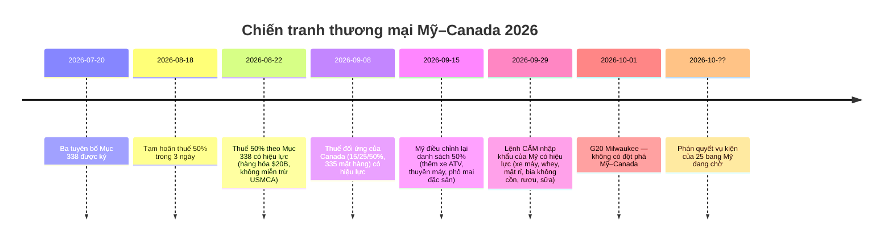
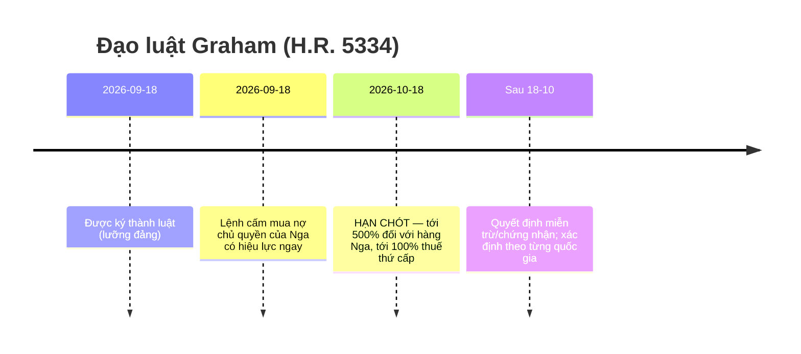
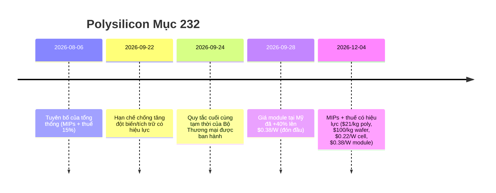

# Báo cáo Tình báo Thương mại Toàn cầu — Tuần 28 tháng 9 – 5 tháng 10, 2026

**Bản tin hàng tuần cấp độ phân tích.** Khung thời gian: 28 tháng 9 – 5 tháng 10, 2026. Được tổng hợp từ ~45 nguồn tin tức thương mại, chính sách, dữ liệu và vận tải trên toàn thế giới. Mọi tuyên bố đều có nguồn; các giá trị không thể xác minh được đánh dấu n/a.

---

## Mục lục

1. [Tóm tắt điều hành](#1-executive-summary)
2. [Cảnh báo](#2-alerts)
3. [Tin tức hàng đầu — phân tích chuyên sâu](#3-top-stories--deep-dives)
4. [Trình theo dõi thuế quan](#4-tariff-tracker)
5. [Phân tích chuyên sâu chính sách Hoa Kỳ](#5-us-policy-deep-dive)
6. [Chính sách thế giới theo khu vực](#6-world-policy-by-region)
7. [Hành động thực thi](#7-enforcement-actions)
8. [Các đợt công bố dữ liệu](#8-data-releases)
9. [Thị trường vận tải](#9-freight-market)
10. [Dòng thời gian chính sách](#10-policy-timelines)
11. [Hạn chót & sự kiện sắp tới (90 ngày tới)](#11-upcoming-deadlines--events-next-90-days)
[Điểm nhấn nội dung — các góc độ tiếp thị Dureach](#12-content-flags--dureach-marketing-angles)
12. [Nguồn & phương pháp luận](#12-sources--methodology)

---

## 1. Tóm tắt điều hành

Tuần định hình cho thương mại toàn cầu trong năm 2026 cho đến nay. Ba đợt leo thang cấu trúc đã diễn ra cùng lúc:

- **Chiến tranh thương mại Mỹ–Canada đã trở nên căng thẳng.** Sau thuế quan Mục 338 ở mức 50% đối với ~20 tỷ USD hàng hóa Canada (có hiệu lực từ 22 tháng 8, điều chỉnh phạm vi ngày 15 tháng 9), Washington đã chuyển sang **lệnh cấm nhập khẩu** hoàn toàn đối với xe máy, whey, mật rỉ, bia không cồn, đồ uống có cồn và sữa của Canada từ ngày 29 tháng 9 — hàng hóa đã đang trên đường vận chuyển sẽ chịu mức thuế 50% thay vào đó. Thuế quan trả đũa 15/25/50% của Canada đối với 335 mặt hàng thuế quan của Mỹ (có hiệu lực ngày 8 tháng 9) vẫn được duy trì. Hai mươi lăm bang của Mỹ đang kiện để bãi bỏ thuế quan; chưa có phán quyết. ([tariffcalculator2026.com](https://tariffcalculator2026.com/canada-50-percent-tariff-august-19-explainer), [surtaxscan.com](https://surtaxscan.com/news/canadas-counter-tariffs-are-back-15-25-and-50-on-335-us-tariff-items-from))
- **Đồng hồ Đạo luật Graham đang đếm ngược.** Được ký ngày 18 tháng 9, Đạo luật Trừng phạt Nga và Iran của Lindsey O. Graham yêu cầu áp thuế lên đến **500% đối với hàng hóa Nga và lên đến 100% thuế quan thứ cấp** đối với các nhà nhập khẩu năng lượng Nga hàng đầu (Trung Quốc, Ấn Độ, Thổ Nhĩ Kỳ chịu rủi ro cao nhất) trước **ngày 18 tháng 10**. Các mức thuế cộng dồn trên mọi thuế quan hiện có. ([lexblog.com](https://www.lexblog.com/2026/09/24/the-lindsey-graham-sanctions-act-what-businesses-need-to-know-about-the-new-tariffs/), [jdsupra.com](https://www.jdsupra.com/legalnews/new-sanctions-and-tariff-power-under-4624517/))
- **EU đã với tay tới "Mục 301" của riêng mình.** Ngày 5 tháng 10, Pháp và Đức cùng đề xuất một công cụ thương mại phản ứng nhanh của EU — không phân biệt quốc gia, có thể được kích hoạt bởi thiểu số các quốc gia thành viên, lên đến mức cắt đứt ngay lập tức khỏi thị trường chung — nhắm vào các méo mó thị trường mang tính hệ thống (hiểu là: Trung Quốc). Bắc Kinh đã đáp trả trong vài ngày: một cuộc điều tra chống bán phá giá đối với p-nitrotoluene của EU (ngày 3 tháng 10) và một cảnh báo cứng rắn từ MOFCOM. Các nhà lãnh đạo EU sẽ xem xét hồ sơ Trung Quốc tại hội nghị thượng đỉnh Brussels ngày 15 tháng 10. ([reuters.com](https://www.reuters.com/world/china/france-germany-propose-new-rapid-eu-trade-response-tool-2026-10-05/), [wsj.com](https://www.wsj.com/world/europe/germany-and-france-are-proposing-a-new-weapon-to-counter-flood-of-chinese-goods-f723dfdf))

Trong khi đó, hệ thống đa phương tiếp tục rạn nứt: các bộ trưởng thương mại G20 tại Milwaukee (30 tháng 9 – 2 tháng 10) chỉ đồng thuận được đúng một trong bốn nội dung nghị sự (cưỡng ép thương mại lương thực) và bế tắc về dư thừa công suất, lao động cưỡng bức và cải cách MFN. Mỹ và Trung Quốc đã công bố danh sách giảm thuế quan đối ứng "30-đổi-30" (mỗi bên 30 tỷ USD) — có ý nghĩa biểu tượng, nhưng về kinh tế là không đáng kể (HSBC: thuế quan bình quân gia quyền của Mỹ đối với Trung Quốc chỉ giảm từ 27,3% xuống 26,0%). C.H. Robinson công bố **thâu tóm RXO trị giá 5,8 tỷ USD**, thương vụ hợp nhất 3PL lớn nhất của chu kỳ. Và CBP đã ban hành hai Lệnh giữ hàng (WRO) mới về lao động cưỡng bức đối với dầu cọ Indonesia, nâng tổng số đang hoạt động lên 60 WRO + 8 Kết luận (Findings).

**Vận tải:** thị trường hai tốc độ. Giá container xuyên Thái Bình Dương giữ vững (Drewry WCI 4.434 USD/FEU, -1% so với tuần trước; Thượng Hải–New York 10.428 USD), trong khi tuyến Á–Âu giảm tuần thứ 12 liên tiếp do công suất kênh đào Suez quay trở lại. Hàng rời khô có tuần tệ nhất trong một tháng (BDI 3.148, -8,1% so với tuần trước) khi thu nhập tàu Capesize sụt giảm 12,8%.

---

## 2. Cảnh báo

| # | Cảnh báo | Hiệu lực | Tác động | Nguồn |
|---|-------|-----------|--------|--------|
| A1 | Lệnh cấm nhập khẩu của Mỹ đối với xe máy, whey, mật rỉ, bia không cồn, đồ uống có cồn, sữa của Canada | 29 tháng 9, 2026 | Hàng hóa mục tiêu bị từ chối nhập cảnh; hàng đang vận chuyển chịu thuế 50% thay vào đó | [asrwe.com](https://asrwe.com/asr-university/us-canada-import-ban-alcohol-motorcycles-section-338-expansion-september-2026) |
| A2 | Lệnh WRO của CBP đối với dầu cọ Indonesia (Mitra Aneka Rezeki, Hardaya Inti Plantation) | 29 tháng 9, 2026 | Giam giữ ngay lập tức tại mọi cảng Mỹ; hiện có 60 WRO đang hoạt động + 8 Kết luận | [thompsonhine.com](https://www.thompsonhine.com/insights/cbp-issues-withhold-release-orders-on-two-indonesian-palm-oil-producers/) |
| A3 | Thuế quan thứ cấp Đạo luật Graham (lên đến 100%) đối với các nhà mua năng lượng Nga hàng đầu | Hạn chót 18 tháng 10, 2026 | Trung Quốc, Ấn Độ, Thổ Nhĩ Kỳ chịu rủi ro cao nhất; cộng dồn trên các thuế hiện có | [lexblog.com](https://www.lexblog.com/2026/09/24/the-lindsey-graham-sanctions-act-what-businesses-need-to-know-about-the-new-tariffs/) |
| A4 | Mục 232 polysilicon: MIP + thuế 15% | 4 tháng 12, 2026 (quy tắc chống tích trữ đã có hiệu lực) | Poly 21 USD/kg, wafer 100 USD/kg, cell 0,22 USD/W, module 0,38 USD/W; giá module tại Mỹ đã +40% | [mondaq.com](https://www.mondaq.com/unitedstates/export-controls-trade-investment-sanctions/1848548/polysilicon-and-derivatives-in-the-bullseye-for-major-new-tariffs-and-other-restrictions) |
| A5 | Công cụ thương mại phản ứng nhanh "phản ứng hệ thống" của EU được đề xuất | Đề xuất ngày 5 tháng 10; hội nghị thượng đỉnh lãnh đạo EU ngày 15 tháng 10 | Quyền cắt đứt thị trường trong 24 giờ tiềm năng; rủi ro Trung Quốc trả đũa | [reuters.com](https://www.reuters.com/world/china/france-germany-propose-new-rapid-eu-trade-response-tool-2026-10-05/) |
| A6 | Trung Quốc điều tra chống bán phá giá p-nitrotoluene của EU | Mở ngày 3 tháng 10 (Thông báo số 44 của MOFCOM) | Phát súng trả đũa đầu tiên trong leo thang EU–Trung Quốc | [vespernews.com](https://www.vespernews.com/en/news/7dd758b7-b501-4c41-b2ee-13cb57ed832f) |

### A1 — Lệnh cấm nhập khẩu của Mỹ đối với hàng hóa Canada (chi tiết)

Các tuyên bố ngày 8 tháng 9 tạo ra cấu trúc hai đợt. Đợt một (15 tháng 9): danh sách sản phẩm Mục 338 ở mức 50% được điều chỉnh phạm vi — **bổ sung** ở mức 50%: phô mai đặc sản, chất béo và dầu biến tính, da bò và da bọc nội thất, da lông thô/đã thuộc, thuyền máy giải trí, giấy đặc sản, một số mặt hàng thép/nhôm, phụ kiện kim loại và vật tư hàn, xe golf, đồ nội thất và đèn, xe ATV, thêm sữa. **Loại bỏ**: muối mỏ, đường, xi măng, tủ đóng cắt điện, giấy vệ sinh, linh kiện cần câu, whisky/rượu mùi số lượng lớn. Đợt hai (29 tháng 9): **lệnh cấm nhập khẩu** — không phải thuế quan mà là từ chối nhập cảnh — đối với xe máy Canada (bao gồm BRP Can-Am Spyder/Canyon), whey, mật rỉ, bia không cồn, đồ uống có cồn và sữa. Hàng đã đang trên đường hoặc trong kho ngoại quan trước ngày 29 tháng 9 vẫn chịu thuế 50% thay vì lệnh cấm. ([tariffcalculator2026.com](https://tariffcalculator2026.com/canada-section-338-september-15-29-what-changes), [asrwe.com](https://asrwe.com/asr-university/us-canada-import-ban-alcohol-motorcycles-section-338-expansion-september-2026))

Quy tắc cộng dồn quan trọng: thuế Mục 338 ở mức 50% **không có miễn trừ USMCA** — chứng nhận CUSMA không có tác dụng gì đối với nó. Tuy nhiên, thuế Mục 301 về lao động cưỡng bức 10% riêng biệt đối với hàng hóa Canada *được* miễn khi có yêu cầu USMCA hợp lệ, vì vậy một hàng hóa thuộc diện không có USMCA có thể chịu **50% + 10% = 60%**. ([tarifflens.ai](https://www.tarifflens.ai/blog/section-338-canada-retaliation-september-2026-importers-guide))

### A2 — Lệnh WRO đối với dầu cọ Indonesia (chi tiết)

Lệnh ngày 29 tháng 9 của CBP nhắm vào dầu cọ và các sản phẩm phái sinh từ Mitra Aneka Rezeki (MAR) và Hardaya Inti Plantation (HIP). Bằng chứng được xem xét: phỏng vấn công nhân, phiếu lương, chỉ tiêu thu hoạch, ảnh chụp, báo cáo NGO/chính phủ, truyền thông, nghiên cứu học thuật. Công nhân tại MAR cho thấy **chín** chỉ số lao động cưỡng bức của ILO (bao gồm giữ giấy tờ tùy thân và cô lập); HIP cho thấy **bảy** chỉ số (nô lệ nợ, giữ lương, lừa dối, làm thêm giờ quá mức, đe dọa, điều kiện làm việc lạm dụng, lạm dụng tình trạng dễ bị tổn thương). Việc giam giữ có hiệu lực ngay tại mọi cảng Mỹ; nhà nhập khẩu có thể xuất khẩu trở lại, tiêu hủy, hoặc chứng minh nguồn cung sạch. ([thompsonhine.com](https://www.thompsonhine.com/insights/cbp-issues-withhold-release-orders-on-two-indonesian-palm-oil-producers/), [ghy.com](https://www.ghy.com/trade-compliance/2026-withhold-release-orders-wros/))

### A3 — Đạo luật Graham (chi tiết)

H.R. 5334, được ký ngày 18 tháng 9 với sự ủng hộ lưỡng đảng, đưa chế độ trừng phạt Nga lên cơ sở luật định và tạo ra hai lộ trình thuế quan bắt buộc, cả hai đều đến hạn vào **ngày 18 tháng 10**: lên đến **500%** đối với mọi hàng hóa có xuất xứ Nga, và lên đến **100% thuế quan thứ cấp** đối với các quốc gia từng thuộc top 5 nhà nhập khẩu dầu thô hoặc khí đốt Nga và có giao dịch mua mới trong vòng 30 ngày kể từ khi ban hành. Chịu rủi ro cao nhất: **Trung Quốc, Ấn Độ, Thổ Nhĩ Kỳ**; cũng ở mức cao: Slovakia, Hungary, UAE. Các thành viên EU được đánh giá riêng lẻ. Van thoát: ngoại lệ khí đốt tự nhiên (nhập khẩu <15% tổng xuất khẩu khí đốt của Nga + "các bước đáng kể" để giảm), miễn trừ vì lợi ích quốc gia. Mọi mức thuế đều **cộng dồn** trên các thuế Mục 301/232 hiện có. ([lexblog.com](https://www.lexblog.com/2026/09/24/the-lindsey-graham-sanctions-act-what-businesses-need-to-know-about-the-new-tariffs/), [jdsupra.com](https://www.jdsupra.com/legalnews/new-sanctions-and-tariff-power-under-4624517/), [tradepractitioner.com](https://www.tradepractitioner.com/2026/09/sanctions-by-statute-the-graham-act-and-tariffs-on-russias-energy-buyers/))

### A4 — Mục 232 polysilicon (chi tiết)

Tuyên bố ngày 6 tháng 8 + quy tắc tạm thời cuối cùng của Bộ Thương mại (24 tháng 9). Từ **ngày 4 tháng 12**: giá nhập khẩu tối thiểu **21 USD/kg** (polysilicon), **100 USD/kg** (thỏi/wafer), **0,22 USD/W** (cell), **0,38 USD/W** (module), cộng thuế **15% theo giá trị** đối với các sản phẩm phái sinh (poly thô được miễn 15%; Anh 10%; Nhật Bản/Hàn Quốc/Đài Loan/Thụy Sĩ/Liechtenstein/EU bị giới hạn tổng 15% cùng với MFN). Các hạn chế chống tích trữ/đầu cơ đã có hiệu lực từ 22 tháng 9–4 tháng 12. Thị trường đón đầu: giá chào module tại Mỹ đã ở mức sàn 0,38 USD/W, **+40,7% kể từ tháng 8** (0,27 USD/W), có lợi cho Hanwha Solutions và OCI. Ngành ước tính ~10 triệu USD chi phí thiết bị tăng thêm cho mỗi dự án 100 MW. ([mondaq.com](https://www.mondaq.com/unitedstates/export-controls-trade-investment-sanctions/1848548/polysilicon-and-derivatives-in-the-bullseye-for-major-new-tariffs-and-other-restrictions), [en.sedaily.com](https://en.sedaily.com/finance/2026/09/28/us-solar-module-prices-jump-40-percent-before-import-curbs), [logisticusgroup.com](https://logisticusgroup.com/new-solar-tariffs-land-december-4-heres-how-to-keep-your-project-on-budget-and-on-schedule/))

### A5 — Công cụ phản ứng nhanh của EU (chi tiết)

Macron và Merz đã viết thư cho von der Leyen ngày 5 tháng 10 đề xuất một công cụ **"phản ứng hệ thống"**: không phân biệt quốc gia, có thể được kích hoạt bởi **thiểu số các quốc gia thành viên** (phá vỡ chuẩn đa số đủ điều kiện), cho phép các biện pháp "quyết đoán" lên đến **cắt đứt ngay lập tức khỏi thị trường nội khối**. Được định hình là câu trả lời của EU cho Mục 301 của Mỹ và kiểm soát xuất khẩu khoáng sản trọng yếu của Trung Quốc; một quan chức Đức gọi đó là "vũ khí đòn đánh thứ hai." Một công cụ đa dạng hóa song song sẽ giới hạn mức phụ thuộc vào một quốc gia duy nhất đối với các mặt hàng nhập khẩu trọng yếu. Bối cảnh: thâm hụt hàng hóa của EU với Trung Quốc đạt **359,9 tỷ EUR năm 2025** và **103 tỷ EUR trong quý 2/2026** (cao nhất kể từ quý 3/2022); quan chức thực thi của Ủy ban viện dẫn làn sóng nhập khẩu ồ ạt vào máy móc, dệt may, kim loại, hóa chất — không chỉ xe điện. ([reuters.com](https://www.reuters.com/world/china/france-germany-propose-new-rapid-eu-trade-response-tool-2026-10-05/), [wsj.com](https://www.wsj.com/world/europe/germany-and-france-are-proposing-a-new-weapon-to-counter-flood-of-chinese-goods-f723dfdf), [brusselsmorning.com](https://brusselsmorning.com/eu-china-trade-tensions/104764/))

### A6 — Trung Quốc trả đũa trước (chi tiết)

Ngày 3 tháng 10, MOFCOM (Thông báo số 44) đã mở **cuộc điều tra chống bán phá giá đối với p-nitrotoluene từ EU** — vài ngày trước các cuộc đàm phán thương mại Bắc Kinh và trùng thời điểm với đề xuất Pháp–Đức. MOFCOM riêng rẽ cảnh báo sẽ trả đũa "cứng rắn" đối với bất kỳ công cụ phản ứng nhanh nào của EU. ([vespernews.com](https://www.vespernews.com/en/news/7dd758b7-b501-4c41-b2ee-13cb57ed832f))

---

## 3. Tin tức hàng đầu — phân tích chuyên sâu

### 3.1 Bộ trưởng thương mại G20 rạn nứt tại Milwaukee (30 tháng 9 – 2 tháng 10)

**Diễn biến.** Dưới sự chủ trì của USTR Jamieson Greer, các bộ trưởng thương mại G20 đã họp tại Milwaukee trong nhiệm kỳ chủ tịch G20 của Mỹ. Trong bốn nội dung nghị sự, chỉ **một** đạt được đồng thuận: tuyên bố chung lên án việc vũ khí hóa thương mại lương thực thông qua các hành động cưỡng ép. Ba nội dung thất bại: (1) **dư thừa công suất** — dự thảo được đa số thành viên ủng hộ đã bị thiểu số do Trung Quốc dẫn đầu chặn lại vì phản đối ngôn từ về trợ cấp; Greer cho biết phía chủ tịch "vô cùng thất vọng"; (2) **lao động cưỡng bức** — không có văn bản chung, vì vậy Mỹ, Mexico và Argentina đã ra tuyên bố riêng; (3) **cải cách MFN** — Mỹ mở cuộc tranh luận về việc liệu đối xử tối huệ quốc vô điều kiện có "thất bại trong việc thúc đẩy có đi có lại" và "tạo ra những kẻ ăn theo" hay không, nhưng không tìm kiếm tuyên bố chung. ([barchart.com](https://www.barchart.com/story/news/4917577/g20-trade-talks-yield-little-progress-while-tensions-simmer) (AP), [reuters.com](https://www.reuters.com/world/china/g20-trade-chiefs-denounce-food-trade-coercion-not-excess-factory-capacity-2026-10-01/), [nationpress.com](https://www.nationpress.com/all/g20-milwaukee-talks-eye-more-diesel-globally))

**Các con số & chi tiết chính.**
- Mỹ đã mở các cuộc điều tra dư thừa công suất đối với các quốc gia "từ Na Uy đến Bangladesh"; ngoài thép Trung Quốc, Washington viện dẫn ô tô, pin, giấy và chất bán dẫn. ([barchart.com](https://www.barchart.com/story/news/4917577/g20-trade-talks-yield-little-progress-while-tensions-simmer))
- Ấn Độ đã sửa đổi Chính sách Ngoại thương vào **tháng 7/2026** để cấm nhập khẩu hàng hóa được sản xuất toàn bộ hoặc một phần bằng lao động cưỡng bức — Goyal đã nêu vấn đề tại Milwaukee; Ấn Độ theo đuổi chiến lược hai hướng (bảo vệ lập trường trong phiên toàn thể, thúc đẩy song phương bên lề). ([beatsinbrief.com](https://beatsinbrief.com/2026/10/03/milwaukee-g20-trade-ministers-piyush-goyal-india-positions/))
- Một kết quả bên lề: các cuộc thảo luận do Mỹ làm trung gian dự kiến sẽ đưa **thêm dầu diesel vào thị trường toàn cầu** (các bên, khối lượng và thời gian biểu không được tiết lộ). ([nationpress.com](https://www.nationpress.com/all/g20-milwaukee-talks-eye-more-diesel-globally))
- Không có đột phá về tranh chấp Mỹ–Canada; Trump đã cấm ~1 tỷ USD hàng nhập khẩu Canada (đồ uống có cồn, sữa, xe máy) trong tuần. ([businessmirror.com.ph](https://businessmirror.com.ph/2026/10/02/g20-trade-talks-yield-little-progress-while-tensions-simmer/))

**Vì sao quan trọng.** Việc không ra được văn kiện kết quả cho thấy quản trị thương mại đa phương không còn khả năng kiềm chế làn sóng thuế quan hiện tại — hành động đã chuyển vĩnh viễn sang các kênh đơn phương và song phương. Hãy theo dõi hội nghị thượng đỉnh lãnh đạo G20 tại **Miami** để xem liệu các vết rạn ở Milwaukee có nổi lên ở cấp nguyên thủ hay không. ([nationpress.com](https://www.nationpress.com/international/g20-trade-talks-end-without-deal-goyal))

### 3.2 "30-đổi-30" Mỹ–Trung: danh sách đã công bố, kinh tế không đáng kể

**Diễn biến.** Sau hội nghị thượng đỉnh Trump–Tập tại Washington ngày 23–25 tháng 9, cả hai chính phủ đã công bố danh sách giảm thuế quan đối ứng vào ngày 28 tháng 9 theo khuôn khổ "30-đổi-30" của Hội đồng Thương mại Mỹ–Trung mới: mỗi bên có thể dỡ thuế ~30 tỷ USD hàng hóa của bên kia. ([cnn.com](https://www.cnn.com/2026/09/28/business/us-china-tariff-cuts-60-billion-intl?cid=external-feeds_iluminar_meta), [kpmg.com](https://kpmg.com/us/en/taxnewsflash/news/2026/09/us-china-trade-framework-tariff-reductions.html))

**Các con số chính.**
| | Danh sách của Mỹ (hàng Trung Quốc) | Danh sách của Trung Quốc (hàng Mỹ) |
|---|---|---|
| Dòng HTS | 77 | 1.619 |
| Giá trị | ~30 tỷ USD | ~30 tỷ USD |
| Đặc điểm | Hàng tiêu dùng: đồ chơi, pháo hoa, đồ dùng bàn ăn, chăn, lò vi sóng, đèn cây thông Noel, ghế cao trẻ em, ghế ô tô trẻ em, máy cạo râu điện | Nông nghiệp: ngô, lúa mì, lúa miến, thịt, sữa, dầu, cá, hải sản, gỗ; cộng mỹ phẩm, thiết bị y tế |
| Loại trừ đáng chú ý | Đồ chơi kết nối Wi-Fi/Bluetooth (loại trừ an ninh dữ liệu); **mọi mặt hàng may mặc** | **Đậu nành nguyên hạt** — mặt hàng nông sản xuất khẩu lớn nhất của Mỹ sang Trung Quốc |
| Tỷ trọng dòng song phương | ~7% nhập khẩu của Mỹ từ Trung Quốc (giá trị 2024) | ~18% nhập khẩu của Trung Quốc từ Mỹ |

**Kinh tế.** HSBC (29 tháng 9): thuế quan bình quân gia quyền của Mỹ đối với hàng Trung Quốc chỉ giảm từ **27,3% xuống 26,0%**. Hơn 90% hàng hóa trong danh sách quay lại thuế MFN ("thông thường"). Các điều chỉnh theo điều khoản tham chiếu diễn ra **tối đa một lần mỗi năm**. ([exencialrp.substack.com](https://exencialrp.substack.com/p/hsbc-sees-us-china-30-for-30-deal) (HSBC qua Substack), [lexblog.com](https://www.lexblog.com/2026/09/29/u-s-china-board-of-trade-30-for-30-identifies-products-recommended-for-reduced-tariffs/))

**Các thỏa thuận bên lề.** Trung Quốc sẽ nhập khẩu **≥10 triệu tấn than của Mỹ trong năm 2027 và 2028**; một nhóm công tác tiếp cận thị trường nông nghiệp đã được thành lập; mức xuất khẩu đất hiếm sẽ được "đưa trở lại mức phù hợp" (Trung Quốc chỉ đáp ứng ~2/3 cam kết cung ứng trước đây; thâm hụt hàng hóa Mỹ–Trung giảm 40% kể từ tháng 1/2025 xuống còn 140 tỷ USD). Chưa có đợt cắt giảm thuế nào có hiệu lực — USTR vẫn phải công bố mức thuế và thời gian. ([cnn.com](https://www.cnn.com/2026/09/28/business/us-china-tariff-cuts-60-billion-intl?cid=external-feeds_iluminar_meta), [kpmg.com](https://kpmg.com/us/en/taxnewsflash/news/2026/09/us-china-trade-framework-tariff-reductions.html), [tradersunion.com](https://tradersunion.com/news/financial-news/show/3528484-us-china-lower-tariff-framework/))

**Vì sao quan trọng.** Ý nghĩa thực sự của khuôn khổ là về thể chế — một Hội đồng Thương mại thường trực với quy trình làm việc — chứ không phải phép tính thuế quan. Đối với tìm nguồn cung ứng: việc loại trừ may mặc giữ nguyên động lực đa dạng hóa từ Trung Quốc sang Việt Nam/Bangladesh/Ấn Độ; hàng dệt gia dụng (chăn, ga trải giường/bàn, rèm) có thể đối mặt với cạnh tranh gay gắt hơn từ Trung Quốc nếu biện pháp giảm thuế được thực thi. ([textalks.com](https://textalks.com/us-china-tariff-excludes-apparel-but-opens-door-to-chinese-home-textiles/))

### 3.3 C.H. Robinson thâu tóm RXO — 5,8 tỷ USD

**Diễn biến.** Ngày 5 tháng 10, C.H. Robinson (Nasdaq: CHRW) đã đồng ý thâu tóm RXO (NYSE: RXO) trong thương vụ tiền mặt + cổ phiếu: **17,25 USD tiền mặt + 0,0856 cổ phiếu CHRW cho mỗi cổ phiếu RXO = 30,25 USD/cổ phiếu, cao hơn 29%** so với giá đóng cửa ngày 2 tháng 10 — giá trị ngụ ý **5,8 tỷ USD**, giá trị doanh nghiệp hợp nhất **>25 tỷ USD**. Cả hai hội đồng quản trị nhất trí; MFN Partners (17% RXO) và Orbis (cổ đông lớn nhất) ủng hộ; dự kiến hoàn tất **nửa đầu 2027** chờ phê duyệt quản lý và biểu quyết cổ đông RXO. ([rxo.com](https://rxo.com/news/c-h-robinson-to-acquire-rxo-redefining-the-future-of-third-party-logistics-while-unlocking-significant-shareholder-value/), [reuters.com](https://www.reuters.com/business/ch-robinson-buy-freight-broker-rxo-58-billion-2026-10-05/))

**Các con số chính.**
- Cổ đông RXO sẽ sở hữu ~11% công ty hợp nhất; RXO sáp nhập vào bộ phận Vận tải Đường bộ Bắc Mỹ của CHRW (>2/3 doanh thu).
- **300 triệu USD hiệp đồng chi phí ròng hàng năm trong 2 năm** thông qua mô hình vận hành "Lean AI" của CHRW (dịch vụ dùng chung, hợp nhất nhà cung cấp, bất động sản, bảo hiểm).
- Phản ứng thị trường: RXO **+~20%** (28,10–28,49 USD), CHRW **-12%** trước giờ mở cửa (150 USD so với 157,72 USD giá đóng cửa) — mức chiết khấu kinh điển của bên mua; Reuters Breakingviews gọi lợi nhuận là "tạm được."
- Cố vấn: Morgan Stanley (CHRW), Goldman Sachs (RXO).
- RXO đã tăng 16,2% trong hai phiên trước công bố với khối lượng 3,67 triệu cổ phiếu (so với ~1,9 triệu bình thường) — đà tăng rõ rệt trước công bố. ([freightwaves.com](https://www.freightwaves.com/news/breaking-c-h-robinson-acquiring-rxo), [financial-news.co.uk](https://www.financial-news.co.uk/c-h-robinson-to-buy-rxo-in-5-8bn-cash-and-stock-deal/), [inboundlogistics.com](https://www.inboundlogistics.com/articles/c-h-robinson-to-acquire-rxo-in-5-8-billion-deal/))

**Vì sao quan trọng.** Hợp nhất môi giới vận tải tăng tốc trong giai đoạn giá cước mềm: các hãng lớn mua mật độ và công nghệ thay vì tự xây. Nhà môi giới hợp nhất sẽ có sức mạnh định giá vượt trội trong vận tải đường bộ Bắc Mỹ — các chủ hàng nên chuẩn bị cho các cuộc đàm phán hợp đồng khó khăn hơn; các nhà môi giới nhỏ đối mặt với sức ép sinh tồn. Câu chuyện hiệp đồng "Lean AI" cũng là một tín hiệu: các mô hình môi giới nặng nhân sự đang bị tự động hóa thay thế. (Newsquawk qua [financial-news.co.uk](https://www.financial-news.co.uk/c-h-robinson-to-buy-rxo-in-5-8bn-cash-and-stock-deal/))

### 3.4 Ấn Độ–Mỹ: "những nét vẽ cuối" nhưng chưa có thỏa thuận

**Diễn biến.** Bên lề G20 (1–2 tháng 10), USTR Greer đã gặp Bộ trưởng Thương mại Piyush Goyal và tuyên bố các cuộc đàm phán đang ở "những nét vẽ cuối" — nhưng "tôi không nghĩ có điều gì sắp xảy ra." Một cuộc điện đàm Trump–Modi đã diễn ra trước cuộc gặp; một cuộc điện đàm lãnh đạo khác dự kiến "rất sớm." ([thehindubusinessline.com](https://www.thehindubusinessline.com/news/nothing-imminent-us-trade-representative-greer-on-india-trade-deal-modi-trump-to-talk-soon/article71536059.ece/amp/), [nationpress.com](https://www.nationpress.com/international/india-us-trade-deal-in-short-strokes-greer))

**Các con số & điểm nghẽn chính.**
- Hàng hóa Ấn Độ chịu thêm **thuế Mục 301 về lao động cưỡng bức 10% kể từ 24 tháng 7** (60 nền kinh tế thuộc diện); cuộc điều tra 301 thứ hai về dư thừa công suất cấu trúc (16 nền kinh tế, gồm Ấn Độ) đang chờ xử lý và có thể đánh vào thép.
- Các điểm nghẽn: tiếp cận nông nghiệp, thương mại số, việc Ấn Độ mua dầu Nga — nay càng gay gắt hơn bởi thuế quan thứ cấp lên đến 100% của Đạo luật Graham.
- Bất chấp thuế, xuất khẩu hàng hóa của Ấn Độ sang Mỹ tăng **21,83% so với cùng kỳ năm ngoái trong tháng 8**; rupee gần **96,3/USD**; mục tiêu thương mại song phương 500 tỷ USD vào 2030.
- Bộ trưởng Tài chính Sitharaman (4 tháng 10): các cuộc đàm phán đã "đạt đến điểm bão hòa" — khó có thêm nhượng bộ. ([thefinancialeconomy.com](https://www.thefinancialeconomy.com/india-us-trade-talks/), [jagranjosh.com](https://www.jagranjosh.com/general-knowledge/indiaus-trade-deal-not-imminent-why-is-it-being-delayed-who-has-the-advantage-what-are-indias-options-1820012731-1), [english.dainikjagranmpcg.com](https://english.dainikjagranmpcg.com/top-stories/india-us-trade-talks-reach-plateau-nirmala-sitharaman/article-36152))

**Vì sao quan trọng.** Ấn Độ là biến số then chốt trong cả câu chuyện tìm nguồn cung ứng China+1 và bản đồ thuế quan thứ cấp của Đạo luật Graham. Một thỏa thuận sẽ mở một trong số ít van giảm thuế quan dành cho các nhà nhập khẩu Mỹ trong năm nay; thất bại khiến các nhà xuất khẩu Ấn Độ — và người mua Mỹ của họ — tiếp tục bấp bênh vào mùa cao điểm.

### 3.5 Drone: thuế tăng, kiểm soát xuất khẩu giảm

**Diễn biến.** Hai hành động drone ngược chiều của Mỹ, cả hai đều bắt nguồn từ sự kiện kép ngày 13 tháng 8: (1) tuyên bố Mục 232 (Tuyên bố 11055) áp thuế **100%** đối với drone >25kg hoặc có camera nhiệt (cộng trạm sạc và linh kiện trọng yếu, Phụ lục I) và **25%** đối với drone nhỏ không có camera nhiệt (Phụ lục II), có hiệu lực ngày 3 tháng 9; linh kiện (Phụ lục III) ở mức 25% từ **ngày 9 tháng 2, 2027**. Mức đồng minh: Anh 10%, Nhật Bản/Hàn Quốc/Đài Loan/Thụy Sĩ/Liechtenstein/EU giới hạn tổng 15%. (2) Quy tắc cuối cùng của BIS **nới lỏng kiểm soát xuất khẩu**: UAV có thời gian bay dưới 3 giờ giảm xuống chỉ kiểm soát AT theo ECCN 9A012, với ngoại lệ giấy phép STA cho Nhóm quốc gia A:5 — dù người dùng quân sự tại Trung Quốc/Nga/Belarus/Venezuela vẫn bị hạn chế. ([whitehouse.gov](https://www.whitehouse.gov/presidential-actions/2026/08/adjusting-imports-of-unmanned-aircraft-systems-and-unmanned-aircraft-systems-components-into-the-united-states/), [jdsupra.com](https://www.jdsupra.com/legalnews/two-us-drone-actions-reshape-export-8075367/) (Wiley), [tbgfs.com](https://tbgfs.com/csms-69738151-guidance-section-232-duties-on-imports-of-unmanned-aircraft-systems-and-unmanned-aircraft-systems-components/))

**Vì sao quan trọng.** Mỹ đồng thời dựng tường thành quanh thị trường drone nội địa và trang bị cho các nhà xuất khẩu của mình — một chính sách công nghiệp "pháo đài + tiến công" điển hình. Người mua drone thương mại đối mặt với thị trường phân đôi: sản phẩm chuỗi cung ứng đồng minh ở mức 10–15%, hàng xuất xứ Trung Quốc ở mức 25–100%.

### 3.6 Thâm hụt hàng hóa của Mỹ chạm 132,6 tỷ USD trong tháng 8

**Diễn biến.** Thâm hụt hàng hóa sơ bộ tháng 8 nới rộng **11,5%** lên **132,6 tỷ USD**: nhập khẩu **336,1 tỷ USD (+5,5%)** nhờ vật tư công nghiệp và hàng hóa vốn phục vụ xây dựng AI; xuất khẩu **203,4 tỷ USD (+1,9%)**. Thương mại hiện là lực cản GDP **quý thứ ba liên tiếp** — thời điểm khó xử đối với một chính quyền đang quảng bá thuế quan như liều thuốc cho thâm hụt. ([reuters.com](https://www.reuters.com/business/us-goods-trade-deficit-widens-sharply-august-2026-09-30/))

### 3.7 De minimis vẫn chết; tiền hoàn IEEPA chảy về

**Diễn biến.** Tòa án Thương mại Quốc tế (13 tháng 8, vụ Detroit Axle) đã giữ nguyên việc bãi bỏ miễn trừ de minimis 800 USD dựa trên IEEPA — phán quyết rằng việc xóa một "đặc quyền" không phải là áp thuế, vì vậy nó vẫn đứng vững sau phán quyết tháng 2 của Tòa án Tối cao bác bỏ thuế quan IEEPA. De minimis toàn cầu kết thúc ngày 29 tháng 8, 2025; Quốc hội tự đóng cửa nó có hiệu lực tháng 7/2027. Riêng rẽ, hệ thống CAPE của CBP (hoạt động từ 20 tháng 4) đang xử lý **~165 tỷ USD thuế IEEPA** đã thu, với lãi phát sinh ~650 triệu USD/tháng; **CAPE Giai đoạn 3 triển khai ngày 6 tháng 10** để xử lý tiền hoàn cho các tờ khai được thanh khoản lại. ([reuters.com](https://www.reuters.com/legal/government/us-court-backs-trumps-power-close-de-minimis-tariff-exemption-2026-08-13/), [openclassactions.com](https://openclassactions.com/tariff-class-actions.php))

---

## 4. Trình theo dõi thuế quan

Đường cơ sở + các thay đổi trong tuần. Các mức thuế là thuế *bổ sung* trừ khi có ghi chú khác; quy tắc cộng dồn khác nhau theo từng biện pháp — kiểm tra mã HTS, xuất xứ và ngày nhập cảnh cho từng lô hàng.

| Mục tiêu | Biện pháp | Mức thuế | Hiệu lực | Trạng thái | Nguồn |
|---|---|---|---|---|---|
| Canada (hàng thuộc diện) | Mục 338 (3 tuyên bố, 20 tháng 7) | 50% | 22 tháng 8, 2026 | Có hiệu lực; **không miễn trừ USMCA**; điều chỉnh phạm vi ngày 15 tháng 9 | [tariffcalculator2026.com](https://tariffcalculator2026.com/canada-50-percent-tariff-august-19-explainer) |
| Canada (xe máy, whey, mật rỉ, bia NA, đồ uống có cồn, sữa) | Lệnh cấm nhập khẩu Mục 338 | Cấm (từ chối nhập cảnh) | 29 tháng 9, 2026 | Có hiệu lực | [asrwe.com](https://asrwe.com/asr-university/us-canada-import-ban-alcohol-motorcycles-section-338-expansion-september-2026) |
| Canada (chung) | Mục 301 lao động cưỡng bức | 10% | 24 tháng 7, 2026 (60 nền kinh tế) | Có hiệu lực; yêu cầu USMCA được miễn | [tarifflens.ai](https://www.tarifflens.ai/blog/section-338-canada-retaliation-september-2026-importers-guide) |
| Hàng Mỹ → Canada | Sắc lệnh thuế bổ sung Canada 2026 | 15% / 25% / 50% (335 mặt hàng) | 8 tháng 9, 2026 | Có hiệu lực; tương xứng mức thuế 338 của Mỹ | [surtaxscan.com](https://surtaxscan.com/news/canadas-counter-tariffs-are-back-15-25-and-50-on-335-us-tariff-items-from) |
| Nga (mọi hàng hóa) | Đạo luật Graham (H.R. 5334) | Lên đến 500% | Trước 18 tháng 10, 2026 | Đã ký 18 tháng 9; đang chờ thực thi | [lexblog.com](https://www.lexblog.com/2026/09/24/the-lindsey-graham-sanctions-act-what-businesses-need-to-know-about-the-new-tariffs/) |
| Các nhà mua năng lượng Nga hàng đầu (Trung Quốc, Ấn Độ, Thổ Nhĩ Kỳ…) | Thuế quan thứ cấp Đạo luật Graham | Lên đến 100% | Trước 18 tháng 10, 2026 | Đang chờ; cộng dồn trên thuế hiện có | [jdsupra.com](https://www.jdsupra.com/legalnews/new-sanctions-and-tariff-power-under-4624517/) |
| Trung Quốc (chuỗi polysilicon) | Mục 232 MIP + thuế | MIP 21 USD/kg–0,38 USD/W + 15% | 4 tháng 12, 2026 | Đã tuyên bố 6 tháng 8; quy tắc chống tích trữ có hiệu lực | [mondaq.com](https://www.mondaq.com/unitedstates/export-controls-trade-investment-sanctions/1848548/polysilicon-and-derivatives-in-the-bullseye-for-major-new-tariffs-and-other-restrictions) |
| Drone (chung) | Mục 232 (Tuyên bố 11055) | 100% (>25kg/camera nhiệt); 25% (loại nhỏ) | 3 tháng 9, 2026 | Có hiệu lực | [whitehouse.gov](https://www.whitehouse.gov/presidential-actions/2026/08/adjusting-imports-of-unmanned-aircraft-systems-and-unmanned-aircraft-systems-components-into-the-united-states/) |
| Drone (Anh / JP/KR/TW/CH/EU) | Mức đồng minh Mục 232 | Anh 10%; các nước khác giới hạn 15% | 3 tháng 9, 2026 | Có hiệu lực (cần chứng nhận) | [tbgfs.com](https://tbgfs.com/csms-69738151-guidance-section-232-duties-on-imports-of-unmanned-aircraft-systems-and-unmanned-aircraft-systems-components/) |
| Linh kiện drone (Phụ lục III) | Mục 232 | 25% | 9 tháng 2, 2027 | Đã công bố | [jdsupra.com](https://www.jdsupra.com/legalnews/trump-administration-imposes-section-5315313/) |
| Trung Quốc (danh sách 30-đổi-30, 77 dòng HTS) | Giảm thuế đối ứng (đang chờ) | Quay về gần MFN | n/a — đang chờ USTR công bố | Danh sách công bố 28 tháng 9; chưa có đợt cắt giảm nào có hiệu lực | [kpmg.com](https://kpmg.com/us/en/taxnewsflash/news/2026/09/us-china-trade-framework-tariff-reductions.html) |
| Dược phẩm (có bằng sáng chế) | Mục 232 | Theo HTSUS 9903.04.60–70 | Hướng dẫn cập nhật 28 tháng 9 | Đã ban hành hướng dẫn khai báo CBP | [ghy.com](https://www.ghy.com/trade-compliance/category/international-trade-issues/) |
| Ấn Độ (chung) | Mục 301 lao động cưỡng bức | 10% | 24 tháng 7, 2026 | Có hiệu lực | [thefinancialeconomy.com](https://www.thefinancialeconomy.com/india-us-trade-talks/) |
| 16 nền kinh tế gồm Ấn Độ | Điều tra Mục 301 dư thừa công suất | n/a | Đang điều tra | USTR hứa hành động "trong vài tuần" | [thefinancialeconomy.com](https://www.thefinancialeconomy.com/india-us-trade-talks/) |
| 178 trường hợp loại trừ sản phẩm | Loại trừ Mục 301 | Được loại trừ | Đến 9 tháng 11, 2026 | Sắp hết hạn |  |
| EU (đề xuất) | Công cụ "phản ứng hệ thống" | Lên đến cắt đứt thị trường | Đề xuất 5 tháng 10; hội nghị 15 tháng 10 | Chưa thành luật | [reuters.com](https://www.reuters.com/world/china/france-germany-propose-new-rapid-eu-trade-response-tool-2026-10-05/) |

---

## 5. Phân tích chuyên sâu chính sách Hoa Kỳ

### Các hành động của Mỹ trong tuần

| Ngày | Cơ quan | Hành động | Ý nghĩa | Nguồn |
|---|---|---|---|---|
| 28 tháng 9 | CBP | Cập nhật hướng dẫn khai báo cho thuế Mục 232 dược phẩm (HTSUS 9903.04.60–70); 9903.04.61 hết hiệu lực sau 29 tháng 9 | Rõ ràng về quy tắc khai báo cho nhà nhập khẩu dược phẩm | [ghy.com](https://www.ghy.com/trade-compliance/category/international-trade-issues/) |
| 29 tháng 9 | CBP | Bản tin TRQ năm tài khóa 2027: hàng may mặc AGOA, đường mía thô | Lập kế hoạch năm hạn ngạch | [ghy.com](https://www.ghy.com/trade-compliance/category/international-trade-issues/) |
| 29 tháng 9 | CBP | Hai lệnh WRO lao động cưỡng bức (dầu cọ Indonesia) | Hiện có 60 WRO + 8 Kết luận đang hoạt động | [kpmg.com](https://kpmg.com/us/en/taxnewsflash/news/2026/09/us-cbp-wros-indonesian-palm-oil.html) |
| 29 tháng 9 | Nhà Trắng | Lệnh cấm nhập khẩu Canada có hiệu lực | Lệnh cấm nhập khẩu *đầu tiên* (không phải thuế quan) của chiến tranh thương mại | [asrwe.com](https://asrwe.com/asr-university/us-canada-import-ban-alcohol-motorcycles-section-338-expansion-september-2026) |
| 30 tháng 9 | USTR | Tuyên bố Diễn đàn Toàn cầu về Dư thừa Công suất Thép | Vỏ bọc đa phương cho các hành động thép |  |
| 1–2 tháng 10 | USTR (Greer) | G20 Milwaukee: chỉ đồng thuận về cưỡng ép lương thực; mở tranh luận cải cách MFN | Kênh đa phương đình trệ; kênh đơn phương được khẳng định | [reuters.com](https://www.reuters.com/world/china/g20-trade-chiefs-denounce-food-trade-coercion-not-excess-factory-capacity-2026-10-01/) |
| 2 tháng 10 | USTR | Biện pháp khắc phục RRM lần thứ 14 — lốp xe Corporación de Occidente (Mexico) | Thực thi lao động USMCA tiếp tục |  |
| 2 tháng 10 | USTR | Đánh giá chung USMCA 2027: nhận ý kiến công chúng đến **12 tháng 1, 2027** | Đồng hồ năm đánh giá bắt đầu |  |
| 5 tháng 10 | Nhà Trắng/Quốc hội | Đếm ngược thực thi Đạo luật Graham (còn 13 ngày) | Thuế quan thứ cấp lên đến 100% đang chờ | [lexblog.com](https://www.lexblog.com/2026/09/24/the-lindsey-graham-sanctions-act-what-businesses-need-to-know-about-the-new-tariffs/) |

**Phân tích.** Chính quyền đang vận hành ba đồng hồ cùng lúc: (1) đồng hồ *trừng phạt* — lệnh cấm Canada, thuế thứ cấp Đạo luật Graham, MIP polysilicon — tất cả được thiết kế để tối đa hóa đòn bẩy trước cuối năm; (2) đồng hồ *thể chế* — chuẩn bị đánh giá USMCA 2027, thủ tục Hội đồng Thương mại, tranh luận cải cách MFN — xây dựng bộ máy lâu dài; (3) đồng hồ *pháp lý* — chiến thắng de minimis của CIT so với thất bại thuế quan IEEPA tại Tòa án Tối cao, với 165 tỷ USD tiền hoàn thuế IEEPA nay chảy qua CAPE. Mô hình: ở những nơi tòa án siết chặt (thuế quan IEEPA), chính quyền đi đường vòng qua 232/338/301 và luật định (Đạo luật Graham). Các nhà nhập khẩu nên chuẩn bị cho *nhiều* biện pháp hơn theo các thẩm quyền *cũ* hơn, chứ không phải ít đi.

## 6. Chính sách thế giới theo khu vực

### Châu Âu

| Diễn biến | Chi tiết | Nguồn |
|---|---|---|
| Công cụ phản ứng nhanh Pháp–Đức được đề xuất | Công cụ "phản ứng hệ thống"; ngưỡng kích hoạt thiểu số; lên đến cắt đứt thị trường ngay lập tức; công cụ đa dạng hóa song hành | [reuters.com](https://www.reuters.com/world/china/france-germany-propose-new-rapid-eu-trade-response-tool-2026-10-05/) |
| Thâm hụt EU–Trung Quốc | 359,9 tỷ EUR năm 2025; 103 tỷ EUR trong quý 2/2026 (cao nhất kể từ quý 3/2022); làn sóng nhập khẩu vào máy móc, dệt may, kim loại, hóa chất | [brusselsmorning.com](https://brusselsmorning.com/eu-china-trade-tensions/104764/) |
| Hội nghị thượng đỉnh lãnh đạo EU 15 tháng 10 | Hội nghị Brussels xem xét mất cân bằng Trung Quốc — phép thử đầu tiên của đề xuất Pháp–Đức | [reuters.com](https://www.reuters.com/world/china/france-germany-propose-new-rapid-eu-trade-response-tool-2026-10-05/) |
| EU cân nhắc cắt giảm thuế công nghiệp | Có thể cắt giảm để tránh Trung Quốc trả đũa thép (theo báo cáo của Capitol Forum) |  |

### Canada

| Diễn biến | Chi tiết | Nguồn |
|---|---|---|
| Thuế quan trả đũa có hiệu lực | 15%/25%/50% đối với 335 mặt hàng Mỹ từ 8 tháng 9; phạm vi 28 tỷ CAD; hàng đang vận chuyển được loại trừ | [surtaxscan.com](https://surtaxscan.com/news/canadas-counter-tariffs-are-back-15-25-and-50-on-335-us-tariff-items-from) |
| Gói hỗ trợ 7,5 tỷ CAD | Viện trợ trong nước cho các ngành bị ảnh hưởng |  |
| Đẩy mạnh đa dạng hóa | Chính phủ Carney xoay trục sang các thỏa thuận với châu Âu/Ấn Độ |  |
| 25 bang Mỹ kiện | Thách thức chế độ thuế quan; chưa có phán quyết |  |

### Trung Quốc (MOFCOM)

| Diễn biến | Chi tiết | Nguồn |
|---|---|---|
| Điều tra chống bán phá giá: p-nitrotoluene EU | Mở ngày 3 tháng 10 (Thông báo số 44) — tín hiệu trả đũa | [vespernews.com](https://www.vespernews.com/en/news/7dd758b7-b501-4c41-b2ee-13cb57ed832f) |
| Cảnh báo cứng rắn về công cụ EU | Đe dọa trả đũa "cứng rắn" đối với bất kỳ công cụ phản ứng nhanh nào của EU | [reuters.com](https://www.reuters.com/world/china/france-germany-propose-new-rapid-eu-trade-response-tool-2026-10-05/) |
| Báo cáo 30-đổi-30 | Công bố danh sách 1.619 dòng; cam kết than (10 triệu tấn/năm 2027–28); xuất khẩu đất hiếm về mức bình thường | [kpmg.com](https://kpmg.com/us/en/taxnewsflash/news/2026/09/us-china-trade-framework-tariff-reductions.html) |
| Báo cáo vòng tham vấn thứ 8 | Kênh song phương vẫn hoạt động |  |

### Các nơi khác trên thế giới

| Quốc gia/khu vực | Diễn biến | Nguồn |
|---|---|---|
| Ấn Độ | Lệnh cấm nhập khẩu lao động cưỡng bức (sửa đổi FTP tháng 7) được nêu tại G20; xuất khẩu sang Mỹ +21,83% so với cùng kỳ năm ngoái trong tháng 8 bất chấp thuế 10% | [beatsinbrief.com](https://beatsinbrief.com/2026/10/03/milwaukee-g20-trade-ministers-piyush-goyal-india-positions/), [thefinancialeconomy.com](https://www.thefinancialeconomy.com/india-us-trade-talks/) |
| Anh | Không phát hiện động thái chính sách thương mại lớn nào trong tuần |  |
| Mexico/Argentina | Tham gia tuyên bố lao động cưỡng bức của Mỹ tại G20 (tách khỏi văn bản chung thất bại) | [nationpress.com](https://www.nationpress.com/all/g20-milwaukee-talks-eye-more-diesel-globally) |

## 7. Hành động thực thi

| Hành động | Chi tiết | Nguồn |
|---|---|---|
| 2 WRO mới (29 tháng 9) | Dầu cọ Indonesia — MAR (9 chỉ số ILO), HIP (7 chỉ số); giam giữ ngay lập tức | [thompsonhine.com](https://www.thompsonhine.com/insights/cbp-issues-withhold-release-orders-on-two-indonesian-palm-oil-producers/) |
| Everlight dàn xếp 5,15 triệu USD | Everlight Americas tại Texas dàn xếp vụ kiện False Claims với cáo buộc khai LED Trung Quốc là xuất xứ Đài Loan để né Mục 301 | [news.bloomberglaw.com](https://news.bloomberglaw.com/federal-contracting/tariff-dodging-settlements-underscore-doj-focus-on-trade-fraud) |
| Perfectus Aluminum ~550 triệu USD (tháng 5) | Né thuế nhôm định hình — dàn xếp gian lận thương mại lớn nhất gần đây | [news.bloomberglaw.com](https://news.bloomberglaw.com/federal-contracting/tariff-dodging-settlements-underscore-doj-focus-on-trade-fraud) |
| Bản ghi nhớ gian lận của DOJ (13 tháng 8) | AAG Colin McDonald: gian lận thương mại/né thuế hải quan là ưu tiên hàng đầu; "thể chế hóa" thực thi False Claims | [news.bloomberglaw.com](https://news.bloomberglaw.com/federal-contracting/tariff-dodging-settlements-underscore-doj-focus-on-trade-fraud) |
| Xem trước trấn áp trung chuyển | Nhà Trắng nêu chi tiết các "kế hoạch trung chuyển bất hợp pháp quy mô lớn," xem trước thực thi điều khiển bằng AI | JD Supra |
| Lớp thuế lao động cưỡng bức | Mục 301 10% đối với 60 nền kinh tế (gồm Ấn Độ, Canada) kể từ 24 tháng 7 — khác với thực thi thực thể UFLPA | [thefinancialeconomy.com](https://www.thefinancialeconomy.com/india-us-trade-talks/) |

**Nhận định.** Thực thi đang chuyển từ đánh chặn ở cấp độ lô hàng sang hậu quả ở *bảng cân đối kế toán*: các dàn xếp False Claims nửa tỷ USD, phát hiện trung chuyển hỗ trợ bởi AI, và các lớp thuế quan trừng phạt toàn bộ nền kinh tế vì thực hành lao động. Gánh nặng tuân thủ đang dịch chuyển lên thượng nguồn — nhà nhập khẩu cần tài liệu xuất xứ ở cấp *nhà cung cấp của nhà cung cấp*, chứ không chỉ hóa đơn.

## 8. Các đợt công bố dữ liệu

| Đợt công bố | Chi tiết | Nguồn |
|---|---|---|
| Thương mại hàng hóa sơ bộ tháng 8 của Cục Điều tra Dân số Mỹ (30 tháng 9) | Thâm hụt 132,6 tỷ USD (+11,5% so với tháng trước); nhập khẩu 336,1 tỷ USD (+5,5%), xuất khẩu 203,4 tỷ USD (+1,9%); vật tư công nghiệp + hàng hóa vốn xây dựng AI thúc đẩy nhập khẩu | [reuters.com](https://www.reuters.com/business/us-goods-trade-deficit-widens-sharply-august-2026-09-30/) |
| Song phương EU–Trung Quốc (Eurostat qua báo chí) | Thâm hụt hàng hóa EU 103 tỷ EUR trong quý 2/2026; 359,9 tỷ EUR năm 2025 | [brusselsmorning.com](https://brusselsmorning.com/eu-china-trade-tensions/104764/) |
| UN Comtrade / WITS / ITC / IMF | Không có đợt công bố lớn theo lịch trong tuần (chu kỳ hàng tháng) |  |
| Drewry Container Forecaster | Cân bằng cung–cầu sẽ suy yếu trong các quý tới; dự kiến giá giao ngay tiếp tục co lại | [fibre2fashion.com](https://www.fibre2fashion.com/news/textile-news/drewry-wci-further-falls-1-transpacific-rates-less-volatile-305782-newsdetails.htm) (tuần trước) |

---

## 9. Thị trường vận tải

### 9.1 Container — Chỉ số Container Thế giới Drewry (1 tháng 10, 2026)

Tổng hợp **4.434 USD/FEU, -1% so với tuần trước**, do tuyến Á–Âu suy yếu. Tuyến xuyên Thái Bình Dương giữ vững trước Tuần lễ Vàng; các hãng dự kiến FAK/GRIs cho giữa tháng 10, dù Drewry nghi ngờ chúng sẽ trụ được.

| Tuyến | Tuần này (USD/FEU) | So với tuần trước | Xu hướng |
|---|---|---|---|
| Thượng Hải → New York | 10.428 | +1% | ▲ vững |
| Thượng Hải → Los Angeles | 7.835 | đi ngang | ► ổn định |
| Thượng Hải → Genoa | 3.702 | -3% | ▼ tuần giảm thứ 12 liên tiếp |
| Thượng Hải → Rotterdam | 3.399 | -2% | ▼ tuần giảm thứ 12 liên tiếp |

Ghi chú công suất: 10 chuyến hủy (blank sailings) xuyên Thái Bình Dương được công bố cho tuần tới (giảm từ 13); 5 chuyến trên tuyến Á–Âu (giảm từ 6). Lượt quá cảnh Suez tăng **41 → 48/tuần**, bổ sung công suất hiệu dụng đang lấn át các đợt cắt giảm chuyến trên tuyến châu Âu. ([thedcn.com.au](https://www.thedcn.com.au/news/world-container-index-1-october-2026))

**Biến động giá theo tuyến so với tuần trước (Drewry, USD/FEU):**

```
Shanghai → New York      $10,428  ▲ +1%   ██████████████████████████████████████▓ +108
Shanghai → Los Angeles    $7,835  ►  0%   ████████████████████████████             0
Shanghai → Genoa          $3,702  ▼ -3%   █████████████▓                        -115
Shanghai → Rotterdam      $3,399  ▼ -2%   ████████████                           -69
Composite WCI             $4,434  ▼ -1%   ███████████████▓                       -45
 (bar length ∝ rate level; figures = approx. $ change w/w)
```

### 9.2 Container — Chỉ số Freightos Baltic (tuần kết thúc 2 tháng 10, 2026)

Toàn cầu **FBX 3.341 — không đổi so với tuần trước**. Tuyến xuyên Thái Bình Dương ổn định, châu Âu mềm, xuyên Đại Tây Dương trái chiều:

| Tuyến | Giá (USD/FEU) | Biến động w/w |
|---|---|---|
| FBX01 Trung Quốc/ĐNA → Bờ Tây Mỹ | 8.319 | đi ngang |
| FBX03 Trung Quốc/ĐNA → Bờ Đông Mỹ | 9.606 | đi ngang |
| FBX11 Trung Quốc/ĐNA → Bắc Âu | 3.260 | đi ngang |
| FBX13 Trung Quốc/ĐNA → Địa Trung Hải | 3.555 | -7 USD |
| FBX21 Bờ Đông Mỹ → châu Âu | 963 | -40 USD (từ 1.003 USD) |
| FBX22 châu Âu → Bờ Đông Mỹ | 2.723 | +57 USD (từ 2.666 USD) |

([thedcn.com.au](https://www.thedcn.com.au/news/baltic-exchange-weekly-report-2-october-2026))

**Ảnh chụp nhanh các tuyến FBX (USD/FEU):**

```
FBX01  CN/EA → USWC      $8,319  █████████████████████████████████
FBX03  CN/EA → USEC      $9,606  ██████████████████████████████████████
FBX11  CN/EA → N.Europe  $3,260  █████████████
FBX13  CN/EA → Med       $3,555  ██████████████
FBX22  Europe → USEC     $2,723  ███████████
FBX21  USEC → Europe       $963  ████
```

### 9.3 Hàng rời khô — Chỉ số Baltic Dry (2 tháng 10, 2026)

**BDI 3.148** (+8 điểm / +0,3% so với ngày trước) nhưng **-8,1% trong tuần** — tuần tệ nhất trong hơn một tháng, do tàu Capesize sụp đổ vì biên lợi nhuận nhà máy thép Trung Quốc yếu và tồn kho cảng cao.

| Phân khúc | Chỉ số | Theo ngày | Theo tuần | Thu nhập bình quân/ngày |
|---|---|---|---|---|
| Capesize (BCI) | 5.042 | +32 (+0,6%) | **-12,8%** | 45.731 USD (BCI 182 5TC) |
| Panamax (BPI) | 2.372 | -7 (-0,3%) | -1,5% | 21.349 USD |
| Supramax (BSI) | 1.789 | -5 (-0,3%) | **+0,2%** | 22.619 USD |
| Handysize (BHSI) | 1.007 | -1 | n/a | 18.117 USD |

Lưu ý: bản tin dây của Reuters báo cáo thu nhập Capesize ở mức 42.228 USD/ngày trên cơ sở cỡ tàu khác; con số 5TC của Baltic Exchange (45.731 USD) được dùng ở trên. ([worldports.org](https://www.worldports.org/baltic-dry-bulk-index-gains-for-second-day-but-posts-weekly-loss/), [handybulk.com](https://www.handybulk.com/baltic-dry-index/), [thedcn.com.au](https://www.thedcn.com.au/news/baltic-exchange-weekly-report-2-october-2026))

**Hiệu suất phân khúc theo tuần (% thay đổi w/w):**

```
Capesize   -12.8%  ████████████████████████████████░░░░░░░░░░░░░░░░░░░░░░  deeply negative
Panamax     -1.5%  ████░░░░░░░░░░░░░░░░░░░░░░░░░░░░░░░░░░░░░░░░░░░░░░░░░░  mildly negative
Supramax    +0.2%  ░░░░░░░░░░░░░░░░░░░░░░░░░░░░░░░░░░░░░░░░░░░░░░░░░░░░█  flat-positive
BDI (comp)  -8.1%  ████████████████████░░░░░░░░░░░░░░░░░░░░░░░░░░░░░░░░░░  negative
```

**Nhận định.** Các tuyến ngũ cốc/than (Panamax/Supramax) đang giữ vững; nỗi đau tập trung ở các tuyến Capesize gắn với quặng sắt/thép — một tín hiệu cầu, không phải tín hiệu dư tàu. Supramax ở mức 1.797 giữa tuần chạm **mức cao nhất kể từ tháng 8/2022**. ([worldports.org](https://www.worldports.org/falling-vessel-rates-push-baltic-dry-bulk-index-to-fresh-low/))

### 9.4 Tàu chở dầu & hàng không (bối cảnh)

- **Chỉ số Tàu chở dầu bẩn 5.444** (+0,22% tại giá chốt 29 tháng 9); **Chỉ số Tàu chở dầu sạch 2.293** (+3,01%) — tàu sạch vượt trội khi các tuyến sản phẩm định tuyến lại; vụ Houthi tấn công dầu mỏ Saudi ghi nhận ngày 4 tháng 10 nhưng giá dầu thô không tăng vọt. ([geopoliticsunplugged.substack.com](https://geopoliticsunplugged.substack.com/p/houthis-strike-at-saudi-oil-as-the))
- **Hàng không**: Chỉ số Cước hàng không Baltic **+0,6% tuần kết thúc 28 tháng 9 (+22% so với cùng kỳ năm ngoái)**; sản lượng WorldACD **+8% so với cùng kỳ năm ngoái** (tuần 38) — vững dần vào mùa cao điểm; Xeneta dự báo mùa cao điểm *trầm lắng* với thương mại điện tử Trung Quốc–Mỹ **-34% so với cùng kỳ năm ngoái** do xóa bỏ de minimis. ([metro.global](https://www.metro.global/2026/09/30/airfreight-market-strengthens-as-peak-season-nears/))

### 9.5 So sánh mức thuế quan (các biện pháp tiêu biểu, theo giá trị)

```
Graham Act secondary (max)      100%  ████████████████████████████████████████
Drones >25kg / thermal           100%  ████████████████████████████████████████
Canada Sec. 338 (covered goods)   50%  ████████████████████
Canada counter-tariffs (top)      50%  ████████████████████
Polysilicon derivatives           15%  ██████
Drones allied (UK)                10%  ████
Canada/India Sec. 301 FL          10%  ████
```

---

## 10. Dòng thời gian chính sách

### Leo thang Mỹ–Canada, 2026



### Đếm ngược Đạo luật Graham



### Mục 232 Polysilicon



---

## 11. Hạn chót & sự kiện sắp tới (90 ngày tới)

| Ngày | Sự kiện | Vì sao quan trọng | Nguồn |
|---|---|---|---|
| 6 tháng 10, 2026 | CAPE Giai đoạn 3 triển khai | Tiền hoàn thuế IEEPA cho các tờ khai được thanh khoản lại |  |
| 15 tháng 10, 2026 | Hội nghị thượng đỉnh lãnh đạo EU, Brussels | Phép thử đầu tiên của công cụ phản ứng nhanh Pháp–Đức; mất cân bằng Trung Quốc | [reuters.com](https://www.reuters.com/world/china/france-germany-propose-new-rapid-eu-trade-response-tool-2026-10-05/) |
| 18 tháng 10, 2026 | **Hạn chót thực thi Đạo luật Graham** | Thuế quan thứ cấp lên đến 100% đối với các nhà mua năng lượng Nga | [lexblog.com](https://www.lexblog.com/2026/09/24/the-lindsey-graham-sanctions-act-what-businesses-need-to-know-about-the-new-tariffs/) |
| 9 tháng 11, 2026 | 178 trường hợp loại trừ Mục 301 hết hạn | Quyết định gia hạn hoặc hết hiệu lực |  |
| 4 tháng 12, 2026 | MIP polysilicon + thuế 15% có hiệu lực | Cú sốc chi phí chuỗi cung ứng năng lượng mặt trời | [mondaq.com](https://www.mondaq.com/unitedstates/export-controls-trade-investment-sanctions/1848548/polysilicon-and-derivatives-in-the-bullseye-for-major-new-tariffs-and-other-restrictions) |
| 12 tháng 1, 2027 | Đánh giá chung USMCA 2027 — hạn nhận ý kiến công chúng | Định hình chương trình nghị sự năm đánh giá |  |
| 9 tháng 2, 2027 | Thuế 25% linh kiện drone (Phụ lục III) | Đợt thuế drone thứ hai | [whitehouse.gov](https://www.whitehouse.gov/presidential-actions/2026/08/adjusting-imports-of-unmanned-aircraft-systems-and-unmanned-aircraft-systems-components-into-the-united-states/) |
| Nửa đầu 2027 | Hoàn tất C.H. Robinson–RXO | 3PL hợp nhất trị giá 25 tỷ USD+ | [reuters.com](https://www.reuters.com/business/ch-robinson-buy-freight-broker-rxo-58-billion-2026-10-05/) |
| Tháng 7/2027 | De minimis đóng cửa theo luật | Chấm dứt miễn trừ 800 USD theo đạo luật | [reuters.com](https://www.reuters.com/legal/government/us-court-backs-trumps-power-close-de-minimis-tariff-exemption-2026-08-13/) |

---

## 12. Nguồn & phương pháp luận

**Khung thời gian:** 28 tháng 9 – 5 tháng 10, 2026. **Phương pháp:** tìm kiếm web theo chiều tin tức + đọc trực tiếp các trang trên ~45 nguồn đã liệt kê; ưu tiên nguồn chính phủ chính thức; các trang trả phí chỉ dùng tiêu đề/đoạn trích.

**Các nguồn đã dùng trong tuần:** FreightWaves, thedcn.com.au (Baltic Exchange/Drewry), container-news.com, logisticsnews.ph, worldports.org, handybulk.com, bairdmaritime.com, indexbox.io, geopoliticsunplugged (Substack), metro.global, White House proclamations, CBP (via KPMG, GHY, Thompson Hine, Trans-Border Global Freight), USTR (via AP/Reuters/nationpress), Federal Register (via trade press), BIS (via Baker McKenzie/JD Supra), MOFCOM (direct), Reuters, AP, WSJ, CNN, Euronews (via vespernews/tbsnews), brusselsmorning.com, LexBlog, JD Supra, Mondaq, tradepractitioner.com, KPMG TaxNewsFlash, GHY International, Thompson Hine, tariffcalculator2026.com, surtaxscan.com, tarifflens.ai, asrwe.com, thefinancialeconomy.com, jagranjosh.com, thehindubusinessline.com, nationpress.com, beatsinbrief.com, textalks.com, exencialrp (HSBC note), tradersunion.com, frontlinesandbottomlines (blog), en.sedaily.com, logisticusgroup.com, etwenergy.com, jingsun-power.com, news.metal.com (SMM), news.bloomberglaw.com, openclassactions.com, srnnews.com/Reuters (de minimis), supplychaindive.com, suasnews.com, dronelife.com, rxo.com, inboundlogistics.com, ttnews.com, cdllife.com, financial-news.co.uk.
