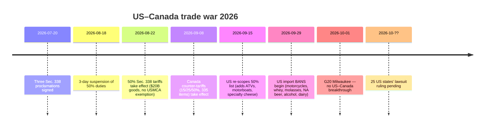
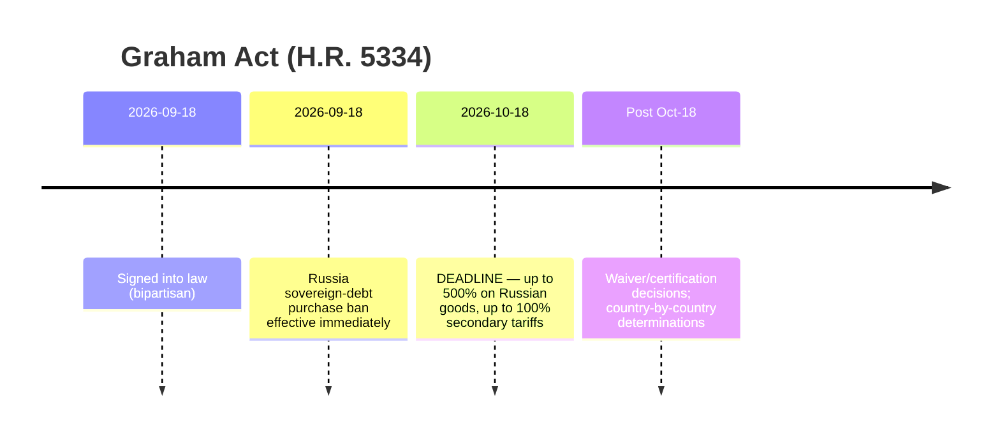
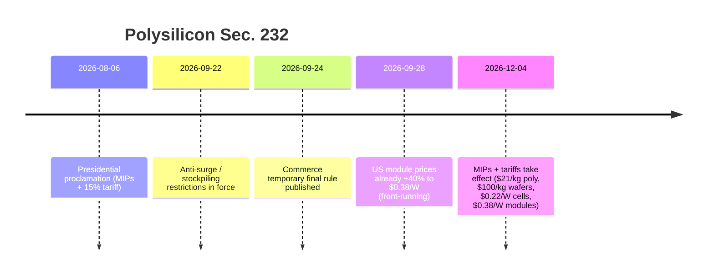

# 全球贸易情报报告 —— 2026年9月28日至10月5日当周

**分析师级每周简报。** 覆盖窗口：2026年9月28日至10月5日。编译自全球约45个贸易新闻、政策、数据与货运来源。每项主张均有来源；无法核验的数值标注为n/a。

---

## 目录

1. [执行摘要](#1-执行摘要)
2. [预警](#2-预警)
3. [头条深度解析](#3-头条深度解析)
4. [关税追踪](#4-关税追踪)
5. [美国政策深挖](#5-美国政策深挖)
6. [全球分区域政策](#6-全球分区域政策)
7. [执法行动](#7-执法行动)
8. [数据发布](#8-数据发布)
9. [货运市场](#9-货运市场)
10. [政策时间线](#10-政策时间线)
11. [未来90天重要节点与事件](#11-未来90天重要节点与事件)
12. [内容选题：Dureach营销角度](#12-内容选题dureach营销角度)
13. [来源与方法](#13-来源与方法)

---

## 1. 执行摘要

这是2026年迄今全球贸易最具决定性的一周。三起结构性升级同时落地：

- **美加贸易战进入动能阶段。** 在对约200亿美元加拿大商品加征50%的338条款关税之后（8月22日生效，9月15日重新划定范围），华盛顿自9月29日起对加拿大摩托车、乳清、糖蜜、无醇啤酒、酒精饮料和乳制品实施**直接进口禁令**——已在途的货物改按50%征税。加拿大对335项美国关税商品的15%/25%/50%镜像反制关税（9月8日生效）维持不变。美国25个州正起诉要求废除这些关税；尚无裁决。([tariffcalculator2026.com](https://tariffcalculator2026.com/canada-50-percent-tariff-august-19-explainer), [surtaxscan.com](https://surtaxscan.com/news/canadas-counter-tariffs-are-back-15-25-and-50-on-335-us-tariff-items-from))
- **《格雷厄姆法案》时钟正在滴答。** 9月18日签署的《林赛·格雷厄姆制裁俄罗斯与伊朗法案》要求在**10月18日**前对俄罗斯商品加征最高**500%的关税**，并对俄罗斯能源的最大进口国（中国、印度、土耳其风险最高）加征最高**100%的次级关税**。新关税与所有现有关税叠加征收。([lexblog.com](https://www.lexblog.com/2026/09/24/the-lindsey-graham-sanctions-act-what-businesses-need-to-know-about-the-new-tariffs/), [jdsupra.com](https://www.jdsupra.com/legalnews/new-sanctions-and-tariff-power-under-4624517/))
- **欧盟拿起了自己的"301条款"。** 10月5日，法国和德国联合提议打造欧盟快速反应贸易武器——不针对特定国家、可由少数成员国触发、最高可立即切断单一市场准入——剑指系统性市场扭曲（即中国）。北京数日内回应：对欧盟产对硝基甲苯发起反倾销调查（10月3日），商务部发出强硬警告。欧盟领导人将于10月15日在布鲁塞尔峰会上讨论对华议题。([reuters.com](https://www.reuters.com/world/china/france-germany-propose-new-rapid-eu-trade-response-tool-2026-10-05/), [wsj.com](https://www.wsj.com/world/europe/germany-and-france-are-proposing-a-new-weapon-to-counter-flood-of-chinese-goods-f723dfdf))

与此同时，多边体系进一步碎裂：在密尔沃基举行的G20贸易部长会议（9月30日至10月2日）四个议程中仅就一项达成共识（谴责粮食贸易胁迫），在过剩产能、强迫劳动和最惠国待遇改革上全部僵持。美中公布了对等的"30换30"关税减免清单（各约300亿美元）——象征意义重大，经济实质有限（汇丰：美国对华贸易加权关税仅从27.3%降至26.0%）。C.H. Robinson宣布以**58亿美元收购RXO**，为本轮周期最大3PL整合案。美国海关（CBP）对印尼棕榈油签发两份新的强迫劳动暂扣令（WRO），现行有效的暂扣令达到60份、调查结果（Findings）8份。

**货运：** 双速市场。跨太平洋集装箱运价保持坚挺（Drewry WCI 4,434美元/FEU，周环比-1%；上海—纽约10,428美元），亚欧线因苏伊士运河运力回归连续第12周下跌。干散货经历一个月来最差一周（BDI 3,148，周环比-8.1%），海岬型船收益暴跌12.8%。

---

## 2. 预警

| # | 预警 | 生效时间 | 影响 | 来源 |
|---|-------|-----------|--------|--------|
| A1 | 美国对加拿大摩托车、乳清、糖蜜、无醇啤酒、酒精饮料、乳制品实施进口禁令 | 2026年9月29日 | 目标货物拒绝入境；在途货物改按50%征税 | [asrwe.com](https://asrwe.com/asr-university/us-canada-import-ban-alcohol-motorcycles-section-338-expansion-september-2026) |
| A2 | CBP对印尼棕榈油签发暂扣令（Mitra Aneka Rezeki、Hardaya Inti Plantation） | 2026年9月29日 | 全美所有港口立即扣留；现行有效暂扣令60份＋调查结果8份 | [thompsonhine.com](https://www.thompsonhine.com/insights/cbp-issues-withhold-release-orders-on-two-indonesian-palm-oil-producers/) |
| A3 | 《格雷厄姆法案》次级关税（最高100%），针对俄罗斯能源最大买家 | 截止2026年10月18日 | 中国、印度、土耳其风险最高；与现有关税叠加 | [lexblog.com](https://www.lexblog.com/2026/09/24/the-lindsey-graham-sanctions-act-what-businesses-need-to-know-about-the-new-tariffs/) |
| A4 | 多晶硅232条款：最低进口限价＋15%关税 | 2026年12月4日（反突击囤货规则已生效） | 多晶硅21美元/公斤、硅片100美元/公斤、电池0.22美元/瓦、组件0.38美元/瓦；美国组件价格已上涨40% | [mondaq.com](https://www.mondaq.com/unitedstates/export-controls-trade-investment-sanctions/1848548/polysilicon-and-derivatives-in-the-bullseye-for-major-new-tariffs-and-other-restrictions) |
| A5 | 欧盟"系统性反应"快速贸易工具提案 | 10月5日提案；10月15日欧盟领导人峰会 | 可能获得24小时市场切断权；中国报复风险 | [reuters.com](https://www.reuters.com/world/china/france-germany-propose-new-rapid-eu-trade-response-tool-2026-10-05/) |
| A6 | 中国对欧盟产对硝基甲苯发起反倾销调查 | 10月3日立案（商务部第44号公告） | 欧中升级中的首次报复性出手 | [vespernews.com](https://www.vespernews.com/en/news/7dd758b7-b501-4c41-b2ee-13cb57ed832f) |

### A1 — 美国对加拿大商品进口禁令（详情）

9月8日的公告形成了双波结构。第一波（9月15日）：50%的338条款产品清单重新划定——**新增**按50%征税：特色奶酪、改性动植物油脂、牛皮及装潢革、生/熟毛皮、休闲机动船、特种纸、部分钢铁铝制品、金属配件及焊接耗材、高尔夫球车、家具灯具、ATV、更多乳制品。**移除**：岩盐、糖、水泥、开关柜组件、卫生纸、钓竿配件、散装威士忌/利口酒。第二波（9月29日）：**进口禁令**——不是关税而是拒绝入境——针对加拿大摩托车（含BRP Can-Am Spyder/Canyon）、乳清、糖蜜、无醇啤酒、酒精饮料和乳制品。9月29日前已在途或已进入保税仓的货物仍按50%征税而非禁令处理。([tariffcalculator2026.com](https://tariffcalculator2026.com/canada-section-338-september-15-29-what-changes), [asrwe.com](https://asrwe.com/asr-university/us-canada-import-ban-alcohol-motorcycles-section-338-expansion-september-2026))

关键的叠加规则：50%的338条款关税**没有USMCA豁免**——CUSMA原产地证对此毫无作用。但另一项针对加拿大商品的10% 301条款强迫劳动关税*可以*凭有效USMCA申诉豁免，因此不满足USMCA的 covered 商品可能面临**50%＋10%＝60%**。([tarifflens.ai](https://www.tarifflens.ai/blog/section-338-canada-retaliation-september-2026-importers-guide))

### A2 — 印尼棕榈油暂扣令（详情）

CBP 9月29日的命令针对Mitra Aneka Rezeki（MAR）和Hardaya Inti Plantation（HIP）的棕榈油及衍生品。审查证据包括：工人访谈、工资单、采收定额、照片、NGO/政府报告、新闻媒体、学术研究。MAR的工人呈现**九项**ILO强迫劳动指标（含扣留身份证件、与世隔绝）；HIP呈现**七项**（债务奴役、扣发工资、欺骗、过度加班、恐吓、恶劣工作条件、利用弱势地位）。全美港口立即扣留；进口商可选择复出口、销毁或证明供应链清白。([thompsonhine.com](https://www.thompsonhine.com/insights/cbp-issues-withhold-release-orders-on-two-indonesian-palm-oil-producers/), [ghy.com](https://www.ghy.com/trade-compliance/2026-withhold-release-orders-wros/))

### A3 — 《格雷厄姆法案》（详情）

H.R. 5334于9月18日以两党支持签署生效，将俄罗斯制裁机制法定化，并设立两条强制关税轨道，均须在**10月18日**前落地：对所有俄罗斯原产商品最高**500%**，对曾为俄罗斯原油或天然气前五大进口国且在法案生效后30天内仍有新购的国家加征最高**100%次级关税**。风险最高：**中国、印度、土耳其**；风险偏高：斯洛伐克、匈牙利、阿联酋。欧盟成员国逐个评估。逃生阀：天然气例外（进口量低于俄罗斯天然气出口总量15%＋已采取"实质性措施"减量）、国家利益豁免。所有关税均**叠加**于现行301/232关税之上。([lexblog.com](https://www.lexblog.com/2026/09/24/the-lindsey-graham-sanctions-act-what-businesses-need-to-know-about-the-new-tariffs/), [jdsupra.com](https://www.jdsupra.com/legalnews/new-sanctions-and-tariff-power-under-4624517/), [tradepractitioner.com](https://www.tradepractitioner.com/2026/09/sanctions-by-statute-the-graham-act-and-tariffs-on-russias-energy-buyers/))

### A4 — 多晶硅232条款（详情）

8月6日总统公告＋商务部9月24日临时最终规则。自**12月4日**起实施最低进口限价：**21美元/公斤**（多晶硅）、**100美元/公斤**（硅锭/硅片）、**0.22美元/瓦**（电池）、**0.38美元/瓦**（组件），另对衍生品加征**15%从价**关税（多晶硅原料免征15%；英国10%；日本/韩国/台湾/瑞士/列支敦士登/欧盟合计上限15%含最惠国税率）。反突击囤货限制已于9月22日至12月4日生效。市场抢跑：美国组件报价已触及0.38美元/瓦下限，**较8月上涨40.7%**（0.27美元/瓦），利好Hanwha Solutions和OCI。行业估算每100MW项目增加约1000万美元设备成本。([mondaq.com](https://www.mondaq.com/unitedstates/export-controls-trade-investment-sanctions/1848548/polysilicon-and-derivatives-in-the-bullseye-for-major-new-tariffs-and-other-restrictions), [en.sedaily.com](https://en.sedaily.com/finance/2026/09/28/us-solar-module-prices-jump-40-percent-before-import-curbs), [logisticusgroup.com](https://logisticusgroup.com/new-solar-tariffs-land-december-4-heres-how-to-keep-your-project-on-budget-and-on-schedule/))

### A5 — 欧盟快速反应工具（详情）

马克龙与默茨10月5日联名致信冯德莱恩，提议设立**"系统性反应"工具**：不针对特定国家、可由**少数成员国**触发（打破特定多数表决惯例）、允许采取"果断"措施直至**立即切断单一市场准入**。定位为欧盟版美国301条款和应对中国关键矿产出口管制；一位德国官员称之为"二次打击武器"。配套的多元化工具将限制关键进口品对单一国家的依赖。背景：欧盟对华货物贸易逆差2025年达**3,599亿欧元**，2026年二季度**1,030亿欧元**（2022年三季度以来最高）；欧委会执法负责人称进口冲击已蔓延至机械、纺织、金属、化工——不只是电动车。([reuters.com](https://www.reuters.com/world/china/france-germany-propose-new-rapid-eu-trade-response-tool-2026-10-05/), [wsj.com](https://www.wsj.com/world/europe/germany-and-france-are-proposing-a-new-weapon-to-counter-flood-of-chinese-goods-f723dfdf), [brusselsmorning.com](https://brusselsmorning.com/eu-china-trade-tensions/104764/))

### A6 — 中国率先报复（详情）

10月3日，商务部（第44号公告）对原产于欧盟的**对硝基甲苯发起反倾销调查**——时点卡在对华贸易谈判前数日，直接回应法德提案。商务部另就欧盟快速反应工具发出"坚决"报复警告。([vespernews.com](https://www.vespernews.com/en/news/7dd758b7-b501-4c41-b2ee-13cb57ed832f))

---

## 3. 头条深度解析

### 3.1 G20贸易部长密尔沃基会议破裂（9月30日－10月2日）

**发生了什么。** 在美国贸易代表Jamieson Greer主持下，G20贸易部长在美国担任G20主席国期间于密尔沃基会晤。四个议程中仅**一项**达成共识：谴责以胁迫手段将粮食贸易武器化的联合声明。三项失败：（1）**过剩产能**——多数成员支持的草案被以中国为首的少数派阻挠，后者拒绝补贴相关措辞；Greer称主席国"深感失望"；（2）**强迫劳动**——未能形成联合文本，美、墨、阿根廷另行发表单独声明；（3）**最惠国待遇改革**——美方抛出无条件最惠国待遇是否"无法促进互惠"、是否"制造搭便车者"的辩论，但未寻求联合声明。([barchart.com](https://www.barchart.com/story/news/4917577/g20-trade-talks-yield-little-progress-while-tensions-simmer) (AP), [reuters.com](https://www.reuters.com/world/china/g20-trade-chiefs-denounce-food-trade-coercion-not-excess-factory-capacity-2026-10-01/), [nationpress.com](https://www.nationpress.com/all/g20-milwaukee-talks-eye-more-diesel-globally))

**关键数字与细节。**
- 美国已对"从挪威到孟加拉"的多国发起过剩产能调查；除中国钢铁外，华盛顿点名汽车、电池、纸张和半导体。([barchart.com](https://www.barchart.com/story/news/4917577/g20-trade-talks-yield-little-progress-while-tensions-simmer))
- 印度**2026年7月**修订《对外贸易政策》，禁止进口全部或部分由强迫劳动制造的商品——Goyal在密尔沃基提出该议题；印度采取双轨策略（全体会议上捍卫立场，会外力推双边）。([beatsinbrief.com](https://beatsinbrief.com/2026/10/03/milwaukee-g20-trade-ministers-piyush-goyal-india-positions/))
- 会外成果：美国斡旋的讨论预计将向全球市场**增加柴油供应**（参与方、数量与时间表未披露）。([nationpress.com](https://www.nationpress.com/all/g20-milwaukee-talks-eye-more-diesel-globally))
- 美加争端无突破；特朗普当周禁止了约10亿美元加拿大进口商品（酒精、乳制品、摩托车）。([businessmirror.com.ph](https://businessmirror.com.ph/2026/10/02/g20-trade-talks-yield-little-progress-while-tensions-simmer/))

**为什么重要。** 未能产出成果文件，意味着多边贸易治理已无力约束本轮关税潮——行动已永久转向单边和双边轨道。关注**迈阿密**G20领导人峰会，看密尔沃基的裂痕是否上升到元首层面。([nationpress.com](https://www.nationpress.com/international/g20-trade-talks-end-without-deal-goyal))

### 3.2 美中"30换30"：清单公布，经济实质有限

**发生了什么。** 继9月23－25日特朗普－习近平华盛顿峰会后，两国政府9月28日根据新成立的美中贸易委员会"30换30"框架公布对等关税减免产品清单：每方可对约300亿美元对方商品降税。([cnn.com](https://www.cnn.com/2026/09/28/business/us-china-tariff-cuts-60-billion-intl?cid=external-feeds_iluminar_meta), [kpmg.com](https://kpmg.com/us/en/taxnewsflash/news/2026/09/us-china-trade-framework-tariff-reductions.html))

**关键数字。**
| | 美国清单（中国商品） | 中国清单（美国商品） |
|---|---|---|
| HTS税号数 | 77 | 1,619 |
| 货值 | 约300亿美元 | 约300亿美元 |
| 品类特征 | 消费品：玩具、烟花、餐具、毯子、微波炉、圣诞树灯、高脚椅、儿童安全座椅、电动剃须刀 | 农产品：玉米、小麦、高粱、肉类、乳制品、油脂、鱼类海鲜、木材；另有化妆品、医疗器械 |
| 显著排除 | 联网玩具（Wi-Fi/蓝牙，数据安全 carve-out）；**全部服装** | **大豆整豆**——美国对华最大宗农产品出口 |
| 占双边贸易比重 | 约占美国自华进口的7%（按2024年货值） | 约占中国自美进口的18% |

**经济账。** 汇丰（9月29日）：美国对华贸易加权关税仅从**27.3%降至26.0%**。超90%的清单商品恢复至最惠国（"正常"）税率。根据职权范围，调整**每年至多一次**。([exencialrp.substack.com](https://exencialrp.substack.com/p/hsbc-sees-us-china-30-for-30-deal) (HSBC via Substack), [lexblog.com](https://www.lexblog.com/2026/09/29/u-s-china-board-of-trade-30-for-30-identifies-products-recommended-for-reduced-tariffs/))

**配套交易。** 中国将在**2027年和2028年每年进口至少1,000万吨美国煤炭**；成立农业市场准入工作组；稀土对华出口量将"恢复到适当水平"（此前中国仅兑现约三分之二供应承诺；美中货物贸易逆差自2025年1月以来下降40%至1,400亿美元）。尚无减税落地——USTR仍须公布税率与日期。([cnn.com](https://www.cnn.com/2026/09/28/business/us-china-tariff-cuts-60-billion-intl?cid=external-feeds_iluminar_meta), [kpmg.com](https://kpmg.com/us/en/taxnewsflash/news/2026/09/us-china-trade-framework-tariff-reductions.html), [tradersunion.com](https://tradersunion.com/news/financial-news/show/3528484-us-china-lower-tariff-framework/))

**为什么重要。** 该框架的真正意义在机制——一个有工作程序的常设贸易委员会，而非关税数字。对采购而言：服装被排除在外，意味着中国向越南/孟加拉/印度转移的动因犹存；若减免落地，家纺产品（毯子、床品桌布、窗帘）可能面临更激烈的中国竞争。([textalks.com](https://textalks.com/us-china-tariff-excludes-apparel-but-opens-door-to-chinese-home-textiles/))

### 3.3 C.H. Robinson拟58亿美元收购RXO

**发生了什么。** 10月5日，C.H. Robinson（纳斯达克：CHRW）同意以现金加股票收购RXO（纽交所：RXO）：**每股17.25美元现金＋0.0856股CHRW股票＝每股30.25美元，较10月2日收盘价溢价29%**——隐含价值**58亿美元**，合并企业价值**超250亿美元**。双方董事会一致通过；MFN Partners（持股17%）与最大股东Orbis支持；预计**2027年上半年**完成，待监管批准与RXO股东投票。([rxo.com](https://rxo.com/news/c-h-robinson-to-acquire-rxo-redefining-the-future-of-third-party-logistics-while-unlocking-significant-shareholder-value/), [reuters.com](https://www.reuters.com/business/ch-robinson-buy-freight-broker-rxo-58-billion-2026-10-05/))

**关键数字。**
- RXO股东将持有合并公司约11%股权；RXO并入CHRW北美陆运事业部（占其营收三分之二以上）。
- **2年内实现3亿美元净运营协同**，依托CHRW"精益AI"运营模式（共享服务、供应商整合、不动产、保险）。
- 市场反应：RXO **涨约20%**（28.10－28.49美元），CHRW盘前**跌12%**（150美元 vs 收盘157.72美元）——典型的收购方折价；路透Breakingviews称回报"平平"。
- 顾问：摩根士丹利（CHRW）、高盛（RXO）。
- 公告前两个交易日RXO已涨16.2%，成交367万股（平时约190万股）——公告前明显异动。([freightwaves.com](https://www.freightwaves.com/news/breaking-c-h-robinson-acquiring-rxo), [financial-news.co.uk](https://www.financial-news.co.uk/c-h-robinson-to-buy-rxo-in-5-8bn-cash-and-stock-deal/), [inboundlogistics.com](https://www.inboundlogistics.com/articles/c-h-robinson-to-acquire-rxo-in-5-8-billion-deal/))

**为什么重要。** 货代整合在运价下行周期加速：规模玩家买的是密度和技术，而不是自己建。合并后的经纪商将在北美整车市场拥有无可匹敌的定价权——托运人应预期更艰难的合同谈判；中小货代面临生存挤压。"精益AI"协同故事也是一个信号：人力密集型经纪模式正在被自动化取代。（Newsquawk via [financial-news.co.uk](https://www.financial-news.co.uk/c-h-robinson-to-buy-rxo-in-5-8bn-cash-and-stock-deal/)）

### 3.4 印度—美国："临门一脚"但无协议

**发生了什么。** G20会外（10月1－2日），USTR Greer会见印度商工部长Piyush Goyal，称谈判已到"临门一脚"——但"我认为近期不会有结果"。此前特朗普与莫迪通话；预计两国领导人"很快"再通话。([thehindubusinessline.com](https://www.thehindubusinessline.com/news/nothing-imminent-us-trade-representative-greer-on-india-trade-deal-modi-trump-to-talk-soon/article71536059.ece/amp/), [nationpress.com](https://www.nationpress.com/international/india-us-trade-deal-in-short-strokes-greer))

**关键数字与症结。**
- 印度商品自7月24日起面临额外**10%的301条款强迫劳动关税**（覆盖60个经济体）；针对16个经济体结构性过剩产能的第二项301调查待定，可能冲击钢铁。
- 难点：农业准入、数字贸易、印度购买俄罗斯石油——《格雷厄姆法案》最高100%次级关税让后者更棘手。
- 尽管有关税，印度8月对美商品出口同比**增长21.83%**；卢比逼近**96.3兑1美元**；2030年5,000亿美元双边贸易目标。
- 财长Sitharaman（10月4日）：谈判已"进入平台期"——进一步让步难以达成。([thefinancialeconomy.com](https://www.thefinancialeconomy.com/india-us-trade-talks/), [jagranjosh.com](https://www.jagranjosh.com/general-knowledge/indiaus-trade-deal-not-imminent-why-is-it-being-delayed-who-has-the-advantage-what-are-indias-options-1820012731-1), [english.dainikjagranmpcg.com](https://english.dainikjagranmpcg.com/top-stories/india-us-trade-talks-reach-plateau-nirmala-sitharaman/article-36152))

**为什么重要。** 印度既是"中国+1"采购故事的关键变量，也是《格雷厄姆法案》次级关税地图上的摇摆项。达成协议将打开今年美国进口商为数不多的关税减压阀之一；谈崩则让印度出口商及其美国买家在旺季继续悬着。

### 3.5 无人机：关税上调，出口管制下调

**发生了什么。** 两项方向相反的美国无人机动作，均源于8月13日的双连发：（1）232条款公告（第11055号总统公告）对25公斤以上或带热成像的无人机（及停机坪与关键部件，附件一）加征**100%**关税，对小型非热成像无人机（附件二）加征**25%**，9月3日生效；部件（附件三）25%关税自**2027年2月9日**起。盟友税率：英国10%，日本/韩国/台湾/瑞士/列支敦士登/欧盟合计上限15%。（2）BIS**最终规则放宽出口管制**：续航3小时以下无人机降至仅AT管制（ECCN 9A012），A:5国家组适用STA许可例外——但中国/俄罗斯/白俄罗斯/委内瑞拉的军用最终用户仍受限。([whitehouse.gov](https://www.whitehouse.gov/presidential-actions/2026/08/adjusting-imports-of-unmanned-aircraft-systems-and-unmanned-aircraft-systems-components-into-the-united-states/), [jdsupra.com](https://www.jdsupra.com/legalnews/two-us-drone-actions-reshape-export-8075367/) (Wiley), [tbgfs.com](https://tbgfs.com/csms-69738151-guidance-section-232-duties-on-imports-of-unmanned-aircraft-systems-and-unmanned-aircraft-systems-components/))

**为什么重要。** 美国在同时筑起国内无人机市场的高墙并为本国出口商松绑——教科书式的"堡垒＋出击"产业政策。商用无人机买家面对分化市场：盟友供应链产品10－15%，中国原产25－100%。

### 3.6 美国8月货物贸易逆差达1,326亿美元

**发生了什么。** 8月预估货物贸易逆差扩大**11.5%**至**1,326亿美元**：进口**3,361亿美元（+5.5%）**，受工业用品和AI基建资本品拉动；出口**2,034亿美元（+1.9%）**。贸易连续**第三个季度**拖累GDP——对正在兜售"关税治逆差"的政府而言时机尴尬。([reuters.com](https://www.reuters.com/business/us-goods-trade-deficit-widens-sharply-august-2026-09-30/))

### 3.7 小额豁免维持死刑；IEEPA退税启动

**发生了什么。** 国际贸易法院（8月13日，Detroit Axle案）维持了基于IEEPA取消800美元小额豁免的做法——裁定取消一项"特权"不等于加征关税，因此不受最高法院2月推翻IEEPA关税判决的影响。全球小额豁免已于2025年8月29日终结；国会立法版关闭将于2027年7月生效。另一方面，CBP的CAPE系统（4月20日上线）正在处理已征收的**约1,650亿美元IEEPA关税**，利息约每月6.5亿美元累积；**CAPE第三阶段10月6日部署**，处理重新清算条目的退税。([reuters.com](https://www.reuters.com/legal/government/us-court-backs-trumps-power-close-de-minimis-tariff-exemption-2026-08-13/), [openclassactions.com](https://openclassactions.com/tariff-class-actions.php), 贸易媒体)

---

## 4. 关税追踪

基线＋本周变化。除非注明，税率均为*附加*关税；叠加规则因措施而异——请按每票货物的HTS、原产地和入境日期核对。

| 对象 | 措施 | 税率 | 生效时间 | 状态 | 来源 |
|---|---|---|---|---|---|
| 加拿大（covered商品） | 338条款（7月20日三份公告） | 50% | 2026年8月22日 | 生效中；**无USMCA豁免**；9月15日重新划定范围 | [tariffcalculator2026.com](https://tariffcalculator2026.com/canada-50-percent-tariff-august-19-explainer) |
| 加拿大（摩托车、乳清、糖蜜、无醇啤酒、酒精饮料、乳制品） | 338条款进口禁令 | 禁令（拒绝入境） | 2026年9月29日 | 生效中 | [asrwe.com](https://asrwe.com/asr-university/us-canada-import-ban-alcohol-motorcycles-section-338-expansion-september-2026) |
| 加拿大（一般） | 301条款强迫劳动 | 10% | 2026年7月24日（60个经济体） | 生效中；USMCA申诉可豁免 | [tarifflens.ai](https://www.tarifflens.ai/blog/section-338-canada-retaliation-september-2026-importers-guide) |
| 美国商品→加拿大 | 加拿大2026年附加税令 | 15% / 25% / 50%（335项） | 2026年9月8日 | 生效中；镜像美国338税率 | [surtaxscan.com](https://surtaxscan.com/news/canadas-counter-tariffs-are-back-15-25-and-50-on-335-us-tariff-items-from) |
| 俄罗斯（所有商品） | 《格雷厄姆法案》(H.R. 5334) | 最高500% | 2026年10月18日前 | 9月18日签署；待实施 | [lexblog.com](https://www.lexblog.com/2026/09/24/the-lindsey-graham-sanctions-act-what-businesses-need-to-know-about-the-new-tariffs/) |
| 俄罗斯能源最大买家（中国、印度、土耳其……） | 《格雷厄姆法案》次级关税 | 最高100% | 2026年10月18日前 | 待定；与现有关税叠加 | [jdsupra.com](https://www.jdsupra.com/legalnews/new-sanctions-and-tariff-power-under-4624517/) |
| 中国（多晶硅链） | 232条款最低限价＋关税 | 最低限价21美元/公斤–0.38美元/瓦＋15% | 2026年12月4日 | 8月6日公告；反突击规则已生效 | [mondaq.com](https://www.mondaq.com/unitedstates/export-controls-trade-investment-sanctions/1848548/polysilicon-and-derivatives-in-the-bullseye-for-major-new-tariffs-and-other-restrictions) |
| 无人机（一般） | 232条款（第11055号公告） | 100%（25公斤以上/热成像）；25%（小型） | 2026年9月3日 | 生效中 | [whitehouse.gov](https://www.whitehouse.gov/presidential-actions/2026/08/adjusting-imports-of-unmanned-aircraft-systems-and-unmanned-aircraft-systems-components-into-the-united-states/) |
| 无人机（英国/日韩台瑞士列支敦士登/欧盟） | 232条款盟友税率 | 英国10%；其他合计上限15% | 2026年9月3日 | 生效中（需认证） | [tbgfs.com](https://tbgfs.com/csms-69738151-guidance-section-232-duties-on-imports-of-unmanned-aircraft-systems-and-unmanned-aircraft-systems-components/) |
| 无人机部件（附件三） | 232条款 | 25% | 2027年2月9日 | 已宣布 | [jdsupra.com](https://www.jdsupra.com/legalnews/trump-administration-imposes-section-5315313/) |
| 中国（30换30清单，77个HTS税号） | 对等减免（待定） | 回归最惠国方向 | n/a——待USTR公告 | 9月28日公布清单；尚未减税 | [kpmg.com](https://kpmg.com/us/en/taxnewsflash/news/2026/09/us-china-trade-framework-tariff-reductions.html) |
| 药品（专利药） | 232条款 | 按HTSUS 9903.04.60–70 | 9月28日更新指引 | CBP已发布申报指引 | [ghy.com](https://www.ghy.com/trade-compliance/category/international-trade-issues/) |
| 印度（一般） | 301条款强迫劳动 | 10% | 2026年7月24日 | 生效中 | [thefinancialeconomy.com](https://www.thefinancialeconomy.com/india-us-trade-talks/) |
| 16个经济体（含印度） | 301条款过剩产能调查 | n/a | 调查进行中 | USTR承诺"数周内"采取行动 | [thefinancialeconomy.com](https://www.thefinancialeconomy.com/india-us-trade-talks/) |
| 178项产品豁免 | 301条款豁免 | 豁免 | 至2026年11月9日 | 即将到期 | 贸易媒体 |
| 欧盟（提案） | "系统性反应"工具 | 最高市场切断 | 10月5日提案；10月15日峰会 | 尚未立法 | [reuters.com](https://www.reuters.com/world/china/france-germany-propose-new-rapid-eu-trade-response-tool-2026-10-05/) |

---

## 5. 美国政策深挖

### 本周美国动作

| 日期 | 主体 | 动作 | 意义 | 来源 |
|---|---|---|---|---|
| 9月28日 | CBP | 更新232条款药品关税申报指引（HTSUS 9903.04.60–70）；9903.04.61于9月29日后停用 | 药品进口商申报规则明确 | [ghy.com](https://www.ghy.com/trade-compliance/category/international-trade-issues/) |
| 9月29日 | CBP | FY2027配额公告：AGOA服装、原蔗糖 | 配额年度规划 | [ghy.com](https://www.ghy.com/trade-compliance/category/international-trade-issues/) |
| 9月29日 | CBP | 两份强迫劳动暂扣令（印尼棕榈油） | 现行有效暂扣令60份＋调查结果8份 | [kpmg.com](https://kpmg.com/us/en/taxnewsflash/news/2026/09/us-cbp-wros-indonesian-palm-oil.html) |
| 9月29日 | 白宫 | 加拿大进口禁令生效 | 贸易战中首次美国进口*禁令*（非关税） | [asrwe.com](https://asrwe.com/asr-university/us-canada-import-ban-alcohol-motorcycles-section-338-expansion-september-2026) |
| 9月30日 | USTR | 全球钢铁过剩产能论坛声明 | 为钢铁行动披多边外衣 | 贸易媒体 |
| 10月1－2日 | USTR (Greer) | G20密尔沃基：仅粮食胁迫达成共识；抛出最惠国改革辩论 | 多边轨道停滞；单边轨道获确认 | [reuters.com](https://www.reuters.com/world/china/g20-trade-chiefs-denounce-food-trade-coercion-not-excess-factory-capacity-2026-10-01/) |
| 10月2日 | USTR | 第14次快速反应机制整改——Corporación de Occidente轮胎（墨西哥） | USMCA劳工执法继续 | 贸易媒体 |
| 10月2日 | USTR | 2027年USMCA联合审查：公众意见截止**2027年1月12日** | 审查年时钟启动 | 贸易媒体 |
| 10月5日 | 白宫/国会 | 《格雷厄姆法案》实施倒计时（剩13天） | 最高100%次级关税待定 | [lexblog.com](https://www.lexblog.com/2026/09/24/the-lindsey-graham-sanctions-act-what-businesses-need-to-know-about-the-new-tariffs/) |

**分析。** 本届政府同时拨动三个时钟：（1）*惩罚*时钟——加拿大禁令、《格雷厄姆法案》次级关税、多晶硅最低限价——都为在年底前最大化筹码；（2）*建制*时钟——USMCA 2027年审查筹备、贸易委员会程序、最惠国改革辩论——在搭建永久机器；（3）*法律*时钟——国际贸易法院维持小额豁免死刑 vs 最高法院推翻IEEPA关税，1,650亿美元IEEPA关税正经CAPE退税。规律：在法院受限处（IEEPA关税），政府绕道232/338/301和成文法（《格雷厄姆法案》）。进口商应为*更多*措施做准备，走的是*更老*的法律授权，而不是更少。

## 6. 全球分区域政策

### 欧洲

| 动态 | 详情 | 来源 |
|---|---|---|
| 法德快速反应工具提案 | "系统性反应"工具；少数成员国可触发；最高立即切断市场准入；配套多元化工具 | [reuters.com](https://www.reuters.com/world/china/france-germany-propose-new-rapid-eu-trade-response-tool-2026-10-05/) |
| 欧盟对华逆差 | 2025年3,599亿欧元；2026年二季度1,030亿欧元（2022年三季度以来最高）；进口冲击蔓延至机械、纺织、金属、化工 | [brusselsmorning.com](https://brusselsmorning.com/eu-china-trade-tensions/104764/) |
| 10月15日欧盟领导人峰会 | 布鲁塞尔峰会讨论对华失衡——法德提案的首次考验 | [reuters.com](https://www.reuters.com/world/china/france-germany-propose-new-rapid-eu-trade-response-tool-2026-10-05/) |
| 欧盟考虑下调工业关税 | 或为避免中国钢铁报复而下调（据Capitol Forum报道） | 贸易媒体 |

### 加拿大

| 动态 | 详情 | 来源 |
|---|---|---|
| 反制关税生效 | 9月8日起对335项美国商品加征15%/25%/50%；覆盖280亿加元；在途货物豁免 | [surtaxscan.com](https://surtaxscan.com/news/canadas-counter-tariffs-are-back-15-25-and-50-on-335-us-tariff-items-from) |
| 75亿加元支持计划 | 援助受影响产业的国内方案 | 贸易媒体 |
| 多元化转向 | Carney政府转向欧洲/印度协议 | 贸易媒体 |
| 美国25州起诉 | 挑战关税机制；尚无裁决 | 贸易媒体 |

### 中国（商务部）

| 动态 | 详情 | 来源 |
|---|---|---|
| 对欧盟对硝基甲苯反倾销调查 | 10月3日立案（第44号公告）——报复信号 | [vespernews.com](https://www.vespernews.com/en/news/7dd758b7-b501-4c41-b2ee-13cb57ed832f) |
| 就欧盟工具发出强硬警告 | 对任何快速反应工具威胁"坚决"报复 | [reuters.com](https://www.reuters.com/world/china/france-germany-propose-new-rapid-eu-trade-response-tool-2026-10-05/) |
| "30换30"清单解读 | 公布1,619个税号清单；煤炭承诺（2027－28年每年1,000万吨）；稀土发货量恢复正常 | [kpmg.com](https://kpmg.com/us/en/taxnewsflash/news/2026/09/us-china-trade-framework-tariff-reductions.html) |
| 第八轮磋商纪要 | 双边渠道仍在运转 | 贸易媒体 |

### 世界其他地区

| 国家/地区 | 动态 | 来源 |
|---|---|---|
| 印度 | 7月外贸政策修订中的强迫劳动进口禁令在G20提出；尽管有10%关税，8月对美出口同比+21.83% | [beatsinbrief.com](https://beatsinbrief.com/2026/10/03/milwaukee-g20-trade-ministers-piyush-goyal-india-positions/), [thefinancialeconomy.com](https://www.thefinancialeconomy.com/india-us-trade-talks/) |
| 英国 | 本周未发现重大贸易政策动作 | 贸易媒体 |
| 墨西哥/阿根廷 | 在G20加入美国强迫劳动声明（独立于失败的联合文本） | [nationpress.com](https://www.nationpress.com/all/g20-milwaukee-talks-eye-more-diesel-globally) |

## 7. 执法行动

| 行动 | 详情 | 来源 |
|---|---|---|
| 2份新暂扣令（9月29日） | 印尼棕榈油——MAR（9项ILO指标）、HIP（7项指标）；立即扣留 | [thompsonhine.com](https://www.thompsonhine.com/insights/cbp-issues-withhold-release-orders-on-two-indonesian-palm-oil-producers/) |
| Everlight 515万美元和解 | 德州Everlight Americas就《虚假申报法》诉讼和解，被指将中国LED申报为台湾原产以规避301关税 | [news.bloomberglaw.com](https://news.bloomberglaw.com/federal-contracting/tariff-dodging-settlements-underscore-doj-focus-on-trade-fraud) |
| Perfectus Aluminum约5.5亿美元（5月） | 铝挤压材关税规避——近年最大贸易欺诈和解 | [news.bloomberglaw.com](https://news.bloomberglaw.com/federal-contracting/tariff-dodging-settlements-underscore-doj-focus-on-trade-fraud) |
| 司法部欺诈备忘录（8月13日） | 助理部长Colin McDonald：贸易欺诈/海关规避为头号重点；"制度化"《虚假申报法》执法 | [news.bloomberglaw.com](https://news.bloomberglaw.com/federal-contracting/tariff-dodging-settlements-underscore-doj-focus-on-trade-fraud) |
| 转运打击预告 | 白宫详述"大规模非法转运行为"，预告AI驱动执法 | 贸易媒体（JD Supra） |
| 强迫劳动关税层 | 301条款10%覆盖60个经济体（含印度、加拿大），自7月24日——区别于UFLPA实体执法 | [thefinancialeconomy.com](https://www.thefinancialeconomy.com/india-us-trade-talks/) |

**解读。** 执法正从单票货物拦截转向*资产负债表*后果：数亿美元的《虚假申报法》和解、AI辅助的转运行为侦测、对整个经济体因劳工问题加征关税层。合规负担向上游迁移——进口商需要的原产地文件要到*供应商的供应商*层级，而不只是发票。

## 8. 数据发布

| 发布 | 详情 | 来源 |
|---|---|---|
| 美国人口普查局8月预估货物贸易（9月30日） | 逆差1,326亿美元（环比+11.5%）；进口3,361亿美元（+5.5%），出口2,034亿美元（+1.9%）；工业用品＋AI资本品拉动进口 | [reuters.com](https://www.reuters.com/business/us-goods-trade-deficit-widens-sharply-august-2026-09-30/) |
| 欧盟对华双边（欧统局，经媒体） | 2026年二季度欧盟货物逆差1,030亿欧元；2025年3,599亿欧元 | [brusselsmorning.com](https://brusselsmorning.com/eu-china-trade-tensions/104764/) |
| UN Comtrade / WITS / ITC / IMF | 本周无重大例行发布（月度周期） | 贸易媒体 |
| Drewry集装箱预测 | 未来几季度供需平衡走弱；预计现货运价进一步收缩 | [fibre2fashion.com](https://www.fibre2fashion.com/news/textile-news/drewry-wci-further-falls-1-transpacific-rates-less-volatile-305782-newsdetails.htm)（上周） |

---

## 9. 货运市场

### 9.1 集装箱 —— Drewry世界集装箱指数（2026年10月1日）

综合指数**4,434美元/FEU，周环比-1%**，拖累来自亚欧线。跨太平洋在黄金周前保持坚挺；船公司计划10月中旬推FAK/GRIs，但Drewry怀疑能否落地。

| 航线 | 本周（美元/FEU） | 环比 | 趋势 |
|---|---|---|---|
| 上海 → 纽约 | 10,428 | +1% | ▲ 坚挺 |
| 上海 → 洛杉矶 | 7,835 | 持平 | ► 稳定 |
| 上海 → 热那亚 | 3,702 | -3% | ▼ 连续第12周下跌 |
| 上海 → 鹿特丹 | 3,399 | -2% | ▼ 连续第12周下跌 |

运力备注：下周跨太平洋宣布10个空白航次（上周13个）；亚欧线5个（上周6个）。苏伊士运河通行量从每周41艘增至**48艘**，新增有效运力盖过了欧洲线的空白航次削减。([thedcn.com.au](https://www.thedcn.com.au/news/world-container-index-1-october-2026))

**Drewry航线周环比变动（美元/FEU）：**

```
Shanghai → New York      $10,428  ▲ +1%   ██████████████████████████████████████▓ +108
Shanghai → Los Angeles    $7,835  ►  0%   ████████████████████████████             0
Shanghai → Genoa          $3,702  ▼ -3%   █████████████▓                        -115
Shanghai → Rotterdam      $3,399  ▼ -2%   ████████████                           -69
Composite WCI             $4,434  ▼ -1%   ███████████████▓                       -45
 (bar length ∝ rate level; figures = approx. $ change w/w)
```

### 9.2 集装箱 —— Freightos波罗的海指数（截至2026年10月2日当周）

全球**FBX 3,341——周环比持平**。跨太平洋稳定，欧洲疲软，跨大西洋涨跌互现：

| 航线 | 运价（美元/FEU） | 周环比变动 |
|---|---|---|
| FBX01 中国/东亚 → 美西 | 8,319 | 持平 |
| FBX03 中国/东亚 → 美东 | 9,606 | 持平 |
| FBX11 中国/东亚 → 北欧 | 3,260 | 持平 |
| FBX13 中国/东亚 → 地中海 | 3,555 | -7美元 |
| FBX21 美东 → 欧洲 | 963 | -40美元（自1,003美元） |
| FBX22 欧洲 → 美东 | 2,723 | +57美元（自2,666美元） |

([thedcn.com.au](https://www.thedcn.com.au/news/baltic-exchange-weekly-report-2-october-2026))

**FBX航线快照（美元/FEU）：**

```
FBX01  CN/EA → USWC      $8,319  █████████████████████████████████
FBX03  CN/EA → USEC      $9,606  ██████████████████████████████████████
FBX11  CN/EA → N.Europe  $3,260  █████████████
FBX13  CN/EA → Med       $3,555  ██████████████
FBX22  Europe → USEC     $2,723  ███████████
FBX21  USEC → Europe       $963  ████
```

### 9.3 干散货 —— 波罗的海干散货指数（2026年10月2日）

**BDI 3,148**（日环比+8点/+0.3%），但**周环比-8.1%**——一个多月来最差一周，主因中国钢厂利润疲软、港口库存高企导致海岬型船崩盘。

| 船型 | 指数 | 日环比 | 周环比 | 日均收益 |
|---|---|---|---|---|
| 海岬型 (BCI) | 5,042 | +32 (+0.6%) | **-12.8%** | 45,731美元（BCI 182 5TC） |
| 巴拿马型 (BPI) | 2,372 | -7 (-0.3%) | -1.5% | 21,349美元 |
| 超灵便型 (BSI) | 1,789 | -5 (-0.3%) | **+0.2%** | 22,619美元 |
| 灵便型 (BHSI) | 1,007 | -1 | n/a | 18,117美元 |

注：路透电讯版按不同船型口径报海岬型日收益42,228美元；上表采用波罗的海交易所5TC口径（45,731美元）。([worldports.org](https://www.worldports.org/baltic-dry-bulk-index-gains-for-second-day-but-posts-weekly-loss/), [handybulk.com](https://www.handybulk.com/baltic-dry-index/), [thedcn.com.au](https://www.thedcn.com.au/news/baltic-exchange-weekly-report-2-october-2026))

**各船型周表现（周环比%）：**

```
Capesize   -12.8%  ████████████████████████████████░░░░░░░░░░░░░░░░░░░░░░  deeply negative
Panamax     -1.5%  ████░░░░░░░░░░░░░░░░░░░░░░░░░░░░░░░░░░░░░░░░░░░░░░░░░░  mildly negative
Supramax    +0.2%  ░░░░░░░░░░░░░░░░░░░░░░░░░░░░░░░░░░░░░░░░░░░░░░░░░░░░█  flat-positive
BDI (comp)  -8.1%  ████████████████████░░░░░░░░░░░░░░░░░░░░░░░░░░░░░░░░░░  negative
```

**解读。** 谷物/煤炭航线（巴拿马型/超灵便型）守住了；疼痛集中在铁矿石/钢铁相关的海岬型航线——这是需求信号，不是运力过剩信号。超灵便型周中触及1,797点，为**2022年8月以来最高**。([worldports.org](https://www.worldports.org/falling-vessel-rates-push-baltic-dry-bulk-index-to-fresh-low/))

### 9.4 油轮与空运（背景）

- **脏油轮指数5,444**（9月29日定盘+0.22%）；**成品油轮指数2,293**（+3.01%）——成品油因改道跑赢；10月4日胡塞袭击沙特石油设施，但原油未大涨。([geopoliticsunplugged.substack.com](https://geopoliticsunplugged.substack.com/p/houthis-strike-at-saudi-oil-as-the))
- **空运**：波罗的海空运指数**周环比+0.6%（同比+22%）**，截至9月28日当周；WorldACD货量**同比+8%**（第38周）——旺季前走强；Xeneta认为旺季*偏弱*，中国—美国电商**同比-34%**，受小额豁免取消拖累。([metro.global](https://www.metro.global/2026/09/30/airfreight-market-strengthens-as-peak-season-nears/) via 贸易媒体)

### 9.5 关税税率对比（部分措施，从价税）

```
Graham Act secondary (max)      100%  ████████████████████████████████████████
Drones >25kg / thermal           100%  ████████████████████████████████████████
Canada Sec. 338 (covered goods)   50%  ████████████████████
Canada counter-tariffs (top)      50%  ████████████████████
Polysilicon derivatives           15%  ██████
Drones allied (UK)                10%  ████
Canada/India Sec. 301 FL          10%  ████
```

---

## 10. 政策时间线

### 美加升级，2026年



### 《格雷厄姆法案》倒计时



### 多晶硅232条款



---

## 11. 未来90天重要节点与事件

| 日期 | 事件 | 意义 | 来源 |
|---|---|---|---|
| 2026年10月6日 | CAPE第三阶段部署 | IEEPA关税重新清算条目的退税 | 贸易媒体 |
| 2026年10月15日 | 欧盟领导人峰会，布鲁塞尔 | 法德快速反应工具的首次考验；对华失衡 | [reuters.com](https://www.reuters.com/world/china/france-germany-propose-new-rapid-eu-trade-response-tool-2026-10-05/) |
| 2026年10月18日 | **《格雷厄姆法案》实施截止日** | 对俄罗斯能源买家最高100%次级关税 | [lexblog.com](https://www.lexblog.com/2026/09/24/the-lindsey-graham-sanctions-act-what-businesses-need-to-know-about-the-new-tariffs/) |
| 2026年11月9日 | 178项301条款豁免到期 | 续期或失效决定 | 贸易媒体 |
| 2026年12月4日 | 多晶硅最低限价＋15%关税生效 | 光伏供应链成本冲击 | [mondaq.com](https://www.mondaq.com/unitedstates/export-controls-trade-investment-sanctions/1848548/polysilicon-and-derivatives-in-the-bullseye-for-major-new-tariffs-and-other-restrictions) |
| 2027年1月12日 | USMCA 2027年联合审查——公众意见截止 | 审查年议程设定 | 贸易媒体 |
| 2027年2月9日 | 无人机部件（附件三）25%关税 | 第二波无人机关税 | [whitehouse.gov](https://www.whitehouse.gov/presidential-actions/2026/08/adjusting-imports-of-unmanned-aircraft-systems-and-unmanned-aircraft-systems-components-into-the-united-states/) |
| 2027年上半年 | C.H. Robinson—RXO交割 | 250亿美元＋合并3PL | [reuters.com](https://www.reuters.com/business/ch-robinson-buy-freight-broker-rxo-58-billion-2026-10-05/) |
| 2027年7月 | 小额豁免立法版关闭 | 800美元豁免依法终结 | [reuters.com](https://www.reuters.com/legal/government/us-court-backs-trumps-power-close-de-minimis-tariff-exemption-2026-08-13/) |

---

## 12. 内容选题：Dureach营销角度

1. **"你的供应商上了两份关税清单。"** 16个经济体的301条款过剩产能调查与60个经济体的强迫劳动关税层高度重叠——《格雷厄姆法案》又加了第三道筛子（俄罗斯能源敞口）。一篇合规风险计算器/清单交叉比对的帖子几乎自己写好了，货运数据就是证明层。([thefinancialeconomy.com](https://www.thefinancialeconomy.com/india-us-trade-talks/))
2. **CHRW—RXO超级并购 → "到底是谁在运货。"** 面向货代受众的3PL整合角度；用提单数据展示哪些货代经手哪些航线——收购方买的是密度，而密度在货运记录里看得见。([reuters.com](https://www.reuters.com/business/ch-robinson-buy-freight-broker-rxo-58-billion-2026-10-05/))
3. **多晶硅最低限价：价格下限先例。** 首次把最低进口限价用作贸易武器——如果在光伏上奏效，电池、电动车、钢铁都会跟进。一篇"关税2.0：从从价税到价格下限"的解读，让Dureach站在下一波前面。([mondaq.com](https://www.mondaq.com/unitedstates/export-controls-trade-investment-sanctions/1848548/polysilicon-and-derivatives-in-the-bullseye-for-major-new-tariffs-and-other-restrictions))

---

## 13. 来源与方法

**覆盖窗口：** 2026年9月28日至10月5日。**方法：** 新闻垂直搜索＋直接页面阅读，覆盖约45个指定来源；优先政府一手来源；付费墙媒体仅用标题/摘要。

**本轮引用的来源：** FreightWaves、thedcn.com.au（波罗的海交易所/Drewry）、container-news.com、logisticsnews.ph、worldports.org、handybulk.com、bairdmaritime.com、indexbox.io、geopoliticsunplugged (Substack)、metro.global、白宫公告、CBP（经KPMG、GHY、Thompson Hine、Trans-Border Global Freight）、USTR（经AP/路透/nationpress）、联邦公报（经贸易媒体）、BIS（经Baker McKenzie/JD Supra）、商务部（直接）、路透、美联社、华尔街日报、CNN、Euronews（经vespernews/tbsnews）、brusselsmorning.com、LexBlog、JD Supra、Mondaq、tradepractitioner.com、KPMG TaxNewsFlash、GHY International、Thompson Hine、tariffcalculator2026.com、surtaxscan.com、tarifflens.ai、asrwe.com、thefinancialeconomy.com、jagranjosh.com、thehindubusinessline.com、nationpress.com、beatsinbrief.com、textalks.com、exencialrp（汇丰纪要）、tradersunion.com、frontlinesandbottomlines（博客）、en.sedaily.com、logisticusgroup.com、etwenergy.com、jingsun-power.com、news.metal.com (SMM)、news.bloomberglaw.com、openclassactions.com、srnnews.com/路透（小额豁免）、supplychaindive.com、suasnews.com、dronelife.com、rxo.com、inboundlogistics.com、ttnews.com、cdllife.com、financial-news.co.uk。
